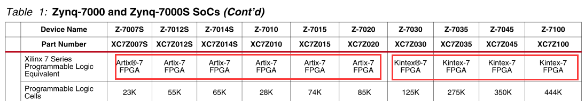
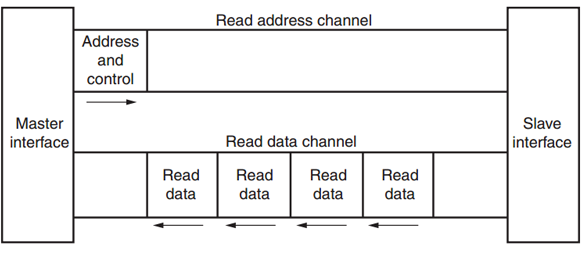
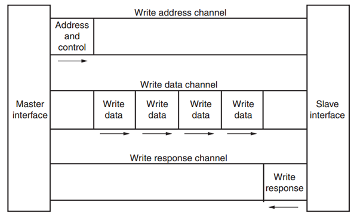
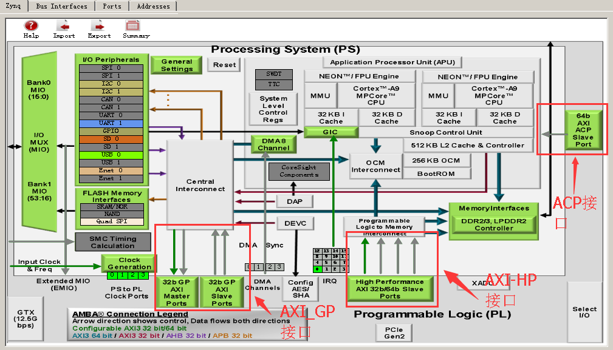
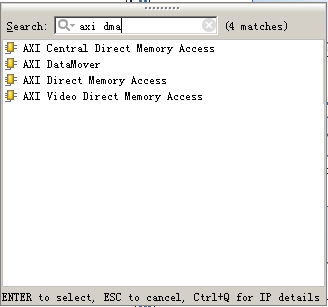
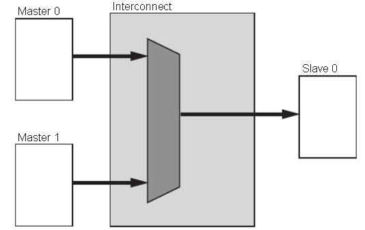
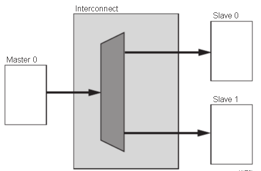
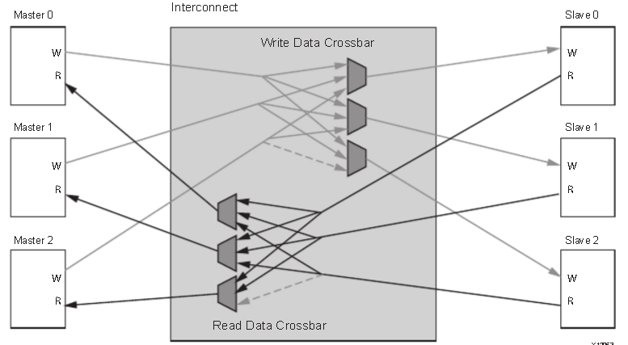
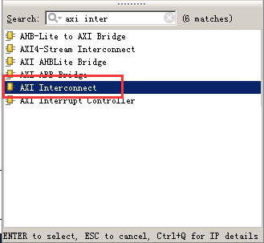

ZYNQ简介
==========

Zynq系列的亮点在于FPGA里包含了完整的ARM处理子系统（PS），每一颗Zynq系列的处理器都包含了Cortex-A9处理器，整个处理器的搭建都以处理器为中心，而且处理器子系统中集成了内存控制器和大量的外设，
使Cortex-A9的核在Zynq-7000中完全独立于可编程逻辑单元，也就是说如果暂时没有用到可编程逻辑单元部分（PL），ARM处理器的子系统也可以独立工作，这与以前的FPGA有本质区别，其是以处理器为中心的。

Zynq就是两大功能块，PS 部分和 PL部分，说白了，就是ARM的SOC部分，和FPGA部分。其中，PS集成了两个ARM
Cortex™-A9处理器，AMBA®互连，内部存储器，外部存储器接口和外设。这些外设主要包括USB总线接口，以太网接口，SD/SDIO接口，I2C总线接口，CAN总线接口，UART接口，GPIO等。

.. image:: images/01_media/image1.png
      
ZYNQ芯片的总体框图

PS: 处理系统 （Processing System) , 就是与FPGA无关的ARM的SOC的部分。

PL: 可编程逻辑 (Progarmmable Logic), 就是FPGA部分。

*PL部分是与7系列一样的，在DS190文档中可以看到对应的7系列产品。*

      
PS和PL互联技术 
---------------

ZYNQ作为首款将高性能ARM
Cortex-A9系列处理器与高性能FPGA在单芯片内紧密结合的产品，为了实现ARM处理器和FPGA之间的高速通信和数据交互，发挥ARM处理器和FPGA的性能优势，需要设计高效的片内高性能处理器与FPGA之间的互联通路。因此，如何设计高效的PL和PS数据交互通路是ZYNQ芯片设计的重中之重，也是产品设计的成败关键之一。本节，我们就将主要介绍PS和PL的连接，让用户了解PS和PL之间连接的技术。

其实，在具体设计中我们往往不需要在连接这个地方做太多工作，我们加入IP核以后，系统会自动使用AXI接口将我们的IP核与处理器连接起来，我们只需要再做一点补充就可以了。

AXI全称Advanced eXtensible
Interface，是Xilinx从6系列的FPGA开始引入的一个接口协议，主要描述了主设备和从设备之间的数据传输方式。在ZYNQ中继续使用，版本是AXI4，所以我们经常会看到AXI4.0，ZYNQ内部设备都有AXI接口。其实AXI就是ARM公司提出的AMBA（Advanced Microcontroller Bus
Architecture）的一个部分，是一种高性能、高带宽、低延迟的片内总线，也用来替代以前的AHB和APB总线。第一个版本的AXI（AXI3）包含在2003年发布的AMBA3.0中，AXI的第二个版本AXI（AXI4）包含在2010年发布的AMBA 4.0之中。

AXI协议主要描述了主设备和从设备之间的数据传输方式，主设备和从设备之间通过握手信号建立连接。当从设备准备好接收数据时，会发出READY信号。当主设备的数据准备好时，会发出和维持VALID信号，表示数据有效。数据只有在VALID和READY信号都有效的时候才开始传输。当这两个信号持续保持有效，主设备会继续传输下一个数据。主设备可以撤销VALID信号，或者从设备撤销READY信号终止传输。AXI的协议如图，T2时，从设备的READY信号有效，T3时主设备的VILID信号有效，数据传输开始。

.. image:: images/01_media/image3.png
      
AXI握手时序图

在ZYNQ中，支持AXI-Lite，AXI4和AXI-Stream三种总线，通过表5-1,我们可以看到这三中AXI接口的特性。

+----------------------+----------------------+------------------------+
| 接口协议             | 特性                 | 应用场合               |
+======================+======================+========================+
| AXI4-Lite            | 地址/单数据传输      | 低速外设或控制         |
+----------------------+----------------------+------------------------+
| AXI4                 | 地址/突发数据传输    | 地址的批量传输         |
+----------------------+----------------------+------------------------+
| AXI4-Stream          | 仅传输数据，突发传输 | 数据流和媒体流传输     |
+----------------------+----------------------+------------------------+

AXI4-Lite：

具有轻量级，结构简单的特点，适合小批量数据、简单控制场合。不支持批量传输，读写时一次只能读写一个字（32bit）。主要用于访问一些低速外设和外设的控制。

AXI4：

接口和AXI-Lite差不多，只是增加了一项功能就是批量传输，可以连续对一片地址进行一次性读写。也就是说具有数据读写的burst功能。

上面两种均采用内存映射控制方式，即ARM将用户自定义IP编入某一地址进行访问，读写时就像在读写自己的片内RAM，编程也很方便，开发难度较低。代价就是资源占用过多，需要额外的读地址线、写地址线、读数据线、写数据线、写应答线这些信号线。

AXI4-Stream：

这是一种连续流接口，不需要地址线（很像FIFO，一直读或一直写就行）。对于这类IP，ARM不能通过上面的内存映射方式控制（FIFO根本没有地址的概念），必须有一个转换装置，例如AXI-DMA模块来实现内存映射到流式接口的转换。AXI-Stream适用的场合有很多：视频流处理；通信协议转换；数字信号处理；无线通信等。其本质都是针对数值流构建的数据通路，从信源（例如ARM内存、DMA、无线接收前端等）到信宿（例如HDMI显示器、高速AD音频输出，等）构建起连续的数据流。这种接口适合做实时信号处理。

AXI4和AXI4-Lite接口包含5个不同的通道：

-  Read Address Channel

-  Write Address Channel

-  Read Data Channel

-  Write Data Channel

-  Write Response Channel

其中每个通道都是一个独立的AXI握手协议。下面两个图分别显示了读和写的模型：

      
AXI读数据通道

      
AXI写数据通道

在ZYNQ芯片内部用硬件实现了AXI总线协议，包括9个物理接口，分别为AXI-GP0~AXI-GP3，AXI-HP0~AXI-HP3，AXI-ACP接口。

AXI_ACP接口，是ARM多核架构下定义的一种接口，中文翻译为加速器一致性端口，用来管理DMA之类的不带缓存的AXI外设，PS端是Slave接口。

AXI_HP接口，是高性能/带宽的AXI3.0标准的接口，总共有四个，PL模块作为主设备连接。主要用于PL访问PS上的存储器（DDR和On-Chip RAM）

AXI_GP接口，是通用的AXI接口，总共有四个，包括两个32位主设备接口和两个32位从设备接口。

      
可以看到，只有两个AXI-GP是Master Port，即主机接口，其余7个口都是Slave
Port（从机接口）。主机接口具有发起读写的权限，ARM可以利用两个AXI-GP主机接口主动访问PL逻辑，其实就是把PL映射到某个地址，读写PL寄存器如同在读写自己的存储器。其余从机接口就属于被动接口，接受来自PL的读写，逆来顺受。

另外这9个AXI接口性能也是不同的。GP接口是32位的低性能接口，理论带宽600MB/s，而HP和ACP接口为64位高性能接口，理论带宽1200MB/s。有人会问，为什么高性能接口不做成主机接口呢？这样可以由ARM发起高速数据传输。答案是高性能接口根本不需要ARM
CPU来负责数据搬移，真正的搬运工是位于PL中的DMA控制器。

位于PS端的ARM直接有硬件支持AXI接口，而PL则需要使用逻辑实现相应的AXI协议。Xilinx在Vivado开发环境里提供现成IP如AXI-DMA，AXI-GPIO，AXI-Dataover,
AXI-Stream都实现了相应的接口，使用时直接从Vivado的IP列表中添加即可实现相应的功能。下图为Vivado下的各种DMA
IP：

      
下面为几个常用的AXI接口IP的功能介绍：

AXI-DMA：实现从PS内存到PL高速传输高速通道AXI-HP<---->AXI-Stream的转换

AXI-FIFO-MM2S：实现从PS内存到PL通用传输通道AXI-GP<----->AXI-Stream的转换

AXI-Datamover：实现从PS内存到PL高速传输高速通道AXI-HP<---->AXI-Stream的转换，只不过这次是完全由PL控制的，PS是完全被动的。

AXI-VDMA：实现从PS内存到PL高速传输高速通道AXI-HP<---->AXI-Stream的转换，只不过是专门针对视频、图像等二维数据的。

AXI-CDMA：这个是由PL完成的将数据从内存的一个位置搬移到另一个位置，无需CPU来插手。

关于如何使用这些IP，我们会在后面的章节中举例讲到。有时，用户需要开发自己定义的IP同PS进行通信，这时可以利用向导生成对应的IP。用户自定义IP核可以拥有AXI4-Lite，AXI4，AXI-Stream，PLB和FSL这些接口。后两种由于ARM这一端不支持，所以不用。

有了上面的这些官方IP和向导生成的自定义IP，用户其实不需要对AXI时序了解太多（除非确实遇到问题），因为Xilinx已经将和AXI时序有关的细节都封装起来，用户只需要关注自己的逻辑实现即可。

AXI协议严格的讲是一个点对点的主从接口协议，当多个外设需要互相交互数据时，我们需要加入一个AXI
Interconnect模块，也就是AXI互联矩阵，作用是提供将一个或多个AXI主设备连接到一个或多个AXI从设备的一种交换机制（有点类似于交换机里面的交换矩阵）。

这个AXI Interconnect IP核最多可以支持16个主设备、16个从设备，如果需要更多的接口，可以多加入几个IP核。

AXI Interconnect基本连接模式有以下几种：

-  N-to-1 Interconnect

-  to-N Interconnect

-  N-to-M Interconnect (Crossbar Mode)

-  N-to-M Interconnect (Shared Access Mode)

      
多对一的情况

      
一对多的情况

.. image:: images/01_media/image10.png
      
多对多读写地址通道

      
多对多读写数据通道

ZYNQ内部的AXI接口设备就是通过互联矩阵的的方式互联起来的，既保证了传输数据的高效性，又保证了连接的灵活性。Xilinx在Vivado里我们提供了实现这种互联矩阵的IP核axi_interconnect，我们只要调用就可以。

      
AXI Interconnect IP

ZYNQ芯片开发流程的简介
----------------------

由于ZYNQ将CPU与FPGA集成在了一起，开发人员既需要设计ARM的操作系统应用程序和设备的驱动程序，又需要设计FPGA部分的硬件逻辑设计。开发中既要了解Linux操作系统，系统的构架，也需要搭建一个FPGA和ARM系统之间的硬件设计平台。所以ZYNQ的开发是需要软件人员和硬件硬件人员协同设计并开发的。这既是ZYNQ开发中所谓的"软硬件协同设计”。

ZYNQ系统的硬件系统和软件系统的设计和开发需要用到一下的开发环境和调试工具：

Xilinx Vivado。

Vivado设计套件实现FPGA部分的设计和开发，管脚和时序的约束，编译和仿真，实现RTL到比特流的设计流程。Vivado并不是ISE设计套件的简单升级，而是一个全新的设计套件。它替代了ISE设计套件的所有重要工具，比如Project Navigator、Xilinx Synthesis Technology、Implementation、CORE Generator、Constraint、Simulator、Chipscope Analyzer、FPGA Editor等设计工具。

Xilinx SDK（Software Development Kit），
SDK是Xilinx软件开发套件(SDK),在Vivado硬件系统的基础上，系统会自动配置一些重要参数，其中包括工具和库路径、编译器选项、JTAG和闪存设置，调试器连接已经裸机板支持包(BSP)。SDK也为所有支持的Xilinx
IP硬核提供了驱动程序。SDK支持IP硬核（FPGA上）和处理器软件协同调试，我们可以使用高级C或C++语言来开发和调试ARM和FPGA系统，测试硬件系统是否工作正常。SDK软件也是Vivado软件自带的，无需单独安装。

ZYNQ的开发也是先硬件后软件的方法。具体流程如下：

1) 在Vivado上新建工程，增加一个嵌入式的源文件。

2) 在Vivado里添加和配置PS和PL部分基本的外设，或需要添加自定义的外设。

3) 在Vivado里生成顶层HDL文件，并添加约束文件。再编译生成比特流文件（\*.bit）。

4) 导出硬件信息到SDK软件开发环境，在SDK环境里可以编写一些调试软件验证硬件和软件，结合比特流文件单独调试ZYNQ系统。

5) 在SDK里生成FSBL文件。

6) 在VMware虚拟机里生成u-boot.elf、 bootloader 镜像。

7) 在SDK里通过FSBL文件,比特流文件system.bit和u-boot.elf文件生成一个BOOT.bin文件。

8) 在VMware里生成Ubuntu的内核镜像文件Zimage和Ubuntu的根文件系统。另外还需要要对FPGA自定义的IP编写驱动。

9) 把BOOT、内核、设备树、根文件系统文件放入到SD卡中，启动开发板电源，Linux操作系统会从SD卡里启动。

以上是典型的ZYNQ开发流程，但是ZYNQ也可以单独做为ARM来使用，这样就不需要关系PL端资源，和传统的ARM开发没有太大区别。ZYNQ也可以只使用PL部分，但是PL的配置还是要PS来完成的，就是无法通过传统的固化Flash方式把只要PL的固件固化起来。

学习ZYNQ要具备哪些技能
----------------------

学习ZYNQ比学习FPGA、MCU、ARM等传统工具开发要求更高，想学好ZYNQ也不是一蹴而就的事情。

软件开发人员
~~~~~~~~~~~~

-  计算机组成原理

-  C、C++语言

-  计算机操作系统

-  tcl脚本

-  良好的英语阅读基础

逻辑开发人员
~~~~~~~~~~~~

-  计算机组成原理

-  C语言

-  数字电路基础

-  Verilog、VHDL语言

-  良好的英语阅读基础
