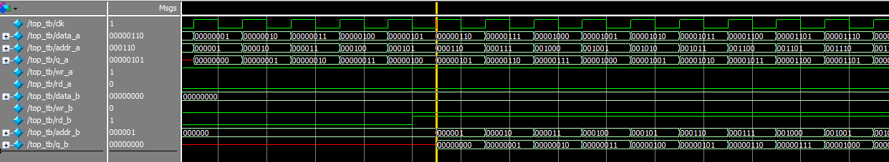
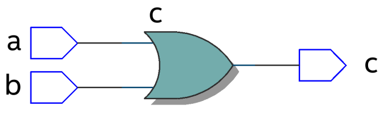
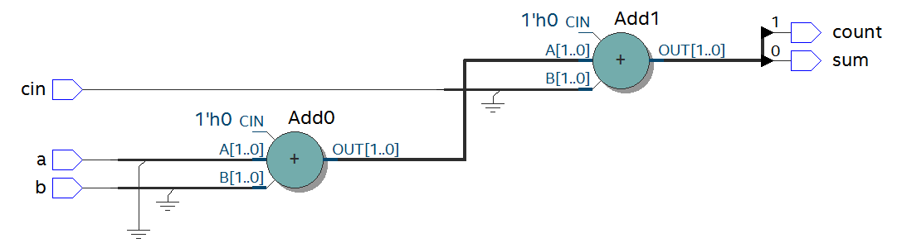

Verilog基础模块介绍
=====================

简介
----

本文主要介绍verilog基础模块，夯实基础，对深入学习FPGA会有很大帮助。

数据类型
--------

常量
~~~~

**整数**\ ：整数可以用二进制b或B，八进制o或O，十进制d或D，十六进制h或H表示，例如，
8’b00001111表示8位位宽的二进制整数，4’ha表示4位位宽的十六进制整数。

**X和Z**\ ：X代表不定值，z代表高阻值，例如，5’b00x11，第三位不定值，3’b00z表示最低位为高阻值。

**下划线**\ ：在位数过长时可以用来分割位数，提高程序可读性，如8’b0000_1111

**参数parameter**:
parameter可以用标识符定义常量，运用时只使用标识符即可，提高可读性及维护性，如定义parameter
width = 8 ; 定义寄存器reg [width-1:0] a; 即定义了8位宽度的寄存器。

参数的传递：在一个模块中如果有定义参数，在其他模块调用此模块时可以传递参数，并可以修改参数，如下所示，在module后用#（）表示。

例如定义模块如下 

调用模块

.. code:: verilog

 module rom 
 #( 
   parameter depth =15, 
   parameter width = 8  
   ) 
   ( 
    input [depth-1:0] addr , 
 input [width-1:0] data , 
 output result 
 ) ; 
 
 endmodule

顶层模块

.. code:: verilog

 module top() ; 
  
 wire [31:0] addr ; 
 wire [15:0] data ; 
 wire result ; 
  
 rom 
 #( 
   .depth(32), 
   .width(16)  
   )
 r1  
 ( 
 .addr(addr) , 
 .data(data) , 
 .result(result) 
 ) ;  
 endmodule 

Parameter可以用于模块间的参数传递，而localparam仅用于本模块内使用，不能用于参数传递。Localparam多用于状态机状态的定义。

变量
----

变量是指程序运行时可以改变其值的量，下面主要介绍几个常用了变量类型。

Wire 型
~~~~~~~

Wire
类型变量，也叫网络类型变量，用于结构实体之间的物理连接，如门与门之间，不能储存值，用连续赋值语句assign赋值，定义为wire
[n-1:0] a ; 其中n代表位宽，如定义wire a ; assign a = b ;
是将b的结点连接到连线a上。如下图所示，两个实体之间的连线即是wire类型变量。

.. image:: images/04_media/image1.png
      
Reg 型
~~~~~~

Reg
类型变量，也称为寄存器变量，可用来储存值，必须在always语句里使用。其定义为

reg [n-1:0] a ; 表示n位位宽的寄存器，如reg [7:0] a;
表示定义8位位宽的寄存器a。如下所示定义了寄存器q，生成的电路为时序逻辑，下图为其结构，为D触发器。

.. code:: verilog

 module top(d, clk, q) ; 
 input  d  ; 
 input clk ; 
 output reg q ; 
  
 always @(posedge clk) 
 begin 
   q <= d ; 
 end   
 endmodule 

|image1|

也可以生成组合逻辑，如数据选择器，敏感信号没有时钟，定义了reg
Mux，最终生成电路为组合逻辑。

.. code:: verilog

 module top(a, b, c, d, sel, Mux) ; 
 input   a ; 
 input   b ; 
 input   c ; 
 input   d ; 
 input [1:0] sel ; 
 output reg Mux ; 
  
 always @(sel or a or b or c or d) 
 begin 
   case(sel) 
     2'b00 : Mux = a ; 
     2'b01 : Mux = b ; 
     2'b10 : Mux = c ; 
     2'b11 : Mux = d ; 
   endcase 
 end 
    
 endmodule

|image2|

Memory型
~~~~~~~~

可以用memory类型来定义RAM,ROM等存储器，其结构为reg [n-1:0]
存储器名[m-1:0]，意义为m个n位宽度的寄存器。例如，reg [7:0] ram
[255:0]表示定义了256个8位寄存器，256也即是存储器的深度，8为数据宽度。

运算符
------

运算符可分为以下几类：

1. 算术运算符（+，-，\*，/，%）

2. 赋值运算符（=，<=）

3. 关系运算符（>，<，>=，<=，==，！=）

4. 逻辑运算符（&&，||，！）

5. 条件运算符（？：）

6. 位运算符（~，\|，^，&，^~）

7. 移位运算符（<<，>>）

8. 拼接运算符（{ }）

算术运算符
~~~~~~~~~~

“+”(加法运算符)，”-“（减法运算符），”*”(乘法运算符)，”/”（除法运算符，如7/3
=2），“%”（取模运算符，也即求余数，如7%3=1，余数为1）

赋值运算符
~~~~~~~~~~

“=”阻塞赋值，”<=”非阻塞赋值。阻塞赋值为执行完一条赋值语句，再执行下一条，可理解为顺序执行，而且赋值是立即执行;非阻塞赋值可理解为并行执行，不考虑顺序，在always块语句执行完成后，才进行赋值。如下面的阻塞赋值：

代码如下： 

.. code:: verilog

 module top(din,a,b,c,clk); 
  
 input din; 
 input clk; 
 output reg a,b,c; 
  
 always @(posedge clk)  
 begin 
         a = din; 
         b = a; 
         c = b; 
 end 
  
 endmodule 

激励文件如下：

.. code:: verilog

 `timescale 1 ns/1 ns 
 module top_tb() ; 
 reg din ; 
 reg clk ; 
 wire a,b,c ; 
  
 initial 
 begin 
   din =  0 ; 
   clk = 0  ; 
   forever 
   begin     
     #({$random}%100) 
     din = ~din ; 
   end 
 end 
  
 always #10 clk = ~clk ; 
  
 top  t0(.din(din),.a(a),.b(b),.c(c),.clk(clk)) ; 
 endmodule 

可以从仿真结果看到，在clk的上升沿，a的值等于din，并立即赋给b，b的值赋给c。

.. image:: images/04_media/image4.png
      
如果改为非阻塞赋值，仿真结果如下，在clk上升沿，a的值没有立即赋值给b，b为a原来的值，同样，c为b原来的值

.. image:: images/04_media/image5.png
      
可以从两者的RTL图看出明显不同：

|image3| |image4|

阻塞赋值RTL图 非阻塞赋值RTL图

**一般情况下，在时序逻辑电路中使用非阻塞赋值，可避免仿真时出现竞争冒险现象;在组合逻辑中使用阻塞赋值，执行赋值语句后立即改变;在assign语句中必须用阻塞赋值。**

关系运算符
~~~~~~~~~~

用于表示两个操作数之间的关系，如a>b，a<b，多用于判断条件，例如：

::

 If (a>=b) q <=1’b1 ;
 else q <= 1’b0 ;

表示如果a的值大于等于b的值，则q的值为1，否则q的值为0

逻辑运算符
~~~~~~~~~~

“&&”（两个操作数逻辑与），”||”（两个操作数逻辑或），”!”（单个操作数逻辑非）例如：

If (a>b && c <d) 表示条件为a>b并且c<d; if
(!a)表示条件为a的值不为1，也就是0。

条件运算符
~~~~~~~~~~

“?:”为条件判断，类似于if else，例如assign a = (i>8)?1’b1:1’b0
;判断i的值是否大于8，如果大于8则a的值为1，否则为0。

位运算符
~~~~~~~~

“~”按位取反，”|”按位或，”^”按位异或，”&”按位与，”^”按位同或，除了”~”只需要一个操作数外，其他几个都需要两个操作数，如a&b，a|b。具体应用在后面的组合逻辑一节中有讲解。

移位运算符
~~~~~~~~~~

“<<”左移位运算符，”>>”右移位运算符，如a<<1表示，向左移1位，a>>2，向右移两位。

拼接运算符
~~~~~~~~~~

“{ }”拼接运算符，将多个信号按位拼接，如{a[3:0],
b[1:0]}，将a的低4位，b的低2位拼接成6位数据。另外，{n{a[3:0]}}表示将n个a[3:0]拼接，{n{1’b0}}表示n位的0拼接。如{8{1’b0}}表示为8’b0000_0000.

优先级别
~~~~~~~~

各种运算符的优先级别如下：

.. image:: images/04_media/image8.png
      
组合逻辑
--------

本节主要介绍组合逻辑，组合逻辑电路的特点是任意时刻的输出仅仅取决于输入信号，输入信号变化，输出立即变化，不依赖于时钟。

与门
~~~~

在verilog中以“&”表示按位与，如c=a&b，真值表如下，在a和b都等于1时结果才为1，RTL表示如右图

|image5| |image6|

代码实现如下： 

.. code:: verilog

 module top(a, b, c) ; 
 input  a ; 
 input  b ; 
 output c ; 
  
 assign c = a & b ; 
 endmodule 

激励文件如下：

.. code:: verilog

 `timescale 1 ns/1 ns 
 module top_tb() ; 
 reg a ; 
 reg b ; 
 wire c ; 
  
 initial 
 begin 
   a = 0 ; 
   b = 0 ; 
   forever 
   begin     
     #({$random}%100) 
     a = ~a ; 
     #({$random}%100)  
     b = ~b ;  
   end 
 end 
  
 top  t0(.a(a), .b(b),.c(c)) ; 
  
 endmodule 

仿真结果如下：

.. image:: images/04_media/image11.png
      
如果a和b的位宽大于1，例如定义input [3:0] a, input
[3:0]b，那么a&b则指a与b的对应位相与。如a[0]&b[0],a[1]&b[1]。

或门
~~~~

在verilog中以“|”表示按位或，如c = a|b ,
真值表如下，在a和b都为0时结果才为0。

|image7| |image8|

代码实现如下：

.. code:: verilog

 module top(a, b, c) ; 
 input  a ; 
 input  b ; 
 output c ; 
  
 assign c = a | b ; 
 endmodule 

激励文件如下：

.. code:: verilog

 `timescale 1 ns/1 ns 
 module top_tb() ; 
 reg a ; 
 reg b ; 
 wire c ; 
  
 initial 
 begin 
   a = 0 ; 
   b = 0 ; 
   forever 
   begin     
     #({$random}%100) 
     a = ~a ; 
     #({$random}%100)  
     b = ~b ;  
   end 
 end 
  
 top  t0(.a(a), .b(b),.c(c)) ; 
  
 endmodule 

仿真结果如下：

.. image:: images/04_media/image14.png
      
同理，位宽大于1，则是按位或。

非门
~~~~

在verilog中以“~”表示按位取反，如b=~a，真值表如下，b等于a的相反数。

|image9| |image10|

代码实现如下： 

.. code:: verilog

 module top(a, b) ; 
 input   a ; 
 output  b ; 
  
 assign b = ~a ; 
 endmodule 

激励文件如下：

.. code:: verilog

 `timescale 1 ns/1 ns 
 module top_tb() ; 
 reg  a ; 
 wire b ; 
  
 initial 
 begin 
   a = 0 ;   
   forever 
   begin     
     #({$random}%100) 
     a = ~a ;     
   end 
 end 
  
 top  t0(.a(a), .b(b)) ; 
  
 endmodule

仿真结果如如下：

.. image:: images/04_media/image17.png
      
异或
~~~~

在verilog中以“^”表示异或，如c= a^b ，真值表如下，当a和b相同时，输出为0。

|image11| |image12|

代码实现如下： 

.. code:: verilog

 module top(a, b, c) ; 
 input  a ; 
 input  b ; 
 output c ; 
  
 assign c = a ^ b ; 
 endmodule 

激励文件如下：

.. code:: verilog

 `timescale 1 ns/1 ns 
 module top_tb() ; 
 reg a ; 
 reg b ; 
 wire c ; 
  
 initial 
 begin 
   a = 0 ; 
   b = 0 ; 
   forever 
   begin     
     #({$random}%100) 
     a = ~a ; 
     #({$random}%100)  
     b = ~b ;  
   end 
 end 
  
 top  t0(.a(a), .b(b),.c(c)) ; 
  
 endmodule 

仿真结果如下：

.. image:: images/04_media/image20.png
      
比较器
~~~~~~

在verilog中以大于“>”，等于”==”，小于”<”，大于等于”>=”，小于等于”<=”，不等于”!=”表示，以大于举例，如c=
a > b ;表示如果a大于b，那么c的值就为1，否则为0。真值表如下：

|image13|\ |image14|

代码实现如下：

.. code:: verilog
 
 module top(a, b, c) ; 
 input  a ; 
 input  b ; 
 output c ; 
  
 assign c = a > b ; 
 endmodule 

激励文件如下：

.. code:: verilog
 
 `timescale 1 ns/1 ns 
 module top_tb() ; 
 reg a ; 
 reg b ; 
 wire c ; 
  
 initial 
 begin 
   a = 0 ; 
   b = 0 ; 
   forever 
   begin     
     #({$random}%100) 
     a = ~a ; 
     #({$random}%100)  
     b = ~b ;  
   end 
 end 
  
 top  t0(.a(a), .b(b),.c(c)) ; 
  
 endmodule

仿真结果如下：

      
半加器
~~~~~~

半加器和全加器是算术运算电路中的基本单元，由于半加器不考虑从低位来的进位，所以称之为半加器，sum表示相加结果，count表示进位，真值表可表示如下：

\ |image15|\ |image16|

可根据真值表写出代码如下： 

.. code:: verilog

 module top(a, b, sum, count) ; 
 input  a ; 
 input  b ; 
 output sum ; 
 output count ; 
  
 assign sum = a ^ b ; 
 assign count = a & b ; 
  
 endmodule 

激励文件如下：

.. code:: verilog

 `timescale 1 ns/1 ns 
 module top_tb() ; 
 reg a ; 
 reg b ; 
 wire sum ; 
 wire count ; 
  
 initial 
 begin 
   a = 0 ; 
   b = 0 ; 
   forever 
   begin     
     #({$random}%100) 
     a = ~a ; 
     #({$random}%100)  
     b = ~b ;  
   end 
   end 
  
 top  t0(.a(a), .b(b), 
 .sum(sum), .count(count)) ; 
  
 endmodule

仿真结果如下：

.. image:: images/04_media/image26.png
      
全加器
~~~~~~

而全加器需要加上低位来的进位信号cin，真值表如下：

|image17|\ |image18|

代码如下： 

.. code:: verilog

 module top(cin, a, b, sum, count) ; 
 input cin ; 
 input  a ; 
 input  b ; 
 output sum ; 
 output count ; 
  
 assign {count,sum} = a + b + cin ; 
  
 endmodule

激励文件如下：

.. code:: verilog

 `timescale 1 ns/1 ns 
 module top_tb() ; 
 reg a ; 
 reg b ; 
 reg cin ; 
 wire sum ; 
 wire count ; 
  
 initial 
 begin 
   a = 0 ; 
   b = 0 ; 
   cin = 0 ; 
   forever 
   begin     
     #({$random}%100) 
     a = ~a ; 
     #({$random}%100)  
 b = ~b ;  
 #({$random}%100)  
     cin = ~cin ;  
  
   end 
 end 
  
 top  t0(.cin(cin),.a(a), .b(b), 
 .sum(sum), .count(count)) ; 
  
 endmodule

仿真结果如下：

.. image:: images/04_media/image29.png
      
乘法器
~~~~~~

乘法的表示也很简单，利用”*”即可，如a*b，举例代码如下：

.. code:: verilog

 module top(a, b, c) ; 
 input  [1:0] a ; 
 input  [1:0] b ; 
 output [3:0] c ; 
  
 assign c = a * b ; 
 endmodule

激励文件如下：

.. code:: verilog

 `timescale 1 ns/1 ns 
 module top_tb() ; 
 reg [1:0] a ; 
 reg [1:0] b ; 
 wire [3:0] c ; 
  
 initial 
 begin 
   a = 0 ; 
   b = 0 ; 
   forever 
   begin     
     #({$random}%100) 
     a = ~a ; 
     #({$random}%100)  
     b = ~b ;  
   end 
 end 
  
 top  t0(.a(a), .b(b),.c(c)) ; 
  
 endmodule

仿真结果如下：

.. image:: images/04_media/image30.png
      
数据选择器
~~~~~~~~~~

在verilog中经常会用到数据选择器，通过选择信号，选择不同的输入信号输出到输出端，如下图真值表，四选一数据选择器，sel[1:0]为选择信号，a,b,c,d为输入信号，Mux为输出信号。

.. image:: images/04_media/image31.png
      

      
代码如下： 

.. code:: verilog

 module top(a, b, c, d, sel, Mux) ; 
 input   a ; 
 input   b ; 
 input   c ; 
 input   d ; 
  
 input [1:0] sel ; 
  
 output reg Mux ; 
  
 always @(sel or a or b or c or d) 
 begin 
   case(sel) 
     2'b00 : Mux = a ; 
     2'b01 : Mux = b ; 
     2'b10 : Mux = c ; 
     2'b11 : Mux = d ; 
   endcase 
 end 
    
 endmodule

激励文件如下：

.. code:: verilog

 `timescale 1 ns/1 ns 
 module top_tb() ; 
 reg  a ; 
 reg  b ; 
 reg  c ; 
 reg  d ; 
 reg [1:0] sel ; 
 wire  Mux ; 
  
 initial 
 begin 
   a = 0 ; 
   b = 0 ; 
   c = 0 ; 
   d = 0 ; 
   forever 
   begin     
     #({$random}%100) 
     a = {$random}%3 ; 
     #({$random}%100)  
     b = {$random}%3 ; 
     #({$random}%100) 
     c = {$random}%3 ; 
     #({$random}%100)  
     d = {$random}%3 ; 
   end 
   end 
  
 initial 
 begin 
   sel = 2'b00 ; 
   #2000 sel =  2'b01 ; 
   #2000 sel =  2'b10 ; 
   #2000 sel =  2'b11 ; 
 end 
  
 top  
 t0(.a(a), .b(b),.c(c),.d(d), .sel(sel),
 .Mux(Mux)) ; 
  
 endmodule 

仿真结果如下

.. image:: images/04_media/image32.png
      
3-8译码器
~~~~~~~~~

3-8译码器是一个很常用的器件，其真值表如下所示，根据A2,A1,A0的值，得出不同的结果。

.. image:: images/04_media/image33.png
      

      
代码如下： 

.. code:: verilog

 module top(addr, decoder) ; 
 input  [2:0] addr ; 
 output reg [7:0] decoder ; 
  
 always @(addr) 
 begin 
   case(addr) 
     3'b000 : decoder = 8'b1111_1110 ; 
     3'b001 : decoder = 8'b1111_1101 ; 
     3'b010 : decoder = 8'b1111_1011 ; 
     3'b011 : decoder = 8'b1111_0111 ; 
     3'b100 : decoder = 8'b1110_1111 ; 
     3'b101 : decoder = 8'b1101_1111 ; 
     3'b110 : decoder = 8'b1011_1111 ; 
     3'b111 : decoder = 8'b0111_1111 ;    
   endcase 
 end 
    
 endmodule

激励文件如下：

.. code:: verilog

 `timescale 1 ns/1 ns 
 module top_tb() ; 
 reg  [2:0]  addr ; 
 wire  [7:0] decoder ;  
  
 initial 
 begin 
   addr = 3'b000 ; 
   #2000 addr =  3'b001 ; 
   #2000 addr =  3'b010 ; 
   #2000 addr =  3'b011 ; 
   #2000 addr =  3'b100 ; 
   #2000 addr =  3'b101 ; 
   #2000 addr =  3'b110 ; 
   #2000 addr =  3'b111 ; 
 end 
  
 top  
 t0(.addr(addr),.decoder(decoder)) ; 
  
 endmodule

仿真结果如下：

.. image:: images/04_media/image35.png
      
三态门
~~~~~~

在FPGA使用中，经常会用到双向IO，需要用到三态门，如bio = en? din: 1’bz
;其中en为使能信号，用于打开关闭三态门，下面的RTL图即是实现了双向IO，可参考代码。激励文件实现两个双向IO的对接。

代码如下：

.. code:: verilog
      
 module top(en, din, dout, bio) ; 
 input  din  ; 
 input  en ; 
 output dout ; 
 inout bio ; 
  
 assign bio = en? din : 1'bz ; 
 assign dout = bio ; 
    
 endmodule

激励文件如下：

.. code:: verilog

 `timescale 1 ns/1 ns 
 module top_tb() ; 
 reg en0 ; 
 reg din0 ; 
 wire dout0 ; 
 reg en1 ; 
 reg din1 ; 
 wire dout1 ; 
 wire bio ; 
  
 initial 
 begin 
   din0 = 0 ; 
   din1 = 0 ; 
   forever 
   begin     
     #({$random}%100) 
     din0 = ~din0 ; 
     #({$random}%100)     
 din1 = ~din1 ; 
   end 
 end 
  
 initial 
 begin 
   en0 = 0 ; 
   en1 = 1 ; 
   #100000  
   en0 = 1 ; 
   en1 = 0 ;   
 end 
  
 top  
 t0(.en(en0),.din(din0),.dout(dout0),.bi
 o(bio)) ; 
 top  
 t1(.en(en1),.din(din1),.dout(dout1),.bi
 o(bio)) ; 
  
 endmodule

激励文件结构如下图

      
仿真结果如下，en0为0，en1为1时，1通道打开，双向IO
bio就等于1通道的din1，1通道向外发送数据，0通道接收数据，dout0等于bio;当en0为1，en1为0时，0通道打开，双向IO
bio就等于0通道的din0，0通道向外发送数据，1通道接收数据，dout1等于bio

.. image:: images/04_media/image38.png
      
时序逻辑
--------

组合逻辑电路在逻辑功能上特点是任意时刻的输出仅仅取决于当前时刻的输入，与电路原来的状态无关。而时序逻辑在逻辑功能上的特点是任意时刻的输出不仅仅取决于当前的输入信号，而且还取决于电路原来的状态。下面以典型的时序逻辑分析。

D触发器
~~~~~~~

D触发器在时钟的上升沿或下降沿存储数据，输出与时钟跳变之前输入信号的状态相同。

代码如下: 

.. code:: verilog

 module top(d, clk, q) ; 
 input  d  ; 
 input clk ; 
 output reg q ; 
 always @(posedge clk) 
 begin 
   q <= d ; 
 end 
    
 endmodule 

激励文件如下:

.. code:: verilog

 `timescale 1 ns/1 ns 
 module top_tb() ; 
 reg d ; 
 reg clk ; 
 wire q ; 
  
 initial 
 begin 
   d = 0 ; 
   clk = 0 ; 
   forever 
   begin     
     #({$random}%100) 
     d = ~d ; 
   end 
 end 
  
 always #10 clk = ~clk ; 
 top  t0(.d(d),.clk(clk),.q(q)) ; 
  
 endmodule

RTL图表示如下

.. image:: images/04_media/image2.png
      
仿真结果如下，可以看到在t0时刻时，d的值为0，则q的值也为0;在t1时刻d发生了变化，值为1，那么q相应也发生了变化，值变为1。可以看到在t0-t1之间的一个时钟周期内，无论输入信号d的值如何变化，q的值是保持不变的，也就是有存储的功能，保存的值为在时钟的跳变沿时d的值。

      
两级D触发器
~~~~~~~~~~~

软件是按照两级D触发器的模型进行时序分析的，具体可以分析在同一时刻两个D触发器输出的数据有何不同，其RTL图如下：

.. image:: images/04_media/image40.png
      
 代码如下： 

.. code:: verilog

 module top(d, clk, q, q1) ; 
 input  d  ; 
 input clk ; 
 output reg q ; 
 output reg q1 ; 
  
 always @(posedge clk) 
 begin 
   q <= d ; 
 end 
  
 always @(posedge clk) 
 begin 
   q1 <= q ; 
 end 
    
 endmodule 

激励文件如下：

.. code:: verilog

 `timescale 1 ns/1 ns 
 module top_tb() ; 
 reg d ; 
 reg clk ; 
 wire q ; 
 wire q1 ; 
  
 initial 
 begin 
   d = 0 ; 
   clk = 0 ; 
   forever 
   begin     
     #({$random}%100) 
     d = ~d ; 
   end 
 end 
  
 always #10 clk = ~clk ; 
  
 top  
 t0(.d(d),.clk(clk),.q(q),.q1(q1)) ; 
  
 endmodule

仿真结果如下，可以看到t0时刻，d为0，q输出为0，t1时刻，q随着d的数据变化而变化，而此时钟跳变之前q的值仍为0，那么q1的值仍为0，t2时刻，时钟跳变前q的值为1，则q1的值相应为1，q1相对于q落后一个周期。

.. image:: images/04_media/image41.png
      
带异步复位的D触发器
~~~~~~~~~~~~~~~~~~~

异步复位是指独立于时钟，一旦异步复位信号有效，就触发复位操作。这个功能在写代码时会经常用到，用于给信号复位，初始化。其RTL图如下：

.. image:: images/04_media/image42.png
      
代码如下，注意要把异步复位信号放在敏感列表里，如果是低电平复位，即为negedge，如果是高电平复位，则是posedge

.. code:: verilog

 module top(d, rst, clk, q) ; 
 input  d  ; 
 input rst ; 
 input clk ; 
 output reg q ; 
  
 always @(posedge clk or negedge rst) 
 begin 
   if (rst == 1'b0) 
     q <= 0 ; 
   else 
     q <= d ; 
 end 
  
 endmodule

激励文件如下：

.. code:: verilog

 `timescale 1 ns/1 ns 
 module top_tb() ; 
 reg d ; 
  
 reg rst ; 
 reg clk ; 
 wire q ; 
  
 initial 
 begin 
   d = 0 ; 
   clk = 0 ; 
   forever 
   begin     
     #({$random}%100) 
     d = ~d ; 
   end 
 end 
  
 initial 
 begin 
   rst = 0 ; 
   #200 rst = 1 ; 
 end 
  
 always #10 clk = ~clk ; 
  
 top  
 t0(.d(d),.rst(rst),.clk(clk),.q(q)) ; 
  
 endmodule

仿真结果如下，可以看到在复位信号之前，虽然输入信号d数据有变化，但由于正处于复位状态，输入信号q始终为0，在复位之后q的值就正常了。

.. image:: images/04_media/image43.png
      
带异步复位同步清零的D触发器
~~~~~~~~~~~~~~~~~~~~~~~~~~~

前面讲到异步复位独立于时钟操作，而同步清零则是同步于时钟信号下操作的，当然也不仅限于同步清零，也可以是其他的同步操作，其RTL图如下：

.. image:: images/04_media/image44.png
      
代码如下，不同于异步复位，同步操作不能把信号放到敏感列表里

.. code:: verilog

 module top(d, rst, clr, clk, q) ; 
 input  d  ; 
 input rst ; 
 input clr ; 
 input clk ; 
 output reg q ; 
  
 always @(posedge clk or negedge rst) 
 begin 
   if (rst == 1'b0) 
     q <= 0 ; 
   else if (clr == 1'b1) 
     q <= 0 ; 
   else 
     q <= d ; 
 end 
  
 endmodule 

激励文件如下：

.. code:: verilog

 `timescale 1 ns/1 ns 
 module top_tb() ; 
 reg d ; 
 reg rst ; 
 reg clr ; 
 reg clk ; 
 wire q ; 
  
 initial 
 begin 
   d = 0 ; 
   clk = 0 ; 
   forever 
   begin     
     #({$random}%100) 
     d = ~d ; 
   end 
 end 
  
 initial 
 begin 
   rst = 0 ; 
   clr = 0 ; 
   #200 rst = 1 ; 
   #200 clr = 1 ; 
   #100 clr = 0 ; 
 end 
  
 always #10 clk = ~clk ; 
  
 top  
 t0(.d(d),.rst(rst),.clr(clr),.clk(clk),
 .q(q)) ; 
  
 endmodule

仿真结果如下，可以看到clr信号拉高后，q没有立即清零，而是在下个clk上升沿之后执行清零操作，也就是clr同步于clk。

.. image:: images/04_media/image45.png
      
移位寄存器
~~~~~~~~~~

移位寄存器是指在每个时钟脉冲来时，向左或向右移动一位，由于D触发器的特性，数据输出同步于时钟边沿，其结构如下，每个时钟来临，每个D触发器的输出q等于前一个D触发器输出的值，从而实现移位的功能。

.. image:: images/04_media/image46.png
      
代码实现：

.. code:: verilog

 module top(d, rst, clk, q) ; 
 input  d  ; 
 input rst ; 
 input clk ; 
 output reg [7:0] q ;
 
 always @(posedge clk or negedge rst) 
 begin 
   if (rst == 1'b0) 
     q <= 0 ; 
   else 
     q <= {q[6:0], d} ;  //向左移位 
   //q <= {d, q[7:1]} ;  //向右移位 
 end 
  
 endmodule

激励文件：

.. code:: verilog

 `timescale 1 ns/1 ns 
 module top_tb() ; 
 reg d ; 
  
 reg rst ; 
 reg clk ; 
 wire [7:0] q ; 
  
 initial 
 begin 
   d = 0 ; 
   clk = 0 ; 
   forever 
   begin     
     #({$random}%100) 
     d = ~d ; 
   end 
 end 
  
 initial 
 begin 
   rst = 0 ; 
   #200 rst = 1 ; 
 end 
  
 always #10 clk = ~clk ; 
  
 top 
 t0(.d(d),.rst(rst),.clk(clk),.q(q)) ; 
  
 endmodule

仿真结果如下，可以看到复位之后，每个clk上升沿左移一位

.. image:: images/04_media/image47.png
      
单口RAM
~~~~~~~

单口RAM的写地址与读地址共用一个地址，代码如下，其中reg [7:0] ram
[63:0]意思是定义了64个8位宽度的数据。其中定义了addr_reg，可以保持住读地址，延迟一周期之后将数据送出。

代码实现：

.. code:: verilog

 module top  
 ( 
   input [7:0] data, 
   input [5:0] addr, 
   input wr, 
   input clk, 
   output [7:0] q 
 ); 
  
 reg [7:0] ram[63:0];   //declare ram 
 reg [5:0] addr_reg;    //addr register 
  
 always @ (posedge clk) 
 begin 
   if (wr)               //write 
     ram[addr] <= data; 
 	     
   addr_reg <= addr; 
 end 
  
 assign q = ram[addr_reg];  //read data 
 endmodule 

激励文件：

.. code:: verilog

 `timescale 1 ns/1 ns 
 module top_tb() ; 
 reg [7:0] data ;  
 reg [5:0] addr ;  
 reg wr ; 
 reg clk ; 
 wire [7:0] q ; 
  
 initial 
 begin 
   data = 0 ; 
   addr = 0 ; 
   wr = 1 ; 
   clk = 0 ; 
   end 
  
 always #10 clk = ~clk ; 
  
 always @(posedge clk) 
 begin 
   data <= data + 1'b1 ; 
   addr <= addr + 1'b1 ; 
 end 
  
 top  t0(.data(data), 
         .addr(addr), 
         .clk(clk), 
         .wr(wr), 
         .q(q)) ; 
 endmodule

仿真结果如下，可以看到q的输出与写入的数据一致

.. image:: images/04_media/image48.png
      
伪双口RAM
~~~~~~~~~

伪双口RAM的读写地址是独立的，可以随机选择写或读地址，同时进行读写操作。代码如下，在激励文件中定义了en信号，在其有效时发送读地址。

代码实现

.. code:: verilog

 module top  
 ( 
   input [7:0] data, 
   input [5:0] write_addr, 
   input [5:0] read_addr,  
   input wr, 
   input rd, 
   input clk, 
   output reg [7:0] q 
 ); 
  
 reg [7:0] ram[63:0];   //declare ram 
 reg [5:0] addr_reg;    //addr register 
  
 always @ (posedge clk) 
 begin 
   if (wr)               //write 
     ram[write_addr] <= data; 
   if (rd)               //read 
      q <= ram[read_addr]; 
 end 
  
 endmodule 

激励文件

.. code:: verilog

 `timescale 1 ns/1 ns 
 module top_tb() ; 
 reg [7:0] data ;  
 reg [5:0] write_addr ; 
 reg [5:0] read_addr ;  
 reg wr ; 
 reg clk ; 
 reg rd ; 
 wire [7:0] q ; 
  
 initial 
 begin 
   data = 0 ; 
   write_addr = 0 ; 
   read_addr = 0 ; 
   wr = 0 ; 
   rd = 0 ; 
   clk = 0 ; 
   #100 wr = 1 ; 
   #20 rd = 1 ; 
 end 
 
 always #10 clk = ~clk ; 
  
 always @(posedge clk) 
 begin 
   if (wr) 
   begin 
      data <= data + 1'b1 ; 
      write_addr <= write_addr + 1'b1 ; 
      if (rd)  
        read_addr <= read_addr + 1'b1 ; 
   end 
 end 
  
 top  t0(.data(data), 
         .write_addr(write_addr), 
         .read_addr(read_addr), 
         .clk(clk), 
         .wr(wr), 
         .rd(rd), 
         .q(q)) ; 
 endmodule 

仿真结果如下，可以看到在rd有效时，对读地址进行操作，读出数据

.. image:: images/04_media/image49.png
      
真双口RAM
~~~~~~~~~

真双口RAM有两套控制线，数据线，允许两个系统对其进行读写操作，代码如下：

代码实现

.. code:: verilog

 module top  
 ( 
   input [7:0] data_a, data_b, 
   input [5:0] addr_a, addr_b, 
   input wr_a, wr_b, 
   input rd_a, rd_b, 
   input clk, 
   output reg [7:0] q_a, q_b 
 ); 
  
 reg [7:0] ram[63:0];   //declare ram 
  
 //Port A 
 always @ (posedge clk) 
 begin 
   if (wr_a)               //write 
     begin 
      ram[addr_a] <= data_a; 
      q_a <= data_a ; 
     end 
 	  if (rd_a)                    
 //read 
      q_a <= ram[addr_a]; 
 end 
  
 
 //Port B 
 always @ (posedge clk) 
 begin 
   if (wr_b)               //write 
     begin 
      ram[addr_b] <= data_b; 
      q_b <= data_b ; 
     end 
   if (rd_b)                    
 //read 
      q_b <= ram[addr_b]; 
 end 
  
 endmodule 

激励文件

.. code:: verilog

 `timescale 1 ns/1 ns 
 module top_tb() ; 
 reg [7:0] data_a, data_b ; 
 reg [5:0] addr_a, addr_b ; 
 reg wr_a, wr_b ; 
 reg rd_a, rd_b ;  
 reg clk ; 
 wire [7:0] q_a, q_b ; 
  
 initial 
 begin 
   data_a = 0 ; 
   data_b = 0 ; 
   addr_a = 0 ; 
   addr_b = 0 ; 
   wr_a = 0 ; 
   wr_b = 0 ; 
   rd_a =  0 ; 
   rd_b = 0 ; 
   clk = 0 ; 
   #100 wr_a = 1 ; 
   #100 rd_b = 1 ; 
 end 
  
 always #10 clk = ~clk ; 
  
 always @(posedge clk) 
 begin 
   if (wr_a) 
   begin 
     data_a <= data_a + 1'b1 ; 
     addr_a <= addr_a + 1'b1 ; 
   end 
   else     
 begin 
      data_a <= 0 ; 
      addr_a <= 0 ; 
   end 
 end 
  
 always @(posedge clk) 
 begin 
   if (rd_b) 
     begin 
      addr_b <= addr_b + 1'b1 ;     
     end 
   else addr_b <= 0 ; 
  
 end 
  
 top  
 t0(.data_a(data_a), .data_b(data_b), 
    .addr_a(addr_a), .addr_b(addr_b), 
    .wr_a(wr_a), .wr_b(wr_b), 
    .rd_a(rd_a), .rd_b(rd_b), 
    .clk(clk),         
    .q_a(q_a), .q_b(q_b)) ; 
 endmodule 

仿真结果如下

      
单口ROM
~~~~~~~

ROM是用来存储数据的，可以按照下列代码形式初始化ROM，但这种方法处理大容量的ROM就比较麻烦，建议用FPGA自带的ROM
IP核实现，并添加初始化文件。

代码实现 

.. code:: verilog

 module top
 ( 
   input [3:0] addr, 
   input clk, 
   output reg [7:0] q  
 ); 
  
 always @(posedge clk) 
 begin 
   case(addr) 
    4'd0  : q <= 8'd15  ; 
    4'd1  : q <= 8'd24  ; 
    4'd2  : q <= 8'd100 ; 
    4'd3  : q <= 8'd78  ; 
    4'd4  : q <= 8'd98  ; 
    4'd5  : q <= 8'd105 ; 
    4'd6  : q <= 8'd86  ; 
    4'd7  : q <= 8'd254 ; 
    4'd8  : q <= 8'd76  ; 
    4'd9  : q <= 8'd35  ; 
    4'd10 : q <= 8'd120 ; 
    4'd11 : q <= 8'd85  ; 
    4'd12 : q <= 8'd37  ; 
    4'd13 : q <= 8'd19  ; 
    4'd14 : q <= 8'd22  ; 
    4'd15 : q <= 8'd67  ; 
    default: q <= 8'd0 ;
   endcase 
 end  
 
 endmodule

激励文件

.. code:: verilog

 `timescale 1 ns/1 ns 
 module top_tb() ; 
 reg [3:0] addr ; 
 reg clk ; 
 wire [7:0] q ; 
  
 initial 
 begin 
   addr = 0 ; 
   clk = 0 ; 
 end 
  
 always #10 clk = ~clk ; 
  
 always @(posedge clk) 
 begin 
      addr <= addr + 1'b1 ; 
 end 
  
 top  t0(.addr(addr), 
         .clk(clk), 
         .q(q)) ; 
 endmodule 

仿真结果如下

.. image:: images/04_media/image51.png
      
有限状态机
~~~~~~~~~~

在verilog里经常会用到有限状态机，处理相对复杂的逻辑，设定好不同的状态，根据触发条件跳转到对应的状态，在不同的状态下做相应的处理。有限状态机主要用到always及case语句。下面以一个四状态的有限状态机举例说明。

.. image:: images/04_media/image52.png
      
在程序中设计了8位的移位寄存器，在Idle状态下，判断shift_start信号是否为高，如果为高，进入Start状态，在Start状态延迟100个周期，进入Run状态，进行移位处理，如果shift_stop信号有效了，进入Stop状态，在Stop状态，清零q的值，再跳转到Idle状态。

Mealy有限状态机，输出不仅与当前状态有关，也与输入信号有关，在RTL中会与输入信号有连接。

.. code:: verilog

 module top  
 ( 
   input shift_start, 
   input shift_stop, 
   input rst, 
   input clk, 
   input d, 
   output reg [7:0] q  
 ); 
  
 parameter Idle  = 2'd0 ;    //Idle state 
 parameter Start = 2'd1 ;    //Start state 
 parameter Run   = 2'd2 ;    //Run state 
 parameter Stop  = 2'd3 ;    //Stop state 
   
 reg [1:0] state ;           //statement 
 reg [4:0] delay_cnt ;       //delay counter 
  
 always @(posedge clk or negedge rst) 
 begin 
   if (!rst) 
   begin 
    state <= Idle ; 
    delay_cnt <= 0 ; 
    q <= 0 ; 
    end 
   else 
   case(state) 
     Idle  : begin 
              if (shift_start) 
                 state <= Start ; 
     end 
     Start : begin 
               if (delay_cnt == 5'd99) 
               begin 
                 delay_cnt <= 0 ; 
                 state <= Run ; 
               end 
               else 
                 delay_cnt <= delay_cnt + 1'b1 ; 
             end 
     Run   : begin 
               if (shift_stop) 
                  state <= Stop ; 
               else 
                  q <= {q[6:0], d} ; 
             end 
     Stop  : begin 
               q <= 0 ; 
               state <= Idle ; 
            end 
   default: state <= Idle ; 
    endcase 
 end           
 endmodule 

Moore有限状态机，输出只与当前状态有关，与输入信号无关，输入信号只影响状态的改变，不影响输出，比如对delay_cnt和q的处理，只与state状态有关。

.. code:: verilog

 module top  
 ( 
   input shift_start, 
   input shift_stop, 
   input rst, 
   input clk, 
   input d, 
   output reg [7:0] q  
 ); 
  
 parameter Idle  = 2'd0 ;    //Idle state 
 parameter Start = 2'd1 ;    //Start state 
 parameter Run   = 2'd2 ;    //Run state 
 parameter Stop  = 2'd3 ;    //Stop state 
   
 reg [1:0] current_state ;           //statement 
 reg [1:0] next_state ; 
 reg [4:0] delay_cnt ;       //delay counter 
 //First part: statement transition 
 always @(posedge clk or negedge rst) 
 begin 
   if (!rst) 
    current_state <= Idle ; 
   else 
    current_state <= next_state ; 
 end 
 //Second part: combination logic, judge statement transition condition 
 always @(*) 
 begin 
   case(current_state) 
     Idle  : begin 
               if (shift_start) 
                   next_state <= Start ; 
               else 
                   next_state <= Idle ; 
     end 
     Start : begin 
               if (delay_cnt == 5'd99) 
                   next_state <= Run ; 
               else 
                   next_state <= Start ; 
             end 
     Run   : begin 
               if (shift_stop) 
                  next_state <= Stop ; 
               else 
                  next_state <= Run ; 
             end 
     Stop  :      next_state <= Idle ; 
    default:      next_state <= Idle ; 
   endcase 
 end 
 //Last part: output data 
 always @(posedge clk or negedge rst) 
 begin 
   if (!rst) 
     delay_cnt <= 0 ; 
   else if (current_state == Start) 
     delay_cnt <= delay_cnt + 1'b1 ; 
   else 
     delay_cnt <= 0 ; 
 end 
  
 always @(posedge clk or negedge rst) 
 begin 
   if (!rst) 
     q <= 0 ; 
   else if (current_state == Run) 
     q <= {q[6:0], d} ; 
   else 
     q <= 0 ; 
 end   
            
  
 endmodule

在上面两个程序中用到了两种方式的写法，第一种的Mealy状态机，采用了一段式的写法，只用了一个always语句，所有的状态转移，判断状态转移条件，数据输出都在一个always语句里，缺点是如果状态太多，会使整段程序显的冗长。第二个Moore状态机，采用了三段式的写法，状态转移用了一个always语句，判断状态转移条件是组合逻辑，采用了一个always语句，数据输出也是单独的 always语句，这样写起来比较直观清晰，状态很多时也不会显得繁琐。

.. image:: images/04_media/image53.png
      
Mealy有限状态机RTL图

.. image:: images/04_media/image54.png
      
Moore有限状态机RTL图

激励文件如下：

.. code:: verilog

 `timescale 1 ns/1 ns 
 module top_tb() ; 
 reg shift_start ; 
 reg shift_stop ; 
 reg rst ; 
 reg clk ; 
 reg d ; 
 wire [7:0] q ; 
  
 initial 
 begin 
   rst = 0 ;   
   clk = 0 ; 
   d = 0 ; 
   #200 rst = 1 ; 
   forever 
   begin 
     #({$random}%100) 
     d = ~d ; 
   end 
 end 
  
 initial 
 begin 
   shift_start = 0 ; 
   shift_stop = 0 ; 
   #300 shift_start = 1 ; 
   #1000 shift_start = 0 ; 
         shift_stop  = 1 ; 
   #50 shift_stop = 0 ; 
 end 
  
 always #10 clk = ~clk ; 
  
 top  t0 
 ( 
   .shift_start(shift_start), 
   .shift_stop(shift_stop), 
   .rst(rst), 
   .clk(clk), 
   .d(d), 
   .q(q)  
 ); 
 endmodule

仿真结果如下：

.. image:: images/04_media/image55.png
      
总结
----

本文档介绍了组合逻辑以及时序逻辑中常用的模块，其中有限状态机较为复杂，但经常用到，希望大家能够深入理解，在代码中多运用，多思考，有利于快速提升水平。

.. |image1| image:: images/04_media/image2.png

.. |image3| image:: images/04_media/image6.png

.. |image5| image:: images/04_media/image9.png
.. |image6| image:: images/04_media/image10.png
.. |image7| image:: images/04_media/image12.png

.. |image9| image:: images/04_media/image15.png
.. |image10| image:: images/04_media/image16.png
.. |image11| image:: images/04_media/image18.png
.. |image12| image:: images/04_media/image19.png
.. |image13| image:: images/04_media/image21.png
.. |image14| image:: images/04_media/image22.png
.. |image15| image:: images/04_media/image24.png
.. |image16| image:: images/04_media/image25.png

      