Vivado下PLL实验
=================

**实验Vivado工程为“pll_test”。**

很多初学者看到板上只有一个50Mhz时钟输入的时候都产生疑惑，时钟怎么才50Mhz？如果要工作在100Mhz、150Mhz怎么办？
其实在很多FPGA芯片内部都集成了PLL，其他厂商可能不叫PLL，但是也有类似的功能模块，通过PLL可以倍频分频，产生其他很多时钟。本实验通过调用PLL IP core来学习PLL的使用、vivado的IP core使用方法。

实验原理 
---------

PLL(phase-locked loop)，即锁相环。是FPGA中的重要资源。由于一个复杂的FPGA系统往往需要多个不同频率，相位的时钟信号。所以，一个FPGA芯片中PLL的数量是衡量FPGA芯片能力的重要指标。FPGA的设计中，时钟系统的FPGA高速的设计极其重要，一个低抖动,
低延迟的系统时钟会增加FPGA设计的成功率。

本实验将通过使用PLL,输出一个方波到开发板上的扩展口（AX7020/AX7010开发板J11的PIN3脚），来给大家演示在Vivado软件里使用PLL的方法。

7系列的FPGA使用了专用的全局(Global)和区域(Regional)IO和时钟资源来管理设计中各种的时钟需求。Clock Management Tiles(CMT)提供了时钟合成(Clock frequency synthesis)，倾斜矫正(deskew)，过滤抖动(jitter filtering)功能。

每个CMTs包含一个MMCM(mixed-mode clock manager)和一个PLL。如下图所示，CMT的输入可以是BUFR，IBUFG，BUFG，GT，BUFH，本地布线（不推荐使用），输出需要接到BUFG或者BUFH后再使用

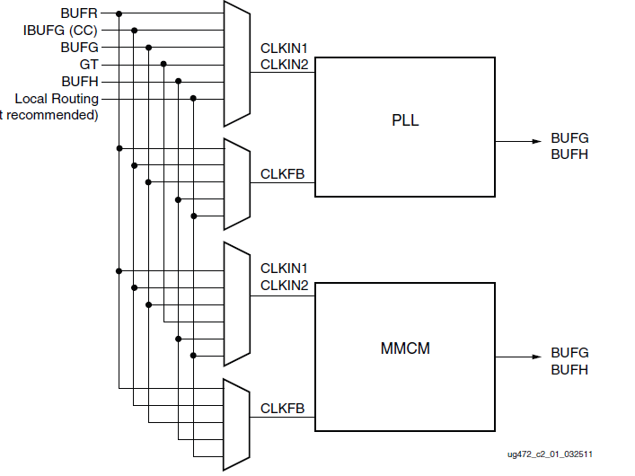
      
-  混合模式时钟管理器(MMCM)

MMCM用于在与给定输入时钟有设定的相位和频率关系的情况下，生成不同的时钟信号。 MMCM提供了广泛而强大的时钟管理功能，

MMCM内部的功能框图如下图所示:

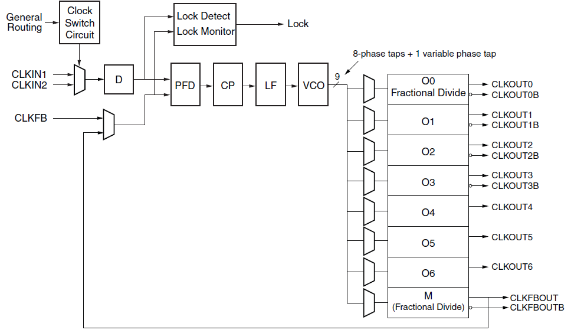
      
-  数字锁相环(PLL)

锁相环（PLL）主要用于频率综合。使用一个PLL可以从一个输入时钟信号生成多个时钟信号。

PLL内部的功能框图如下图所示:

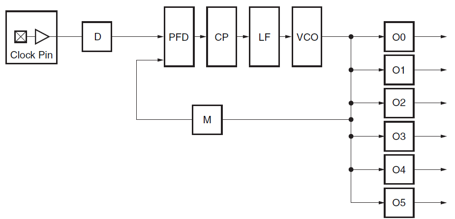
      
想了解更多的时钟资源, 建议大家看看Xilinx提供的文档"7 Series FPGAs Clocking Resources User Guide"。

创建Vivado工程
--------------

本实验中为大家演示如果调用Xilinx提供的PLL IP核来产生不同频率的时钟,并把其中的一个时钟输出到FPGA外部IO上, 下面为程序设计的详细步骤。

1) 新建一个pll_test的工程，点击Project Manager界面下的IP Catalog。

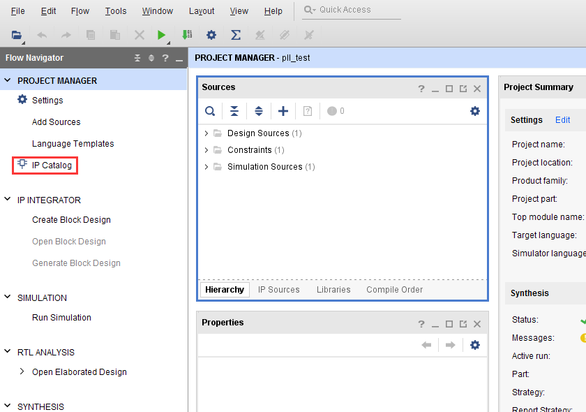
      
2) 再在IP Catalog界面里选择FPGA Features and Design\\Clocking下面的Clocking Wizard，双击打开配置界面。

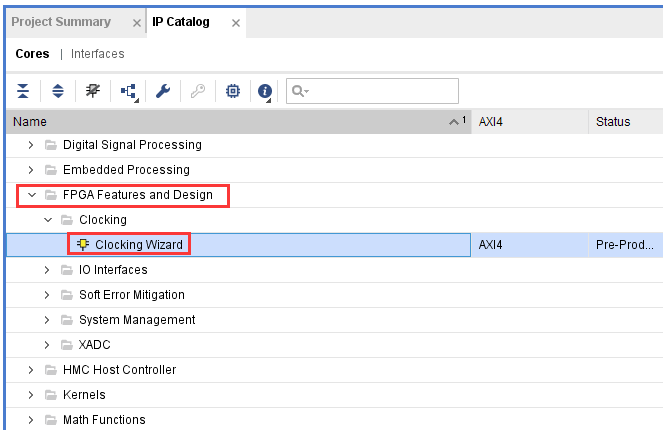
      
3) 默认这个Clocking Wizard的名字为clk_wiz_0,这里我们不做修改。在第一个界面Clocking Options里，我们选择PLL资源，输入的时钟频率为50Mhz。

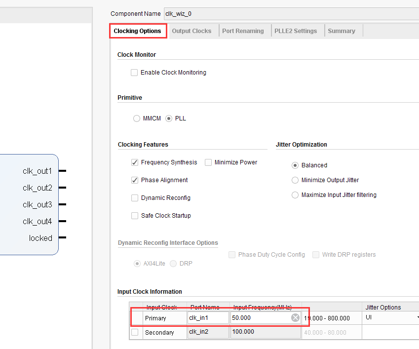
      
4) 在Output Clocks界面里选择clk_out1~clk_out4四个时钟的输出，频率分别为200Mhz, 100Mhz, 50Mhz, 25Mhz。这里还可以设置时钟输出的相位，我们不做设置，保留默认相位, 点击 OK完成,

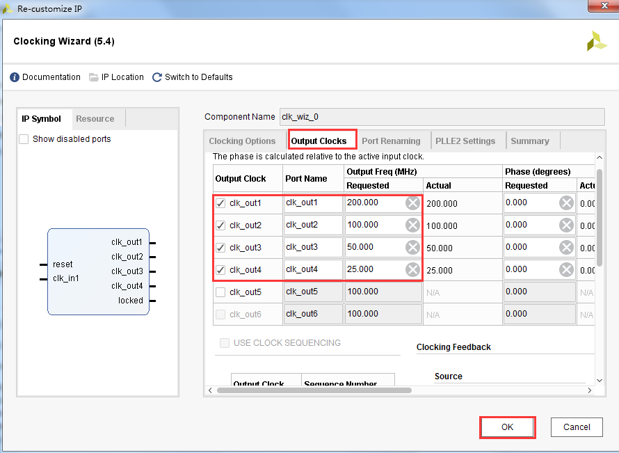
      
5) 在弹出的对话框中点击Generate按钮生成PLL IP的设计文件。

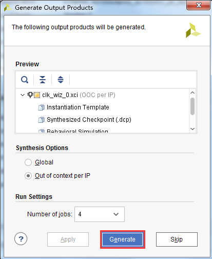
      
6) 这时一个 clk_wiz_0.xci的IP会自动添加到我们的pll_test项目中,用户可以双击它来修改这个IP的配置。

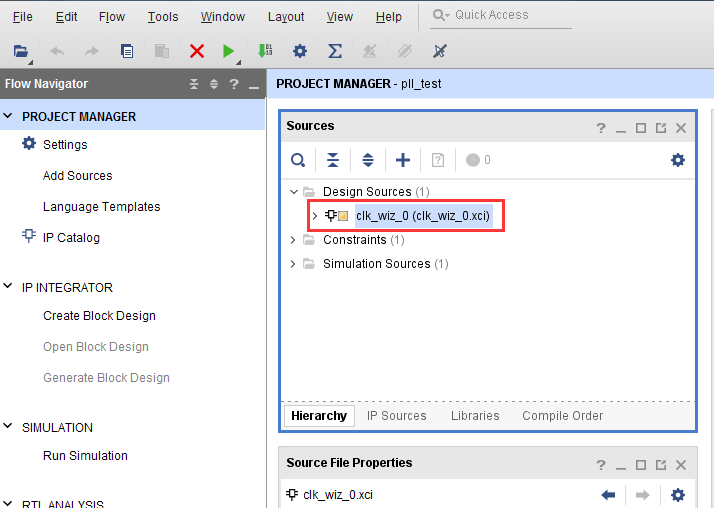
      
选择IP Sources这页，然后双击打开clk_wiz_0.veo文件，这个文件里提供了这个IP的实例化模板。我们只需要把框框的中内容拷贝到我们verilog程序中，对IP进行实例化。

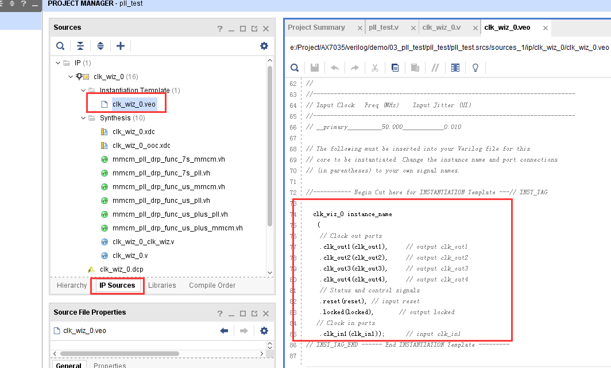
      
7) 我们再来编写一个顶层设计文件来实例化这个PLL IP,编写pll_test.v代码如下。注意PLL的复位是高电平有效，也就是高电平时一直在复位状态，PLL不会工作，这一点很多新手会忽略掉。这里我们将rst_n绑定到一个按键上，而按键是低电平复位，因此需要反向连接到PLL的复位。

.. code:: verilog

 `timescale 1ns / 1ps
 module pll_test(
  input      sys_clk,            //system clock 50Mhz on board
 input       rst_n,             //reset ,low active
 output      clk_out           //pll clock output J8_Pin3
 
     );
     
 wire        locked;
 
 /////////////////////PLL IP call////////////////////////////
 clk_wiz_0 clk_wiz_0_inst
    (// Clock in ports
     .clk_in1(sys_clk),            // IN 50Mhz
     // Clock out ports
     .clk_out1(),                // OUT 200Mhz
     .clk_out2(),               // OUT 100Mhz
     .clk_out3(),              // OUT 50Mhz
     .clk_out4(clk_out),    // OUT 25Mhz	 
     // Status and control signals	 
     .reset(~rst_n),        // pll reset, high-active
     .locked(locked));     // OUT
 
 
 endmodule

程序中先用实例化clk_wiz_0,把单端50Mhz时钟信号输入到clk_wiz_0的clk_in1，把clk_out4的输出赋给clk_out。

**注意：例化的目的是在上一级模块中调用例化的模块完成代码功能，在Verilog里例化信号的格式如下：模块名必须和要例化的模块名一致，比如程序中的clk_wiz_0，包括模块信号名也必须一致，比如clk_in1，clk_out1，clk_out2.....。连接信号为TOP程序跟模块之间传递的信号，模块与模块之间的连接信号不能相互冲突，否则会产生编译错误。**

      
1) 保存工程后，pll_test自动成为了top文件，clk_wiz_0成为Pll_test文件的子模块。

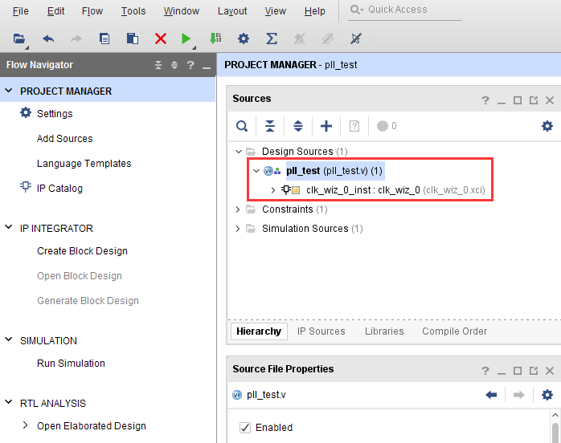
      
9) 再为工程添加xdc管脚约束文件pll.xdc，添加方法参考”PL的”Hello World”LED实验”，也可以直接复制以下内容。并编译生成bitstream。

::

 ############## clock and reset define##################
 create_clock -period 20 [get_ports sys_clk]
 set_property IOSTANDARD LVCMOS33 [get_ports {sys_clk}]
 set_property PACKAGE_PIN U18 [get_ports {sys_clk}]
 
 set_property IOSTANDARD LVCMOS33 [get_ports {rst_n}]
 set_property PACKAGE_PIN N15 [get_ports {rst_n}]
 ############## pll output define  J11 PIN3##################
 set_property IOSTANDARD LVCMOS33 [get_ports clk_out]
 set_property PACKAGE_PIN F17 [get_ports clk_out]

仿真
----

添加一个vtf_pll_test仿真文件，运行后PLL的lock信号会变高，说明PLL IP锁相环已经初始化完成。clk_out有时钟信号输出，输出的频率为输入时钟频率的1/2,为25Mhz。仿真方法可以参考”PL的”Hello World”LED实验”。

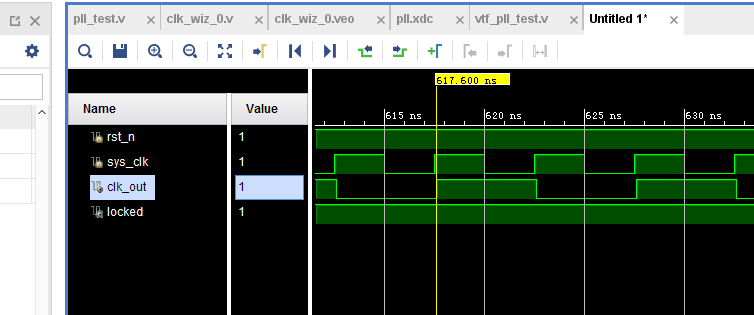
      
板上验证
--------

编译工程并生成pll_test.bit文件，再把bit文件下载到FPGA中，接下去我们就可以用示波器来测量输出时钟波形了。

用示波器探头的地线连接到开发板上的地（AX7020/AX7010开发板J11的PIN1脚)，信号端连接AX7020开发板J11的PIN3脚（测量的时候需要注意，避免示波器表头碰到其它管脚而导致电源和地短路)。

这时我们可以在示波器里看到25Mhz的时钟波形，波形的幅度为3.3V,占空比为1:1,波形显示如下图所示：

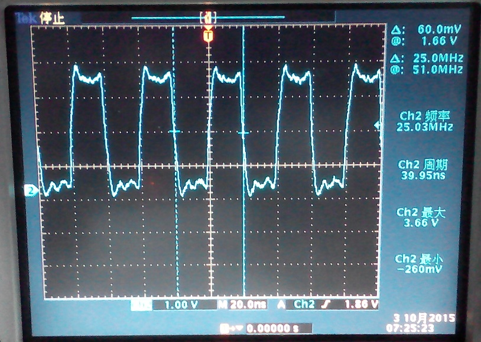
      
如果您想输出其它频率的波形，可以修改时钟的输出为clk_wiz_0的clk_out2或clk_out3或clk_out4。也可以修改clk_wiz_0的clk_out4为您想要的频率，这里也需要注意一下，因为时钟的输出是通过PLL对输入时钟信号的倍频和分频系数来得到的，所以并不是所有的时钟频率都可以用PLL能够精确产生的，不过PLL也会自动为您计算实际输出接近的时钟频率。

另外需要注意的是，有些用户的示波器的带宽和采样率太低，会导致测量高频时钟信号的时候，高频部分衰减太大，测量波形的幅度会变低。
