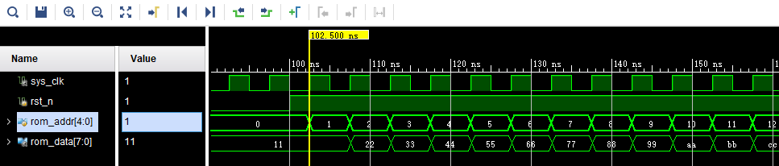

FPGA片内ROM读写测试实验
=========================

**实验Vivado工程为“rom_test”。**

FPGA本身是SRAM架构的，断电之后，程序就消失，那么如何利用FPGA实现一个ROM呢，我们可以利用FPGA内部的RAM资源实现ROM，但不是真正意义上的ROM，而是每次上电都会把初始化的值先写入RAM。本实验将为大家介绍如何使用FPGA内部的ROM以及程序对该ROM的数据读操作。

实验原理
--------

Xilinx在VIVADO里为我们已经提供了ROM的IP核,我们只需通过IP核例化一个ROM，根据ROM的读时序来读取ROM中存储的数据。实验中会通过VIVADO集成的在线逻辑分析仪ila，我们可以观察ROM的读时序和从ROM中读取的数据。

程序设计
--------

创建ROM初始化文件
~~~~~~~~~~~~~~~~~

既然是ROM，那么我们就必须提前给它准备好数据，然后在FPGA实际运行时，我们直接读取这些ROM中预存储好的数据就行。Xilinx FPGA的片内ROM支持初始化数据配置。如下图所示，我们可以创建一个名为rom_init.coe的文件，注意后缀一定是“.coe”，前面的名称当然可以随意起。

      
ROM初始化文件的内容格式很简单, 如下图所示。第一行为定义数据格式,16代表ROM的数据格式为16进制。从第3行开始到第34行，是这个32*8bit大小ROM的初始化数据。每行数字后面用逗号，最后一行数字结束用分号。

      
rom_init.coe编写完成后保存一下, 接下去我们开始设计和配置ROM IP核。

添加ROM IP核
~~~~~~~~~~~~

在添加ROM IP之前先新建一个rom_test的工程, 然后在工程中添加ROM IP，方法如下：

1. 点击下图中IP Catalog，在右侧弹出的界面中搜索rom，找到Block Memory Generator,双击打开。

.. image:: images/08_media/image3.png
      
2. 将Component Name改为rom_ip,在Basic栏目下，将Memory Type改为Single Prot ROM。

      
3. 切换到Port A Options栏目下，将ROM位宽Port A Width改为8，将ROM深度Port A Depth改为32，使能管脚Enable Port Type改为Always，并取消Primitives Output Register

.. image:: images/08_media/image5.png
      
4. 切换到Other Options栏目下，勾选Load Init File，点击Browse，选中之前制作好的.coe文件。

.. image:: images/08_media/image6.png
      
5. 点击ok，点击Generate生成ip核。

.. image:: images/08_media/image7.png
      
ROM测试程序编写
---------------

ROM的程序设计非常简单, 在程序中我们只要每个时钟改变ROM的地址,ROM就会输出当前地址的内部存储数据，例化ila，用于观察地址和数据的变化。ROM IP的实例化及程序设计如下:

.. code:: verilog

 `timescale 1ns / 1ps
 
 module rom_test(
 	input sys_clk,	//50MHz时钟
 	input rst_n		//复位，低电平有效
     );
 
 wire [7:0] rom_data;	  //ROM读出数据
 reg	 [4:0] rom_addr;      //ROM输入地址 
 
 //产生ROM地址读取数据
 always @ (posedge sys_clk or negedge rst_n)
 begin
     if(!rst_n)
         rom_addr <= 10'd0;
     else
         rom_addr <= rom_addr+1'b1;
 end        
 //实例化ROM
 rom_ip rom_ip_inst
 (
     .clka   (sys_clk    ),      //inoput clka
     .addra  (rom_addr   ),      //input [4:0] addra
     .douta  (rom_data   )       //output [7:0] douta
 );
 //实例化逻辑分析仪
 ila_0 ila_m0
 (
     .clk    (sys_clk),
     .probe0 (rom_addr),
 	.probe1 (rom_data)
 );
 
 endmodule

绑定引脚

::

 ############## clock and reset define##################
 create_clock -period 20 [get_ports sys_clk]
 set_property IOSTANDARD LVCMOS33 [get_ports {sys_clk}]
 set_property PACKAGE_PIN U18 [get_ports {sys_clk}]
 
 set_property IOSTANDARD LVCMOS33 [get_ports {rst_n}]
 set_property PACKAGE_PIN N15 [get_ports {rst_n}]

仿真
----

仿真结果如下，符合预期，与RAM的读取数据一样，数据也是滞后于地址一个周期。

      
板上验证
--------

以地址0为触发条件，可以看到读取的数据与仿真一致。

.. image:: images/08_media/image9.png
      