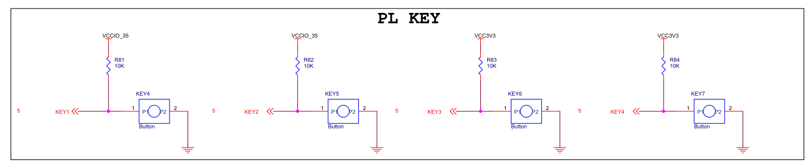
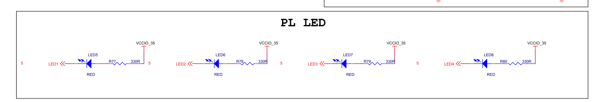
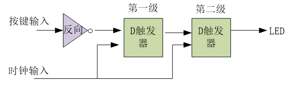
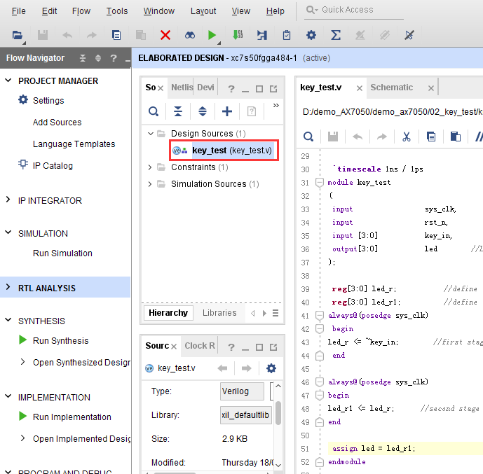
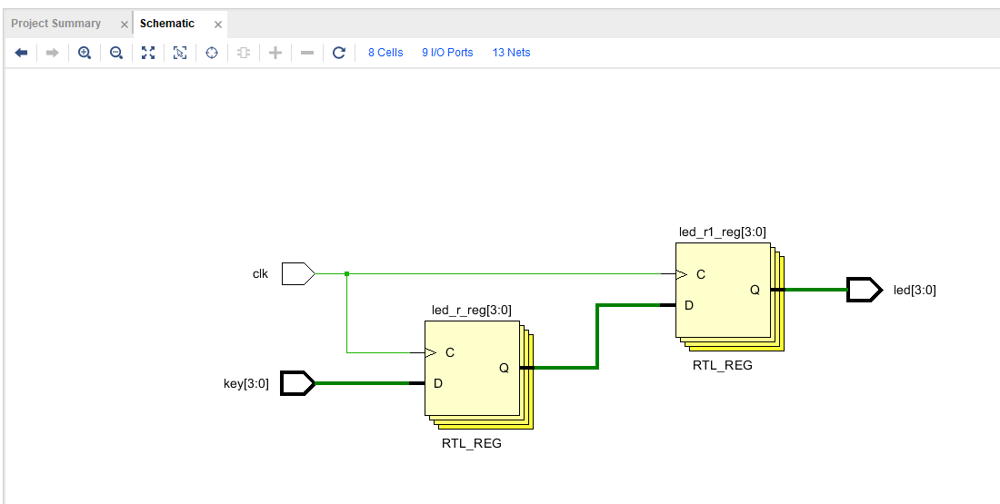

Vivado下按键实验
==================

**实验Vivado工程为“key_test”。**

按键是FPGA设计当中最常用也是最简单的外设，本章通过按键检测实验，检测开发板的按键功能是否正常，并了解硬件描述语言和FPGA的具体关系，学习Vivado
RTL ANALYSIS的使用。

按键硬件电路
------------

      
AX7020/AX7010开发板按键部分电路

从图中可以看到，电路的按键松开时是高电平，按下时是低电平。

      
AX7020/AX7010开发板LED部分电路

而LED部分，低电平亮，高电平灭

程序设计
--------

这个程序没有设计的很复杂，通过简单的硬件描述语言看透硬件描述语言和FPGA硬件的联系。首先我们将按键输入经过2组D触发器。经过D触发器的信号，会在D触发器时钟输入的上升沿锁存然后再送到输出。

在进行硬件描述语言编码之前，我们已经把硬件构建完成，这是一个正常的开发流程。有了硬件设计思路无论是通过画图还是通过Verilog HDL、VHDL都能完成设计，根据设计的复杂程序和对某种语言的熟悉程序来选择工具。

创建Vivado工程
--------------

1) 首先建立按键的测试工程，添加verilog测试代码，完成编译分配管脚等流程。

.. code:: verilog

 `timescale 1ns / 1ps
 module key_test
 (
 	input                 clk,       //system clock 50Mhz on board
 	input [3:0]           key,       //input four key signal,when the keydown,the value is 0
 	output[3:0]           led        //LED display ,when the siganl low,LED lighten
 );
 
 reg[3:0] led_r;           //define the first stage register , generate four D Flip-flop 
 reg[3:0] led_r1;          //define the second stage register ,generate four D Flip-flop
 always@(posedge clk)
 begin
 	led_r <=  key;        //first stage latched data
 end
 
 always@(posedge clk)
 begin
 	led_r1 <= led_r;      //second stage latched data
 end
 
 assign led = led_r1;
 
 endmodule

1) 我们可以使用RTL ANALYSIS工具查看设计

.. image:: images/10_media/image5.png
      
3) 分析RTL图，可以看出第一级D触发器连接按键输入，第二级直接输入，和预期设计一致。

      
板上验证
--------

Bit文件下载到开发板以后，开发板上的" PL LED1"、" PL LED2"、" PL LED3"、" PL LED4"都处于灭状态，按键“PL KEY1”按下“PL LED1”亮，按键“PL KEY2”按下“PL LED2” 亮，按键“PL KEY3”按下“PL LED3” 亮, 按键“PL KEY4”按下“PL LED4” 亮。
