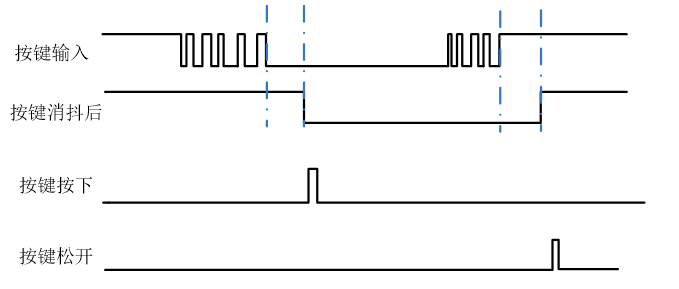
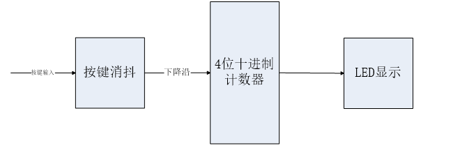
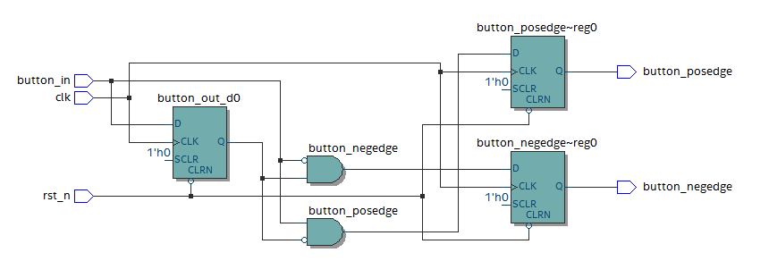
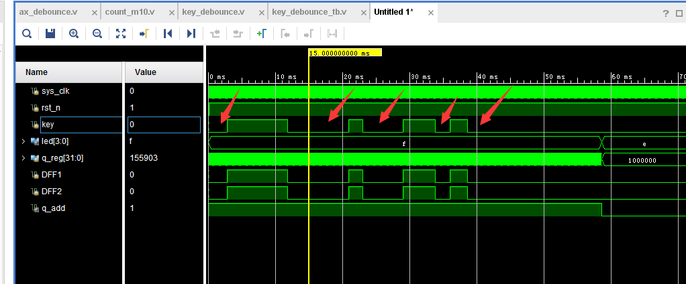
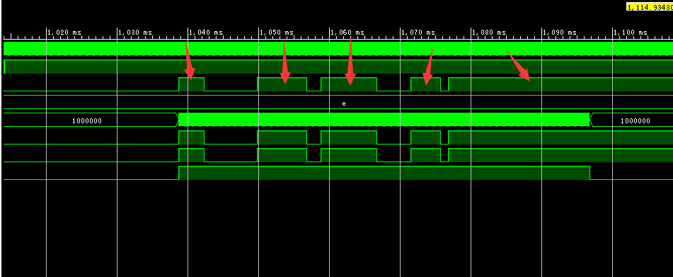

按键消抖实验
==============

**实验Vivado工程为“key_debounce”。**

本文主要讲解按键消抖原理及程序编写，程序实现按键按下后数字加1，并在led出来，通过vivado软件编译调试。

实验原理
--------

按键作为基本的人机输入接口，在很多电子设计中都能见到，由于机械特性，在按键按下或松开的时候，按键输入值是有抖动的，无论按下去是多平稳，都难以消除抖动，按键消抖方式有很多，本实验主要是通过FPGA计时来消抖。实验中设计了一个计数器，当按键输入有变化时，计时器清零，否则就累加，直到加到一个预定值（例如10ms），就认为按键稳定，输出按键值，这样就得到以后没有抖动的按键值。由于在很多地方需要用到按键下降沿或上升沿的检测，按键消抖模块直接集成了上升沿和下降沿检测的功能。

程序设计
--------

如下图所示，通过按键消抖后，在按键按下时，十进制计数器加1，通过LED灯显示出来。

按键消抖部分的原理在上节已经讲过，按键消抖部分代码写的非常精炼，阅读起来稍显费解，建议结合仿真波形去读代码。在提供的例程文件下的src文件夹中同时提供了仿真文件key_debounce_tb.v，可以通过添加仿真文件来进行仿真观察代码中信号的变化。

+---------------+--------+---------------------------------------------+
| 信号名称      | 方向   | 说明                                        |
+===============+========+=============================================+
| clk           | in     | 时钟输入                                    |
+---------------+--------+---------------------------------------------+
| rst_n         | in     | 异步复位输入，低复位                        |
+---------------+--------+---------------------------------------------+
| button_in     | in     | 按键输入                                    |
+---------------+--------+---------------------------------------------+
| b             | out    | 消抖后按键上升沿，高有效，1个时钟周期       |
| utton_posedge |        |                                             |
+---------------+--------+---------------------------------------------+
| b             | out    | 消抖后按键下升沿，高有效，1个时钟周期       |
| utton_negedge |        |                                             |
+---------------+--------+---------------------------------------------+
| button_out    | out    | 消抖后按键输出                              |
+---------------+--------+---------------------------------------------+

按键消抖模块（ax_debounce）端口

LED显示部分在本章不做说明，就例程中按键消抖模块“ax_debounce”模块做一些讲解，模块中通过了两级D触发器来寄存键值，只有当按键值稳定时才将按键值输出。我们可以看到在assign赋值语句中有一条“assign
a_reset=（DFF1 ^ DFF2）”，学过数字电路的应该都知道“ ^ ”是异或运算符，运算符两边相同运算结果为0，
不同运算结果为1。在程序中DFF1和DFF2比较运算后的值通过“assign”赋给“a_reset”，表示比较锁存键值的前后两级寄存器的值是否一致，只有前后两级寄存器的值一致，也就是a_reset的值为0时，才表示当前锁存的键值没有变化。当计数器累加到“TIMER_MAX_VAL”，表示锁存的键值已经稳定可以输出。另外在模块中我们可以看到“{.......}”符号，要注意这可不是大括号，这表示位拼接运算符，其作用是将运算符内的两位，或是多位信号拼接在一起，具体用法请参考例程。

.. code:: verilog

 `timescale 1 ns / 100 ps
 module  ax_debounce 
 (
     input       clk, 
     input       rst, 
     input       button_in,
     output reg  button_posedge,
     output reg  button_negedge,
     output reg  button_out
 );
 //// ---------------- internal constants --------------
 parameter N = 32 ;           // debounce timer bitwidth
 parameter FREQ = 50;         //model clock :Mhz
 parameter MAX_TIME = 20;     //ms
 localparam TIMER_MAX_VAL =   MAX_TIME * 1000 * FREQ;
 ////---------------- internal variables ---------------
 reg  [N-1 : 0]  q_reg;      // timing regs
 reg  [N-1 : 0]  q_next;
 reg DFF1, DFF2;             // input flip-flops
 wire q_add;                 // control flags
 wire q_reset;
 reg button_out_d0;
 //// ------------------------------------------------------
 
 ////contenious assignment for counter control
 assign q_reset = (DFF1  ^ DFF2);          // xor input flip flops to look for level chage to reset counter
 assign q_add = ~(q_reg == TIMER_MAX_VAL); // add to counter when q_reg msb is equal to 0
     
 //// combo counter to manage q_next 
 always @ ( q_reset, q_add, q_reg)
 begin
     case( {q_reset , q_add})
         2'b00 :
                 q_next <= q_reg;
         2'b01 :
                 q_next <= q_reg + 1;
         default :
                 q_next <= { N {1'b0} };
     endcase     
 end
 
 //// Flip flop inputs and q_reg update
 always @ ( posedge clk or posedge rst)
 begin
     if(rst == 1'b1)
     begin
         DFF1 <= 1'b0;
         DFF2 <= 1'b0;
         q_reg <= { N {1'b0} };
     end
     else
     begin
         DFF1 <= button_in;
         DFF2 <= DFF1;
         q_reg <= q_next;
     end
 end
 
 //// counter control
 always @ ( posedge clk or posedge rst)
 begin
 	if(rst == 1'b1)
 		button_out <= 1'b1;
     else if(q_reg == TIMER_MAX_VAL)
         button_out <= DFF2;
     else
         button_out <= button_out;
 end
 
 always @ ( posedge clk or posedge rst)
 begin
 	if(rst == 1'b1)
 	begin
 		button_out_d0 <= 1'b1;
 		button_posedge <= 1'b0;
 		button_negedge <= 1'b0;
 	end
 	else
 	begin
 		button_out_d0 <= button_out;
 		button_posedge <= ~button_out_d0 & button_out;
 		button_negedge <= button_out_d0 & ~button_out;
 	end	
 end
 endmodule

最后，程序中需要说明的是“button_posedge”和“button_negedge”两个输出信号，这是一种常用的上升沿和下降沿的采集方法，其描述的RTL视图如下：

      
当然还有其他的边沿检测电路的描述方法，但是其基本原理都是在逻辑时序电路里先将需要检测的信号作为输入非阻塞赋值给一个自定义寄存器，通过判断前后两级寄存器的值来判断是上升沿或是下降沿，由0->1 变化是上升沿，由1 -> 0变化是下降沿；

仿真
----

这里我们添加了一个激励程序key_debounce_tb.v文件，用来仿真按键key的输入。

仿真的结果如下，我们看到按键一共有5次被按下，但是因为前面4次按键按下的低电平保持时间都小于20ms,这4次的按下都被程序判断为抖动，只有第5次的按键按下时间大于了20ms,才判断为按键有按下，这时LED灯的状态有了变化。

      
同样按键松开后，也会判断高电平的保持时间是否大于20ms,因为前面4次的高电平都低于20ms,程序都把它们当做按键的抖动，只有第5次的高电平保持时间大于20ms,q_add的信号才有变化。

      
实验现象
--------

开发板上电后下载程序，按下“PL KEY2”按键，可以看到4个LED会变化，对应二进制数据，按一次加一，如果不经过消抖，是无法实现按一次加一的。
