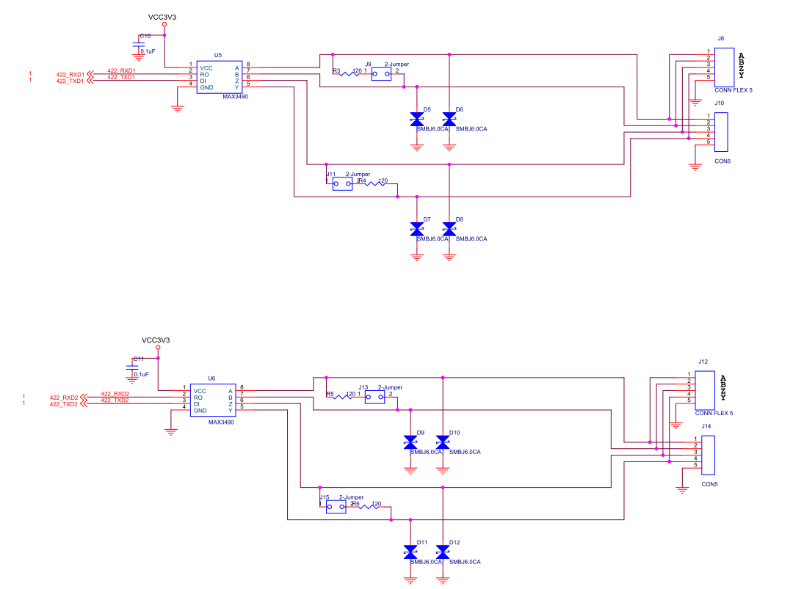
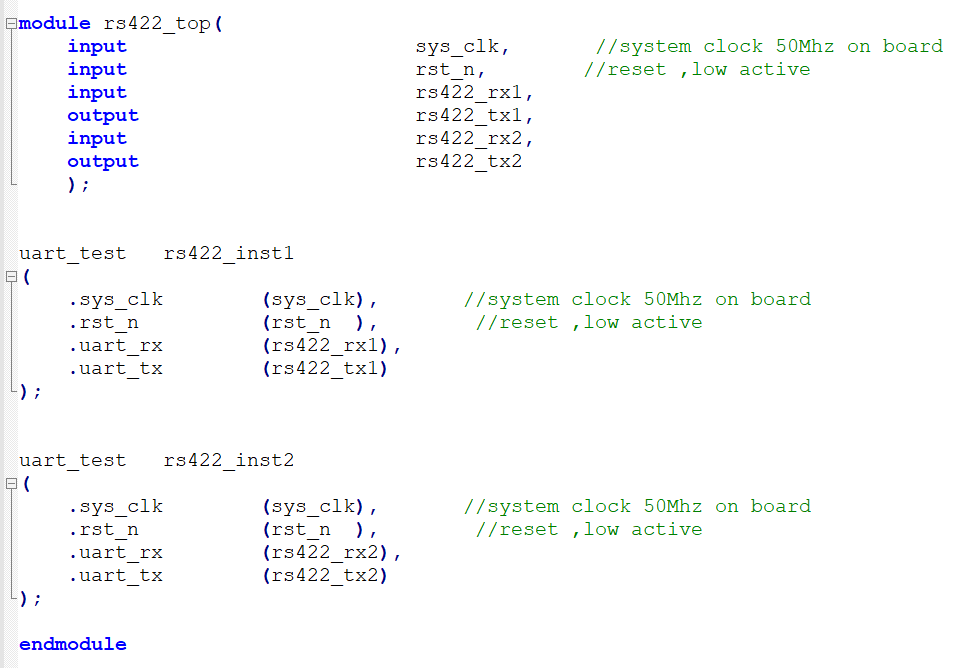
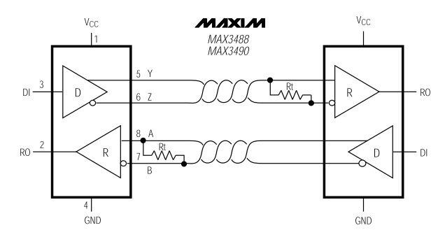
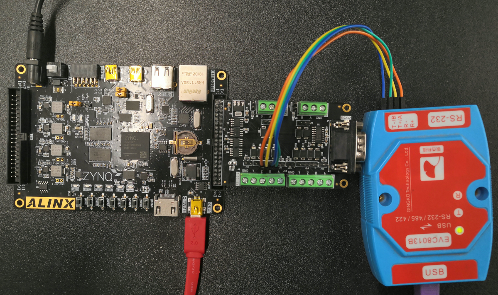
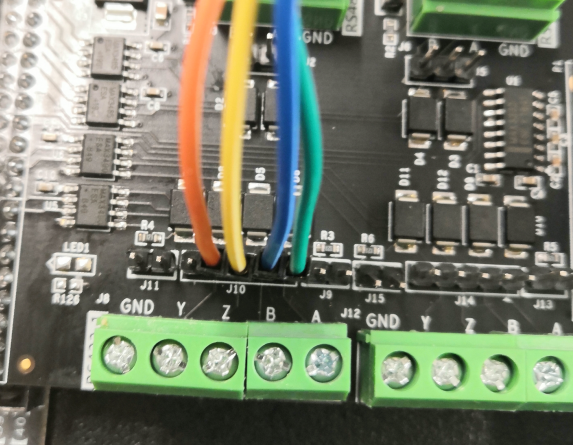
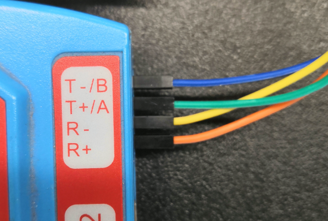
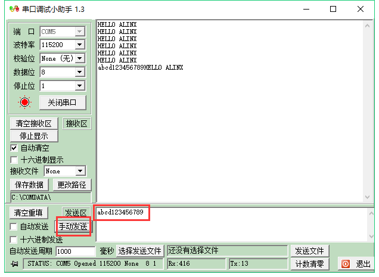

RS422实验
===========

**实验Vivado工程为“rs422_test”。**

本章利用AN3485模块实现RS422接口数据传输。关于模块，在前面的RS232实验中已经介绍过，本实验不再赘述。RS422与RS232在与FPGA的连接的接口上是一样的，都是TXD和RXD，因此，本实验在RS232实验的基础上，例化出两路连接到RS422接口芯片MAX3490上。

      
RS422接口部分原理图

程序设计
--------

程序设计比较简单，以RS232实验为基础，例化两路uart_test即可。

      
实验测试
--------

RS422的接口部分是差分的信号，共四根信号线，两根发送TXD+和TXD-，对应Y和Z，两根接收RXD+和RXD-，对应A和B。

      
与RS232实验一样，也采用USB转串口的设备连接，使用杜绑线将模块的RS422_1的Y和Z分别与设备的R+和R-连接，将模块的A和B分别与设备的T+和T-连接。

      

      

      
下载程序后，即可在串口工具中看到RS232实验同样的效果，可以利用同样的方法测试RS422_2接口。

      