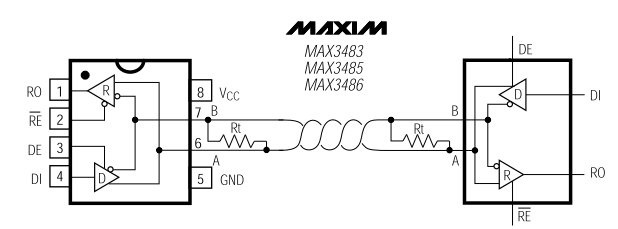
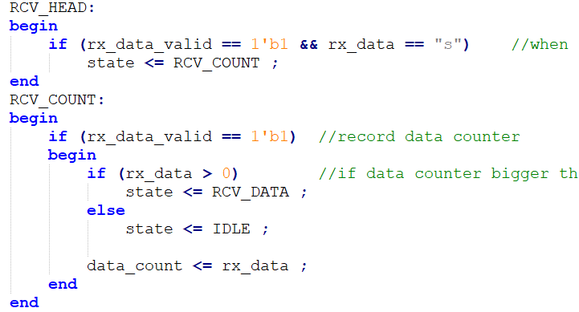
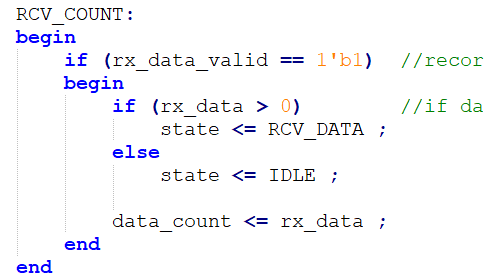
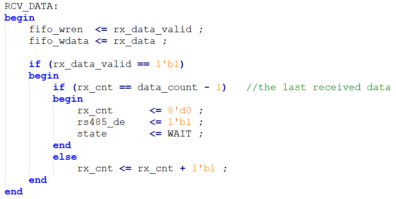
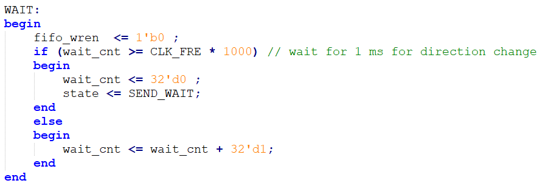
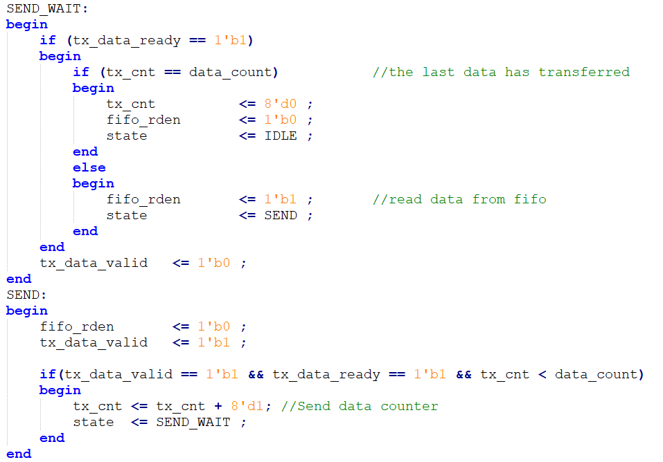
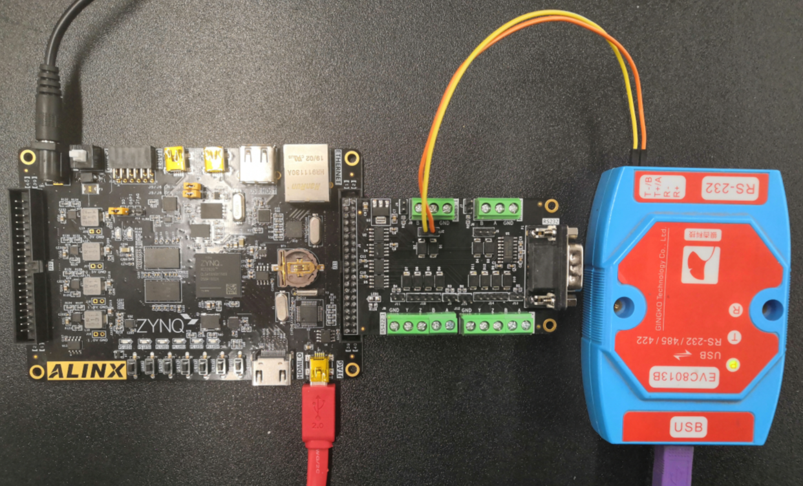
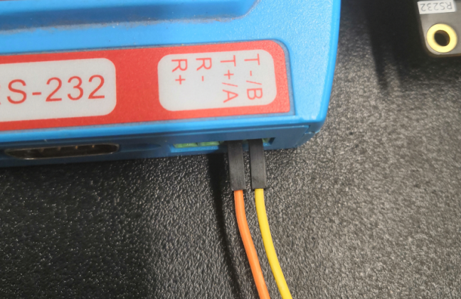
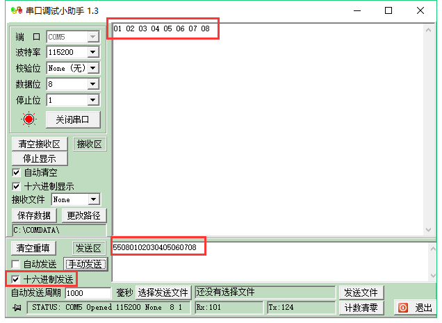
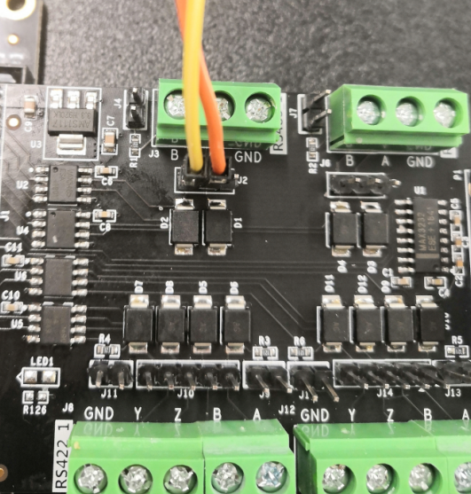

RS485实验
===========

**实验Vivado工程为“rs485_test”。**

本章以AN3485模块介绍RS485的数据传输。

实验原理
--------

前面介绍过RS232和RS422的实验，而RS485与RS422类似，也是采用差分信号传输，但RS485是半双工传输，也就是说，同一时刻只能有一个方向的数据传输。而且接口也比RS422少，只有差分信号A和B，而与ARM或FPGA相连的信号为DE（方向选择）,DI（输入信号TXD），RO（输出信号RXD）。

      
从MAX3485文档中，发送方向，如果DE为1时，也就是输出使能，DI值为1时，对于差分信号A和B值为1和0，否则为0和1。

.. image:: images/16_media/image2.png
      
从接收来看，如果DE为0，A和B之间差值大于等于+0.2V，则RO值为1，否则为0。

.. image:: images/16_media/image3.png
      
程序设计
--------

由于RS485是半双工传输，那么我们需要制定传输协议进行握手，设定第一个字节为8’h55，表示一帧数据的开始，接下来是传输的数据长度信息，由于FIFO大小限制（256），范围为1~255，接下来是数据。格式即为：起始8’h55+数据长度+数据。

其中uart_tx和uart_rx跟RS232实验一样，在这里只修改uart_test即可。我们设计的功能为初始状态下将DE设为0，也就是输入，等待接收上位机发来的数据，并缓存到FIFO中，FIFO大小设置为256，然后切换DE为1，也就是输出，把接收到的数据从FIFO中读出并发送出去。注意缓存的数据是除去起始8’h55和数量信息的。

在RCV_HEAD状态时，判断接收到的数据是否是”S”。

      
在RCV_COUNT状态时，如果数据长度小于0，则跳转到IDLE状态，如果大于0，则进入接收数据状态。

      
在RCV_DATA状态下，把数据写入FIFO，并且检查数据长度，切换RS485的方向为输出，并跳转状态。

      
在切换总线状态时，为了可靠工作，在WAIT状态下，延时1ms进行方向切换。

      
再然后是发送FIFO中的数据，SEND_WAIT状态是控制读使能信号fifo_rden，并且判断数据是否发送完，发送完后进入IDLE状态。

      
实验测试
--------

我们仍然使用USB转串口设备，通过杜邦线将RS485_1的A和B分别与设备的A和B连接。

      
|image1|\ ‘

      
打开串口工具，设置好串口号波特率，选择16进制发送，发送数据以8’h55开头，点击发送，即可在接收窗口看到返回的数据。

      

      