HDMI输出实验
==============

**实验Vivado工程为“hdmi_output_test”。**

前面我们介绍了led闪灯实验，只是为了了解Vivado的基本开发流程，本章这个实验相对LED闪灯实验复杂点，做一个HDMI输出的彩条，这也是我们后面学习显示、视频处理的基础。实验还不涉及到PS系统，从实验设计可以看出如果要非常好的使用ZYNQ芯片，需要良好的FPGA基础知识。

硬件介绍
--------

开发板没有使用HDMI编码芯片，而是将FPGA的3.3V差分IO直接连接到HDMI连接器，
FPGA完成24位RGB编码输出TMDS差分信号。

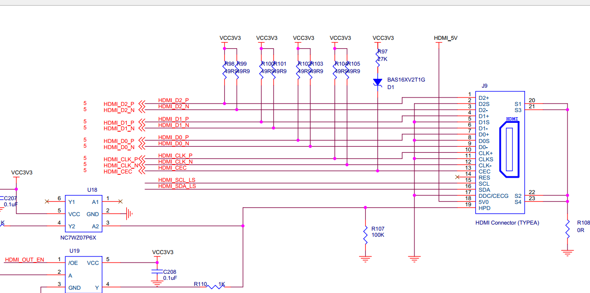
      
TMDS原理
~~~~~~~~

HDMI采用和DVI相同的传输原理——TMDS（Transition Minimized Differential signal），最小化传输差分信号。

TMDS传输系统分为分为两个部分：发送端和接收端。TMDS发送端收到HDMI接口传来的表示RGB信号的24位并行数据（TMDS对每个像素的RGB三原色分别按8bit编码，即R信号有8位，G信号有8位，B信号有8位），然后对这些数据进行编码和并/串转换，再将表示3个RGB信号的数据分别分配到独立的传输通道发送出去。接收端接收来自发送端的串行信号，对其进行解码和串/并转换，然后发送到显示器的控制端。与此同时也接收时钟信号，以实现同步。

**TMDS的原理**

每一个TMDS链路都包括3个传输RGB信号的数据通道和1个传输时钟信号的通道。每一个数据通道都通过编码算法，将8位的视、音频数据转换成最小化传输、直流平衡的10位数据。这使得数据的传输和恢复更加可靠。最小化传输差分信号是通过异或及异或非等逻辑算法将原始8位信号数据转换成10位，前8为数据由原始信号经运算后获得，第9位指示运算的方式，第10位用来对应直流平衡。

一般来说，HDMI传输的编码格式中要包含视频数据、控制数据和数据包（数据包中包含音频数据和附加信息数据，例如纠错码等）。TMDS每个通道在传输时要包含一个2bit的控制数据、8bit的视频数据或者4bit的数据包即可。在HDMI信息传输过程中，可以分为三个阶段：视频数据传输周期、控制数据传输周期和数据岛传输周期，分别对应上述的三种数据类型。

下面介绍TMDS中采用的技术：

1.传输最小化

 8位数据经过编码和直流平衡得到10位最小化数据，这仿佛增加了冗余位，对传输链路的带宽要求更高，但事实上，通过这种算法得到的10位数据在更长的同轴电缆中传输的可靠性增强了。下图是一个例子，说明对一个8位的并行RED数据编码、并/串转换。

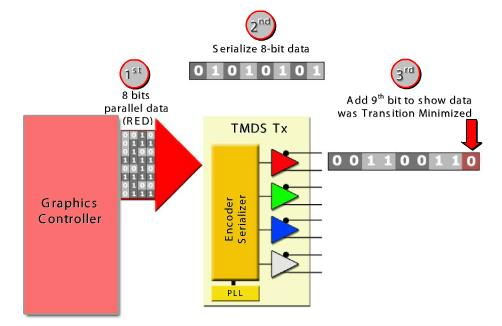
   
      
第一步：将8位并行RED数据发送到TMDS发送端。

第二步：并/串转换.

第三步：进行最小化传输处理，加上第9位，即编码过程。第9位数据称为编码位。

2.直流平衡

直流平衡（DC-balanced）就是指在编码过程中保证信道中直流偏移为零。方法是在原来的9位数据的后面加上第10位数据，这样，传输的数据趋于直流平衡，使信号对传输线的电磁干扰减少，提高信号传输的可靠性。

3.差分信号

TMDS差分传动技术是一种利用2个引脚间电压差来传送信号的技术。传输数据的数值（“0”或者“1”）由两脚间电压正负极性和大小决定。即，采用2根线来传输信号，一根线上传输原来的信号，另一根线上传输与原来信号相反的信号。这样接收端就可以通过让一根线上的信号减去另一根线上的信号的方式来屏蔽电磁干扰，从而得到正确的信号。

如下图所示：

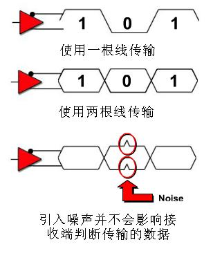
   
      
 另外，还有一个显示数据通道（DDC），是用于读取表示接收端显示器的清晰度等显示能力的扩展显示标识数据(EDID)的信号线。搭载HDCP（High-bandwidth Digital Content
Protection，高带宽数字内容保护技术）的发送、接收设备之间也利用DDC线进行密码键的认证。

视频时序标准
~~~~~~~~~~~~

HDMI显示器扫描方式从屏幕左上角一点开始，从左向右逐点扫描，每扫描完一行,电子束回到屏幕的左边下一行的起始位置，在这期间，CRT对电子束进行消隐，每行结束时，用行同步信号进行同步；当扫描完所有的行，形成一帧，用场同步信号进行场同步，并使扫描回到屏幕左上方，同时进行场消隐，开始下一帧。

完成一行扫描的时间称为水平扫描时间，其倒数称为行频率；完成一帧（整屏）扫描的时间称为垂直扫描时间，其倒数称为场频率，即刷新一屏的频率，常见的有60Hz，75Hz等等。标准的显示的场频60Hz。

时钟频率：以1024x768@59.94Hz(60Hz)为例，每场对应806个行周期,其中768为显示行。每显示行包括1344点时钟,其中1024点为有效显示区。由此可知：需要点时钟频率：806*1344*60约65MHz。

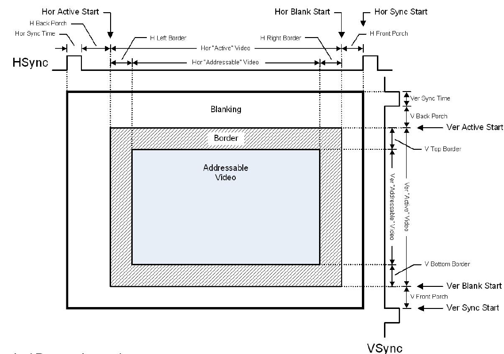
      
视频时序

VGA扫描，基本元素是行扫描，多行组成一帧，下图显示一行的时序，其中“Active”Video是一行视频的有效像素，大部分分辨率时钟中Top/Left Border 和 Bottom / Right Border都是0。“Blanking”是一行的同步时间，“Blanking”时间加上Active”Video时间就是一行的时间。“Blanking”又分为“Front Porch”、“Sync”、“Back Porch”三段。

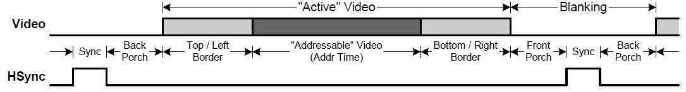
      
行同步时序

以下是720p的时序参数

|image1|\ 1280x720@60Hz时序参数

Vivado工程建立
--------------

本实验将实现HDMI输出显示，verilog实现编程驱动HDMI输出，在HDMI显示器里显示测试图像彩条。HDMI输出显示模块分成3个模块实现，分别是时钟模块vidio_pll,彩条生成模块color_bar和VGA转DVI模块rgb2dvi。实现的逻辑框图如下：

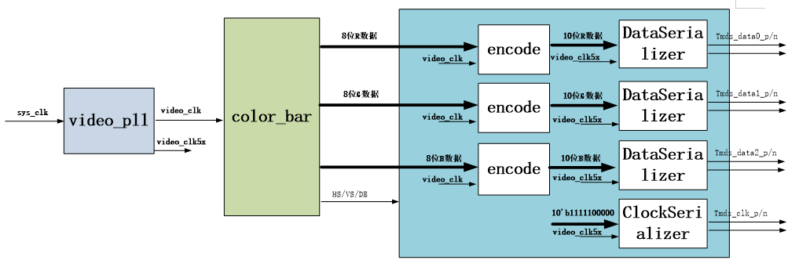

添加HDMI 编码器IP核
~~~~~~~~~~~~~~~~~~~

1) 新建一个名为“hdmi_output_test”的工程

VGA的数据很多人都比较清楚，为RGB数据，而HDMI为TMDS差分信号，RGB数据在FPGA比较容易操作，那么我们需要做的就是把RGB数据转成HDMI的TMDS差分信号，因此采用了RGB to DVI的IP（DVI与HDMI都是TMDS信号）。

2) 复制repo文件夹（这个文件夹可以到给的例程工程中找到）到工程目录，这个文件夹里包含了HDMI编码器的IP，是别的厂家提供

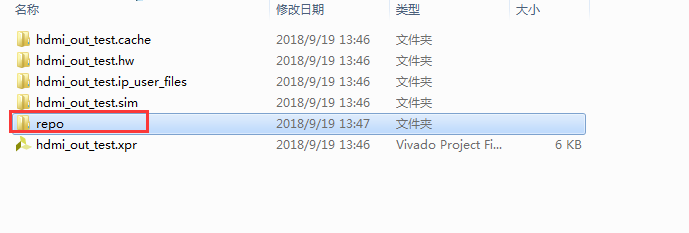
      
3) 点击“IP Catalog”，默认这些IP和都是Xilinx提供，现在我们要添加第三方IP，或者我们自己做的IP

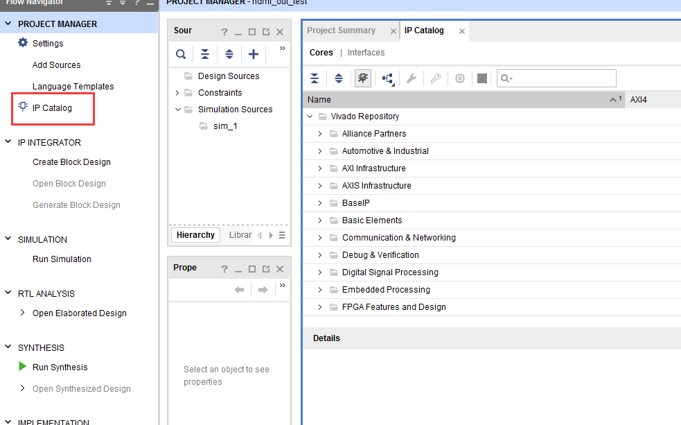
      
4) 右键“Add Repository...”

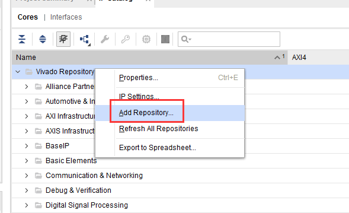
      
5) 路径选择刚才复制的repo文件夹

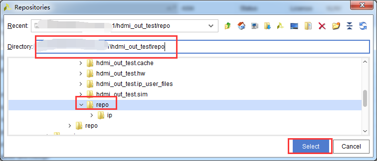
      
6) 添加IP成功提示添加了多少个IP

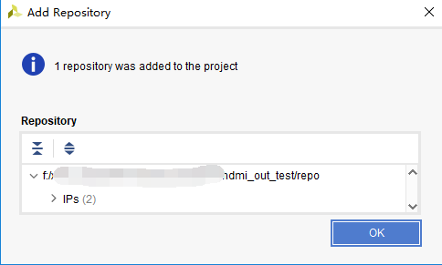
      
7) 找到“RGB to DVI Video Encoder(Source)”，双击

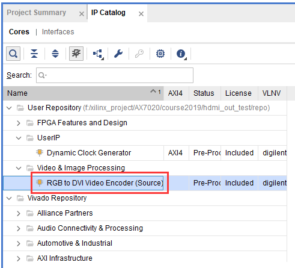
      
8) 弹出下面窗口，“Component Name”元件名保持不变，其他参数也不用改，点击“OK”

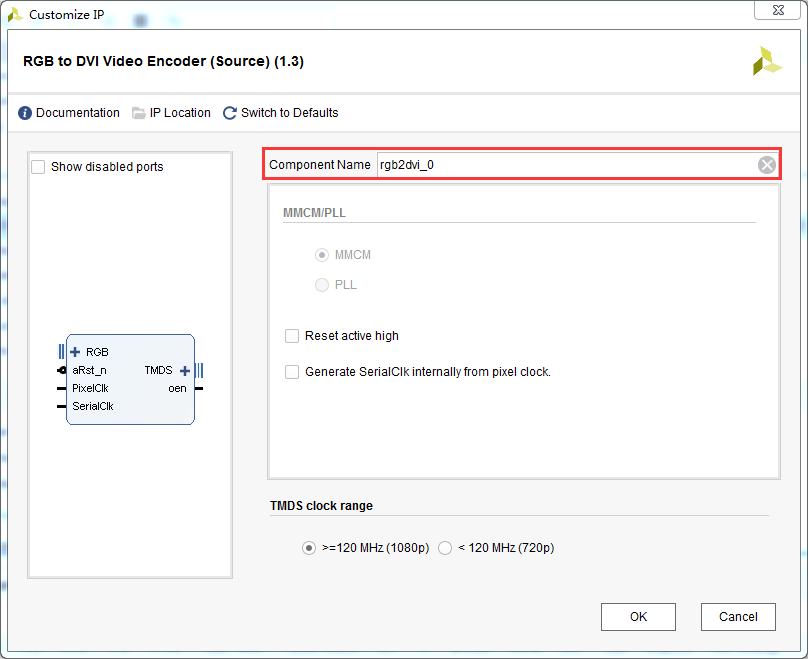
      
9) 弹出一个“Generate Output Products”窗口，其中“Number of jobs”指线程数量，越高越快

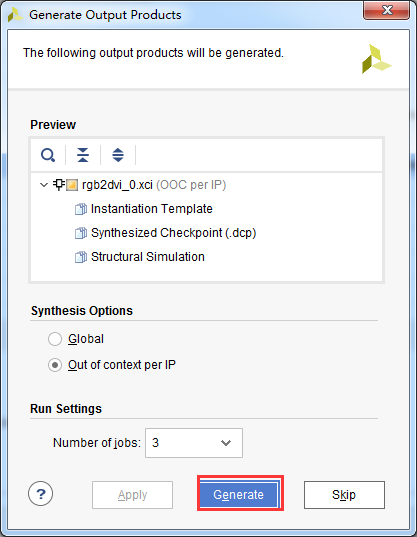
      
10) 可以看到一个名为rgb2dvi_0

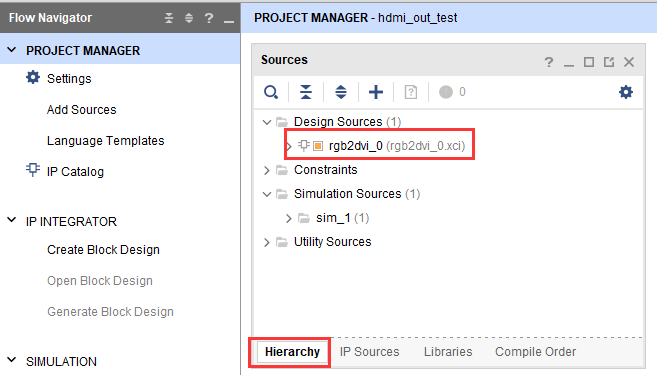
      
添加像素时钟PLL模块
~~~~~~~~~~~~~~~~~~~

为了驱动HDMI编码器，需要提供像素时钟和5倍像素时钟，5倍像素时钟用于10:1串行化。

1) 在“IP Catlog”窗口搜索关键字“clock”，双击“Clocking Wizard”

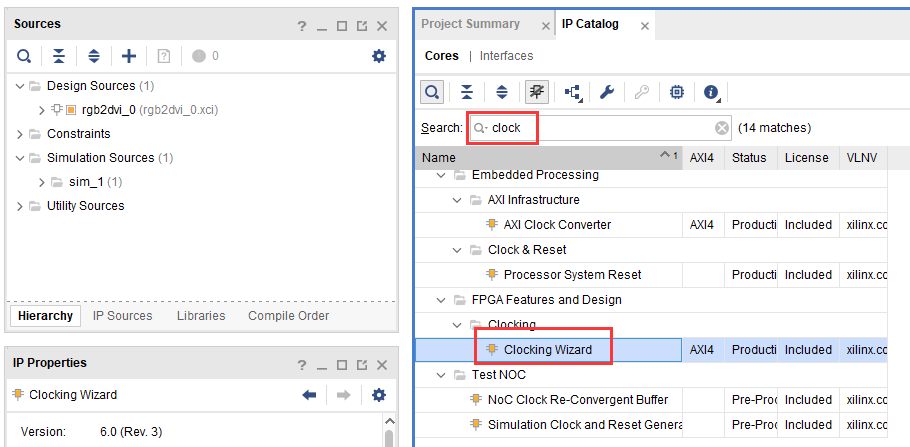
      
2) 这次给元件起个名字，在“Component Name”中填写“video_clock”，“clk_in1”填写50，这里50Mhz和开发板PL端晶振频率一致。

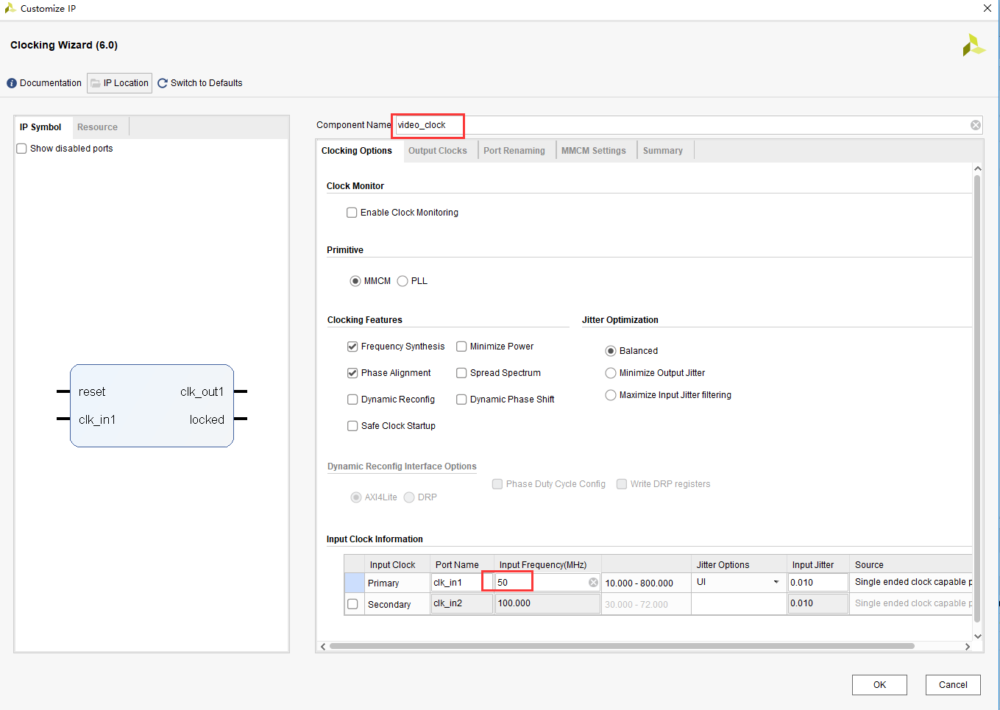
      
3) 输出时钟“clk_out1”用于视频像素时钟，这里填写74.25，这是1280x720@60分辨率的像素时钟，每一种分辨率的像素时钟都不同，需要非常了解视频标准才能知道每一种视频分辨率的像素时钟，“clk_out2”用于编码器串行化，像素时钟的5倍，这里填写371.25，然后点击“OK”生成IP。

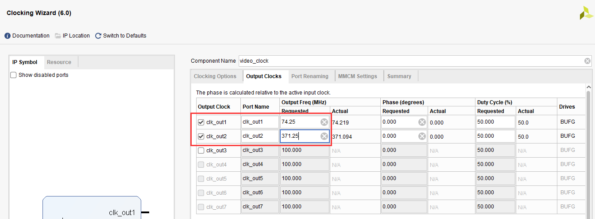
      
添加彩条发生模块
~~~~~~~~~~~~~~~~

4) 彩条发生模块是一段Verilog代码，用于产生视频时序和水平方向的8个彩条，可以到给的例程中复制现有代码。在color_bar文件中定义了不同分辨率的参数，供用户使用。

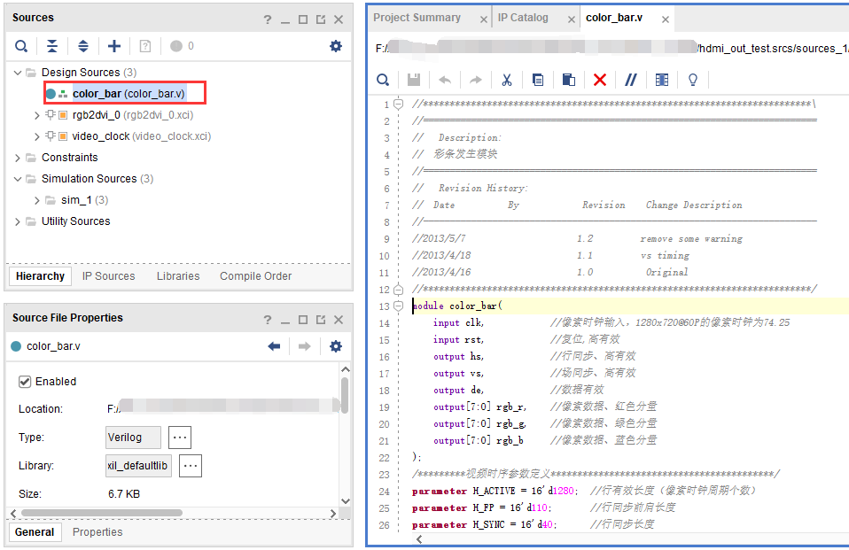
      
添加video_define文件，在其中定义了1280x720的宏

|image2|\ |image3|

添加顶层模块
~~~~~~~~~~~~

5) top模块例化了彩条发生模块，HDMI编码模块，和像素时钟生成模块，代码参考例程给的工程。

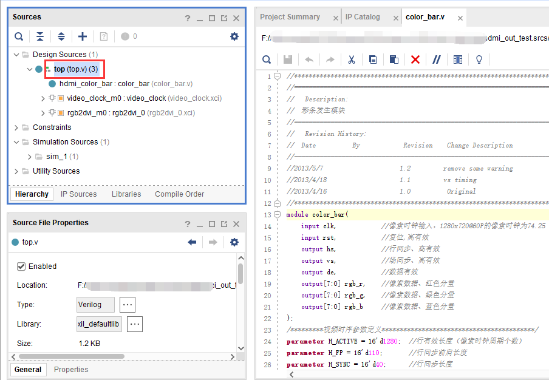
      
添加XDC约束文件
---------------

添加以下的xdc约束文件到项目中，在约束文件里添加了时钟和HDMI相关的管脚。

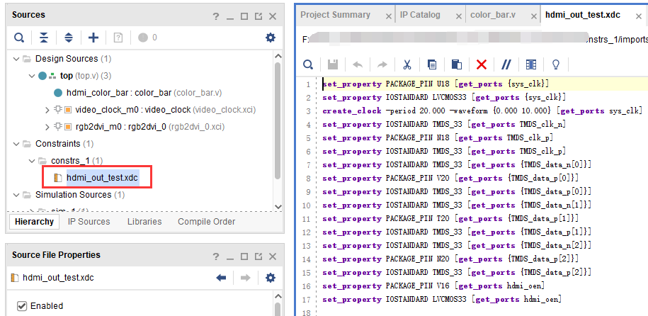
      
::

 set_property PACKAGE_PIN U18 [get_ports {sys_clk}]
 set_property IOSTANDARD LVCMOS33 [get_ports {sys_clk}]
 create_clock -period 20.000 -waveform {0.000 10.000} [get_ports sys_clk]
 set_property IOSTANDARD TMDS_33 [get_ports TMDS_clk_n]
 set_property PACKAGE_PIN N18 [get_ports TMDS_clk_p]
 set_property IOSTANDARD TMDS_33 [get_ports TMDS_clk_p]
 set_property IOSTANDARD TMDS_33 [get_ports {TMDS_data_n[0]}]
 set_property PACKAGE_PIN V20 [get_ports {TMDS_data_p[0]}]
 set_property IOSTANDARD TMDS_33 [get_ports {TMDS_data_p[0]}]
 set_property IOSTANDARD TMDS_33 [get_ports {TMDS_data_n[1]}]
 set_property PACKAGE_PIN T20 [get_ports {TMDS_data_p[1]}]
 set_property IOSTANDARD TMDS_33 [get_ports {TMDS_data_p[1]}]
 set_property IOSTANDARD TMDS_33 [get_ports {TMDS_data_n[2]}]
 set_property PACKAGE_PIN N20 [get_ports {TMDS_data_p[2]}]
 set_property IOSTANDARD TMDS_33 [get_ports {TMDS_data_p[2]}]
 set_property PACKAGE_PIN V16 [get_ports hdmi_oen]
 set_property IOSTANDARD LVCMOS33 [get_ports hdmi_oen]

下载调试
--------

保存工程并编译生成bit文件，连接HDMI接口到HDMI显示器，需要注意，这里使用1280x720@60Hz，请确保自己的显示器支持这个分辨率。

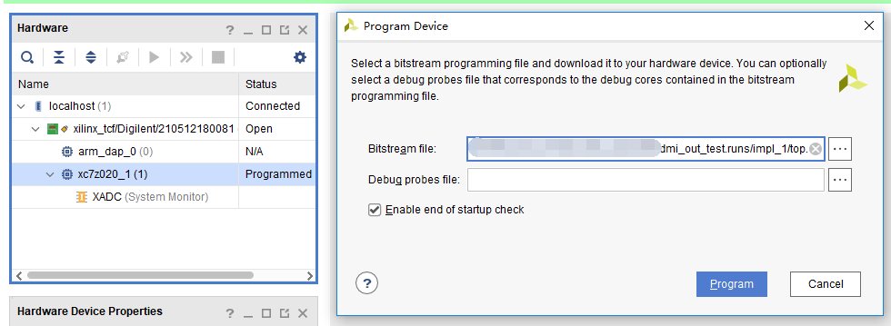
      
.. image:: images/17_media/image26.png
      
AX7020/AX7010硬件连接图

下载后显示器显示如下图像

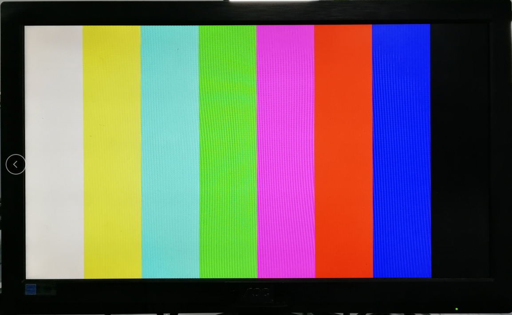
      
实验总结
--------

本实验初步接触到视频显示，涉及到视频知识，这不是zynq学习的重点，zynq在视频处理领域用途广泛，需要学习者有良好的基础知识。实验中仅仅使用PL来驱动HDMI芯片，初步学习了第三方自定IP的用法，后面我们会学习如何自定义IP。

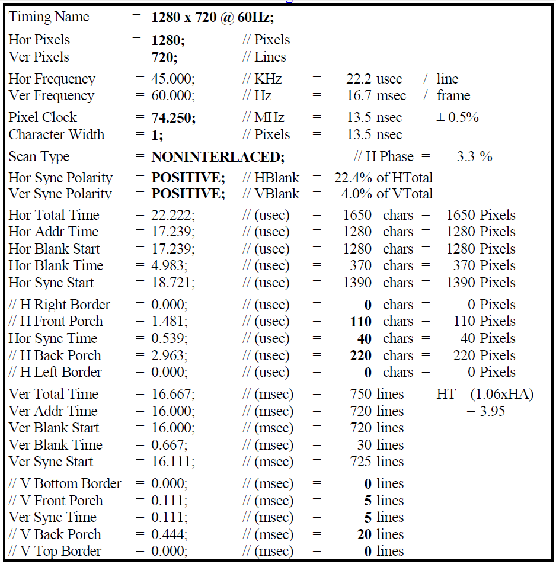
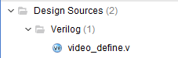
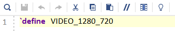
      