HDMI时钟显示实验
==================

**实验Vivado工程为“hdmi_rtc_char”。**

本章在字符显示实验基础上，通过阅读DS1302芯片手册，了解DS1302操作时序和相关寄存器，然后设计程序将DS1302 RTC时间通过HDMI显示出来，类似于一个电子钟。

实验原理 
---------

RTC（Real-Time Clock)实时时钟为系统提供一个可靠的时间，并且在断电的情况下，RTC实时时钟也可以通过电池供电，一直运行下去。RTC通过类SPI总线向FPGA传送8位数据（BCD码）。数据包括秒，分，小时，日期，天，月和年。在本实验中我们将读取RTC的时,分,秒的数据并在数码管中显示时间。

硬件介绍
--------

开发板上RTC设计采用DALLAS公司的低功耗实时时钟芯片DS1302, DS1302的VCC2为主电源，VCC1为后备电源。在主电源关闭的情况下，也能可以通过电池保持时钟的连续运行。DS1302外接32.768kHz晶振为RTC电路提供振荡源。 RTC部分的原理图如下图所示：

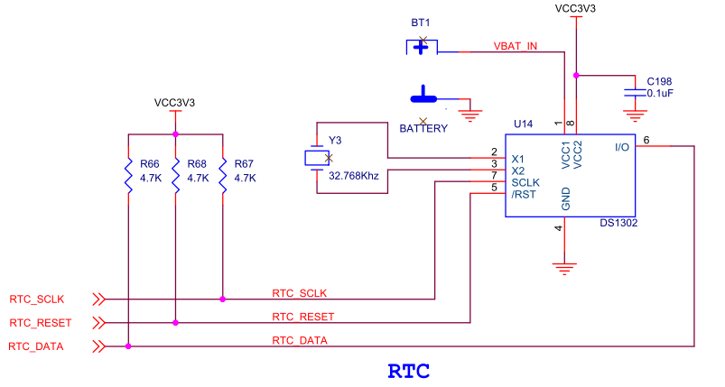
      
DS1302的时序和控制
------------------

写数据时序
~~~~~~~~~~

其接口部分类似于SPI接口，但不同之处是其数据接口是双向的。DS1302芯片写操作的时序图。第一个字节是“访问寄存器的地址”，第二字节是“写数据”。在写操作的时候，都是“上升沿有效”，然而还有一个条件，就是CE（/RST）信号必须拉高。（数据都是从LSB开始发送，亦即是最低位开始至最高位结束）。

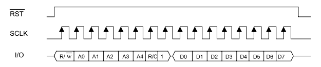
      
DS1302写时序

读数据时序
~~~~~~~~~~

基本上和写操作的时序图大同小异，区别的地方就是在第二个字节是“读数据”的动作。第二字节读数据开始时，SCLK信号都是下降沿送出数据，这个时候可以使用上升沿读取数据。CE（/RST）信号同样是必须拉高。（第一节数据是从LSB开始输出，第二节数据是从LSB开始读入）。

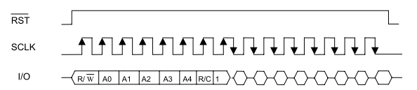
      
DS1302读时序

命令格式和寄存器
~~~~~~~~~~~~~~~~

无论是读操作还是写操作，在时序图中，第一个字节都是“访问寄存器的地址”，然而这一字节数据有自己的格式。

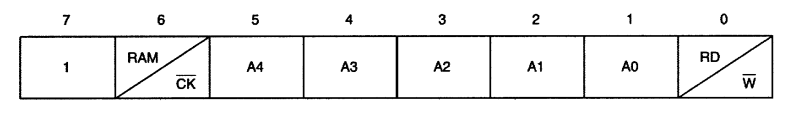
      
BIT 7 固定。 BIT 6 表示是访问寄存器本身，还是访问RAM空间。 BIT 5 到BIT1 表示是寄存器或RAM空间的地址。 BIT 0 表示是访问寄存器本身是写操作，还是读操作。

下图是DS1302的寄存器地址和数据格式

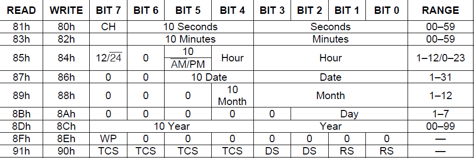
      
程序设计
--------

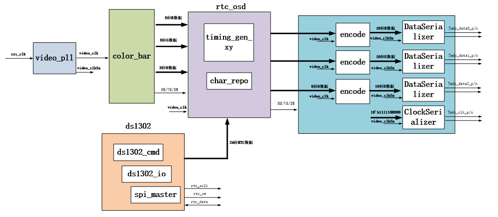

DS1302读写设计
~~~~~~~~~~~~~~

通过分析DS1302读写时序，可以看出和SPI时序类似，只不过数据输出和输入分时复用了，spi
master状态机设计，主要完成一个字节spi数据的读写，由于是全双工的，写一个字节的同时也读一个字节。首先空闲状态“IDLE”接收到写请求后进入“DCLK_IDLE”状态，这个状态为spi时钟沿变化保持一定的时间，用来控制spi时钟的周期，然后进入spi时钟沿的变化状态，一个字节上升沿和下降沿一共16个数据沿。在最后一个数据沿进入“LAST_HALF_CYCLE”状态，为让最后一个沿也保持一定的时间，再进入应答状态，完成一次写请求。

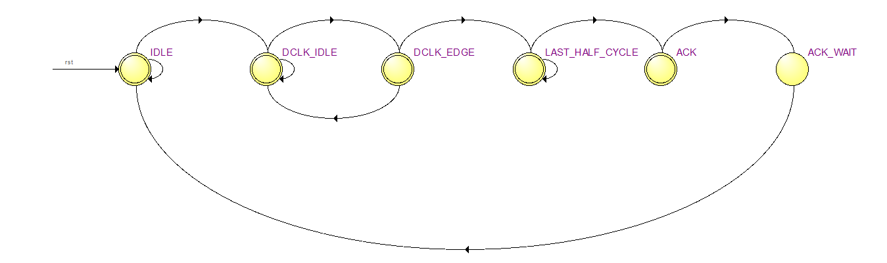
      
spi master模块状态图

spi_master模块中模拟了一个spi时钟，在状态机进入到‘DCLK_EDGE’时进行翻转

.. code:: verilog

 //SPI clock edge counter
 always@(posedge sys_clk or posedge rst)
 begin
 	if(rst)
 		clk_edge_cnt <= 5'd0;
 	else if(state == DCLK_EDGE)
 		clk_edge_cnt <= clk_edge_cnt + 5'd1;
 	else if(state == IDLE)
 		clk_edge_cnt <= 5'd0;
 end

+-------------+-------+------------------------------------------------+
| 信号名称    | 方向  | 说明                                           |
+=============+=======+================================================+
| sys_clk     | in    | 时钟输入                                       |
+-------------+-------+------------------------------------------------+
| rst         | in    | 异步复位输入，高复位                           |
+-------------+-------+------------------------------------------------+
| nCS         | out   | spi 片选信号，等于nCS_ctrl。                   |
+-------------+-------+------------------------------------------------+
| DCLK        | out   | spi 串行时钟                                   |
+-------------+-------+------------------------------------------------+
| MOSI        | out   | spi串行数据输出                                |
+-------------+-------+------------------------------------------------+
| MISO        | in    | spi串行数据输入                                |
+-------------+-------+------------------------------------------------+
| CPOL        | in    | Clock Polarity，spi时钟的极性                  |
|             |       |                                                |
|             |       | 0：空闲状态为0                                 |
|             |       |                                                |
|             |       | 1：空闲状态为1                                 |
+-------------+-------+------------------------------------------------+
| CPHA        | in    |    Clock Phase，spi时钟的相位，                |
|             |       |                                                |
|             |       |    0：第一个沿采样，                           |
|             |       |                                                |
|             |       |    1：第二个沿采样                             |
+-------------+-------+------------------------------------------------+
| nCS_ctrl    | in    | nCS控制                                        |
+-------------+-------+------------------------------------------------+
| clk_div     | in    | spi时钟频率控制                                |
|             |       |                                                |
|             |       | spi时钟=系统时钟/(2*（2+ clk_div）)            |
|             |       |                                                |
|             |       | clk_div                                        |
|             |       | 最小值可以为0，当为0时，spi时钟是系统时钟的1/4 |
+-------------+-------+------------------------------------------------+
| wr_req      | in    | 写一个字节请求                                 |
+-------------+-------+------------------------------------------------+
| wr_ack      | out   | 写应答，高有效                                 |
+-------------+-------+------------------------------------------------+
| data_in     | in    | 数据                                           |
+-------------+-------+------------------------------------------------+
| data_out    | out   | 返回的数据，当写应答时有效                     |
+-------------+-------+------------------------------------------------+

spi master端口说明

ds1302_io模块完成DS1302寄存器读写控制，状态机如下图所示。

状态“S_IDLE”空闲状态，收到读写寄存器请求写进入“S_CE_HIGH”状态，将CE拉高，然后根据请求类型，进入读（S_READ）或写状态(S_WRITE)。

“S_WRITE”状态下一个状态进入写地址状态“S_WRITE_ADDR”,再进入写数据状态“S_WRITE_DATA”，完成一个寄存器的写入，最后应答，拉低CE。

“S_READ”状态下一个状态进入读地址状态“S_READ_ADDR”,再进入读数据状态“S_READ_DATA”，完成一个寄存器的读取，最后应答，拉低CE。

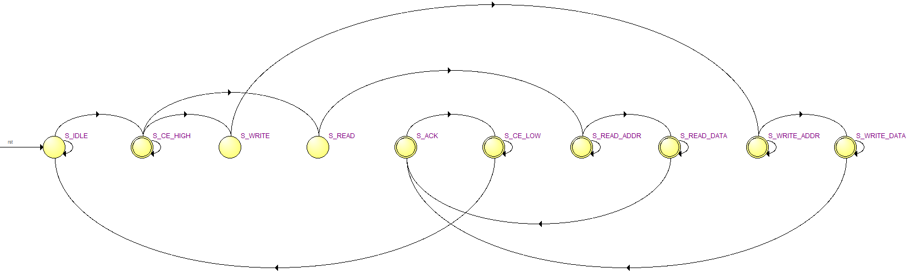
      
ds1302_io状态机

+---------------+--------+---------------------------------------------+
| 信号名称      | 方向   | 说明                                        |
+===============+========+=============================================+
| clk           | in     | 时钟输入                                    |
+---------------+--------+---------------------------------------------+
| rst           | in     | 异步复位输入，高复位                        |
+---------------+--------+---------------------------------------------+
| ds1302_ce     | out    | DS1302 CE，高有效                           |
+---------------+--------+---------------------------------------------+
| ds1302_sclk   | out    | DS1302串行时钟                              |
+---------------+--------+---------------------------------------------+
| ds1302_io     | inout  | DS1302数据                                  |
+---------------+--------+---------------------------------------------+
| cmd_read      | in     | 读寄存器请求，发出请求时准备好地址          |
+---------------+--------+---------------------------------------------+
| cmd_write     | in     | 写寄存器请求，发出请求时准备好地址和数据    |
+---------------+--------+---------------------------------------------+
| cmd_read_ack  | out    | 读寄存器应答，应答时读取数据有效            |
+---------------+--------+---------------------------------------------+
| cmd_write_ack | out    | 写寄存器应答                                |
+---------------+--------+---------------------------------------------+
| read_addr     | in     | 读寄存器地址                                |
+---------------+--------+---------------------------------------------+
| write_addr    | in     | 写寄存器地址                                |
+---------------+--------+---------------------------------------------+
| read_data     | out    | 读出的数据                                  |
+---------------+--------+---------------------------------------------+
| write_data    | in     | 写寄存器数据                                |
+---------------+--------+---------------------------------------------+

ds1302_io端口

ds1302模块主要完成时间寄存器的读写控制，状态机状态较为简单。

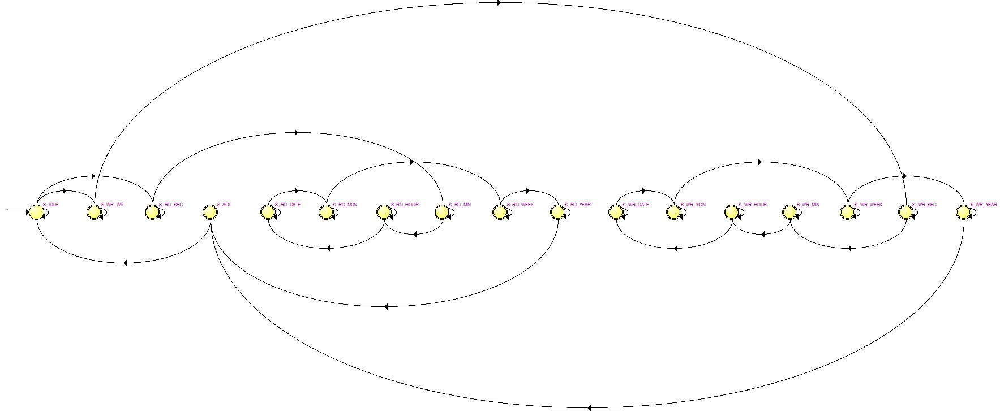
      
ds1302模块状态机

+-------+---+---------------------------------------------------------+
| 信号  | 方 | 说明                                                   |
| 名称  | 向 |                                                        |
+=======+===+=========================================================+
| clk   | i | 时钟输入                                                |
|       | n |                                                         |
+-------+---+---------------------------------------------------------+
| rst   | i | 异步复位输入，高复位                                    |
|       | n |                                                         |
+-------+---+---------------------------------------------------------+
| ds13  | o | DS1302 CE，高有效                                       |
| 02_ce | u |                                                         |
|       | t |                                                         |
+-------+---+---------------------------------------------------------+
| d     | o | DS1302串行时钟                                          |
| s1302 | u |                                                         |
| _sclk | t |                                                         |
+-------+---+---------------------------------------------------------+
| ds13  | i | DS1302数据                                              |
| 02_io | n |                                                         |
|       | o |                                                         |
|       | u |                                                         |
|       | t |                                                         |
+-------+---+---------------------------------------------------------+
| writ  | i | ds1302写时间请求，请求                                  |
| e_tim | n | 发出时，时间数据write_second、write_minute、write_hour  |
| e_req |   | 、write_date、write_month、write_week、write_year要有效 |
+-------+---+---------------------------------------------------------+
| writ  | o | 写时间请求应答                                          |
| e_tim | u |                                                         |
| e_ack | t |                                                         |
+-------+---+---------------------------------------------------------+
| wr    | i | 写时间：秒，BCD码，00-59                                |
| ite_s | n |                                                         |
| econd |   |                                                         |
+-------+---+---------------------------------------------------------+
| wr    | i | 写时间：分，BCD码,，00-59                               |
| ite_m | n |                                                         |
| inute |   |                                                         |
+-------+---+---------------------------------------------------------+
| write | i | 写时间：时，BCD码,，00-23                               |
| _hour | n |                                                         |
+-------+---+---------------------------------------------------------+
| write | i | 写时间：日，BCD码,，01-31                               |
| _date | n |                                                         |
+-------+---+---------------------------------------------------------+
| write | i | 写时间：月，BCD码,，01-12                               |
| _     | n |                                                         |
| month |   |                                                         |
+-------+---+---------------------------------------------------------+
| write | i | 写时间：周，BCD码,，01-07                               |
| _week | n |                                                         |
+-------+---+---------------------------------------------------------+
| write | i | 写时间：年，BCD码,，00-99                               |
| _year | n |                                                         |
+-------+---+---------------------------------------------------------+
| rea   | i | 读时间请求                                              |
| d_tim | n |                                                         |
| e_req |   |                                                         |
+-------+---+---------------------------------------------------------+
| rea   | o | 读时间请求应答                                          |
| d_tim | u |                                                         |
| e_ack | t |                                                         |
+-------+---+---------------------------------------------------------+
| r     | o | 读时间：秒，BCD码，00-59                                |
| ead_s | u |                                                         |
| econd | t |                                                         |
+-------+---+---------------------------------------------------------+
| r     | o | 读时间：分，BCD码,，00-59                               |
| ead_m | u |                                                         |
| inute | t |                                                         |
+-------+---+---------------------------------------------------------+
| read  | o | 读时间：时，BCD码,，00-23                               |
| _hour | u |                                                         |
|       | t |                                                         |
+-------+---+---------------------------------------------------------+
| read  | o | 读时间：日，BCD码,，01-31                               |
| _date | u |                                                         |
|       | t |                                                         |
+-------+---+---------------------------------------------------------+
| read_m| o | 读时间：月，BCD码,，01-12                               |
| onth  | u |                                                         |
|       | t |                                                         |
+-------+---+---------------------------------------------------------+
| read  | o | 读时间：周，BCD码,，01-07                               |
| _week | u |                                                         |
|       | t |                                                         |
+-------+---+---------------------------------------------------------+
| read  | o | 读时间：年，BCD码,，00-99                               |
| _year | u |                                                         |
|       | t |                                                         |
+-------+---+---------------------------------------------------------+

ds1302模块端口

ds1302_test模块主要CH状态检测，CH位于秒寄存器的BIT7位，上电后首先读取时间，判断秒寄存器的CH状态，如果为高，表示DS1302暂停，状态机进入“S_WRITE_CH”，将CH写0，并将一个初始时间写入，然后循环不断的读取时间寄存器。

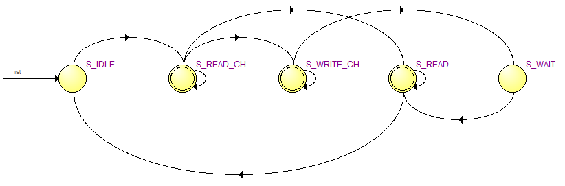
      
ds1302_test状态机

+---------------+--------+--------------------------------------------+
| 信号名称      | 方向   | 说明                                       |
+===============+========+============================================+
| clk           | in     | 时钟输入                                   |
+---------------+--------+--------------------------------------------+
| rst           | in     | 异步复位输入，高复位                       |
+---------------+--------+--------------------------------------------+
| ds1302_ce     | out    | DS1302 CE，高有效                          |
+---------------+--------+--------------------------------------------+
| ds1302_sclk   | out    | DS1302串行时钟                             |
+---------------+--------+--------------------------------------------+
| ds1302_io     | inout  | DS1302数据                                 |
+---------------+--------+--------------------------------------------+
| read_second   | out    | 时间：秒，BCD码，00-59                     |
+---------------+--------+--------------------------------------------+
| read_minute   | out    | 时间：分，BCD码，00-59                     |
+---------------+--------+--------------------------------------------+
| read_hour     | out    | 时间：时，BCD码，00-23                     |
+---------------+--------+--------------------------------------------+
| read_date     | out    | 时间：日，BCD码，01-31                     |
+---------------+--------+--------------------------------------------+
| read_month    | out    | 时间：月，BCD码，01-12                     |
+---------------+--------+--------------------------------------------+
| read_week     | out    | 时间：周，BCD码，01-07                     |
+---------------+--------+--------------------------------------------+
| read_year     | out    | 时间：年，BCD码，00-99                     |
+---------------+--------+--------------------------------------------+

ds1302_test端口

字符叠加设计
~~~~~~~~~~~~

参考前面字符叠加实验，由于前面的实验字符是静态的，而本节需要将RTC的数据动态的显示出来，因此一个字符显示区域的内容是可变的，我们需要做字符库。也就是0~9以及分隔符”:”，考虑到字符较多，如果放在一个ROM里不容易调用。因此不再用例化ROM的方式，而是采用case语句制作字符库char_repo.v。比如在下面的图中即是数字0的字符库表达式。

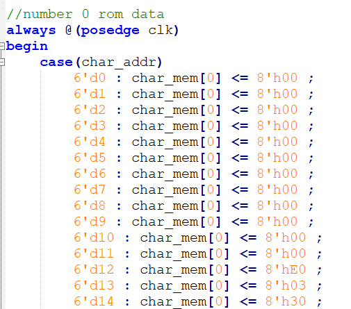
      
至于字符库的数据也是由“FPGA字模提取”软件产生的，点阵宽x高为16x32，也就是64个字节。

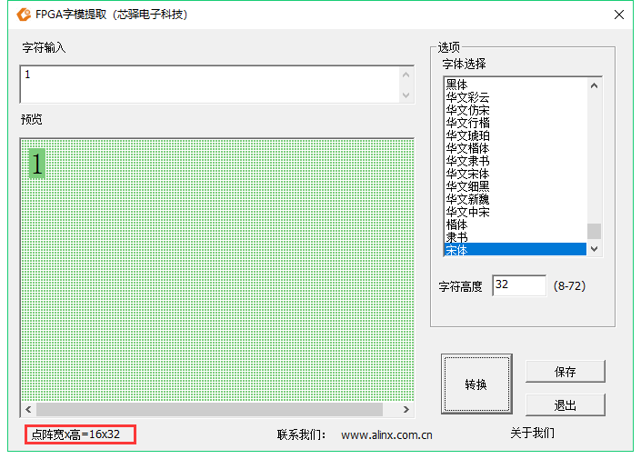
      
程序中的char_addr_sel用来选择用哪个字符，0~9对应数字0~9，10对应“：”

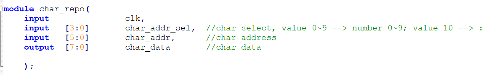
      
+----------------+--------+--------------------------------------------+
| 信号名称       | 方向   | 说明                                       |
+================+========+============================================+
| clk            | in     | 时钟输入                                   |
+----------------+--------+--------------------------------------------+
| char_addr_sel  | in     | 用来选择字符，0~9对应数字0~9，10对应”:”    |
+----------------+--------+--------------------------------------------+
| char_addr      | in     | 字符数据地址                               |
+----------------+--------+--------------------------------------------+
| char_data      | out    | 字符数据                                   |
+----------------+--------+--------------------------------------------+

char_repo模块接口信号

rtc_osd.v是用来将RTC的数据叠加到彩条上的，并设置了以下一些参数，由于一个字符宽度是16，也就是16个像素点，因此将两个字符间隔设置为16。

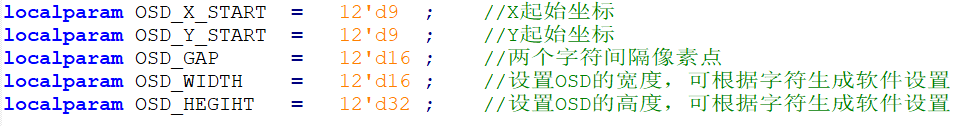
      
由于时分秒加上分隔符共8个字符，因此产生出八个显示有效区域

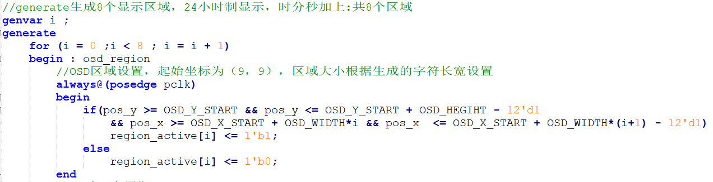
      
根据RTC数据值，进行字符选择信号的译码

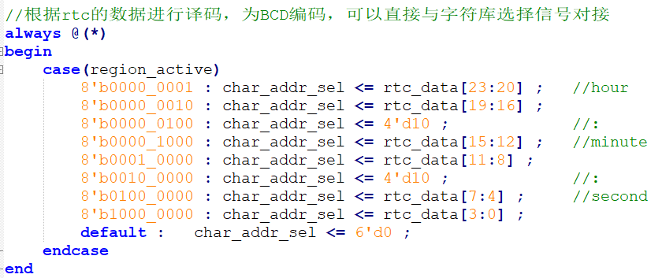
      
+-------------------+-------+------------------------------------------+
| 信号名称          | 方向  | 说明                                     |
+===================+=======+==========================================+
| rst_n             | in    | 异步复位输入,低复位                      |
+-------------------+-------+------------------------------------------+
| pclk              | in    | 外部时钟输入                             |
+-------------------+-------+------------------------------------------+
| rtc_data          | In    | RTC数据，24bit，分别为时分秒数据         |
+-------------------+-------+------------------------------------------+
| i_hs              | in    | 行同步信号                               |
+-------------------+-------+------------------------------------------+
| i_vs              | in    | 场同步信号                               |
+-------------------+-------+------------------------------------------+
| i_de              | in    | 数据有效信号                             |
+-------------------+-------+------------------------------------------+
| i_data            | in    | color_bar数据                            |
+-------------------+-------+------------------------------------------+
| o_hs              | out   | 输出行同步信号                           |
+-------------------+-------+------------------------------------------+
| o_vs              | out   | 输出场同步信号                           |
+-------------------+-------+------------------------------------------+
| o_de              | out   | 输出数据有效信号                         |
+-------------------+-------+------------------------------------------+
| o_data            | out   | 输出数据                                 |
+-------------------+-------+------------------------------------------+

rtc_osd模块信号

实验现象
--------

连接好下载线，HDMI线，将程序下载到板子上以后，可以看到HDMI显示器背景为彩条，在左上方会显示时间，每秒会变一下。

.. image:: images/19_media/image17.png
      
AX7020/AX7010硬件连接图

纽扣电池型号为CR1220，安装时注意正极朝上，取下时用镊子拨动黄色弹片，即可弹出电池。

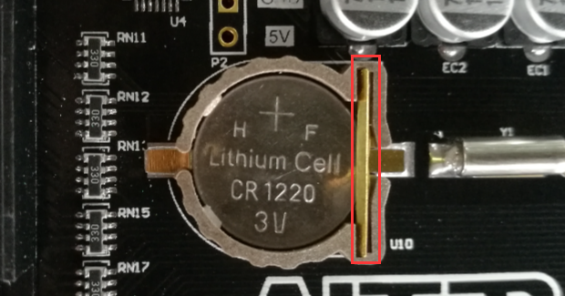
      
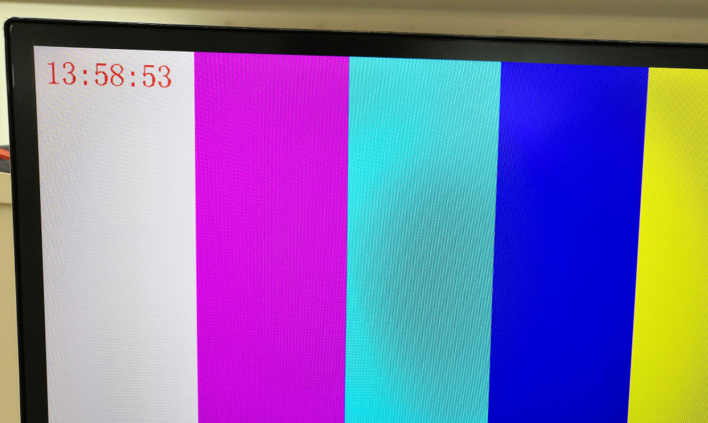
      