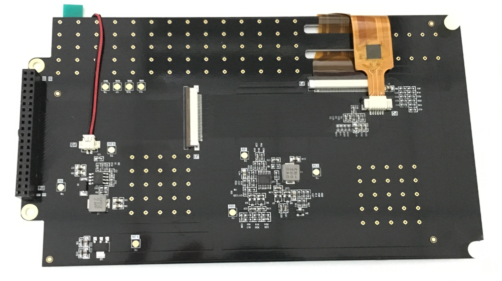
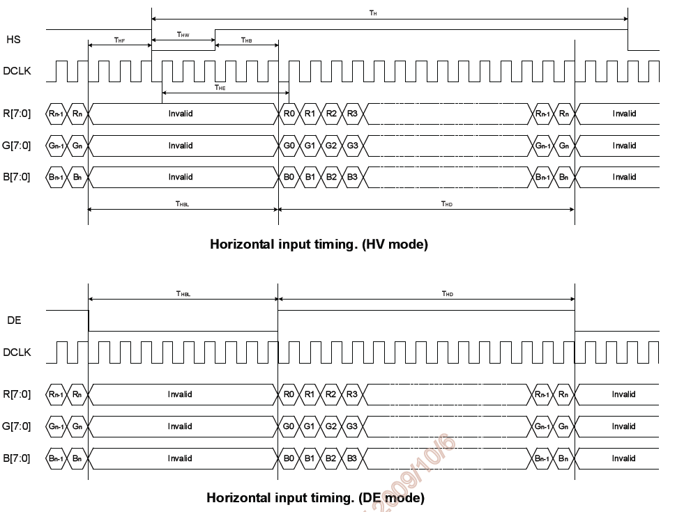
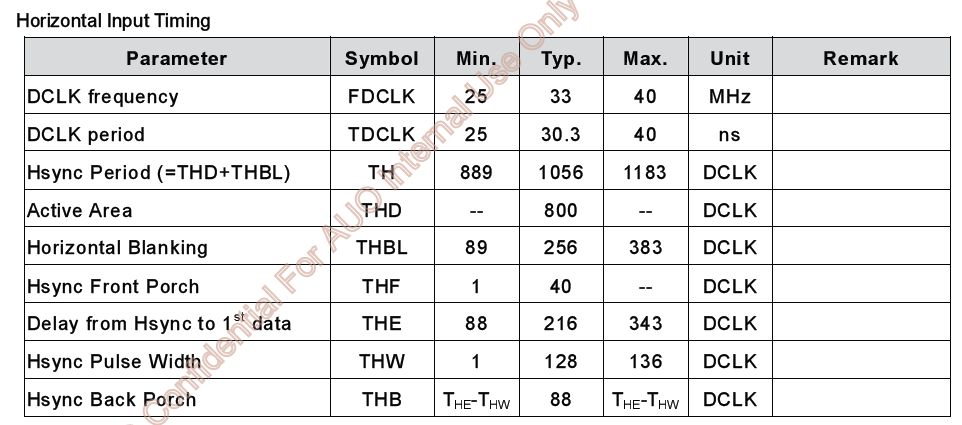
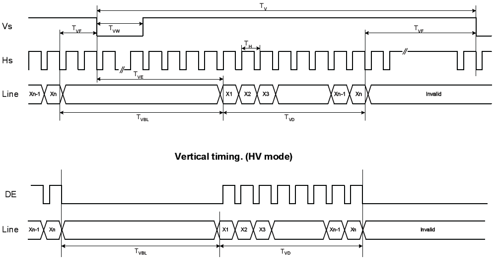
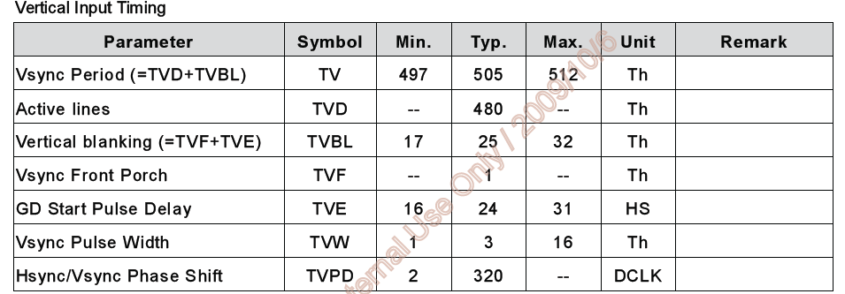
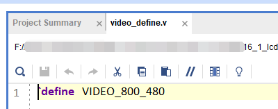
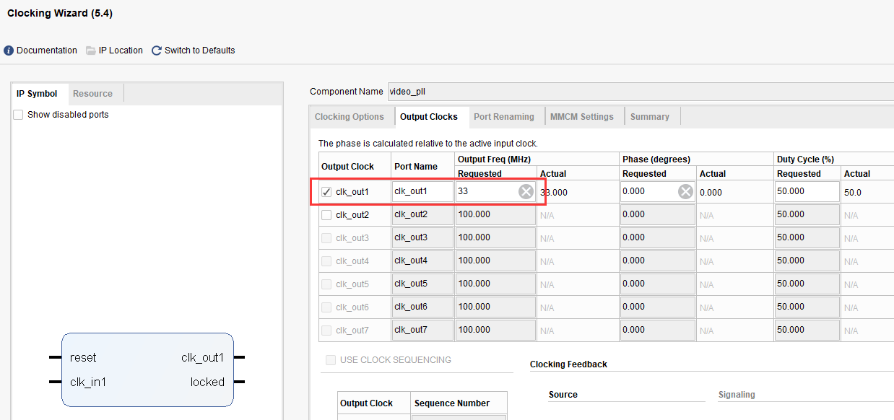
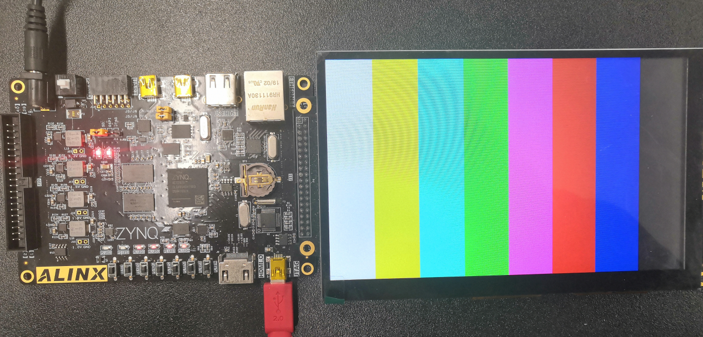
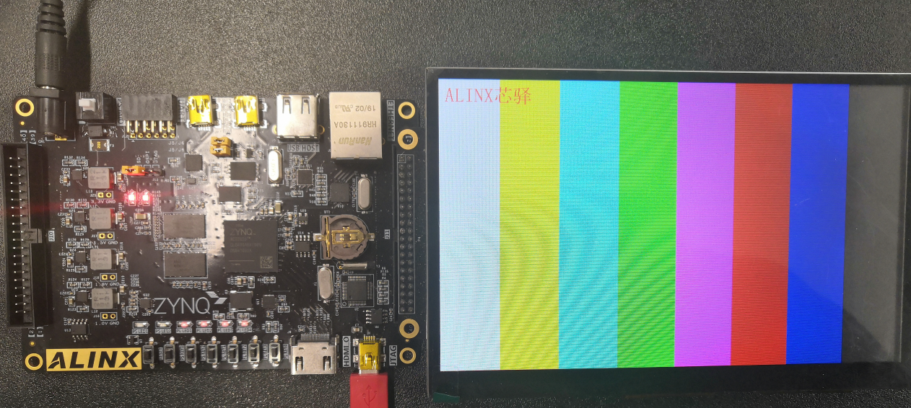
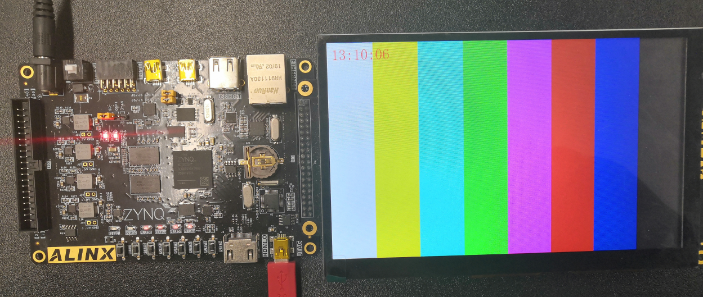

7寸液晶屏显示实验
===================

**实验Vivado工程为“lcd7_test”。**

基于HDMI输出实验，本章介绍7寸液晶屏的显示。

硬件介绍
--------

AN970 LCD触摸屏模块由 TFT 液晶屏，电容触摸屏和驱动板组成，详细信息查看 AN970 用户手册。AN970 实物照片如下：

.. image:: images/20_media/image1.png
      

      
1. LCD屏的驱动时序

LCD屏显示方式从屏幕左上角一点开始，从左向右逐点显示，每显示完一行,再回到屏幕的左边下一行的起始位置，在这期间，需要对行进行消隐，每行结束时，用行同步信号进行同步；LCD的驱动有两种方式，一种为HV模式，另一种为DE模式，这两种模式都能驱动LCD屏，数据在DCLK的上升沿采样。以下为行显示的时序图：

      
LCD行的显示时序参数如下表所示：

      
当显示完所有的行，形成一帧，用场同步信号进行场同步，并使LCD显示回到屏幕左上方，同时进行场消隐,开始下一帧。以下为列显示的时序图：

      
LCD列的显示时序参数如下表所示：

      
程序设计
--------

本章实验其实很简单，与HDMI显示最大的不同是不需要rgb转dvi的模块，输出按照RGB即可。以下是文件结构，去掉了rgb2dvi模块。

.. image:: images/20_media/image7.png
      
同时因为液晶屏的分辨率是800x480，需要修改video_define.v的宏定义。

      
同时将PLL的输出时钟频率修改为33MHz，即800x480的像素时钟。

      
同时在top.v中例化了ax_pwm，用于调节液晶屏的亮度，设置为200Hz，30%点空比。

.. image:: images/20_media/image10.png
      
实验现象
--------

连接液晶屏到J11扩展口，下载程序，即可看到彩条显示。

      
同时也准备了字符显示和RTC显示的例程：

      
字符显示

      
RTC显示
