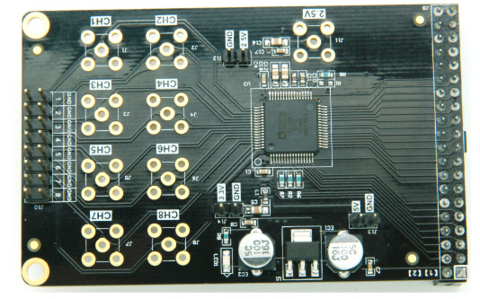
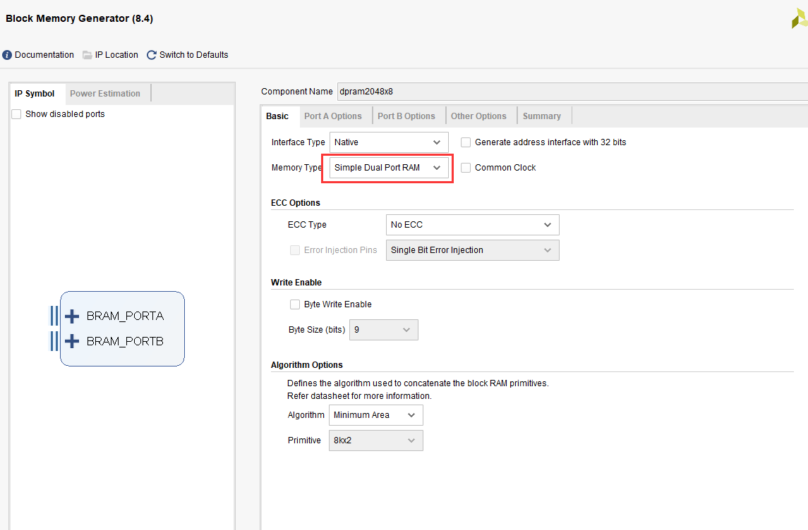

AD7606多通道波形显示实验
==========================

**实验Vivado工程为“ad7606_hdmi_test”。**

本实验练习使用ADC，实验中使用的ADC模块型号为AN706，最大采样率200Khz，精度为16位。实验中把AN706的2路输入以波形方式在HDMI上显示出来，我们可以用更加直观的方式观察波形，是一个数字示波器雏形。

      
8路200K采样16位ADC模块

.. image:: images/21_media/image2.png
      
实验预期结果

实验原理
--------

AD7606是一款集成式8通道同步采样数据采集系统，片内集成输入放大器、过压保护电路、二阶模拟抗混叠滤波器、模拟多路复用器、16位200kSPS SAR ADC和一个数字滤波器, 2.5V基准电压源、基准电压缓冲以及高速串行和并行接口。

AD7606采用+5V单电源供电, 可以处理±10V和±5V真双极性输入信号,同时所有通道均以高达200KSPS的吞吐速率采样。输入钳位保护电路可以耐受最高达±16.5V的电压。

无论以何种采样频率工作,AD7606的模拟输入阻抗均为1M欧姆。它采用单电源工作方式,具有片内滤波和高输入阻抗, 因此无需驱动运算放大器和外部双极性电源。

AD7606抗混叠滤波器的3dB截至频率为22kHz; 当采样速率为200kSPS时,它具有40dB抗混叠抑制特性。灵活的数字滤波器采用引脚驱动,可以改善信噪比(SNR), 并降低3dB带宽。

.. image:: images/21_media/image3.png
      
AD7606时序
~~~~~~~~~~~

.. image:: images/21_media/image4.png
      
AD7606可以对所有8路的模拟输入通道进行同步采样。当两个CONVST引脚(CONVSTA和CONVSTB)连在一起时，所有通道同步采样。此共用CONVST信号的上升沿启动对所有模拟输入通道的同步采样(V1至V8)。

AD7606内置一个片内振荡器用于转换。所有ADC通道的转换时间为tCONV。BUSY信号告知用户正在进行转换，因此当施加CONVST上升沿时，BUSY变为逻辑高电平，
在整个转换过程结束时变成低电平。BUSY信号下降沿用来使所有八个采样保持放大器返回跟踪模式。BUSY下降沿还表示，现在可以从并行总线DB[15:0]读取8个通道的数据。

AD7606配置
~~~~~~~~~~~

在AN706 8通道的AD模块硬件电路设计中，我们对AD7606的3个配置Pin脚通过加上拉或下拉电阻来设置AD7606的工作模式。

AD7606这款芯片支持外部基准电压输入或内部基准电压。如果使用外部基准电压，芯片的REFIN/REFOUT需要外接一个2.5V的基准源。如果使用内部的基准电压。REFIN/REFOUT引脚为2.5V的内部基准电压输出。REF
SELECT引脚用于选择内部基准电压或外部基准电压。在本模块中，因为考虑到AD7606的内部基准电压的精度也非常高（2.49V~2.505V)，所以电路设计选择使用了内部的基准电压。

+---------------------+---------------+--------------------------------+
| **Pin脚名**         | **设置电平**  | **说明**                       |
+=====================+===============+================================+
| REF SELECT          | 高电平        | 使用内部的基准电压2.5V         |
+---------------------+---------------+--------------------------------+

AD7606的AD转换数据采集可以采用并行模式或者串行模式， 用户可以通过设置PAR/SER/BYTE SEL引脚电平来设置通信的模式。我们在设计的时候，选择并行模式读取AD7606的AD数据。

+-----------------------+--------------+-------------------------------+
| **Pin脚名**           | **设置电平** | **说明**                      |
+=======================+==============+===============================+
| PAR/SER/BYTE SEL      | 低电平       | 选择并行接口                  |
+-----------------------+--------------+-------------------------------+

AD7606的AD模拟信号的输入范围可以设置为±5V或者是±10V，当设置±5V输入范围时，1LSB=152.58uV；当设置±10V输入范围时，1LSB=305.175uV
。用户可以通过设置RANGE引脚电平来设置模拟输入电压的范围。我们在设计的时候，选择±5V的模拟电压输入范围。

+-----------------------+--------------+-------------------------------+
| **Pin脚名**           | **设置电平** | **说明**                      |
+=======================+==============+===============================+
| RANGE                 | 低电平       | 模拟信号输入范围选择：±5V     |
+-----------------------+--------------+-------------------------------+

AD7606内置一个可选的数字一阶sinc滤波器，在使用较低吞吐率或需要更高信噪比的应用中，应使用滤波器。数字滤波器的过采样倍率由过采样引脚OS[2:0]控制。下表提供了用来选择不同过采样倍率的过采样位解码。

.. image:: images/21_media/image5.png
      
在AN706模块的硬件设计中, OS[2:0]已经引到外部的接口中，FPGA或CPU可以通过控制OS[2:0]的管脚电平来选择是否使用滤波器，以达到更高的测量精度。

AD7606 AD转换
~~~~~~~~~~~~~~

AD7606的输出编码方式为二进制补码。所设计的码转换在连续LSB整数的中间(既1/2LSB和3/2LSB)进行。AD7606的LSB大小为FSR/65536。AD7606的理想传递特性如下图所示：

.. image:: images/21_media/image6.png
      
程序设计
--------

本实验显示部分是基于前面的HDMI显示彩条的实验，在彩条上叠加网格线和波形,
整个项目的框图如下图所示：

ad7606_if模块为AN706的接口模块，完成AD706输入的8路AD的数据采集，按照AD706芯片的时序产生AD转换信号ad_convstab，等待ADC忙信号无效后，产生片选信号，依次读取8路AD数据。

+---------------+------+-------+--------------------------------------+
| 信号名称      | 方向 | 宽度  | 说明                                 |
|               |      | (bit) |                                      |
+===============+======+=======+======================================+
| clk           | in   | 1     | 系统时钟                             |
+---------------+------+-------+--------------------------------------+
| rst_n         | in   | 1     | 异步复位，低复位                     |
+---------------+------+-------+--------------------------------------+
| adc_data      | in   | 16    | ADC数据输入                          |
+---------------+------+-------+--------------------------------------+
| ad_busy       | in   | 1     | ADC忙信号                            |
+---------------+------+-------+--------------------------------------+
| first_data    | in   | 1     | 第一通道数据指示信号                 |
+---------------+------+-------+--------------------------------------+
| ad_os         | out  | 3     | ADC过采样                            |
+---------------+------+-------+--------------------------------------+
| ad_cs         | out  | 1     | ADC片选                              |
+---------------+------+-------+--------------------------------------+
| ad_rd         | out  | 1     | ADC读信号                            |
+---------------+------+-------+--------------------------------------+
| ad_reset      | out  | 1     | ADC复位信号                          |
+---------------+------+-------+--------------------------------------+
| ad_convstab   | out  | 1     | ADC转换信号                          |
+---------------+------+-------+--------------------------------------+
| a             | in   | 1     | ADC数据有效                          |
| dc_data_valid |      |       |                                      |
+---------------+------+-------+--------------------------------------+
| ad_ch1        | out  | 16    | ADC通道1数据                         |
+---------------+------+-------+--------------------------------------+
| ad_ch2        | out  | 16    | ADC通道2数据                         |
+---------------+------+-------+--------------------------------------+
| ad_ch3        | out  | 16    | ADC通道3数据                         |
+---------------+------+-------+--------------------------------------+
| ad_ch4        | out  | 16    | ADC通道4数据                         |
+---------------+------+-------+--------------------------------------+
| ad_ch5        | out  | 16    | ADC通道5数据                         |
+---------------+------+-------+--------------------------------------+
| ad_ch6        | out  | 16    | ADC通道6数据                         |
+---------------+------+-------+--------------------------------------+
| ad_ch7        | out  | 16    | ADC通道7数据                         |
+---------------+------+-------+--------------------------------------+
| ad_ch8        | out  | 16    | ADC通道8数据                         |
+---------------+------+-------+--------------------------------------+

ad7606_sample模块主要完成ad706的单路数据转换。首先需要对输入数据转换为无符号数，最后的数据只取高8位的数据，数据宽度转换到8bit（为了跟其它8位的AD模块程序兼容）。另外每次采集1280个数据，然后等待一段时间再继续采集下面的1280个数据。

+---------------+------+-------+--------------------------------------+
| 信号名称      | 方向 | 宽度  | 说明                                 |
|               |      | (bit) |                                      |
+===============+======+=======+======================================+
| adc_clk       | in   | 1     | adc系统时钟                          |
+---------------+------+-------+--------------------------------------+
| rst           | in   | 1     | 异步复位，高复位                     |
+---------------+------+-------+--------------------------------------+
| adc_data      | in   | 16    | ADC数据输入                          |
+---------------+------+-------+--------------------------------------+
| a             | in   | 1     | adc数据有效                          |
| dc_data_valid |      |       |                                      |
+---------------+------+-------+--------------------------------------+
| adc_buf_wr    | out  | 1     | ADC数据写使能                        |
+---------------+------+-------+--------------------------------------+
| adc_buf_addr  | out  | 12    | ADC数据写地址                        |
+---------------+------+-------+--------------------------------------+
| adc_buf_data  | out  | 8     | 无符号8位ADC数据                     |
+---------------+------+-------+--------------------------------------+

ad7606_sample模块端口

grid_display模块主要完成视频图像的网格线叠加，本实验将彩条视频输入，然后叠加一个网格后输出，
这一块网格区域提供给后面的波形显示模块使用，这个网格区域是位于显示器水平方向（从左到右）从9到1018，垂直方向（从上到下）从9到308的视频显示位置。

.. image:: images/21_media/image8.png
      
+-------------+------+-------+----------------------------------------+
| 信号名称    | 方向 | 宽度  | 说明                                   |
|             |      | (bit) |                                        |
+=============+======+=======+========================================+
| pclk        | in   | 1     | 像素时钟                               |
+-------------+------+-------+----------------------------------------+
| rst_n       | in   | 1     | 异步复位，低电平复位                   |
+-------------+------+-------+----------------------------------------+
| i_hs        | in   | 1     | 视频行同步输入                         |
+-------------+------+-------+----------------------------------------+
| i_vs        | in   | 1     | 视频场同步输入                         |
+-------------+------+-------+----------------------------------------+
| i_de        | in   | 1     | 视频数据有效输入                       |
+-------------+------+-------+----------------------------------------+
| i_data      | in   | 24    | 视频数据输入                           |
+-------------+------+-------+----------------------------------------+
| o_hs        | out  | 1     | 带网格视频行同步输出                   |
+-------------+------+-------+----------------------------------------+
| o_vs        | out  | 1     | 带网格视频场同步输出                   |
+-------------+------+-------+----------------------------------------+
| o_de        | out  | 1     | 带网格视频数据有效输出                 |
+-------------+------+-------+----------------------------------------+
| o_data      | out  | 24    | 带网格视频数据输出                     |
+-------------+------+-------+----------------------------------------+

grid_display模块端口

wav_display显示模块主要是完成波形数据的叠加显示，模块内含有一个双口ram，写端口是由ADC采集模块写入，读端口是显示模块。在网格显示区域有效的时候，每行显示都会读取RAM中存储的AD数据值，跟Y坐标比较来判断显示波形或者不显示。

.. image:: images/21_media/image9.png
      
+--------------+------+-------+---------------------------------------+
| 信号名称     | 方向 | 宽度  | 说明                                  |
|              |      | (bit) |                                       |
+==============+======+=======+=======================================+
| pclk         | in   | 1     | 像素时钟                              |
+--------------+------+-------+---------------------------------------+
| rst_n        | in   | 1     | 异步复位，低电平复位                  |
+--------------+------+-------+---------------------------------------+
| wave_color   | in   | 24    | 波形颜色，rgb                         |
+--------------+------+-------+---------------------------------------+
| adc_clk      | in   | 1     | adc模块时钟                           |
+--------------+------+-------+---------------------------------------+
| adc_buf_wr   | in   | 1     | adc数据写使能                         |
+--------------+------+-------+---------------------------------------+
| adc_buf_addr | in   | 12    | adc数据写地址                         |
+--------------+------+-------+---------------------------------------+
| adc_buf_data | in   | 8     | adc数据，无符号数                     |
+--------------+------+-------+---------------------------------------+
| i_hs         | in   | 1     | 视频行同步输入                        |
+--------------+------+-------+---------------------------------------+
| i_vs         | in   | 1     | 视频场同步输入                        |
+--------------+------+-------+---------------------------------------+
| i_de         | in   | 1     | 视频数据有效输入                      |
+--------------+------+-------+---------------------------------------+
| i_data       | in   | 24    | 视频数据输入                          |
+--------------+------+-------+---------------------------------------+
| o_hs         | out  | 1     | 带网格视频行同步输出                  |
+--------------+------+-------+---------------------------------------+
| o_vs         | out  | 1     | 带网格视频场同步输出                  |
+--------------+------+-------+---------------------------------------+
| o_de         | out  | 1     | 带网格视频数据有效输出                |
+--------------+------+-------+---------------------------------------+
| o_data       | out  | 24    | 带网格视频数据输出                    |
+--------------+------+-------+---------------------------------------+

wav_display模块端口

RAM的配置如下：

      
.. image:: images/21_media/image11.png
      
.. image:: images/21_media/image12.png
      
timing_gen_xy模块为其它模块的子模块，完成视频图像的坐标生成，x坐标，从左到右增大，y坐标从上到下增大。

+-------------+------+-------+----------------------------------------+
| 信号名称    | 方向 | 宽度  | 说明                                   |
|             |      | (bit) |                                        |
+=============+======+=======+========================================+
| clk         | in   | 1     | 系统时钟                               |
+-------------+------+-------+----------------------------------------+
| rst_n       | in   | 1     | 异步复位，低电平复位                   |
+-------------+------+-------+----------------------------------------+
| i_hs        | in   | 1     | 视频行同步输入                         |
+-------------+------+-------+----------------------------------------+
| i_vs        | in   | 1     | 视频场同步输入                         |
+-------------+------+-------+----------------------------------------+
| i_de        | in   | 1     | 视频数据有效输入                       |
+-------------+------+-------+----------------------------------------+
| i_data      | in   | 24    | 视频数据输入                           |
+-------------+------+-------+----------------------------------------+
| o_hs        | out  | 1     | 视频行同步输出                         |
+-------------+------+-------+----------------------------------------+
| o_vs        | out  | 1     | 视频场同步输出                         |
+-------------+------+-------+----------------------------------------+
| o_de        | out  | 1     | 视频数据有效输出                       |
+-------------+------+-------+----------------------------------------+
| o_data      | out  | 24    | 视频数据输出                           |
+-------------+------+-------+----------------------------------------+
| x           | out  | 12    | 坐标x输出                              |
+-------------+------+-------+----------------------------------------+
| y           | out  | 12    | 坐标y输出                              |
+-------------+------+-------+----------------------------------------+

timing_gen_xy模块端口

实验现象
--------

连接电路如下，插入AN706模块，连接SMA到波形发生器，为了方便观察显示效果，波形发生器采样频率设置范围为500Hz~10KHz，电压幅度最大为10V，结果即为本章最前面的效果图。

      
AX7020/AX7010硬件连接图（J11扩展口）
