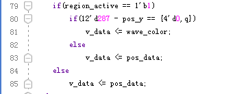

ADDA测试实验
==============

**实验Vivado工程为“an108_adda_hdmi_test”。**

本实验练习使用ADC和DAC，实验中使用的ADDA模块型号为AN108，ADC最大采样率32Mhz，精度为8位，DAC最大采样率125Mhz，精度为8位。实验中用DAC输出正弦波，然后使用ADC采集并把波形在HDMI显示器显示。

.. image:: images/23_media/image1.png
      
ADDA模块

.. image:: images/23_media/image2.png
      
实验预期结果

硬件介绍
--------

      
数模转换（DA）电路
~~~~~~~~~~~~~~~~~~~

如硬件结构图所示，DA电路由高速DA芯片、7阶巴特沃斯低通滤波器、幅度调节电路和信号输出接口组成。

我们使用的高速DA芯片是AD公司推出的AD9708。AD9708是8位，125MSPS的DA转换芯片，内置1.2V参考电压，差分电流输出。芯片内部结构图如下图所示

      
AD9708芯片差分输出以后，为了防止噪声干扰，电路中接入了7阶巴特沃斯低通滤波器，带宽为40MHz，频率响应如下图所示

      
滤波器参数如下图所示

      
滤波器之后，我们使用了2片高性能145MHz带宽的运放AD8056，实现差分变单端，以及幅度调节等功能，使整个电路性能得到了最大限度的提升。幅度调节，使用的是5K的电位器，最终的输出范围是-5V~5V（10Vpp）。

注：\ **由于电路器的精度不是很精确，最终的输出有一定误差，有可能波形幅度不能达到10Vpp，也有可能出现波形削顶等问题，这些都属正常情况**\ 。

模数转换（AD）电路
~~~~~~~~~~~~~~~~~~~

如硬件结构图中所示，AD电路由高速AD芯片、衰减电路和信号输入接口组成。

我们使用的高速AD芯片是由AD公司推出的8位，最大采样率32MSPS的AD9280芯片。内部结构图如下图所示

      
根据下图的配置，我们将AD电压输入范围设置为：0V~2V

      
在信号进入AD芯片之前，我们用一片AD8056芯片构建了衰减电路，接口的输入范围是-5V~+5V(10Vpp)。衰减以后，输入范围满足AD芯片的输入范围（0~2V）。转换公式如下：

.. image:: images/23_media/image9.png
      
当输入信号Vin=5(V)的时候，输入到AD的信号Vad=2(V)；

当输入信号Vin=-5(V)的时候，输入到AD的信号Vad=0(V)；

程序设计
--------

本实验程序设计跟AN706波形显示实验基本类似，只是ADDA模块是单通道的AD，这里只是一路采集波形的叠加。另外FPGA通过ROM IP产生正弦波数据输出到DA芯片进行DA转换，产生正选波模拟信号，用户只有用BNC线把模块的AD和DA端口连接起来就形成环路。这样HDMI显示器上显示的就是DA正选波的信号了。

ad9280_sample模块主要完成ad9280的AD 8位数据采集和转换，每次采集1280个数据，然后等待一段时间再继续采集下次的1280个数据。

+--------------+------+-------+--------------------------------------+
| 信号名称     | 方向 | 宽度  | 说明                                 |
|              |      | (bit) |                                      |
+==============+======+=======+======================================+
| adc_clk      | in   | 1     | adc系统时钟                          |
+--------------+------+-------+--------------------------------------+
| rst          | in   | 1     | 异步复位，高复位                     |
+--------------+------+-------+--------------------------------------+
| adc_data     | in   | 8     | ADC数据输入                          |
+--------------+------+-------+--------------------------------------+
| adc_buf_wr   | out  | 1     | ADC数据写使能                        |
+--------------+------+-------+--------------------------------------+
| adc_buf_addr | out  | 12    | ADC数据写地址                        |
+--------------+------+-------+--------------------------------------+
| adc_buf_data | out  | 8     | 无符号8位ADC数据                     |
+--------------+------+-------+--------------------------------------+

ad9280_sample模块端口

grid_display模块主要完成视频图像的网格线叠加，本实验将彩条视频输入，然后叠加一个网格后输出，
这一块网格区域提供给后面的波形显示模块使用，这个网格区域是位于显示器水平方向（从左到右）从9到1018，垂直方向（从上到下）从9到308的视频显示位置。

.. image:: images/23_media/image11.png
      
+-------------+------+-------+----------------------------------------+
| 信号名称    | 方向 | 宽度  | 说明                                   |
|             |      | (bit) |                                        |
+=============+======+=======+========================================+
| pclk        | in   | 1     | 像素时钟                               |
+-------------+------+-------+----------------------------------------+
| rst_n       | in   | 1     | 异步复位，低电平复位                   |
+-------------+------+-------+----------------------------------------+
| i_hs        | in   | 1     | 视频行同步输入                         |
+-------------+------+-------+----------------------------------------+
| i_vs        | in   | 1     | 视频场同步输入                         |
+-------------+------+-------+----------------------------------------+
| i_de        | in   | 1     | 视频数据有效输入                       |
+-------------+------+-------+----------------------------------------+
| i_data      | in   | 24    | 视频数据输入                           |
+-------------+------+-------+----------------------------------------+
| o_hs        | out  | 1     | 带网格视频行同步输出                   |
+-------------+------+-------+----------------------------------------+
| o_vs        | out  | 1     | 带网格视频场同步输出                   |
+-------------+------+-------+----------------------------------------+
| o_de        | out  | 1     | 带网格视频数据有效输出                 |
+-------------+------+-------+----------------------------------------+
| o_data      | out  | 24    | 带网格视频数据输出                     |
+-------------+------+-------+----------------------------------------+

grid_display模块端口

wav_display显示模块主要是完成波形数据的叠加显示，模块内含有一个双口ram，写端口是由ADC采集模块写入，读端口是显示模块。在网格显示区域有效的时候，每行显示都会读取RAM中存储的AD数据值，跟Y坐标比较来判断显示波形或者不显示。

      
+--------------+------+-------+---------------------------------------+
| 信号名称     | 方向 | 宽度  | 说明                                  |
|              |      | (bit) |                                       |
+==============+======+=======+=======================================+
| pclk         | in   | 1     | 像素时钟                              |
+--------------+------+-------+---------------------------------------+
| rst_n        | in   | 1     | 异步复位，低电平复位                  |
+--------------+------+-------+---------------------------------------+
| wave_color   | in   | 24    | 波形颜色，rgb                         |
+--------------+------+-------+---------------------------------------+
| adc_clk      | in   | 1     | adc模块时钟                           |
+--------------+------+-------+---------------------------------------+
| adc_buf_wr   | in   | 1     | adc数据写使能                         |
+--------------+------+-------+---------------------------------------+
| adc_buf_addr | in   | 12    | adc数据写地址                         |
+--------------+------+-------+---------------------------------------+
| adc_buf_data | in   | 8     | adc数据，无符号数                     |
+--------------+------+-------+---------------------------------------+
| i_hs         | in   | 1     | 视频行同步输入                        |
+--------------+------+-------+---------------------------------------+
| i_vs         | in   | 1     | 视频场同步输入                        |
+--------------+------+-------+---------------------------------------+
| i_de         | in   | 1     | 视频数据有效输入                      |
+--------------+------+-------+---------------------------------------+
| i_data       | in   | 24    | 视频数据输入                          |
+--------------+------+-------+---------------------------------------+
| o_hs         | out  | 1     | 带网格视频行同步输出                  |
+--------------+------+-------+---------------------------------------+
| o_vs         | out  | 1     | 带网格视频场同步输出                  |
+--------------+------+-------+---------------------------------------+
| o_de         | out  | 1     | 带网格视频数据有效输出                |
+--------------+------+-------+---------------------------------------+
| o_data       | out  | 24    | 带网格视频数据输出                    |
+--------------+------+-------+---------------------------------------+

wav_display模块端口

timing_gen_xy模块为其它模块的子模块，完成视频图像的坐标生成，x坐标，从左到右增大，y坐标从上到下增大。

+-------------+------+-------+----------------------------------------+
| 信号名称    | 方向 | 宽度  | 说明                                   |
|             |      | (bit) |                                        |
+=============+======+=======+========================================+
| clk         | in   | 1     | 系统时钟                               |
+-------------+------+-------+----------------------------------------+
| rst_n       | in   | 1     | 异步复位，低电平复位                   |
+-------------+------+-------+----------------------------------------+
| i_hs        | in   | 1     | 视频行同步输入                         |
+-------------+------+-------+----------------------------------------+
| i_vs        | in   | 1     | 视频场同步输入                         |
+-------------+------+-------+----------------------------------------+
| i_de        | in   | 1     | 视频数据有效输入                       |
+-------------+------+-------+----------------------------------------+
| i_data      | in   | 24    | 视频数据输入                           |
+-------------+------+-------+----------------------------------------+
| o_hs        | out  | 1     | 视频行同步输出                         |
+-------------+------+-------+----------------------------------------+
| o_vs        | out  | 1     | 视频场同步输出                         |
+-------------+------+-------+----------------------------------------+
| o_de        | out  | 1     | 视频数据有效输出                       |
+-------------+------+-------+----------------------------------------+
| o_data      | out  | 24    | 视频数据输出                           |
+-------------+------+-------+----------------------------------------+
| x           | out  | 12    | 坐标x输出                              |
+-------------+------+-------+----------------------------------------+
| y           | out  | 12    | 坐标y输出                              |
+-------------+------+-------+----------------------------------------+

timing_gen_xy模块端口

另外在本例程中添加了一个ROM IP模块，需要对ROM IP初始化数据。这里仅介绍如何使用波形数据生成工具，在软件工具及驱动文件夹下找到工具，其图标如下所示：

.. image:: images/23_media/image13.png
      
1. 双击.exe打开工具，打开界面如下：

.. image:: images/23_media/image14.png
      
2. 可以根据需要自选波形，本例程中选择正弦波，数据长度和位宽保持默认

.. image:: images/23_media/image15.png
      
3. 点击保存按钮，将生成的数据文件保存到工程目录文件下（注意保存的文件类型）：

.. image:: images/23_media/image16.png
      
4. 保存后出现如下对话框表示保存成功，点击确定后关闭工具

.. image:: images/23_media/image17.png
            
将 .coe文件保存到生成的Rom IP核中即可，这里不再重复介绍

实验现象
--------

连接AN108的DAC输入到信号发生器的输出，\ **这里使用的是专用屏蔽线，如果使用其他线可能会有较大干扰**\ 。

.. image:: images/23_media/image18.png
      
AN108连接示意图

      
J11扩展口

调节信号发生的频率和幅度，AN108输入范围-5V-5V，为了便于观察波形数据，建议信号输入频率200Khz到1Mhz。观察显示器输出，红色波形为ADC输入、黄色网格最上面横线代表5V，最下面横线代表-5V，中间横线代表0V，每个竖线间隔是10个采样点。

.. image:: images/23_media/image2.png
      