AD9767双通道正弦波产生实验
============================

**实验Vivado工程为“ad9767_dual_sin_wave”。**

本章介绍利用AN9767模块实现两路正弦波产生的实验。

硬件介绍
--------

双通道14位DA输出模块AN9767采用ANALOG DEVICES公司的AD9767芯片，支持独立双通道、14位、125MSPS的数模转换。模块留有一个40针的排母用于连接FPGA开发板，2个BNC连接器用于模拟信号的输出。

AN9767模块实物照片如下：

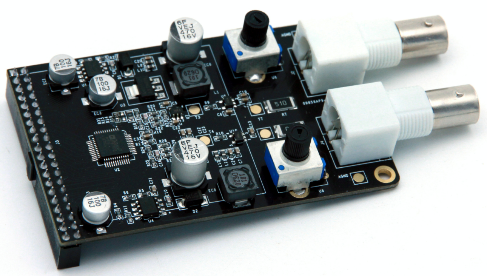
      
AN9767模块正面图

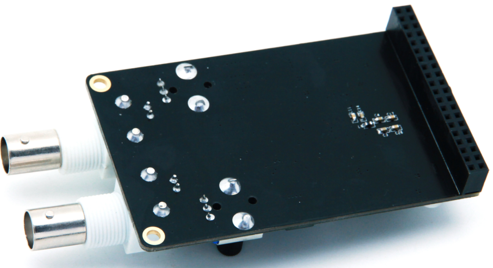
      
AN9767模块背面图

AN9767模块的参数说明
~~~~~~~~~~~~~~~~~~~~

以下为AN9767双通道DA模块的详细参数:

-  DA转换芯片：AD9767；

-  通道数：2通道；

-  DA转换位数：14bit；

-  DA更新速率：125 MSPS；

-  输出电压范围：-5V~+5V；

-  模块PCB层数：4层，独立的电源层和GND层；

-  模块接口：40针2.54mm间距排座，方向向下；

-  工作温度：-40°~85° 模块使用芯片均满足工业级温度范围

-  输出接口：2路BNC模拟输出接口（用BNC线可以直接连接到示波器）；

AN9767模块的原理框图
~~~~~~~~~~~~~~~~~~~~

AN9767模块的原理设计框图如下：

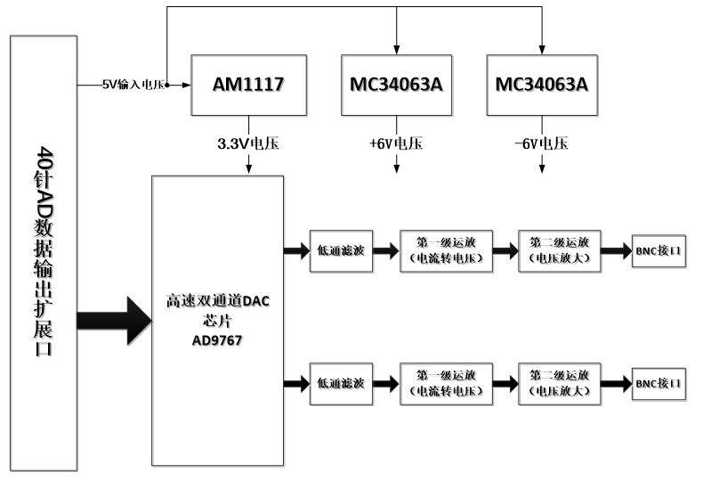

AD9767芯片简介
~~~~~~~~~~~~~~

`AD9767 <http://www.bdtic.com/ADI/AD9767.html>`__\ 是双端口、高速、双通道、14位CMOS DAC, 芯片集成两个高品质TxDAC+®内核、一个基准电压源和数字接口电路,采用48引脚小型LQFP封装。器件提供出色的交流和直流性能，同时支持最高125 MSPS的更新速率。\ `AD9767 <http://www.bdtic.com/ADI/AD9767.html>`__\ 的功能框图如下：

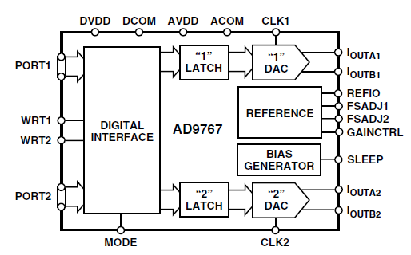
      
电流电压转换及放大
~~~~~~~~~~~~~~~~~~

AD9767的两路DA输出都为补码形式的电流输出IoutA和IoutB。当AD9767数字输入为满量程时（DAC的输入的14位数据都为高），IoutA输出满量程的电流输出20mA。IoutB输出的电流为0mA。具体的电流和DAC的数据的关系如下公式所示：

.. image:: images/24_media/image5.png
      
其中IoutFS=32 x Iref，在AN9767模块设计中,Iref的值由电阻R16的值决定，如果R16=19.2K，那Iref的值就是0.625mA。这样IoutFS的值就是20mA。

AD9767输出的电流通过第一级运放AD6045转换成-1V~+1V的电压。具体的转换电路如下图所示：

.. image:: images/24_media/image6.png
      
第一级运放转换后的-1V~+1V的电压通过第二级运放变换到更高幅度的电压信号，这个运放的幅度大小可以通过调整板上的可调电阻来改变。通过第二级运放，模拟信号的输出范围高达-5V~+5V。

.. image:: images/24_media/image7.png
      
下表为数字输入信号和各级运放输出后的电压对照表：

+----------------+----------------+----------------+------------------+
| **D            | **AD           | **第           | **               |
| AC数据输入值** | 9767电流输出** | 一级运放输出** | 第二级运放输出** |
+================+================+================+==================+
| 3              | +20mA          | -1V            | +5V              |
| fff(14位全高） |                |                |                  |
+----------------+----------------+----------------+------------------+
| 0(14位全低）   | -20mA          | +1V            | -5V              |
+----------------+----------------+----------------+------------------+
| 2000（中间值） | 0mA            | 0V             | 0V               |
+----------------+----------------+----------------+------------------+

.. _电流电压转换及放大-1:

电流电压转换及放大
~~~~~~~~~~~~~~~~~~

AD9767芯片的数字接口可以通过芯片的模式管脚(MODE)来配置成双端口模式(Dual)或者交叉(Interleaved)模式。在AN9767模块设计中，AD9767芯片是工作在双端口模式，双通道的DA数字输入接口是独立分开的。双端口模式(Dual)的数据时序图如下图所示：

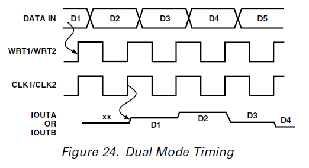
      
给AD9767芯片的DA数据通过时钟CLK和写信号WRT的上升沿输入到芯片进行DA转换。

程序设计
--------

例程中提供了AN9767模块的DA测试程序，通过AN9767模块来实现正弦波信号的输出。

正选波测试程序是通过读取FPGA内部的一个ROM中存储的正选波数据，然后把正选波的数据输出到AN9767模块进行数模的转换，从而得到正选波的模拟信号。正选波测试程序的示意图如下:

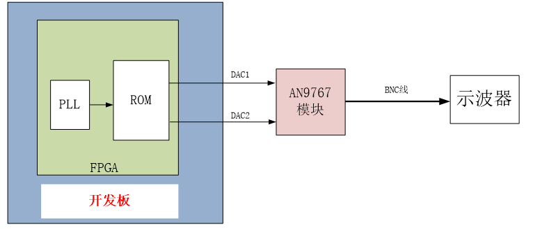

生成ROM初始化文件
~~~~~~~~~~~~~~~~~

程序中我们会用到一个ROM用于存储1024个14位的正弦波数据,首先我们需要准备ROM的初始化文件(如果是ALTERA开发板的话是mif文件，如果是Xilinx开发板的话是coe文件)。以下为生成正弦波ROM数据文件的方法：

在软件工具及驱动文件夹下找到工具，其图标如下所示：

.. image:: images/24_media/image10.png
      
1. 双击.exe打开工具，打开界面如下：

.. image:: images/24_media/image11.png
      
2. 可以根据需要自选波形，本例程中选择正弦波，数据长度1024，数据位宽14，其它默认：

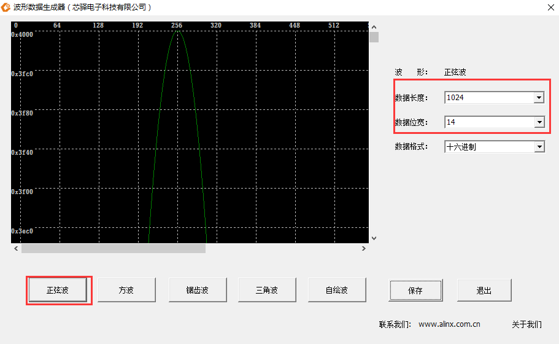
      
3. 点击保存按钮，将生成的数据文件保存到工程目录文件下（注意保存的文件类型）：

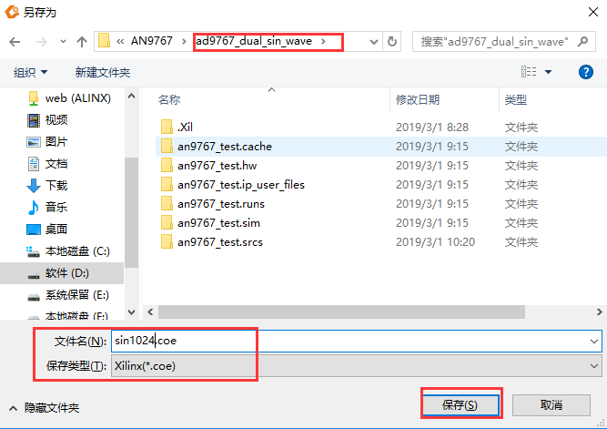
      
4. 保存后出现如下对话框表示保存成功，点击确定后关闭工具

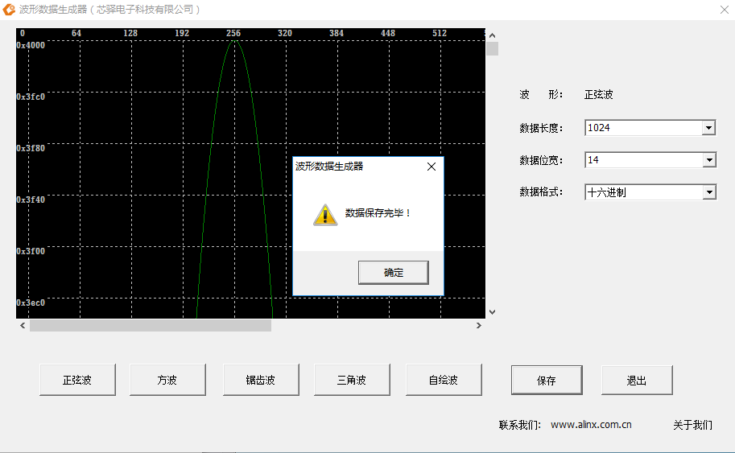
            
将 .coe文件保存到生成的Rom IP核中即可，在字符显示实验教程中已做介绍，这里不再重复。

双通道正弦波发生程序
~~~~~~~~~~~~~~~~~~~~~

.. code:: verilog

 `timescale 1ns / 1ps
 //////////////////////////////////////////////////////////////////////////////////
 //Two sine wave outputs -10V ~ +10V
 //////////////////////////////////////////////////////////////////////////////////
 module ad9767_test
 (
 input sys_clk,                //  input clock  50Mhz
 
 output da1_clk,             //AD9767 CH1 clock
 output da1_wrt,             //AD9767 CH1 enable
 output [13:0] da1_data,     //AD9767 CH1 data output
 
 output da2_clk,             //AD9767 CH2 clock
 output da2_wrt,             //AD9767 CH2 enable
 output [13:0] da2_data      //AD9767 CH2 data output
 
 );
 
 reg [9:0] rom_addr;
 
 wire [13:0] rom_data;
 wire clk_125M;
 
 
 assign da1_clk=clk_125M;
 assign da1_wrt=clk_125M;
 assign da1_data=rom_data;
 
 assign da2_clk=clk_125M;
 assign da2_wrt=clk_125M;
 assign da2_data=rom_data;
 
 
 //DA output sin waveform
 always @(negedge clk_125M)
 begin
  rom_addr <= rom_addr + 1'b1 ;              //The output sine wave frequency is 122Khz
  // rom_addr <= rom_addr + 4 ;              //The output sine wave frequency is 488Khz
  // rom_addr <= rom_addr + 128 ;            //The output sine wave frequency is 15.6Mhz                             
 end 
 
 
 
 ROM ROM_inst
 (
 .clka(clk_125M), // input clka
 .addra(rom_addr), // input [8 : 0] addra
 .douta(rom_data) // output [7 : 0] douta
 );
 
 
 PLL PLL_inst
 (// Clock in ports
 .clk_in1    (sys_clk        ),      // IN
 // Clock out ports
 .clk_out1   (               ),      // OUT
 .clk_out2   (clk_125M       ),     // OUT
 // Status and control signals
 .reset      (1'b0           ),      // IN
 .locked     (               )
 );      
 
 endmodule

程序中通过一个PLL IP来产生125M的DA输出时钟，然后就是循环读取存放在ROM中的1024个数据，并同时输出到通道1和通道2的DA数据线上。程序中可以通过地址的加1，加4,或者加128来选择输出不同的频率的正弦波。

实验现象
--------

将AN9767模块插入开发板的J11扩展口，用我们提供的BNC线连接AN9767的输出到示波器的输入如下图，然后开发板上电,下载程序就可以从示波器上观察从DA模块输出的模拟信号的波形了。

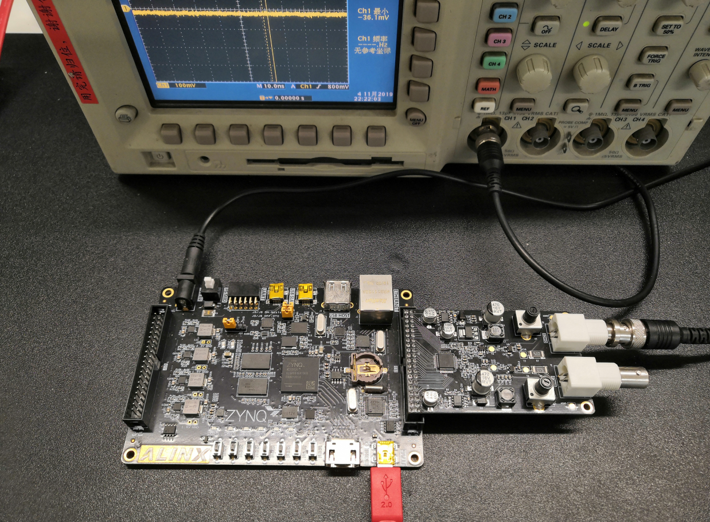
      
AN9767与AX7020/AX7010连接图

示波器上看到的正弦波如下：

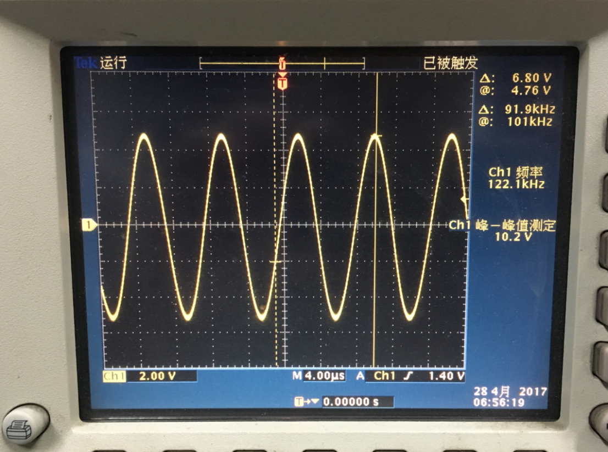
      
我们可以把程序中的地址修改成+4的方式，如下修改，这样一个正弦波的输出的点为256个，输出的正弦波的频率会提高4倍：

.. image:: images/24_media/image17.png
      
程序修改后，重新下载FPGA后，正弦波的频率变高，示波器显示的波形如下：

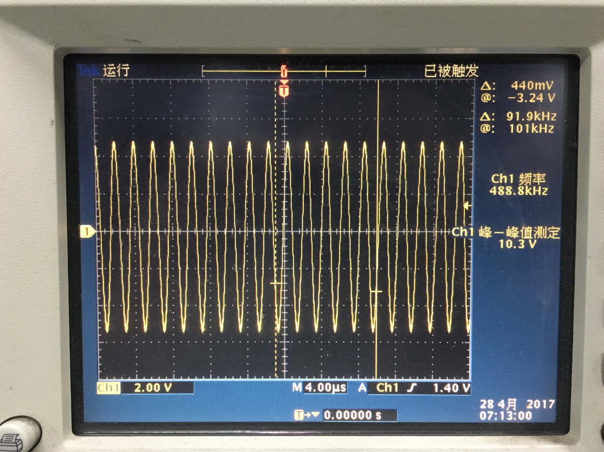
      
用户也可以通过调节AN9767模块上的可调电阻来改变2个通道输出波形的幅度。

.. image:: images/24_media/image19.png
      