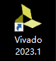
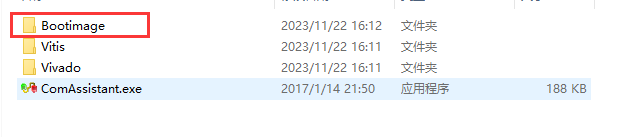
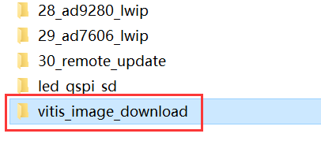
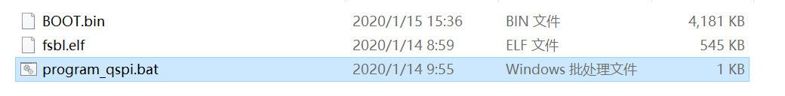
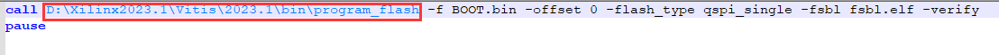

准备工程及注意事项
====================

软件环境
--------

软件开发环境基于Vivado 2023.1

         
硬件环境
--------

+---------------------------------+------------------------------------+
| 开发板型号                      | 芯片型号                           |
+=================================+====================================+
| AX7015                          | XCZ7015-2CLG485                    |
+---------------------------------+------------------------------------+
| AX7010                          | XCZ7010-1CLG400                    |
+---------------------------------+------------------------------------+
| AX7020                          | XCZ7020-2CLG400                    |
+---------------------------------+------------------------------------+
| AX7021                          | XC7Z020-2CLG484                    |
+---------------------------------+------------------------------------+

注意事项
--------

所有的工程目录下都有个bootimage文件夹，存放了对应的BOOT.bin文件，可将此文件拷贝到Vitis_image_download文件夹，覆盖原有的BOOT.bin。

      
vitis_image_download文件夹在course_s2_vitis目录下面，进入文件夹，右键点击program_qspi.bat，打开编辑

      

      
将program_flash路径改成自己的软件安装路径，保存并关闭。

      
双击program_qspi.bat，即可下载BOOT.BIN到QSPI FLASH，建议用JTAG模式下载。

.. image:: images/000_media/image6.png
      
也可以采用SD卡启动方法，把BOOT.bin文件拷贝到SD内启动。
