PS定时器中断实验
==================

**实验Vivado工程为“ps_timer”(基于”ps_hello”工程另存为)。**

很多SOC内部都会有定时器，ZYNQ的PS也有，对于ZYNQ内到底有什么外设，这些外设有什么特性，都是开发者必须关心的，因此建议经常阅读xilinx文档UG585。本章的实验用的是CPU Private Timer，即私有定时器。

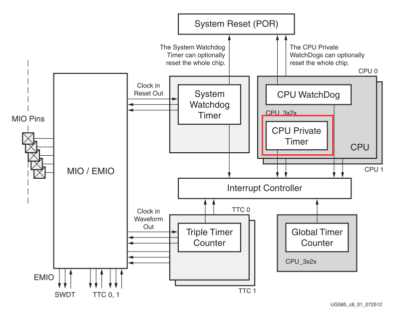
      
ZYNQ定时器结构图

打开工程“ps_hello”，另存为一个名为”ps_timer”的工程

中断介绍
--------

翻开UG585中断部分，Zynq中断大致可分为三个部分，1为SGI，软件生成的中断，共16个端口；2为PPI，CPU私有外设中断，有5个；3为SPI，共享外设中断，来自于44个PS端的IO外设以及16个PL端的中断。中间部分为GIC，也即中断控制器，用于对中断进行使能、关闭、掩码、设置优先等。

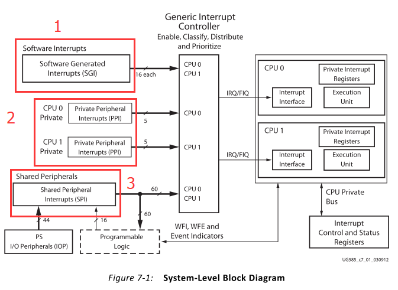
      
以下为中断控制器框图，主要的控制器部分为ICC和ICD，ICD连接SGI和PPI，ICD连接SPI，可配置两者的寄存器来控制中断。

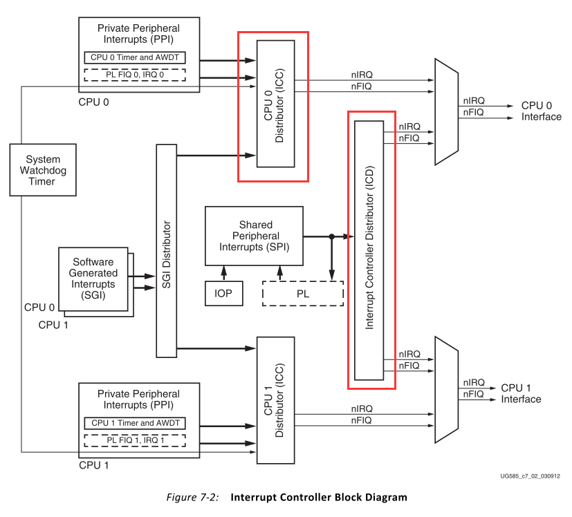
      
SGI中断（软件产生中断），共16个IRQ ID号

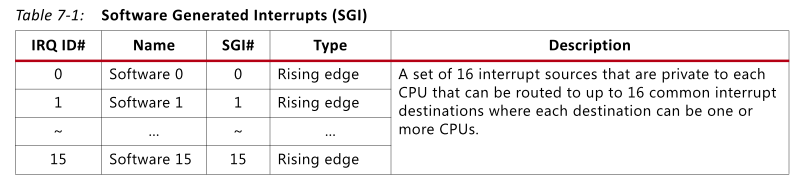
      
PPI中断，CPU私有中断，共5个IRQ ID号

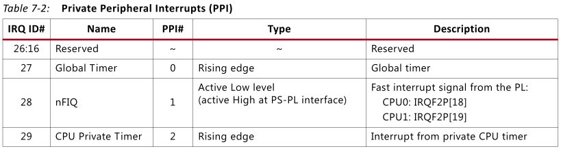
      
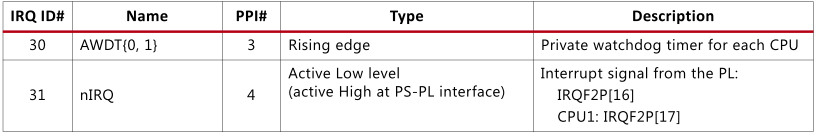
      
SPI中断部分，共60个IRQ ID号

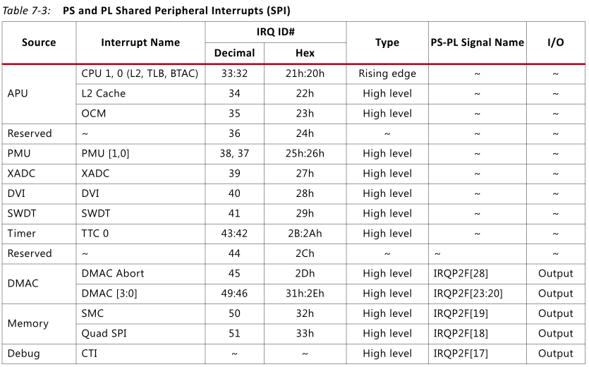
      
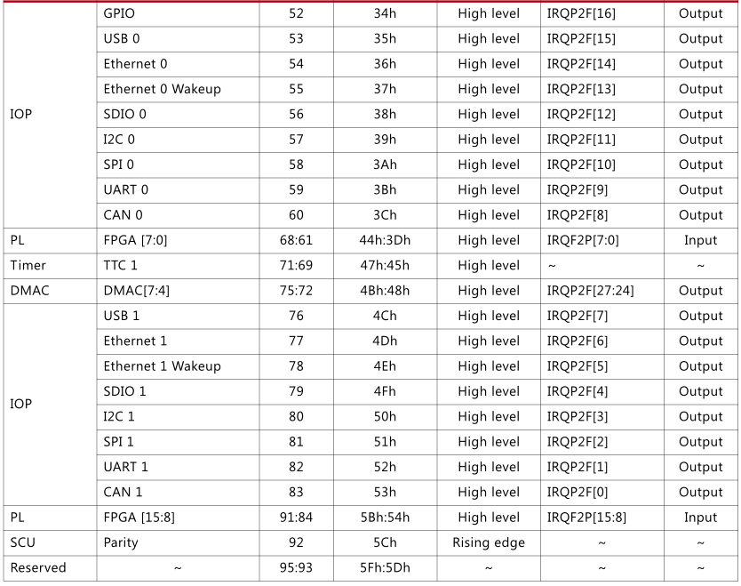
      
中断寄存器介绍
--------------

用Xilinx的API函数就可以很好的控制中断，如果有兴趣可以深入了解中断寄存器，可以对其机制有更好的认识。

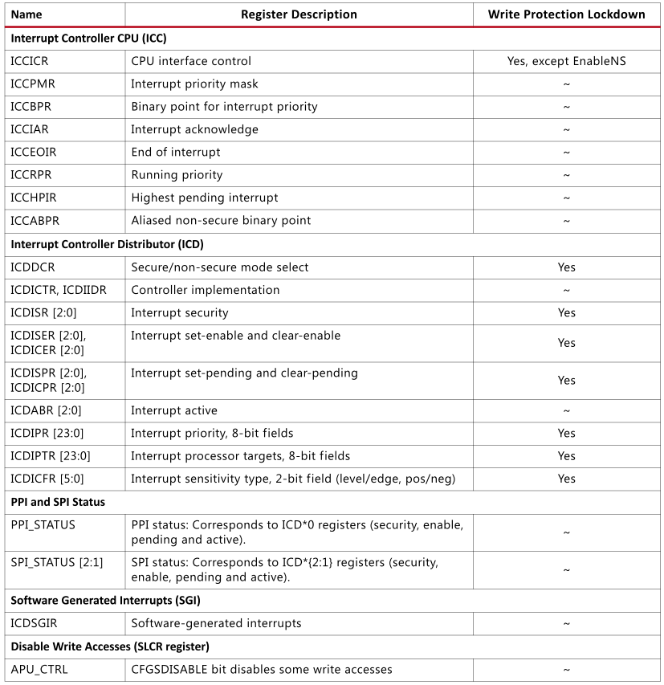
      
ICDICFR:
配置寄存器，用于配置触发方式，电平触发或边沿触发，共有6个，每个寄存器32位，每两位表示一个中断，32*6/2=96个中断号，能覆盖所有中断。

ICDICFR0: IRQ ID#0~#15

ICDICFR1: IRQ ID#16~#31

ICDICFR2: IRQ ID#32~#47

ICDICFR3: IRQ ID#48~#63

ICDICFR4: IRQ ID#64~#79

ICDICFR5: IRQ ID#80~#95

对于SPI中断 0b01：高电平触发 0b11：上升沿触发

ICDIPR:
中断优先级寄存器，设置优先级，共24个寄存器，每8位代表一个中断号，共96个中断号。

ICDIPTR: CPU选择寄存器，24个寄存器，每8位代表一个中断号，共96个

0bxxxxxxx1: CPU interface 0

0bxxxxxx1x: CPU interface 1

ICDICER: 中断关闭寄存器，3个寄存器，每1位代表一个中断号，共96个

ICDISER: 中断使能寄存器，3个寄存器，每1位代表一个中断号，共96个

关于其余的寄存器，大家可以研究UG585的寄存器表中的mpcore部分。

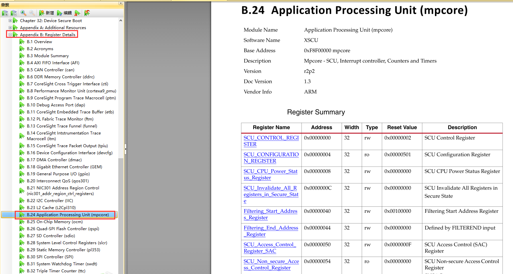
      
软件工程师工作内容
------------------

以下为软件工程师负责内容。

Vitis程序编写
-------------

创建Platform工程
~~~~~~~~~~~~~~~~

1) 点击ToolsLaunch Vitis

.. image:: images/02_media/image11.png
      
2) 与前面的Hello World实验不同，我们只建立Platform工程

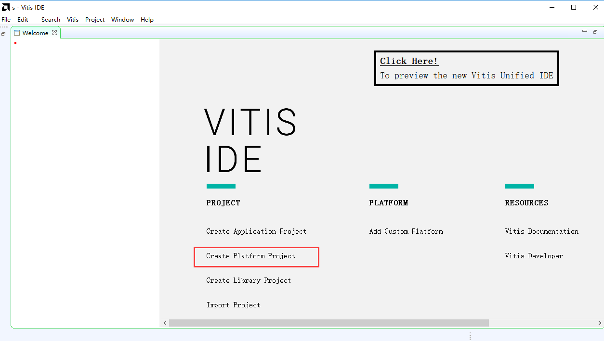
         
3) 填入工程名字，点击Next

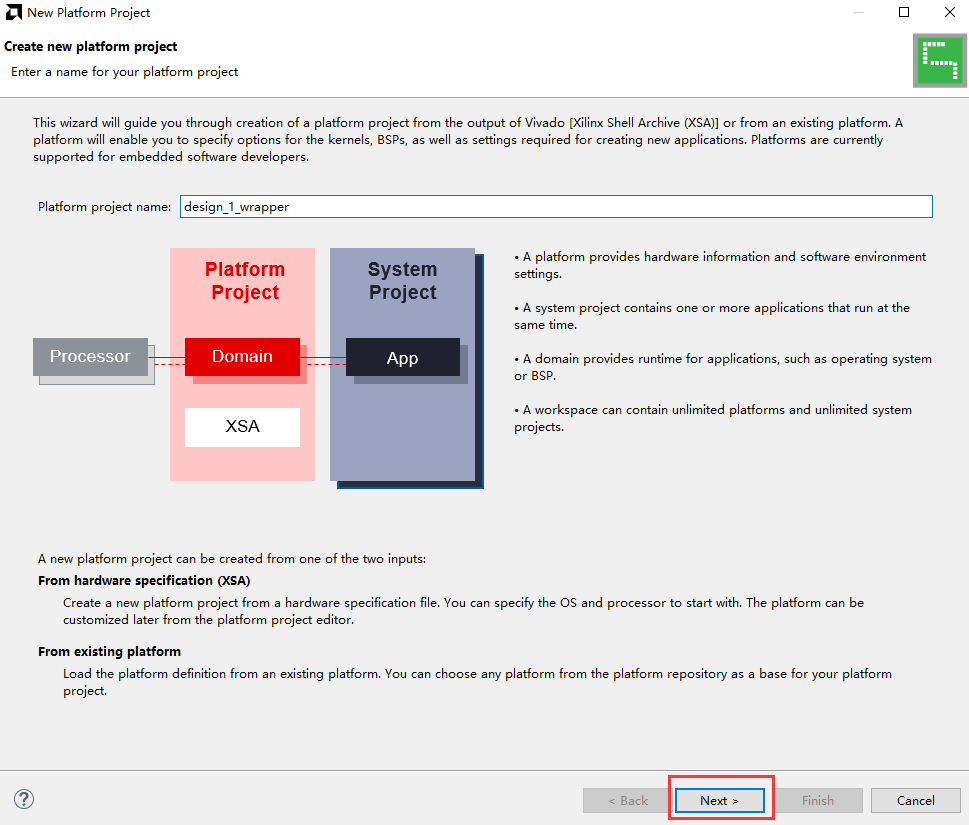
         
4) 点击“Create a new platform hardware(XSA)，软件已经提供了一些板卡的硬件平台，但对于

5) 我们自己的硬件平台，可以选择browse

.. image:: images/02_media/image14.png
         
6) 选择XSA文件

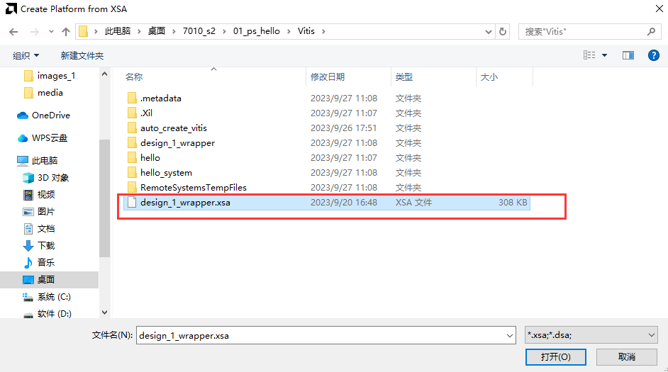
         
保持默认，点击Finish

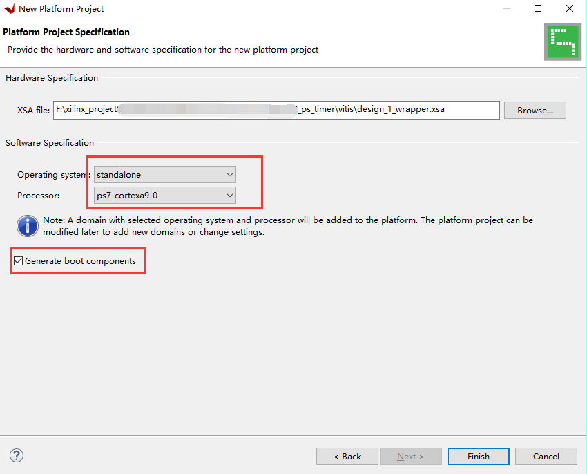
      
7) 点开platform.spr，并点开BSP

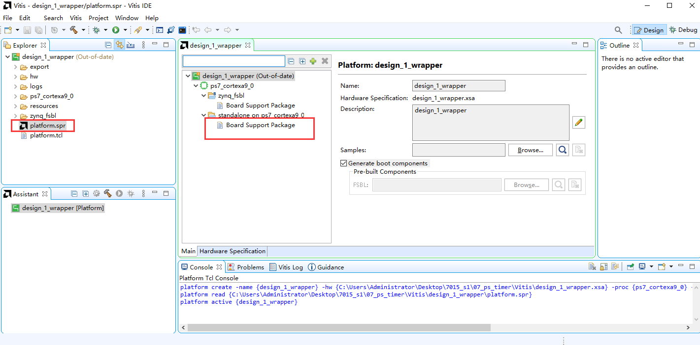
      
8) 找到定时器驱动，并点击Import Examples

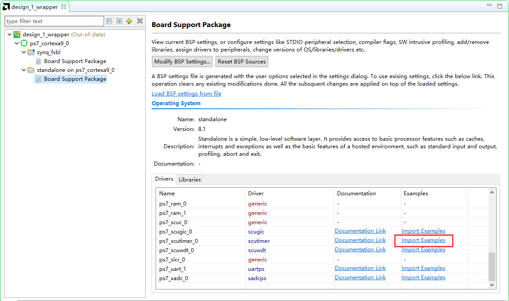
      
9) 非常幸运，有一个定时器中断的例子，怎么就知道这个例子就是中断的例子呢？是通过“intr”猜测的，所以，基本功很重要，不然你连找例程都不会。

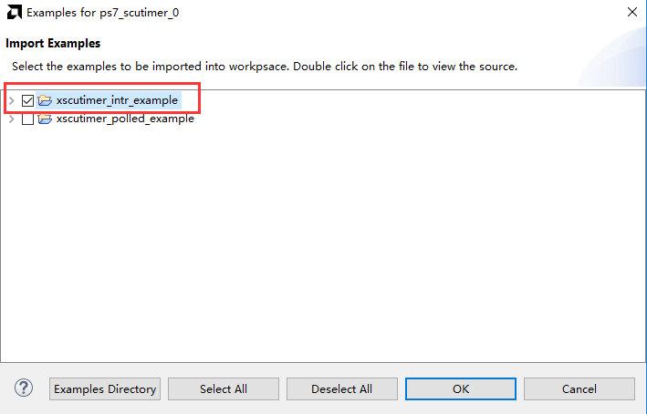
      
10) 在这里就导入了example工程

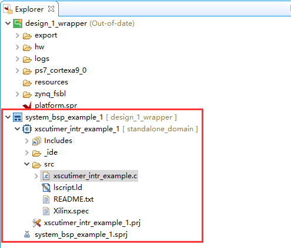
      
下面就是阅读代码，然后修改代码了，当然，可能一下不能完全理解这些代码，只能在以后的应用中去反复练习

11) 本实验设计一个1秒定时器中断一次，然后打印出信息，30秒后结束。在UG585文档中我们得知，定时器的时钟频率为CPU频率的一半，首先要修改计数器最大值，修改为CPU频率的一半，也就是计数器的时钟频率值，这样就会1秒中断一次

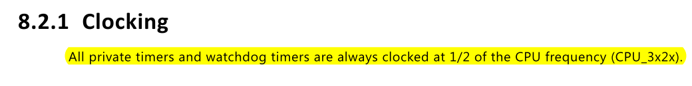
      
.. image:: images/02_media/image22.png
      
CPU频率的宏定义可以在xparameters.h中找到

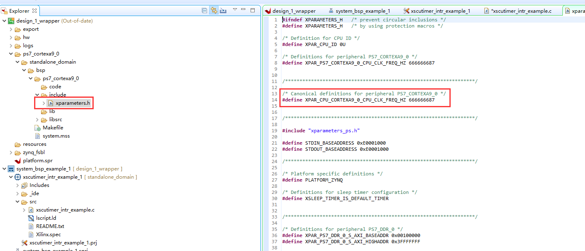
      
12) 修改计数次数3改为30

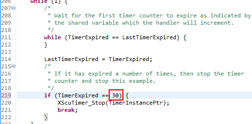
      
13) 添加打印信息，保存文件

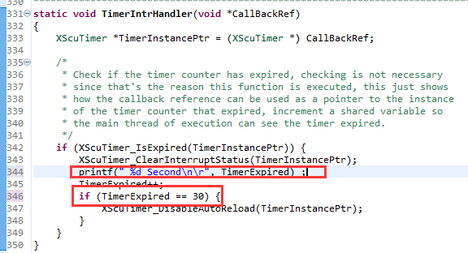
      
14) Build Project编译

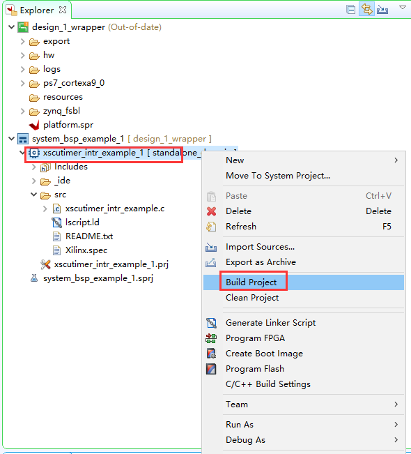
      
15) 了解一下中断控制器的使用，主要分为几个步骤，初始化中断控制器\ *GIC初始化中断异常中断服务函数注册在中断控制器中使能中断使能外设中断使能中断异常*\ 。有两步需要注意，\ *在中断控制器中使能中断*
是要根据中断号使能相应的中断，比如本章介绍的Timer为私有定时器，中断号为29，是在中断控制器GIC中的操作，而后面的\ *使能外设中断*
是指在外设中打开它的中断，正常情况下是不打开的，打开之后就可以产生中断传递到中断控制器GIC。在以后的实验中可以借鉴这种写法。

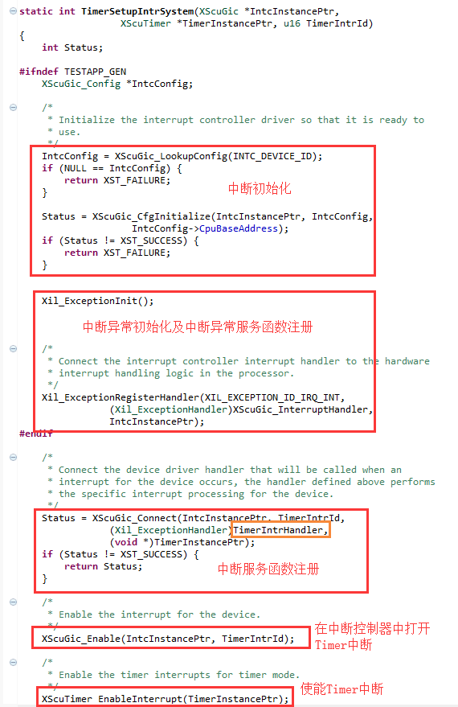
      
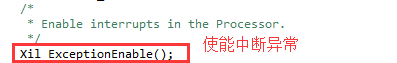
      
下载调试
--------

1) 打开PuTTY串口终端

2) 下载调试程序的方法前面教程已经讲解，不再复述

3) 和我们预期一样，串口每秒会输出一句信息

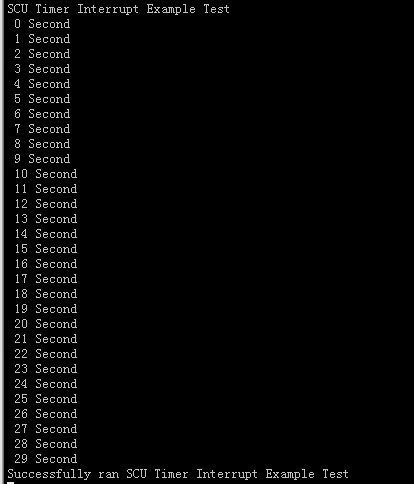
      
实验总结
--------

实验中通过简单的修改Vitis的例程，就完成了定时器，中断的应用，看似简单的操作，可蕴含了丰富的知识，我们需要非常了解定时器的原理、中断的原理，这些基本知识是学习好ZYNQ的必要条件。
