PS端EMIO的使用
================

**实验Vivado工程为“ps_emio”。**

前面介绍了PS端点亮LED灯的实验，但是如果想用PS点亮PL的LED灯，该如何做呢？一是可以通过EMIO控制PL端LED灯，二是通过AXI
GPIO的IP实现控制。本章介绍如何使用EMIO控制PL端LED灯的亮灭。同时也介绍了，利用EMIO连接PL端按键控制PL端LED灯。

原理介绍
--------

前面介绍了PS端MIO的结构如下，从图中可知BANK0和BANK1的MIO有54个。BANK2和BANK3的EMIO有64个，本章就是采用EMIO控制PL端LED。

.. image:: images/04_media/image1.png
      
FPGA工程师工作内容
------------------

以下为FPGA工程师负责内容。

Vivado工程建立
--------------

1. 以ps_hello工程为基础，另存为一个名为ps_emio的工程，打开ZYNQ配置，把GPIO EMIO勾选上。

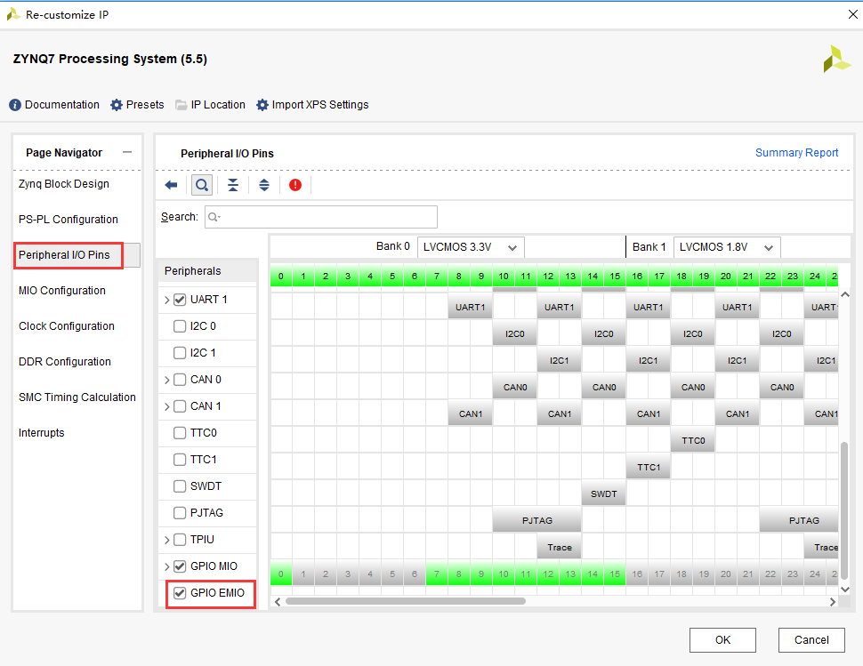
      
2. 在MIO配置中选择EMIO的位宽为5位，因为PL端的LED有四个，使用PL端的一个按键。配置结束，点击OK。

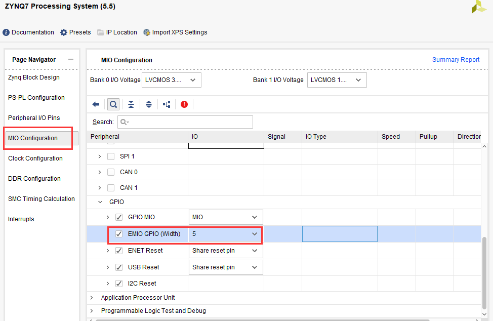
      
3. 点击多出的GPIO_0端口右键选择Make External，将端口信号导出

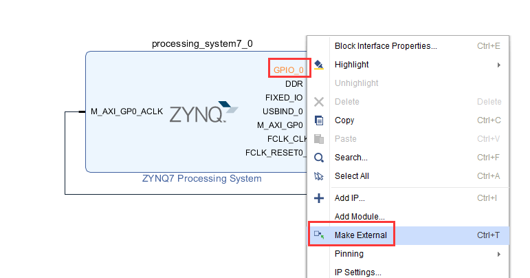
      
4. 修改引脚名称为emio

.. image:: images/04_media/image5.png
      
修改结果，并保存设计

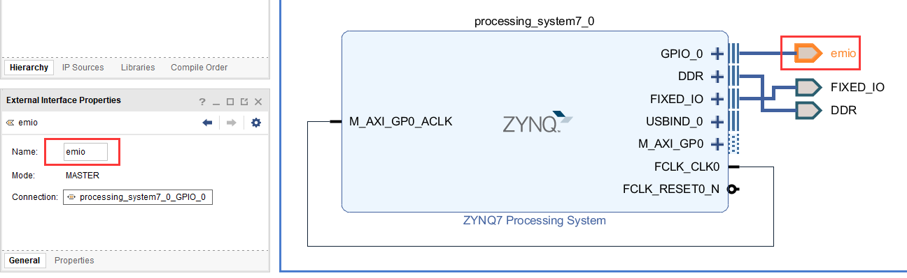
      
5. 点击xx.bd右键选择Generate Output Products，重新生成输出文件

.. image:: images/04_media/image7.png
      
6. 结束后，顶层文件会更新出新的管脚，下面需要对其进行引脚绑定

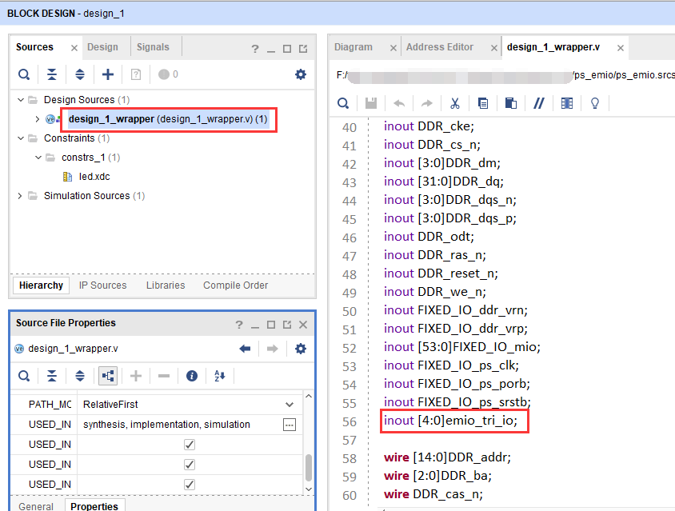
      
XDC文件约束PL管脚
-----------------

7. 新建XDC文件，绑定PL端引脚

.. image:: images/04_media/image9.png
      
设置文件名称为emio

.. image:: images/04_media/image10.png
      
8. emio.xdc添加一下内容，端口名称一定要和顶层文件端口一致

::
   
 set_property IOSTANDARD LVCMOS33 [get_ports {emio_tri_io[*]}]
 #pl led
 set_property PACKAGE_PIN M14 [get_ports {emio_tri_io[0]}]
 set_property PACKAGE_PIN M15 [get_ports {emio_tri_io[1]}]
 set_property PACKAGE_PIN K16 [get_ports {emio_tri_io[2]}]
 set_property PACKAGE_PIN J16 [get_ports {emio_tri_io[3]}]
 #pl key
 set_property PACKAGE_PIN N15 [get_ports {emio_tri_io[4]}]

1. 生成bit文件

.. image:: images/04_media/image11.png
      
10. 导出硬件，因为要用到PL，所以选择“Include bitstream”，点击“OK”

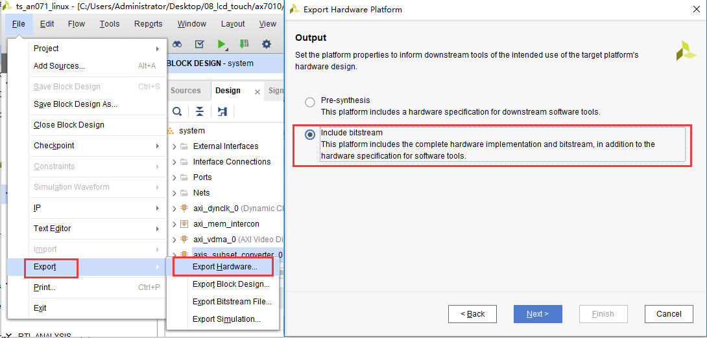
         
软件工程师工作内容
------------------

以下为软件工程师负责内容。

Vitis程序编写
-------------

EMIO点亮PL端LED灯
~~~~~~~~~~~~~~~~~

1. 进入Vitis软件，新建名为emio_led的工程

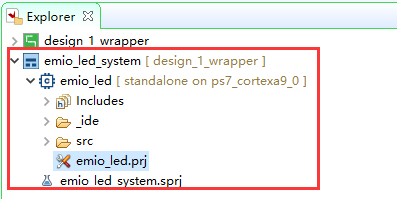
      
2. 代码部分与PS端MIO操作点亮LED类似，由于MIO的编号是0~53，因此EMIO的编号是从54开始的，只要做以下修改即可

.. image:: images/04_media/image14.png
      
3. 下载配置

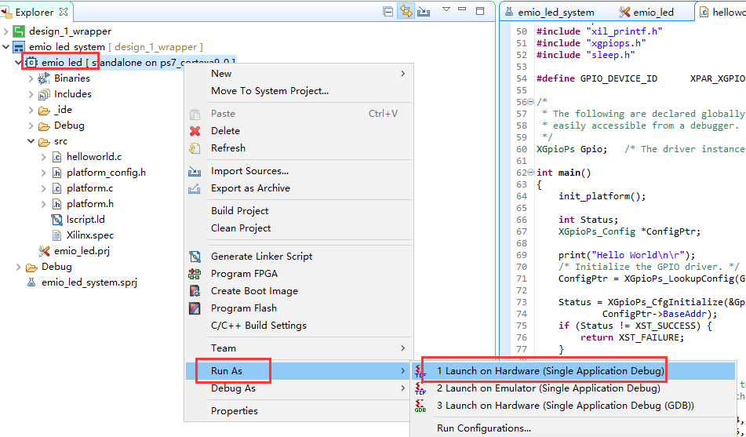
      
即可看到PL端LED闪烁。

EMIO实现PL端按键中断
~~~~~~~~~~~~~~~~~~~~

通过PL端的按键控制PL端LED灯的亮灭

1) 新建名为emio_key的工程，模板为hello world，拷贝例程的程序，保存并编译

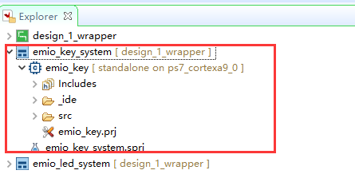
      
1. 由PS端MIO的使用的MIO按键中断程序移植过来，并修改按键的编号为58，LED灯编号为54，保存重新生成elf。

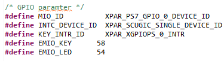
      
2. 下载程序

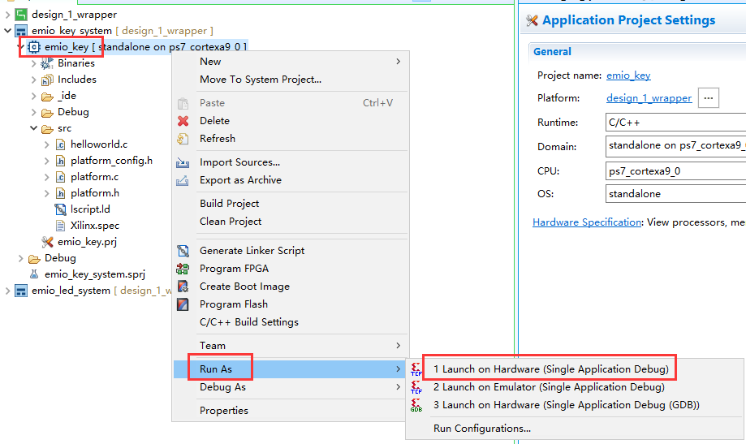
      
1. 观察实验现象，按下PL端按键，就可以控制PL端LED的亮灭。

..

   AX7020/AX7010开发板丝印为PL KEY1；

   PL端LED灯位置： AX7020/AX7010开发板丝印为PL LED1;

固化程序
--------

前面介绍过没有FPGA加载文件情况下如何生成固化程序（详情参考“体验ARM，裸机输出”Hello World”一章）。本章内容生成了FPGA的加载文件，在这里演示一下如何生成固化程序。

与前面一样，也是点击system，右键Build Project即可

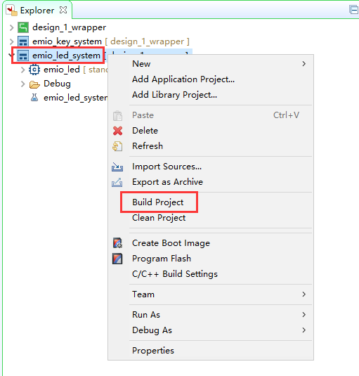
      
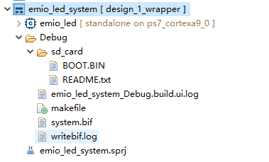
      
软件会自动添加三个文件，第一个引导程序fsbl.elf，第二个为FPGA的bitstream，第三个为应用程序xx.elf，下载方法与前面一样，不再赘述。

引脚绑定常见错误
----------------

1. 在block design设计中，比如下图，GPIO模块的引脚名设置为了leds和keys，很多人想当然的在XDC里按照这样的名称绑定引脚。

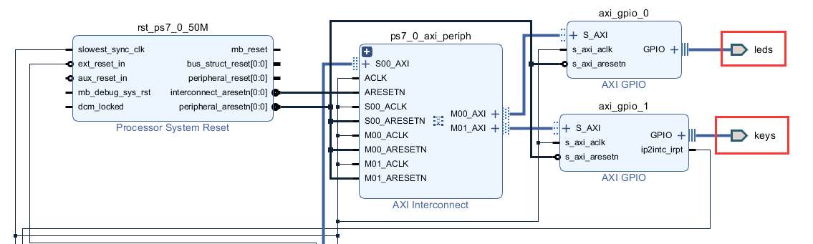
            
如果打开顶层文件就会发现引脚名称是不一样的，一定要仔细检查，以顶层文件里的引脚名称为

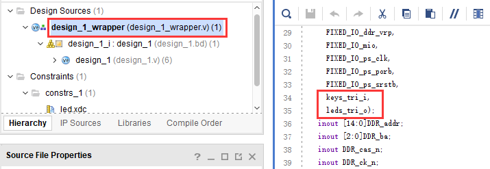
            
否则就会出现以下引脚未绑定的

.. image:: images/04_media/image23.png
            
2. 如果是手写XDC文件，切记注意空格，这也是非常常见的错误

.. image:: images/04_media/image24.png
            
本章小节
--------

本章进一步学习了PS端的EMIO的使用，虽然将EMIO连接到了PL端的引脚上，但Vitis中的用法还是一样的，从这个例子我们也可以看出，一旦与PL端发生了联系，就需要生成bitstream，虽然几乎没有产生逻辑。
