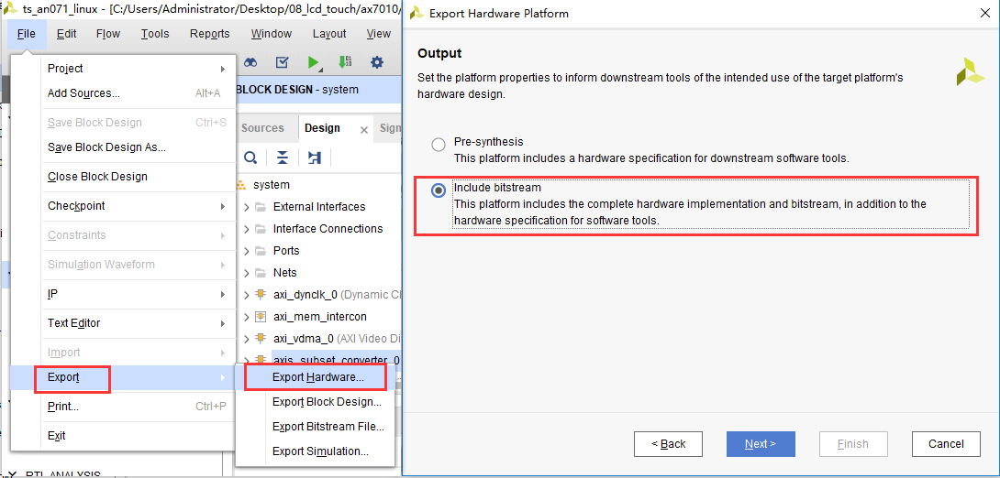
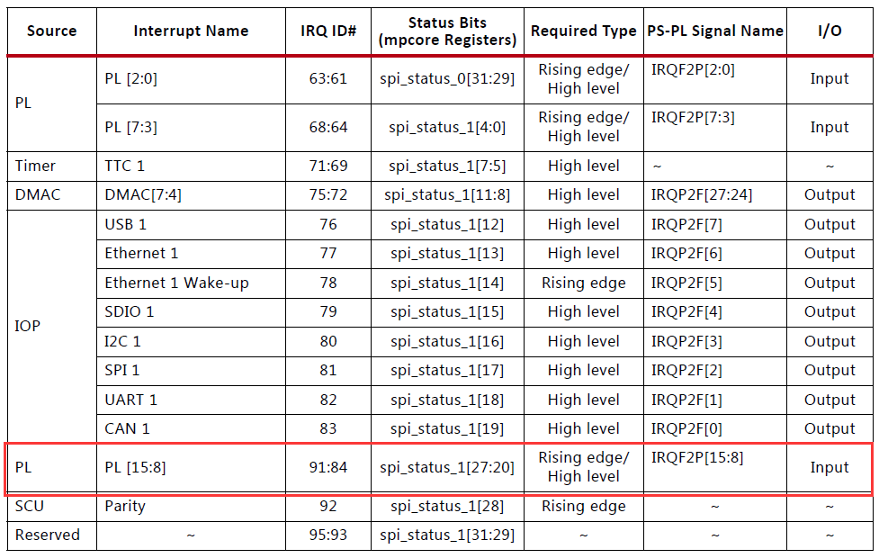
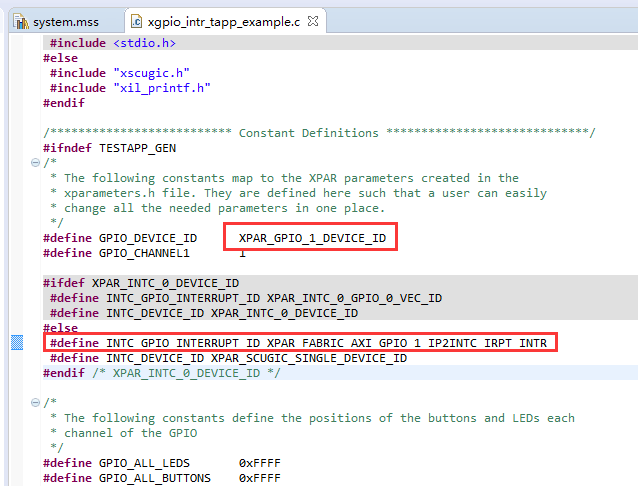
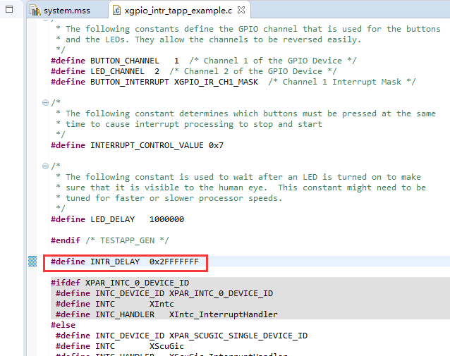

PL端AXI GPIO的使用
====================

**实验Vivado工程为“ps_axi_gpio”。**

可能有些人就会问，怎么又在讲GPIO，LED灯，觉得太繁琐，但是GPIO是ZYNQ的基本操作，本教程力求把各种方法分享给大家，PS端的MIO，EMIO，PL端的axi gpio，包括输入输出两个方向，以及PS与PL的基本操作，所以还是希望大家耐心学习。

前面讲过如何用的是PS端的EMIO点亮PL端LED灯，但是并没有与PL端产生交互。本章介绍另外一种控制方法，在ZYNQ当中可以使用AXI GPIO，通过AXI总线控制PL端的LED灯。同时也介绍了PL端按键的使用。

使用zynq最大的疑问就是如何把PS和PL结合起来使用，在其他的SOC芯片中一般都会有GPIO，本实验使用一个AXI GPIO的IP核，让PS端通过AXI总线控制PL端的LED灯，实验虽然简单，不过可以让我们了解PL和PS是如何结合的。

原理介绍
--------

一个AXI GPIO模块有两个GPIO，分别是GPIO和GPIO2，也就是channel1和channel2，为双向IO。

.. image:: images/05_media/image1.png
      
AXI GPIO结构

FPGA工程师工作内容
------------------

以下为FPGA工程师负责内容。

Vivado工程建立
--------------

1) 打开“ps_hello”另存为一个名为“ps_axi_gpio”Vivado工程，表示PS通过AXI总线控制gpio

      
.. image:: images/05_media/image3.png
      
2) 双击xx.bd打开block design

.. image:: images/05_media/image4.png
      
添加AXI GPIO
~~~~~~~~~~~~

3) 添加一个AXI GPIO的IP 核

      
4) 双击刚才添加的“axi_gpio_0”配置参数

.. image:: images/05_media/image6.png
      
5) 选择“All Outputs”，因为这里控制LED，只要输出就可以了，“GPIO Width”填4，控制4颗LED，点击OK。如果想使用channel2，需要把”Enable Dual Channel”打开，也就使能了GPIO2。

      
6) 点击“Run Connection Automation”，可以完成部分自动连线

.. image:: images/05_media/image8.png
      
7) 选择要自动连接的端口，这里全选，点击OK

      
8) 点击“Optimize Routing”，可以优化布局，同时可以看到多了两个模块，一个是Processor System Reset模块，为同步复位模块，提供同一时钟域的复位信号。AXI Interconnect模块为AXI总线互联模块，用于AXI模块的交叉互联。

.. image:: images/05_media/image10.png
      
在这个应用中，我们可以看到用到了ZYNQ的GP口，M_AXI_GP0，M代表的是master，此接口用于访问PL端数据，大部分应用中是为了配置PL端模块的寄存器。

.. image:: images/05_media/image11.png
      
复位信号由ZYNQ的复位输出提供，最好是每个时钟域都加一个复位模块，可以根据模块下面的名称搜索添加。

.. image:: images/05_media/image12.png
      
9) 修改GPIO端口的名称

.. image:: images/05_media/image13.png
      
10) 名称修改为leds

      
11) 再添加一个AXI GPIO，连接PL端按键

      
12) 配置GPIO参数，都为输入，宽度为1，使能中断

.. image:: images/05_media/image16.png
      
13) 使用自动连接

.. image:: images/05_media/image17.png
      
14) 再把端口名称改为keys

.. image:: images/05_media/image18.png
      
15) 由于是PL端过来的中断，在这里需要配置ZYNQ处理器的中断，勾选IRQ_F2P

.. image:: images/05_media/image19.png
      
16) 连接ip2intc_irpt到IRQ_F2P

.. image:: images/05_media/image20.png
      
17) 保存设计，点击xx.bd，右键Generate Output Products

      
18) 在生成的Verilog文件中，可以看到有个“leds_tri_o”和”keys_tri_i”的端口，要为他们分配管脚，在绑定引脚时，以这个文件里的引脚名称为准。

      
XDC文件约束PL管脚
-----------------

1. 创建一个新的xdc约束文件

.. image:: images/05_media/image23.png
      
2. 文件名称为led

      
3. led.xdc添加一下内容，端口名称一定要和顶层文件端口一致

::

 set_property IOSTANDARD LVCMOS33 [get_ports {leds_tri_o[3]}]
 set_property IOSTANDARD LVCMOS33 [get_ports {leds_tri_o[2]}]
 set_property IOSTANDARD LVCMOS33 [get_ports {leds_tri_o[1]}]
 set_property IOSTANDARD LVCMOS33 [get_ports {leds_tri_o[0]}]
 set_property PACKAGE_PIN M14 [get_ports {leds_tri_o[0]}]
 set_property PACKAGE_PIN M15 [get_ports {leds_tri_o[1]}]
 set_property PACKAGE_PIN K16 [get_ports {leds_tri_o[2]}]
 set_property PACKAGE_PIN J16 [get_ports {leds_tri_o[3]}]
 
 set_property IOSTANDARD LVCMOS33 [get_ports {keys_tri_i[0]}]
 set_property PACKAGE_PIN N15 [get_ports {keys_tri_i[0]}]

1. 生成bit文件

.. image:: images/05_media/image25.png
      
5. 导出硬件FileExportExport Hardware

         
6. 因为要用到PL，所以选择“Include bitstream”，点击“OK”

软件工程师工作内容
------------------

以下为软件工程师负责内容。

Vitis程序编写
-------------

AXI GPIO点亮PL端LED灯
~~~~~~~~~~~~~~~~~~~~~

1) 创建一个platform，创建过程参考“PS定时器中断实验”一章

      
2) 面对一个不熟悉AXI GPIO，我们如何控制呢？我们可以尝试一下Vitis自带的例程

3) 双击“platform.spr的BSP”,找到“axi_gpio_0”,这里可以点击“Documentation”来看相关文档，这里就不演示，点击“Import Examples”

      
4) 在弹出的对话框中有多个例程，从名称中可以猜个大概，这里选第一个“xgpio_example”

.. image:: images/05_media/image29.png
      
5) 可以看到例程比较简单，短短几行代码，完成了AXI GPIO的操作

      
里面用到很多GPIO相关的API函数，通过文档可以了解详细，也可以选中该函数，按“F3”查看具体定义。如果有了这些信息你还不能理解如何使用AXI GPIO，说明你需要补充C语言基础。

其实这些函数都是在操作GPIO的寄存器，AXI GPIO的寄存器也不多，主要是两个channel的数据寄存器GPIO_DATA和GPIO2_DATA，两个channel的方向控制GPIO_TRI和GPIO2_TRI，以及全局中断使能寄存器GIER，IP的中断使能IP
IER和中断状态寄存器ISR，具体的功能可以看AXI GPIO的文档pg144。

.. image:: images/05_media/image31.png
      
比如进入到设置GPIO方向的函数中，就可以看到是在向GPIO的GPIO_TRI寄存器写数据，从而控制方向。

.. image:: images/05_media/image32.png
      
其他的函数也可以按此法自行研究。

下载调试
~~~~~~~~

1) 首先编译APP工程，编译方法前面的例程已经介绍过了。虽然Vitis可以提供一些例程，但有一部分例程是需要自己修改的，这个简单的LED例程就不修改了，尝试运行一下，发现不能达到预期效果，甚至提示一些错误。下载后可以看到开发板PL
   LED1快速闪烁。

.. image:: images/05_media/image33.png
      
2) 修改代码让4个LED灯都闪烁

.. image:: images/05_media/image34.png
      
寄存器方式实现
~~~~~~~~~~~~~~

如果觉得Xilinx提供的API函数比较繁琐，效率低，也可以采取操作寄存器的方式实现LED的控制。

比如下面我们新建了axi_led的工程，修改helloworld.c如下。

      

      
其中定义的基地址GPIO_BASEADDR可以在xx.xsa中里找到

.. image:: images/05_media/image37.png
      
由于我们只启用了channel1，因此定义了下面的寄存器地址

      
这样直接操作寄存器的方式效率会比调用Xilinx API函数高，而且更直观，对于理解程序如何运行有很大帮助。但是对于大工程来讲，这种方式使用起来就比较复杂，主要依据个人需求选择。

AXI GPIO之PL端按键中断
~~~~~~~~~~~~~~~~~~~~~~

前面的定时器中断实验的中断属于PS内部的中断，本实验中断来自PL，PS最大可以接收16个来自PL的中断信号，都是上升沿或高电平触发。

      
1) 和前面的教程一样，在不熟悉Vitis程序编写的情况下，我们尽量使用Vitis自带例程来修改，选择“xgpio_intr_tapp_example”

      
2) 导入例程以后有未定义的错误，我们需要修改部分代码，可以回到vivado工程看到按键的axi gpio模块叫做axi_gpio_1，以及它的偏移地址

.. image:: images/05_media/image41.png
      
因此就可以在xparameters.h中找到它的device id

      

      

      
3) 然后可以修改GPIO和中断号的宏定义如下

      
4) 修改测试延时时间，让我们有足够的时间去按按键

      
.. _下载调试-1:

下载调试
~~~~~~~~

1) 保存文件，编译工程，打开串口终端，下载程序。如果一直不按按键，串口显示“No button pressed.”，如果按下“PL KEY1”按键显示“Successfully ran Gpio Interrupt Tapp Example”。

      
实验总结
--------

通过实验我们了解到PS可以通过AXI总线控制PL，但几乎没有体现出ZYNQ的优势，因为对于控制LED灯，无论是ARM还是FPGA，都可以轻松完成，但是如果把LED换成串口呢，控制100路串口通信，8路以太网等应用，我想还没有哪个SOC能完成这种功能，只有ZYNQ可以，这就是ZYNQ和普通SOC的不同之处。

PL端可以给PS发送中断信号，这提高了PL和PS数据交互的效率，在需要大数量、低延时的应用中需要用到中断处理。

到本章结束已经把ZYNQ的PS端MIO、EMIO，PL端GPIO如何使用讲完了，包括输入和输出以及中断处理，这些都是最基础的操作，大家还是要多多思考，理解清楚。

知识点分享
----------

1) 在设计好后，可以看到Address Editor中，已经为AXI外设分配好了地址空间，其中偏移地址和空间大小是可以修改的。

.. image:: images/05_media/image48.png
      
但是修改偏移地址是有限制的，详情参考UG585文档System Address一章，AXI外设连接到了M_AXI_GP0口， 在4000_0000到7FFF_FFFF地址空间内修改。

.. image:: images/05_media/image49.png
      
2) 在使用一个模块时，需要配套的文档辅助开发，但是这些文档该如何去找呢，例如XILINX的IP，打开模块的配置，在左上角点击Documentation，再点击Product Guide，如果在安装Vivado的时候安装了DocNav，就会跳转过去打开文档。

.. image:: images/05_media/image50.png
      
.. image:: images/05_media/image51.png
      

      
此功能需要电脑联网，DocNav会从网站加载文档。可以点击下载按钮下载到本地。

还有一种方法是在Xilinx官网根据模块的名称搜索资料下载（页面可能会有所变化）

.. image:: images/05_media/image53.png
      