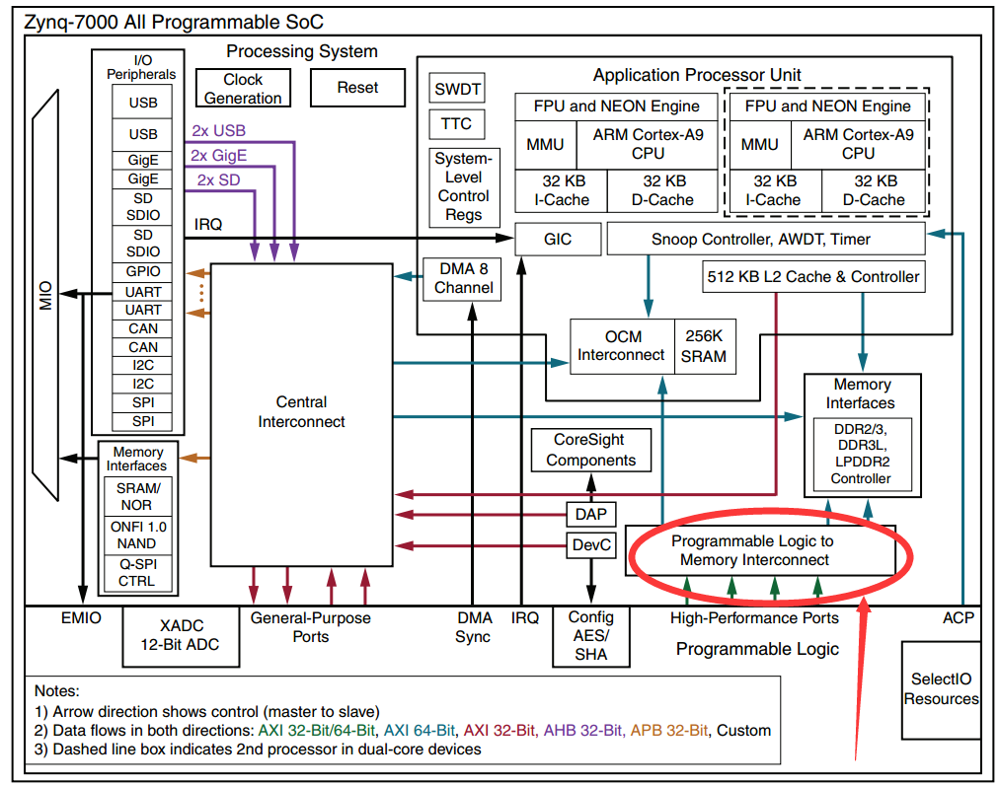

PL读写PS端DDR数据
===================

**实验Vivado工程为“pl_read_write_ps_ddr”。**

PL和PS的高效交互是zynq 7000
soc开发的重中之重，我们常常需要将PL端的大量数据实时送到PS端处理，或者将PS端处理结果实时送到PL端处理，常规我们会想到使用DMA的方式来进行，但是各种协议非常麻烦，灵活性也比较差，本节课程讲解如何直接通过AXI总线来读写PS端ddr的数据，这里面涉及到AXI4协议，vivado的FPGA调试等。

ZYNQ的HP端口使用
----------------

zynq 7000 SOC的HP口是 High-Performance Ports的缩写，如下图所示，一共有4个HP口，HP口是AXI Slave设备，我们可以通过这4个HP接口实现高带宽的数据交互。

         
以”ps_hello”工程为基础，另存为一个工程

1. 在vivado的界面中HP的配置如下图(HP0~HP3)，这里面有使能控制，数据位宽选择，可选择32或64bit的位宽。把M AXI GP0接口取消，在本实验中不需要。

      
我们的实验启用HP0配置为64bit位宽，使用的时钟是150Mhz，HP的带宽是150Mhz \* 64bit，对于视频处理，ADC数据采集等应用都有足够的带宽。

      
2. 如下图所示，配置完HP端口以后，zynq会多出一个AXI Slave端口，名称为S_AXI_HP0，不过这些端口都是AXI3标准的，我们常用的是AXI4协议，这里添加1个AXI Interconnect IP，用于协议转换（AXI3<->AXI4）。

      
3. 将FCLK_CLK0时钟和S00_AXI导出，并修改名称

      
4. 在空白处右键选择Create Port，添加一个时钟输入接口

      

      
5. 添加一个复位模块，并连接时钟如下

      
6. 单击S00_AXI接口，选择时钟接口为axi_hp_clk

      
7. 双击S00_AXI引脚进行配置，改为AXI4接口

      
再次双击，打开配置将AXI的Burst长度设置为最大256，如果与上一步同时设置，可能会不成功。

.. image:: images/12_media/image11.png
      
.. image:: images/12_media/image12.png
      
8. 导出复位引脚，修改名称，并连接对应信号

      
9. 修改复位的关联时钟为axi_hp_clk

      
10. 在Address Editor里点击自动分配地址空间

      
11. 保存设计，并按F6检查设计

      
12. Generate Output Products生成输出文件。

13. 添加其他hdl文件

      
PL端AXI Master
--------------

AXI4相对复杂，但SOC开发者必须掌握，对于zynq的开发者，笔者建议能够在一些已有的模板代码基础上修改。AXI协议的具体内容可参考Xilinx UG761 AXI Reference Guide。在这里我们简单了解一下。

AXI4所采用的是一种READY，VALID握手通信机制，即主从模块进行数据通信前，先根据操作对各所用到的数据、地址通道进行握手。主要操作包括传输发送者A等到传输接受者B的READY信号后，A将数据与VALID信号同时发送给B，这是一种典型的握手机制。

.. image:: images/12_media/image18.jpeg
         
AXI总线分为五个通道：

-  读地址通道，包含ARVALID, ARADDR, ARREADY信号；

-  写地址通道，包含AWVALID，AWADDR, AWREADY信号；

-  读数据通道，包含RVALID, RDATA, RREADY, RRESP信号；

-  写数据通道，包含WVALID, WDATA，WSTRB, WREADY信号；

-  写应答通道，包含BVALID, BRESP, BREADY信号；

-  系统通道，包含：ACLK，ARESETN信号；

其中ACLK为axi总线时钟，ARESETN是axi总线复位信号，低电平有效；读写数据与读写地址类信号宽度都为32bit；READY与VALID是对应的通道握手信号；WSTRB信号为1的bit对应WDATA有效数据字节，WSTRB宽度是32bit/8=4bit；BRESP与RRESP分别为写回应信号，读回应信号，宽度都为2bit，‘h0代表成功，其他为错误。

读操作顺序为主与从进行读地址通道握手并传输地址内容，然后在读数据通道握手并传输所读内容以及读取操作的回应，时钟上升沿有效。如图所示：

      
写操作顺序为主与从进行写地址通道握手并传输地址内容，然后在写数据通道握手并传输所读内容，最后再写回应通道握手，并传输写回应数据，时钟上升沿有效。如图所示：

      
在我们不擅长写FPGA的一些代码时我们往往要借鉴别人的代码或者使用IP core。在这里笔者从github上找到一个AXI
master的代码，地址是https://github.com/aquaxis/IPCORE/tree/master/aq_axi_vdma。这个工程是一个自己写的VDMA，里面包含了大量可参考的代码。笔者这里主要使用了aq_axi_master.v这个代码用于AXI
master读写操作。借鉴别人代码有时会节省很多时间，但如果不能理解的去借鉴，出现问题了很难解决。具体可以参考aq_axi_master.v代码，有部分修改。

ddr读写数据的检验
-----------------

有了AXI Master读写接口以后比较编写了一个简单的验证模块，这个验证模块以前是用来验证ddr
ip的，通过每8bit写入以后递增的数据，然后读取出来比较。这里要注意的是PS端DDR的起始地址和大小，还有地址的单位是byte还是word，AXI总线的地址单位是byte，测试模块的地址单位是word（这里的word不一定是4byte）。文件名mem_test.v。

Vivado软件的调试技巧
--------------------

AXI读写验证模块只有一个error信号用于指示错误，如果有数据错误我们希望能更精确的信息，altera的quartus II软件中有signal tap工具，xilinx
的ISE中有chipscope工具，这些都是嵌入式逻辑分析仪，对我们调试有很大帮助，在vivado软件中调试更加方便。如下图所示点击Set Up Debug可直接进入调试配置界面。

.. image:: images/12_media/image21.png
      
具体的添加方法在course_s1中的”PL的“Hello World”LED实验”中已经讲过，可参考。

并在XDC文件里绑定error信号到PL端LED灯上。

      
上电验证
--------

生成bit文件后导出到Vitis，运行Vitis，如下图所示。因为工程移动位置后Vitis找不到硬件信息，所以又重新建了一个硬件平台，top_hw_platform_1，这里的top_hw_platform_0，是笔者调试时产生的。大家可以直接删除，同时将文件也删除，删除以后可将留下top_hw_platform_1改名为top_hw_platform_0。我们在Vitis里建立了一个helloworld程序，虽然我们仅仅测试PL端读取PS端DDR，但是PS如果不工作起来，DDR控制器也是没有工作的，所以这个简单的helloword程序就是为了让DDR控制器工作起来。注意一定要从Vitis下载，如果直接在Vivado中下载bit文件，将无法正常运行。我们配置运行选项，如下图所示：

.. image:: images/12_media/image23.png
      
点击运行后系统会复位并且下载FPGA的bit文件。然后回到vivado界面点击Program and Debug栏自动连接目标如下图所示：

      
自动连接硬件后可发现JTAG连上的设备，其中有一个hw_ila_1的设备，这个设备就是我们debug设备，选中后可点击上方黄色三角按钮捕捉波形。如果有些信号没有显示完整，可点击波形旁边的“+”按钮添加。

      
点击捕获波形以后如下图所示，如果error一直为低，并且读写状态有变化，说明读写DDR数据正常，用户在这里可以自己查看其它的信号来观察写入DDR的数据和从DDR读出的数据。

      
本章小结
--------

zynq系统相对于单个FPGA或单个ARM要复杂很大，对开发者的基础知识要求较高，本章内容涉及到AXI协议、zynq的互联资源、vivado的和Vitis的调试技巧。这些都仅仅是基础知识，笔者在这里也仅仅是抛砖引玉，大家还是要多多练习，在不断练习中掌握技巧。
