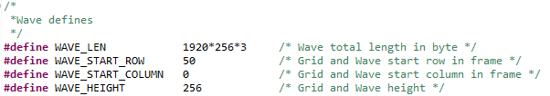

DMA使用之ADC示波器(AN108)
===========================

**实验Vivado工程为“ad9280_dma_hdmi”。**

前面讲过AN108模块的DAC使用，本章介绍ADC采集，仍然使用DMA，也就是DMA的另外一条通路。将ADC数据写到DDR，由ARM叠加波形到彩条上，最终效果如下：

      
效果图

原理框图

硬件环境搭建
------------

搭建硬件
~~~~~~~~

1. 基于VDMA驱动HDMI显示例程，打开Zynq设置，添加时钟，设置为ADC的时钟FCLK_CLK2最大频率32MHz

      
2. 添加DMA模块，只打开写通道

      
3. 添加AXI Interconnect模块，连接S00_AXI和S01_AXI分别到VDMA和DMA的MM2S接口，M00_AXI连接到HP0口。

      
4. 增加xlconcat接口，连接到dma的中断口

      
5. 添加自定义IP模块ad9280_sample，功能为采集ad9280数据，缓存到FIFO中，并从FIFO中读出转换为AXI4-Stream流数据。自定义IP在repo文件夹中。

            
6. 添加同步复位模块，并将复位时钟连接到adc_clk，复位输出连接到ad9280的adc_rst_n复位接口。

      
7. 添加AXI4-Stream Register Slice模块（可选），对Stream接口时序会有些提升。

      

      
8. 将ADC数据接口以及时钟引出

      

      
9. 保存，重新Generate Output Products

      
10. 在XDC中绑定AD9280引脚，，之后Generate Bitstream

ADC自定义IP功能介绍
~~~~~~~~~~~~~~~~~~~

由于需要将ADC采集的数据通过DMA传输到ZYNQ，与DMA的接口为AXIS流接口，因此需要将ADC数据转换成AXIS流数据，同时ADC的时钟与AXIS时钟频率不同，因此需要添加FIFO进行跨时钟域数据处理。同时需要实现AXIS Master功能。工作流程为：

1. ARM配置启动寄存器和采集长度寄存器。

2. ADC采集数据并存入FIFO。

3. DMA使用AXIS接口读取FIFO中的数据，直到读取到所配置的数据量。

Vitis程序开发
-------------

1. 实验流程为：向frame buffer里写入彩条数据叠加网格叠加波形数据

2. 程序中增加了adc_dma_ctrl.c和adc_dma_ctrl.h文件，以及wave.c和wave.h文件，可以在Vitis文件夹下找到

      
3. 首先要做显示背景，本实验中选择彩条做背景，利用main.c文件的DemoPrintTest函数，将其他删除，只保留彩条部分。

      
4. 在main.c中打开中断控制器，用于DMA的中断。

      
5. 下一步是进行网格和波形的叠加，adc_dma_ctrl.c是基于前面DMA的控制做的修改，XAxiDma_Adc_Wave函数用于初始化DMA，控制ADC采集，波形叠加。由于DMA只有写接口，因此在XAxiDma_Initial函数中打开S2MM中断。

      
6. 在adc_dma_ctrl.c中调用draw_grid函数叠加网格，draw_grid在wave.c文件中，需要提供参数宽度width，高度height，即要显示网格的宽与高。函数中设置每个方格是32*32像素点，水平和垂直方向每隔4个点显示。网格显示为灰色，背景为黑色，将图像数据写入画布（CanvasBuffer）缓冲区中。

      
效果如下：

      
7. 叠加波形函数为draw_wave， width为宽度，height为高度，BufferPtr为波形数据指针，本实验中指向ADC接收到的数据。CanvasBufferPtr为画布指针，处理后的数据叠加到上面。Sign为BufferPtr数据的符号位，Bits为有效数据位，比如ADC的数据宽度为8，则可将此参数设为8。参数color用于选择要显示的颜色，coe为系数，可以通过调节coe的值，改变波形的高度。由于AD9280数据宽度为8，本实验中coe设置为1。

            
判断Sign符号位，赋给不同的指

            
由于得到的数据在图像上显示为离散点，为了使波形显示更平滑，进行了描点处理，将数据与前一个数据进行比较，得到差值，并在同一列描点。

      
下面为500KHz未描点的正弦波，都是离散的点：

.. image:: images/17_media/image23.png
      
下图为描点之后的效果，平滑了一些。

      
描点函数为draw_point，需要提供横坐标，纵坐标，宽度，高度等参数

      
8. 在adc_dma_ctrl.c的XAxiDma_Adc_Wave函数中，调用frame_copy函数将画布数据copy到图像空间，并刷新Cache，之后打开ADC采集。

      
9. 前面的实验已经讲过，修改显示分辨率的方法，在display_ctrl.c中修改vMode

      
10. 如果想改变波形背景显示区域，可以修改网格波形起始位置，修改WAVE_START_ROW改变起始行的位置，修改WAVE_START_COLUMN修改起始列的位置注意WAVE_HEIGHT\\

+WAVE_START_ROW不能大于分辨率的高度，如1280*720，不能大于720，否则显示不正常。

      
在XAxiDma_Adc_Wave函数中也可修改波形的宽度，比如将其改为1024，WAVE_START_COLUMN修改为50，可见效果如下图

      
.. image:: images/17_media/image30.png
      
1.  调用draw_wave函数时，Sign符号设置为UNSIGNEDCHAR

      
在adc_dma_ctrl.h文件中，ADC的参数设置如下：

      
添加math.h库
~~~~~~~~~~~~

注意：在程序中用到了math.h的函数，需要做以下设置才能使用，右键点开C/C++ Build Settings选项

.. image:: images/17_media/image33.png
      
在Settings选项的Libraries添加m，点击OK

.. image:: images/17_media/image34.png
      
板上验证
--------

1. 连接AN108到开发板上，使用专用屏蔽线连接波形发生器到ADC接口，连接HDMI线，为了方便观察显示效果，波形发生器采样频率设置范围为100KHz~1MHz，电压幅度最大为10V

.. image:: images/17_media/image35.png
      
AX7015硬件连接图

      
AX7021硬件连接图（J15扩展口）

      
AX7020/AX7010硬件连接图（J11扩展口）

      
AX7Z035/AX7Z100硬件连接图

      
注意1脚对齐

2. 下载程序，即可看到本章首页的效果

      
本章小结
--------

本章介绍了简易的ADC采集显示，整体功能并不复杂，用户可在此基础上进行功能完善和优化。
