基于DAC模块的Scatter/Gather DMA使用（AN9767）
===============================================

**实验Vivado工程为“ad9767_sg_dma”。**

本章以AN9767模块为例演示SG DMA的读通路使用，即MM2S通路。下图为原理框图，由于AD9767是双通道，带宽也比较大，因此考虑用两个HP口，本实验最终实验为双通道DAC同时输出波形，并通过示波器观察。

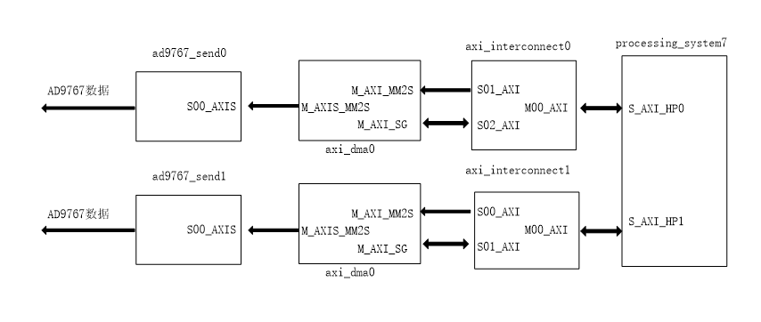

双通道14位DA模块说明
--------------------

1. 参数参数说明

黑金双通道14位DA输出模块AN9767采用ANALOG DEVICES公司的AD9767芯片，支持独立双通道、14位、125MSPS的数模转换。模块留有一个40针的排母用于连接FPGA开发板，2个BNC连接器用于模拟信号的输出。

AN9767模块实物照片如下：

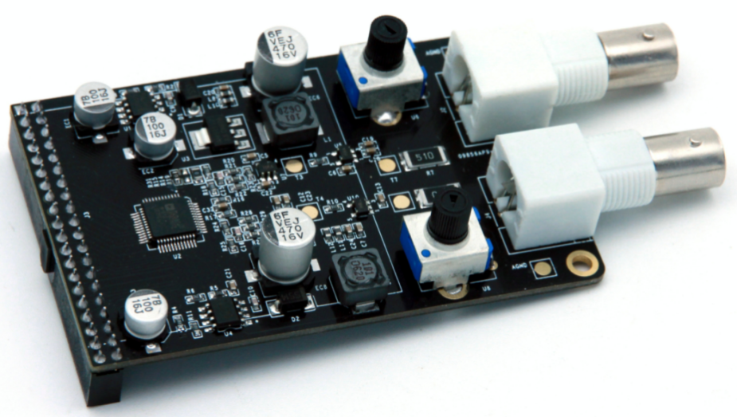
      
AN9767模块正面图

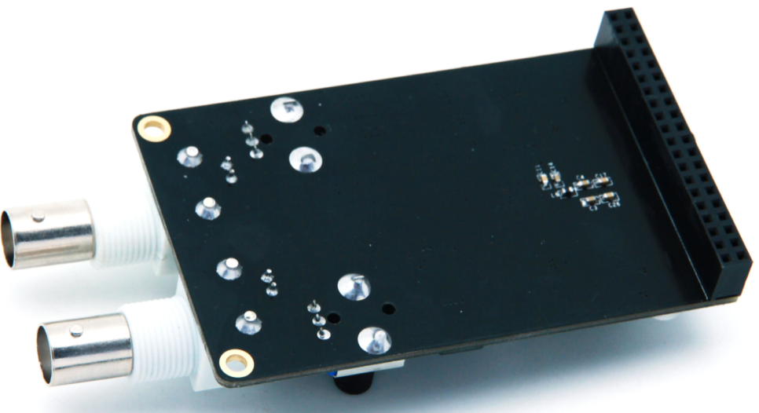
      
AN9767模块背面图

以下为AN9767双通道DA模块的详细参数:

-  DA转换芯片：AD9767；

-  通道数：2通道；

-  DA转换位数：14bit；

-  DA更新速率：125 MSPS；

-  输出电压范围：-5V~+5V；

-  模块PCB层数：4层，独立的电源层和GND层；

-  模块接口：40针2.54mm间距排座，方向向下；

-  工作温度：-40°~85°模块使用芯片均满足工业级温度范围

-  输出接口：2路BNC模拟输出接口（用BNC线可以直接连接到示波器）；

2. AN9767模块的原理设计框图如下：

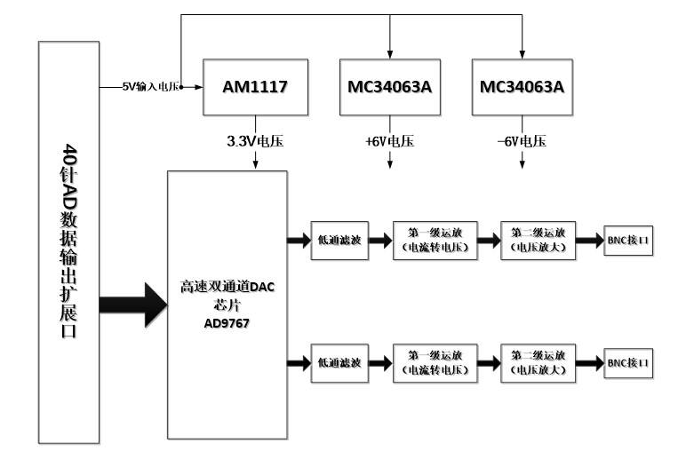

3. `AD9767 <http://www.bdtic.com/ADI/AD9767.html>`__\ 是双端口、高速、双通道、14位CMOS DAC, 芯片集成两个高品质TxDAC+®内核、一个基准电压源和数字接口电路,采用48引脚小型LQFP封装。器件提供出色的交流和直流性能，同时支持最高125 MSPS的更新速率。\ `AD9767 <http://www.bdtic.com/ADI/AD9767.html>`__\ 的功能框图如下：

.. image:: images/21_media/image5.png
      
4. 电流电压转换及放大

AD9767的两路DA输出都为补码形式的电流输出IoutA和IoutB。当AD9767数字输入为满量程时（DAC的输入的14位数据都为高），IoutA输出满量程的电流输出20mA。IoutB输出的电流为0mA。具体的电流和DAC的数据的关系如下公式所.. image:: images/21_media/image6.png
            
其中IoutFS=32 x Iref，在AN9767模块设计中,
Iref的值由电阻R16的值决定，如果R16=19.2K，那Iref的值就是0.625mA。这样IoutFS的值就是20mA。

AD9767输出的电流通过第一级运放AD6045转换成-1V~+1V的电压。具体的转换电路如下图所.. image:: images/21_media/image7.png
            
第一级运放转换后的-1V~+1V的电压通过第二级运放变换到更高幅度的电压信号，这个运放的幅度大小可以通过调整板上的可调电阻来改变。通过第二级运放，模拟信号的输出范围高达-5V~+5V。

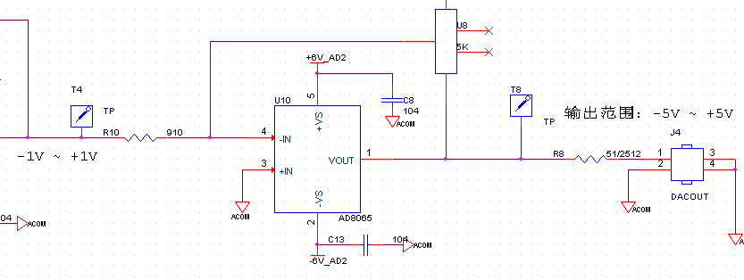
      
下表为数字输入信号和各级运放输出后的电压对照表：

+----------------+----------------+----------------+------------------+
| **D            | **AD           | **第           | **第             |
| AC数据输入值** | 9767电流输出** | 一级运放输出** | 二级运放输出**   |
+================+================+================+==================+
| 3              | +20mA          | -1V            | +5V              |
| fff(14位全高） |                |                |                  |
+----------------+----------------+----------------+------------------+
| 0(14位全低）   | -20mA          | +1V            | -5V              |
+----------------+----------------+----------------+------------------+
| 2000（中间值） | 0mA            | 0V             | 0V               |
+----------------+----------------+----------------+------------------+

5. 接口时序

AD9767芯片的数字接口可以通过芯片的模式管脚(MODE)来配置成双端口模式(Dual)或者交叉(Interleaved)模式。在AN9767模块设计中，AD9767芯片是工作在双端口模式，双通道的DA数字输入接口是独立分开的。双端口模式(Dual)的数据时序图如下图所示：

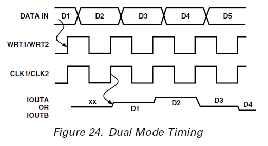
      
AD9767芯片的DA数据通过时钟CLK和写信号WRT的上升沿输入到芯片进行DA转换。

硬件环境搭建
------------

搭建硬件
~~~~~~~~

1. 在“DMA使用之DAC波形发生器（AN108）”工程基础上，进行改动。由于双通道每路带宽都能达到125MHz*14bit = 1.75Gbps，为了双通道不抢占interconnect资源，因此在此实验中用两路HP口连接两个通道。

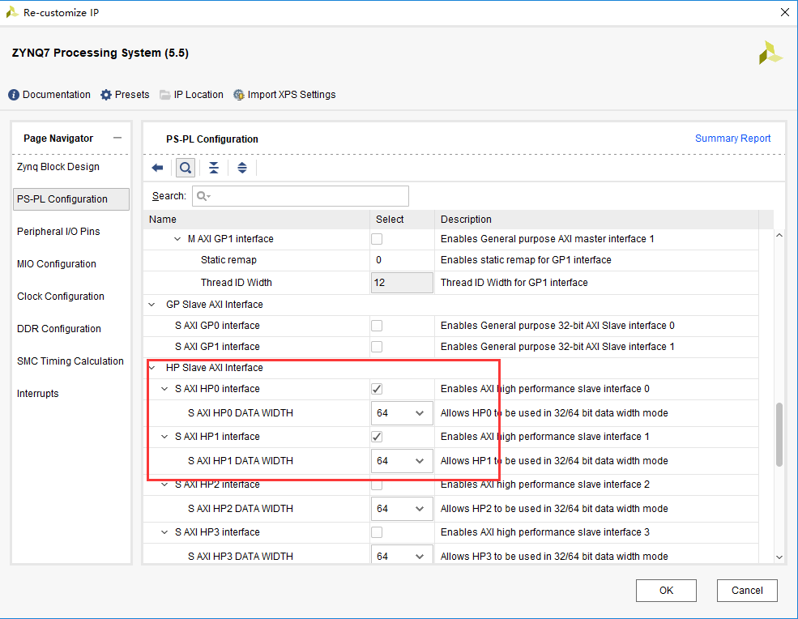
      
2. 设置FCLK_CLK0为150MHz，用于AXI总线使用，设置FCLK_CLK1为125MHz，用于连接AD9767时钟。

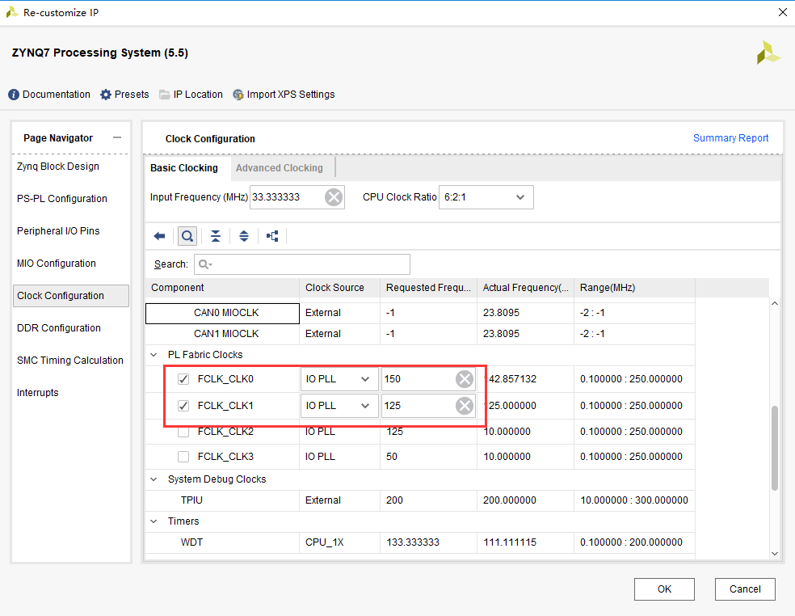
      
引出两路时钟

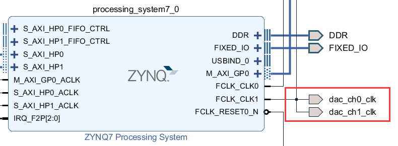
      
3. 设置DMA如下，使能SG功能，buffer宽度设为最大，打开读通道，Stream Data Width设为16，连接ad9767发送模块，每个模块连接一个DMA。

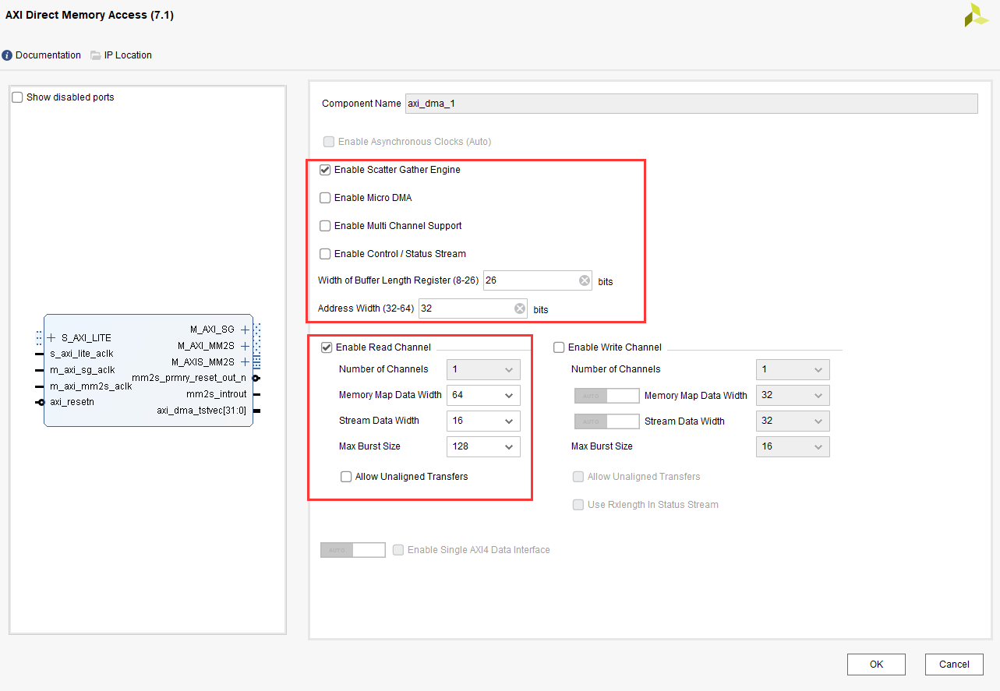
      
4. 添加两个ad9767_send模块，此模块功能为ARM发送start命令后，就不断的读取内部FIFO中的数据，FIFO的数据是由DMA通过AXIS MM2S接口写入的。并将数据接口和wrt接口引出。

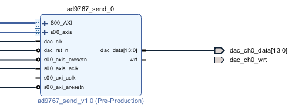
      
5. 连接各个模块，最终连接结果如下：

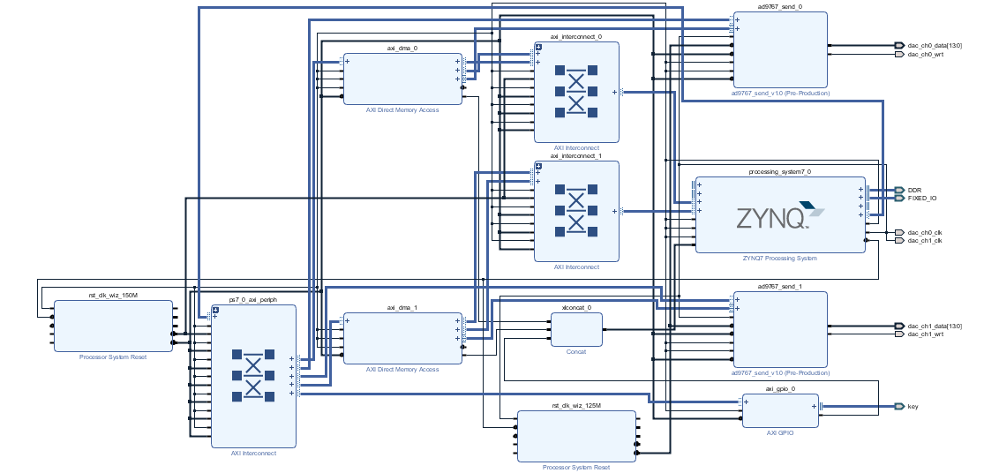
      
6. 添加准备好的ad9767.xdc文件，生成Bitstream。

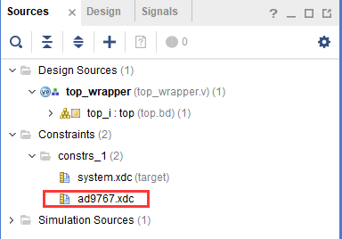
      
DAC自定义IP功能介绍
~~~~~~~~~~~~~~~~~~~

由于需要将波形数据通过DMA传输到DAC，与DMA的接口为AXIS流接口，因此需要将AXIS流数据转换成DAC数据，同时DAC的时钟与AXIS时钟频率不同，需要添加FIFO进行跨时钟域数据处理。同时需要实现AXIS
Slave功能。工作流程为：

1. ARM配置DAC的启动寄存器和数据长度寄存器。

2. DMA使用AXIS接口将数据写入FIFO

3. DAC状态机查询FIFO中有一定数据后，开始将数据读出。由于AXIS的时钟频率较快，可以保证DAC读出的数据连续。

Vitis程序开发
-------------

关于SG DMA的使用可以参考“基于ADC模块的Scatter/Gather DMA使用（AN108）“一章。

1. 在这里设置两路最大幅度值为2^14，即16384，注意AMP_VAL不能大于MAX_AMP_VAL，可以调节AMP_VAL改变幅值。MAX_PKT_LEN为采集的数据量，注意不能小于1024，因为DMA中断后有一段时间空档，此时没有向FIFO写数据，会导致FIFO会被读空。采集数值越大，有效数据时间越长。DMA时钟为150MHz，DAC时钟为125MHz，因此就能保证FIFO一直不空。

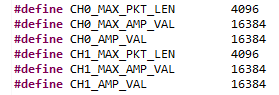
      
2. 在main函数中设置了PS和PL端的按键，并使能中断，PS端按键控制channel0波形切换，PL端按键控制channel1波形切换。

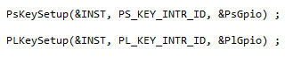
      
3. 在XAxiDma_DAC函数中，创建BD链表，并开始DMA传输，这里选择TXPATH。While循环中，如果有按键按下，载入新波形数据，并刷新到内存。

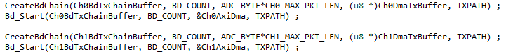
      
4. 在DAC_Interrupt_Handler函数中，清除中断，清除BD状态，开始下一次DMA传输。

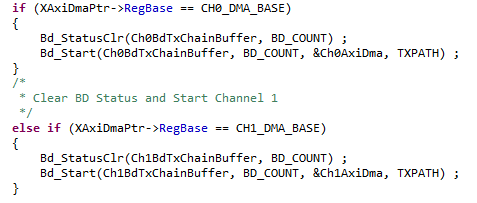
      
5. 其他部分不再过多讲解，可参考前面的例程。

板上验证
--------

1. 连接模块与开发板，并用专用屏蔽线与示波器连接。

.. image:: images/21_media/image21.png
      
AX7015硬件连接图

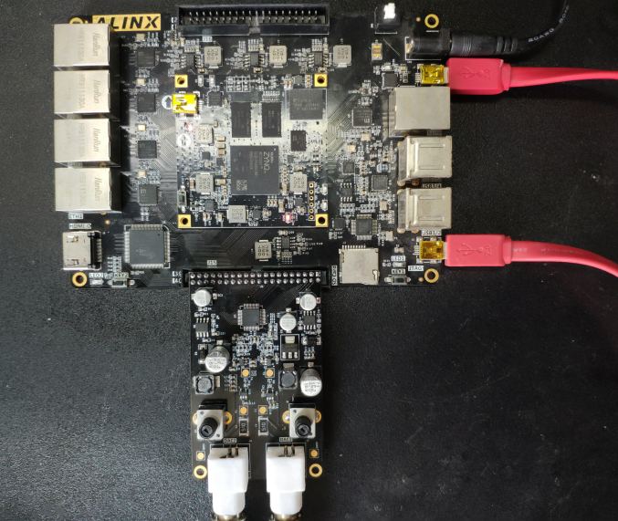
      
AX7021硬件连接图（J15扩展口）

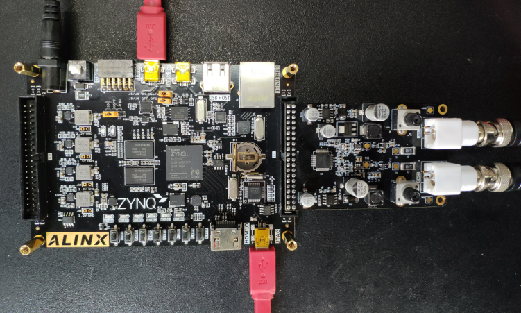
      
AX7010/AX7020硬件连接图（J11扩展口）

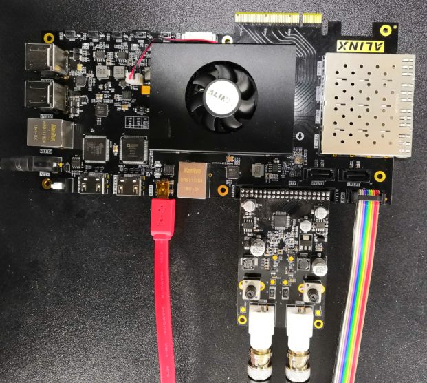
      
AX7Z035/AX7Z100硬件连接图

2. 下载程序

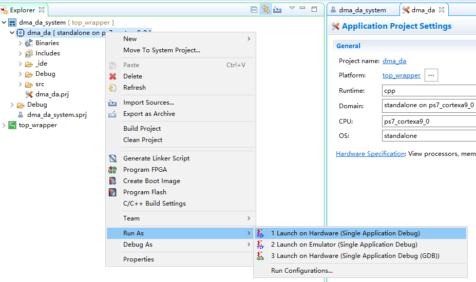
      
3. 下载后，示波器显示如下，可通过按键切换波形。AX7015开发板PS端按键为PS_KEY，PL端按键为PL_KEY；AX7021开发板PS端按键为KEY1，PL端按键为KEY2；AX7020/AX7010开发板PS端按键为PS KEY1，PL端按键为PL KEY1。

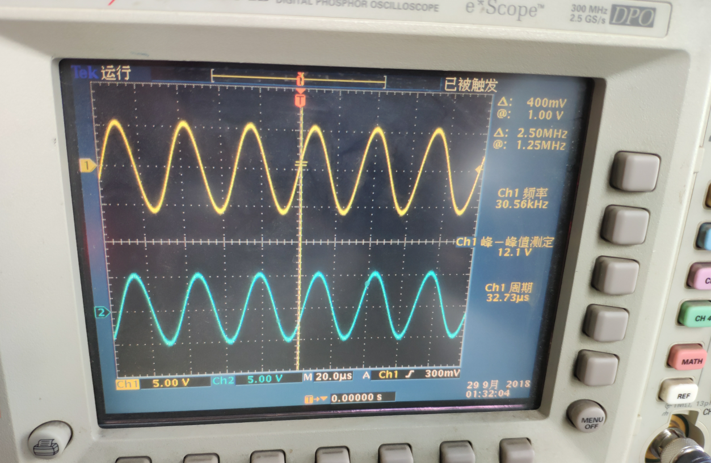
      
4. 也可通过模块上的电位器调节幅度。
