7寸触摸屏模块的显示
=====================

**实验Vivado工程为“lcd7_touch”。**

在以往单纯的FPGA设计人机交互非常麻烦，往往需要再配置一个处理器用于人机交互，zynq的出现大大方便了FPGA设计需要人机交互的设计。液晶屏在人机交互中是一个非常常见的部件，在前面教程中我们介绍了VDMA结合HDMI的显示例程，本章讲解黑金7寸液晶屏在ZYNQ系统的使用。

LCD触摸屏说明
-------------

AN970 LCD触摸屏模块由TFT液晶屏，电容触摸屏和驱动板组成，详细信息查看AN970用户手册。AN970实物照片如下：

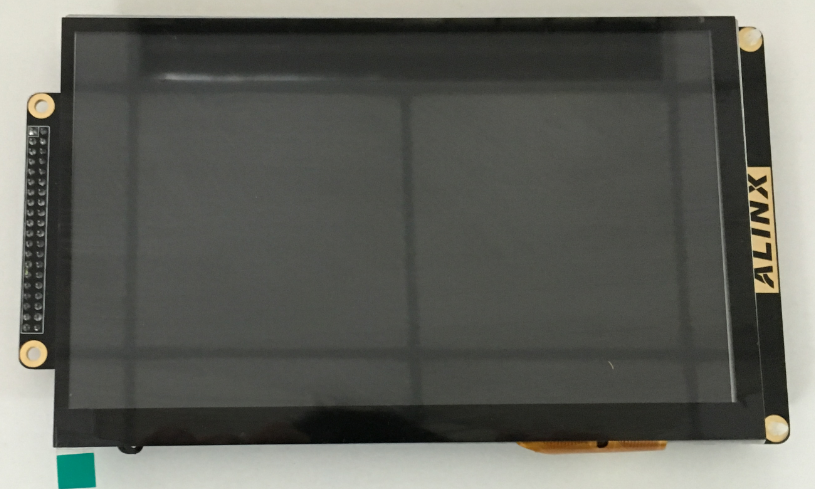
      
硬件环境搭建
------------

7寸液晶屏的驱动实验的硬件构架基本上跟VDMA实验硬件系统基本一样。主要差别就是VDMA通过HDMI显示，需要添加HDMI编码输出模块，而且HDMI的分辨率是可变的，但是对于固定型号的液晶屏的分辨率是固定的。

视频或者图像数据是从ZYNQ系统的高速AXI_HP0口输出, 通过axi interconnect连接axi_vdma IP, axi_vdma通过AXI-Stream流接口连接到axi4s_vid_out IP 并输出驱动信号给LCD液晶屏模块显示图像。系统中使用v_tc IP来控制输出的显示格式和分辨率的时序控制，使用axi_dynclk IP来产生LCD屏的像数显示时钟信号。构架好的系统大致如下所示：

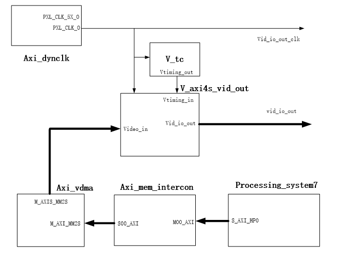

在工程中增加了背光的PWM调节模块，可以调节背光亮度

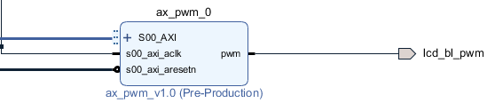
      
添加了I2C的接口，用于读取触摸信息

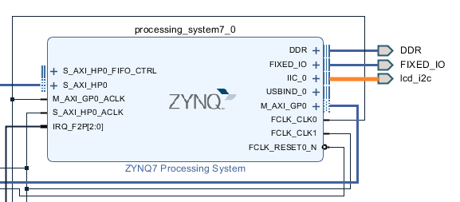
      
添加接口lcd_intr，连接到触摸屏的中断信号，低电平表示产生中断，因此加了反向器连接到中断

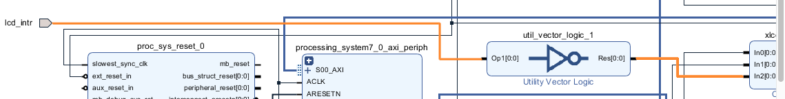
      
设计好后的vivado工程如下图所示：

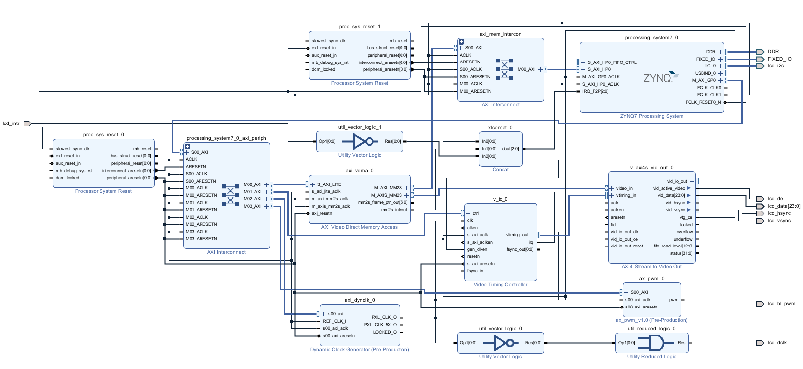
      
Vitis程序开发
-------------

Vitis的软件程序跟HDMI显示的例程基本一样，这里也是输出一个图片到7寸屏，这个图片数据存储在"pic_800_600.h"文件里。图片是800x600像数的，我们的LCD屏的像数是800x480的，所以无法整副显示。如果用户想换其它图片，可以自己重新生成。

在vga_modes.h文件里我们需要添加7寸屏800*480的时序参数，软件会配置这个参数给v_tc IP来产生正确的LCD屏驱动时序。

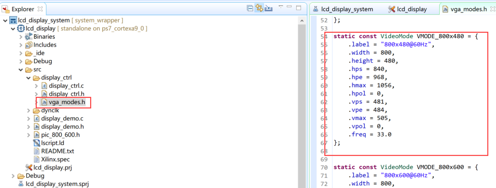
      
在display_ctrl.c文件里修改dispPtr->vMode的值为VMOD_800_480。

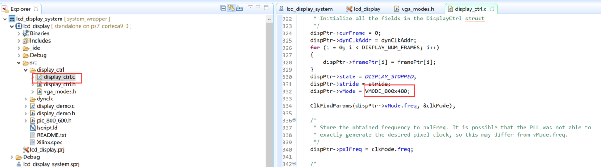
      
在main.c文件中配置PWM的频率和点空比，set_pwm_frequency第二个参数为基础时钟，Vivado中连接的是100MHz，第三个参数是要设置的PWM频率，单位为Hz。Set_pwm_duty第二个参数为占空比。

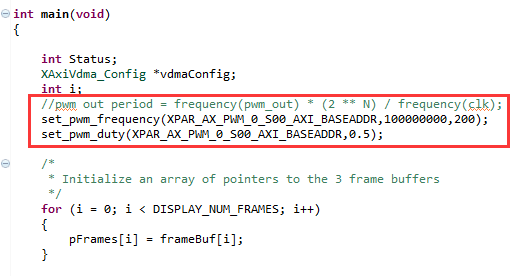
      
板上验证
--------

和前面的例程一样，编译生成bit文件，然后导出硬件，运行Vitis。7寸液晶屏连接到开发板的扩展口，Run As下载程序，可看到和VDMA测试例程一样，液晶屏上会显示小猫的图片。

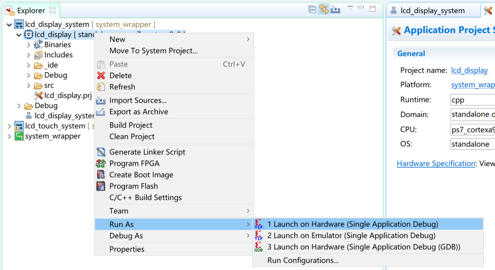
      
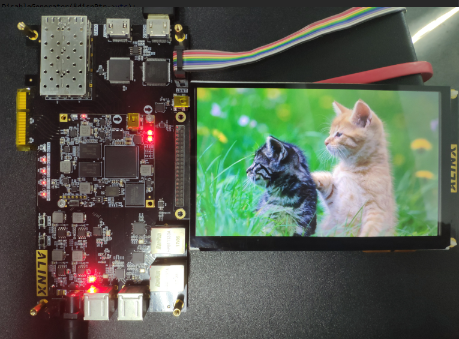
      
AX7015硬件连接及显示效果

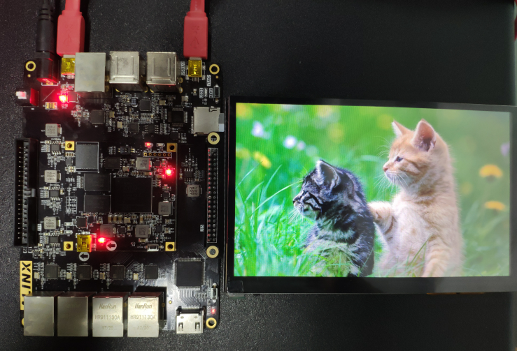
      
AX7021硬件连接(J15扩展口)及显示效果

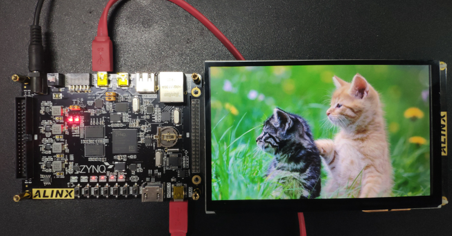
      
AX7020/AX7010硬件连接（J11扩展口）及显示效果

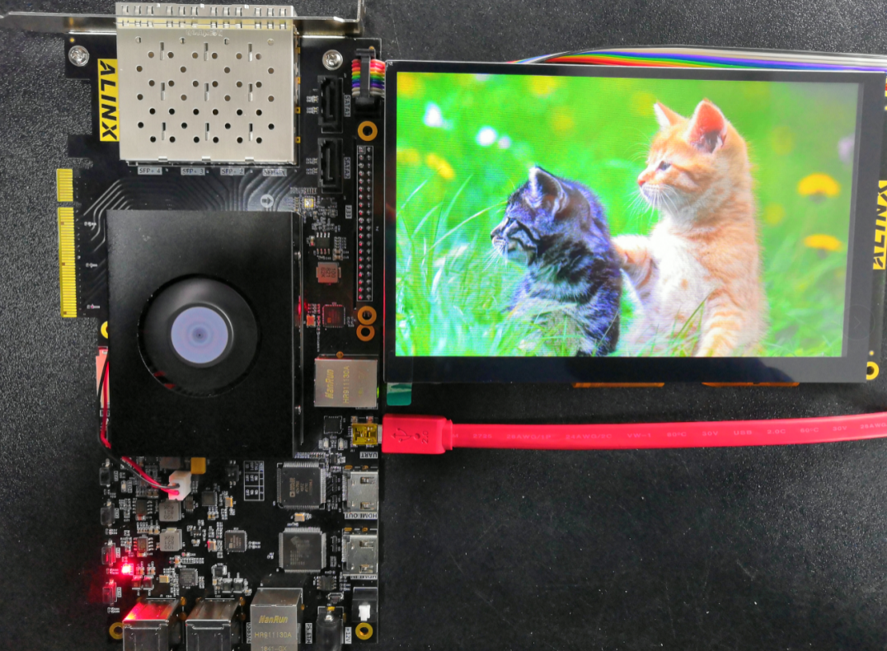
      
AX7Z035/AX7Z100硬件连接及显示效果
