7寸触摸屏的GUI及触摸控制
==========================

**实验Vivado工程为“lcd7_touch”。**

本章的重点在于掌握触摸控制器的使用以及带触摸功能的GUI使用。

硬件环境搭建
------------

基于“lcd_touch”工程

µGUI的使用
----------

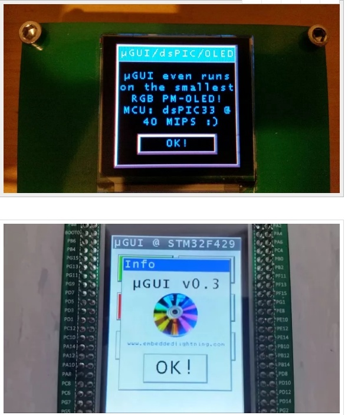
      
µGUI运行效果图

µGUI是轻量级的人机界面开源库，适合单片机、没有操作系统的环境。µGUI的官方网站是

http://embeddedlightning.com/ugui/。

µGUI有一个简单的窗口管理系统，可以定义按钮、文本框等常规的图像界面元素。

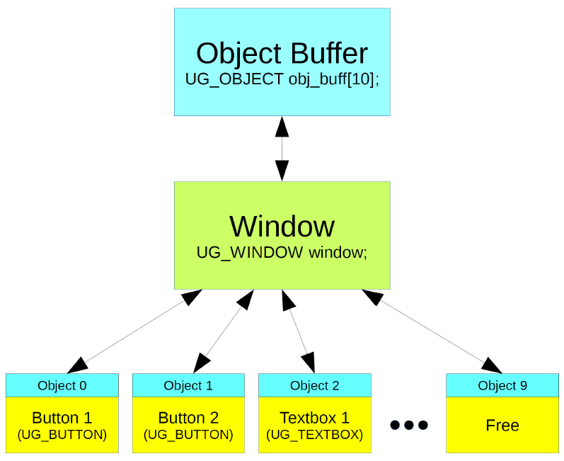
      
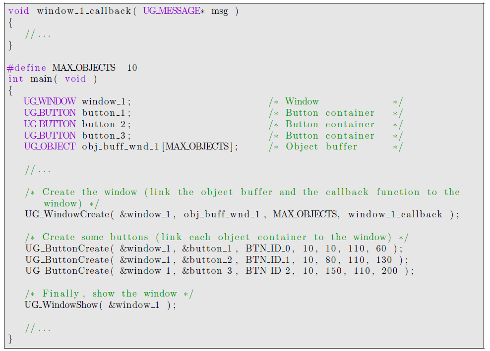
      
详细的使用方法见µGUI的《Reference Guide》，不是本文讨论的重点。

Vitis程序开发
-------------

在触摸屏的Vitis程序里，我们在7寸屏显示的例程基础上添加了以下的代码。PS的I2C的通信程序(PS_i2c.c和PS_i2c.h),触摸程序（touch.c和touch.h），PS的定时器代码（PS_timer.c）,中断程序(zynq_interrupt.c)和uGUI的库程序(ugui.c和ugui.h)。

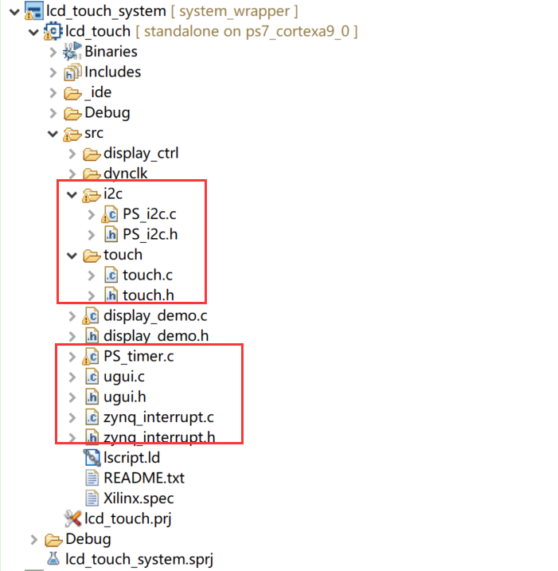
      
下面对新增的代码做一下简单的介绍：

1. PS的I2C通信程序（PS_i2c.c和PS_i2c.h）

PS的I2C的通信程序里包含3个函数：I2C的初始化函数i2c_init，
i2C的字节写函数i2c_wrtie_bytes和I2C的字节读函数i2c_read_bytes。这3个函数用来对触摸屏的寄存器的数据进行读写操作。

.. code:: c

 inti2c_init(XIicPs *IicInstance, u16 DeviceId, u32 FsclHz);
 
 inti2c_wrtie_bytes(XIicPs *IicInstance,u8 i2c_slave_addr,void *buf,int byte_num);
 
 inti2c_read_bytes(XIicPs *IicInstance,u8 i2c_slave_addr,void *buf,int byte_num);

2. 触摸程序（touch.c和touch.h）

触摸程序里里包含3个函数，一个是触摸屏I2C的寄存器读函数，触摸屏的设备地址为0xA0，这里调用I2C通信程序里的i2c_write_bytes和i2c_read_bytes来完成一次触摸屏的寄存器读操作。

一个是触摸屏的初始化函数，连接中断响应函数。另一个是触摸屏中断的响应函数，设置变量touch_sig为高。

.. code:: c

 inttouch_i2c_read_bytes(u8 *BufferPtr, u8 address, u16 ByteCount);
 inttouch_init (void);
 voidTouch_Intr_Handler(void *InstancePtr);

3. 定时器程序（PS_timer.c）

程序里只有一个定时器初始化函数（PS_timer_init）, 函数初始化PS的定时器，重置定时器的初始值，设置自动加载，并使能定时器开始计数。

.. code:: c

 intPS_timer_init(XScuTimer *Timer, u16 DeviceId, u32 timer_load);

4. uGUI的库程序（ugui.c）

这是我们在网上下载的开源的uGUI的库程序，里面定义了很多用C语言来实现的画线，画框，按键，文字的一些函数和字库。具体函数的使用和说明大家请参考uGUI Reference Guide文档。

5. ZYNQ中断程序（zynq_interrupt.c）

中断程序里定义了3个函数，一个是中断系统建立函数，一个是中断初始化函数，另一个是中断响应函数连接。

6. 主程序（display_demo.c）

首先我们来看一下main函数，在main函数里我们在前面添加了pwm设置，中断，触摸初始化，定时器初始化和定时器中断使能。

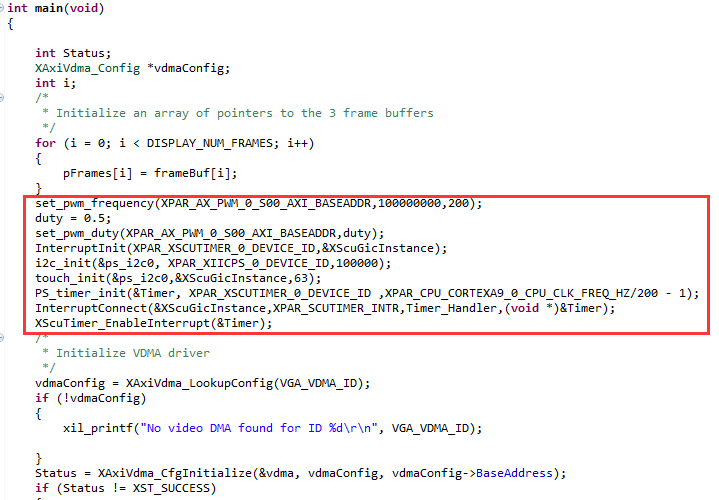
      
在main函数的后面我们调用uGUI函数在7寸LCD屏上实现一个窗口，并在这个窗口上显示不同的图案，这里添加了一个菜单条，菜单条上显示"%UI For ALINX!"字符，再在窗口不同的位置添加6个按键，各个按键上显示不同的文字用来表示不同的功能。

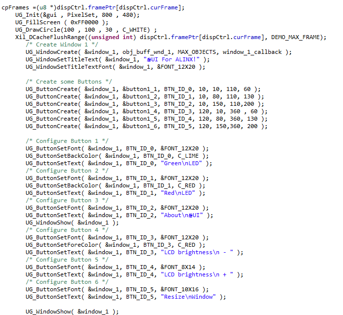
      
在display_demo.c程序里还有2个函数，一个是定时器中断处理函数Timer_Handler。当定时器溢出是会产生中断，会进入Timer_Handler中断程序，在中断程序里读取触摸屏的寄存器的值，计算触摸的状态和触摸的位置。

.. code:: c

 staticvoidTimer_Handler(void *CallBackRef);

还有一个窗口处理程序window_1_callback，用来处理触摸的事件，根据触摸的按键位置来产生不同的处理结果，比如如果触摸green led的按钮，按键上的数字会增加，每按一次，数字加1;如果触摸Resize Window的按键，窗口的尺寸会变化。如果按下LCD brightness+/-按键，屏幕亮度会改变。

.. code:: c

 voidwindow_1_callback( UG_MESSAGE* msg );

板上验证
--------

和前面的例程一样，编译生成bit文件，然后导出硬件，运行Vitis。7寸触摸液晶屏连接到开发板的扩展口，按前面几章的方法运行配置，点击run，可看到7寸屏上显示以下的窗口界面。

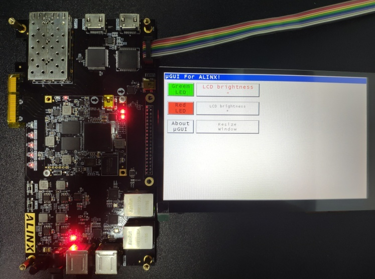
      
AX7015硬件连接及显示效果

.. image:: images/29_media/image8.png
      
AX7021硬件连接（J15扩展口）及显示效果

.. image:: images/29_media/image9.png
      
AX7020/AX7010硬件连接（J11扩展口）及显示效果

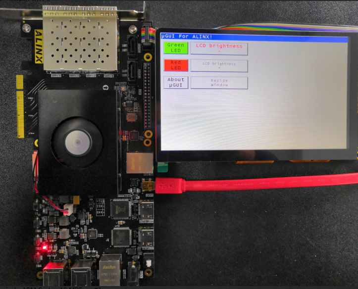
      
AX7Z035/AX7Z100硬件连接及显示效果

这时我们可以用手触碰触摸屏上的按键，比如触碰green led的按键，每碰一次，按键上的数字会加1。

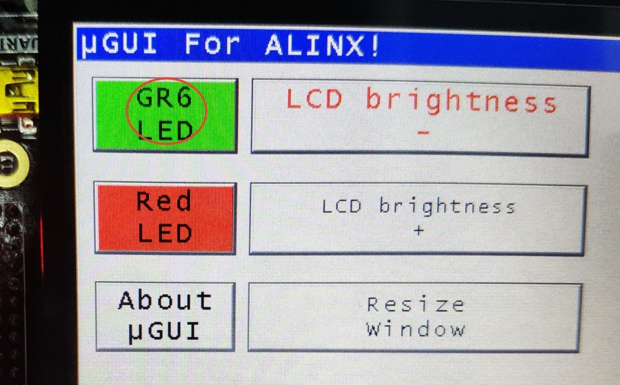
      
如果我们按一下LCD brightness+/-按钮，可以改变LCD显示亮度

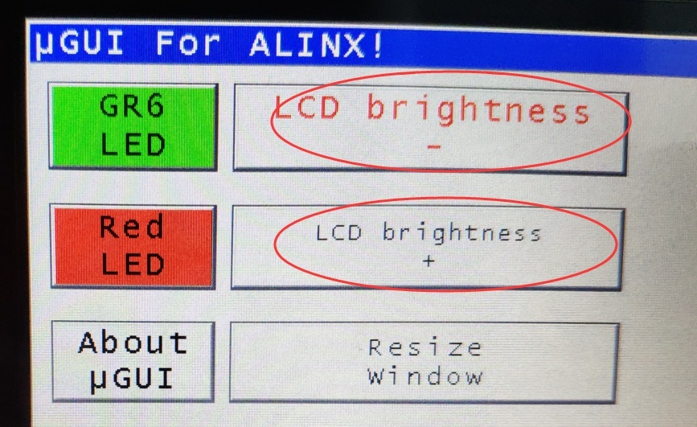
      
如果按下Resize Window，窗口会变小，再按一次会还原。

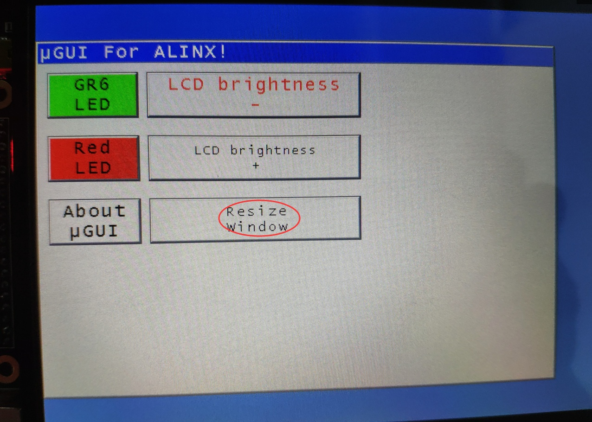
      