基于AN108模块的ADC采集以太网传输
==================================

**实验Vivado工程为“ad9280_lwip”。**

本章以AN108模块为例，介绍将ADC采集的数据通过以太网传输到上位机。

制定传输协议
------------

为了体现上位机的灵活性，基于UDP传输，制定了以下通讯协议，此协议包含在UDP数据包中。

一、获取板卡信息

（1）询问命令（共5字节，由上位机通过以太网发送）

+--------------+--------------+---------------------------------------+
| 字节数       | 1            | 4                                     |
+==============+==============+=======================================+
| 命令信息     | Header       | 0x00000000 或0x00010001               |
+--------------+--------------+---------------------------------------+

（2）应答命令（共27字节，由开发板通过以太网发送）

+----------+-----------------------------------------------------------+
| 字节数   | 命令信息                                                  |
+==========+===========================================================+
| 1        | Header|0x01                                               |
+----------+-----------------------------------------------------------+
| 4        | 0x00010001                                                |
+----------+-----------------------------------------------------------+
| 6        | 板卡MAC地址                                               |
+----------+-----------------------------------------------------------+
| 4        | 板卡IP地址                                                |
+----------+-----------------------------------------------------------+
| 1        | 符号位                                                    |
|          | 0x00:无符号数0x01有符号数此功能无效，上位机要求为有符号数 |
+----------+-----------------------------------------------------------+
| 1        | ADC有效数据长度，比如AD9226为12位，即12                   |
+----------+-----------------------------------------------------------+
| 1        | 采集一次                                                  |
|          | ADC的字节数，此功能无效，上位机要求ADC数据位宽为两个字节  |
+----------+-----------------------------------------------------------+
| 1        | 采样通道（此功能上位机未实现）                            |
+----------+-----------------------------------------------------------+
| 4        | 采样率，即采样的频率，程序中设为65M                       |
+----------+-----------------------------------------------------------+
| 4        | 缓存的ADC数据长度，单位为字节                             |
+----------+-----------------------------------------------------------+

二、获取数据

（1）控制命令（由上位机发送数据请求）

+----------+-----------------------------------------------------------+
| 字节数   | 命令信息                                                  |
+==========+===========================================================+
| 1        | Header                                                    |
+----------+-----------------------------------------------------------+
| 4        | 0x00010002                                                |
+----------+-----------------------------------------------------------+
| 6        | 板卡MAC地址，确认是本地的MAC地址                          |
+----------+-----------------------------------------------------------+
| 4        | 采样通道（此功能未实现）                                  |
+----------+-----------------------------------------------------------+
| 4        | 采样次数（采集数据为16位，采样次数为缓存数据长度的一半）  |
+----------+-----------------------------------------------------------+

（2）应答命令（由开发板发送）

+----------+-----------------------------------------------------------+
| 字节数   | 命令信息                                                  |
+==========+===========================================================+
| 1        | Header|0x01                                               |
+----------+-----------------------------------------------------------+
| 4        | 0x00010002                                                |
+----------+-----------------------------------------------------------+
| 1024     | ADC数据                                                   |
+----------+-----------------------------------------------------------+

每个UDP包都包含有Header，在第一个字节，其格式如下：

+-----------------------+----------------------+----------------------+
| 比特位                | 值（0）              | 值（1）              |
+=======================+======================+======================+
| bit 0                 | 查询或控制           | 应答                 |
+-----------------------+----------------------+----------------------+
| bit1~bit7             | 随机数据             |                      |
+-----------------------+----------------------+----------------------+

注：当应答时，高7位随机数据保持不变，bit0设置为1

工作流程为：

1. 上位机发送询问命令

2. 开发板应答询问

3. 上位机发送控制命令请求数据

4. 开发板发送数据

5. 步骤3和4循环

硬件环境搭建
------------

基于AN108 SG DMA的工程，将显示部分的的模块都删除，注意要把Ethernet0打开，使能MDIO

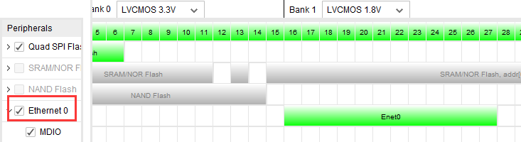
      
.. image:: images/30_media/image2.png
      
AX7015和AX7021开发板需要使能Ethernet PHY Reset并连接到MIO7，AX7020和AX7010开发板不需要使能Ethernet PHY Reset，具体参考提供的例程。

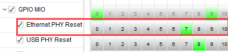
      
最终连接结果如下：

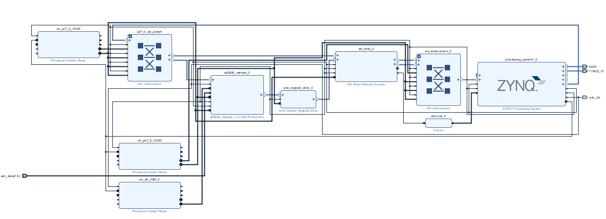
      
只保留AD9280的引脚绑定

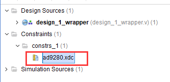
      
重新生成下载文件，导出硬件信息。

Vitis程序开发
-------------

ADC采集部分
~~~~~~~~~~~

1. ADC的采集在前面已经讲过，在本章的Vitis中加入dma_bd和adc_dma.h

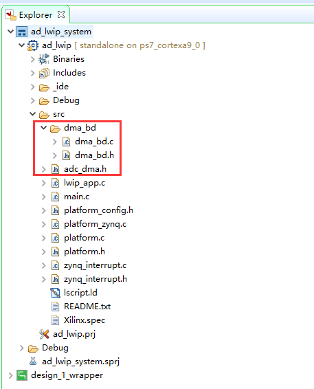
      
2. 在main.c文件的main函数中，中断初始化，进行DMA的初始化，中断连接，建立BD链表

.. image:: images/30_media/image7.png
      
LWIP控制部分
~~~~~~~~~~~~

1. 在本实验中需要使能lwip库，在Board Support Package Setting里设置

.. image:: images/30_media/image8.jpeg
         
2. 进行DHCP，pbuf的设置

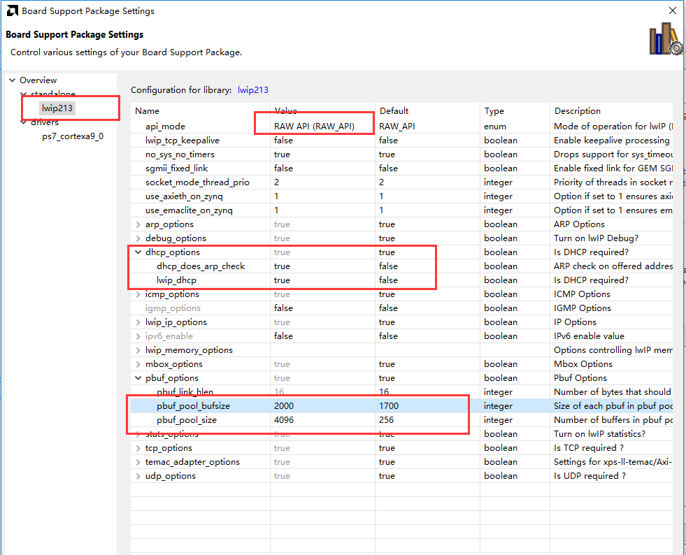
         
3. 在lwip_app.c文件中，start_udp用于udp初始化，前面已经讲过。

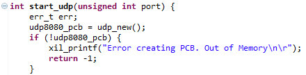
      
4. udp_receive函数为接收回调函数，在此函数中判断上位机发来的命令，格式请参考前面制定的传输协议。

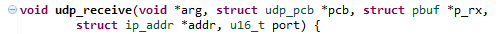
      
5. transfer_data函数用于回答上位机的命令，在udp_receive

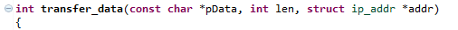
      
6. send_adc_data函数用于发送ADC数据到上位机，最前面的5个字节为TargetHeader，可参考传输协议。

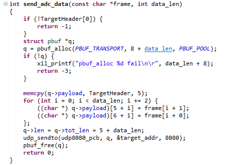
      
7. 在lwip_loop函数中，启动UDP传输，由于上位机只能显示一个通道的ADC数据，因此本实验中只打开CH1的通道。在while循环中，判断ADC数据是否采集完成，之后进行分包发送

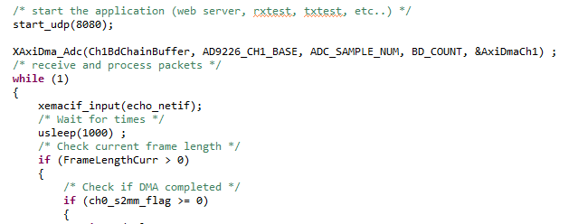
      
8. 需要注意的是上位机设置的缓存大小为1MB，由于上位机固定为数据位宽为两个字节，且为无符号位，因此在adc_dma.h中将AD9280的采集数设置为1024*512，ADC_BYTE设为2

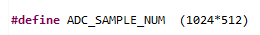
      
并将数据转换为两个字节，有符号数。在lwip_app.c的while循环中实现。

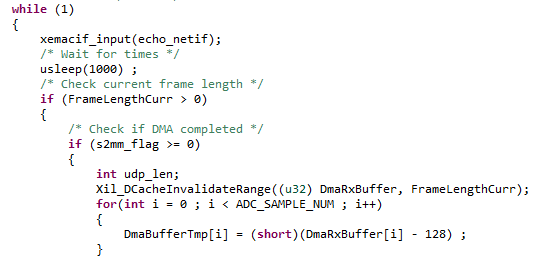
      
板上验证
--------

1. 连接开发板如下所示，需要保证PC网卡为千兆网卡，否则会因为网络速度过低，导致无法显示。将AN108模块插到扩展口，连接专用屏蔽线到波形发生器，为了方便观察显示效果，波形发生器采样频率设置范围为1KHz~1MHz，电压幅度最大为10V

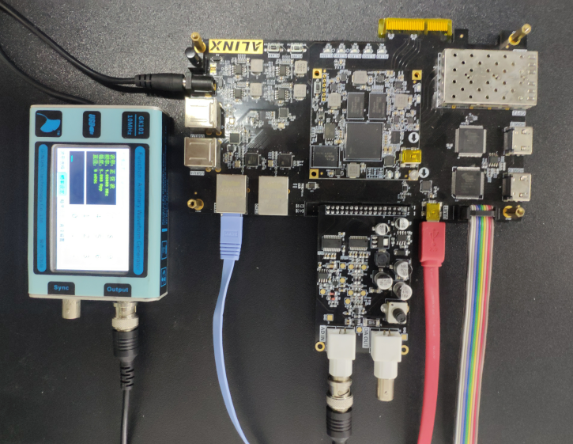
      
AX7015硬件连接图

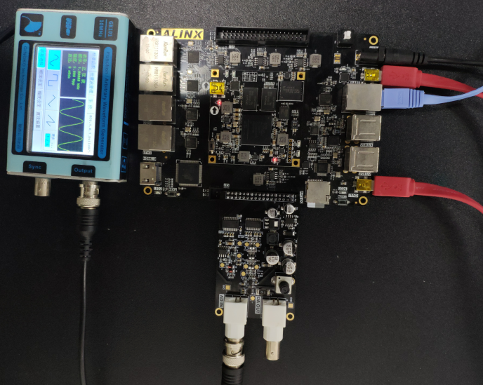
      
AX7021硬件连接图（J15扩展口）

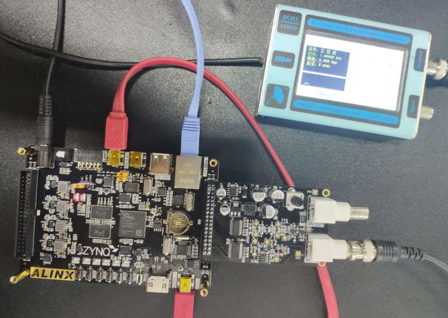
      
AX7020/AX7010硬件连接图(J11扩展口)

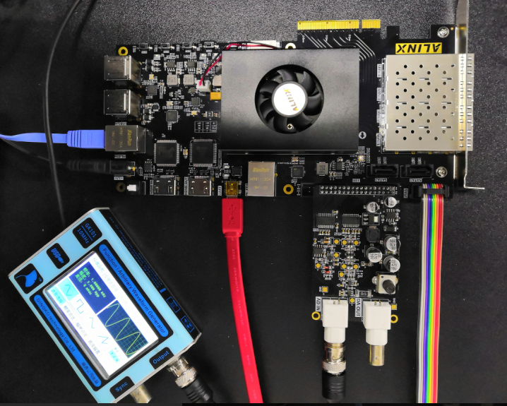
      
AX7Z035/AX7Z100硬件连接图

2. 如果有DHCP服务器，会自动分配IP给开发板；如果没有DHCP服务器，默认开发板IP地址为192.168.1.11，需要将PC的IP地址设为同一网段，如下图所示。同时要确保网络里没有192.168.1.11的IP地址，否则会造成IP冲突，导致无法显示。可以在板子未上电前在CMD里输入ping
192.168.1.11查看是否能ping通，如果ping通，说明网络中有此IP地址，就无法验证。没有问题之后打开putty软件。

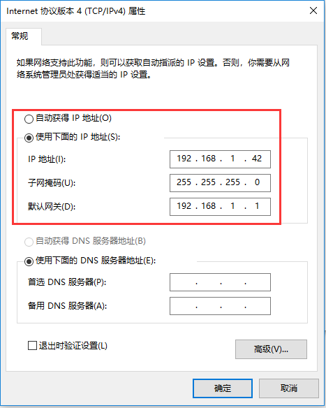
      
1. 下载程序到开发板，在putty中可以看到打印信息如下

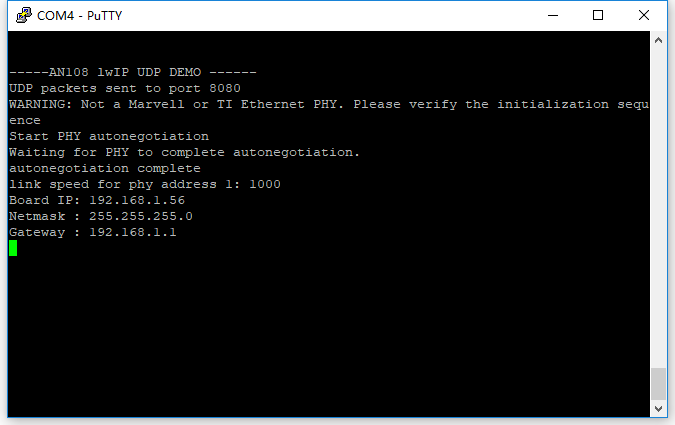
      
4. 在工程目录下，打开示波器.exe

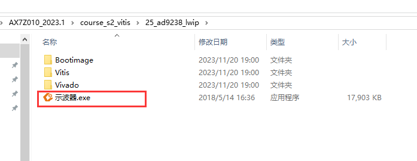
      
5. 显示结果如下

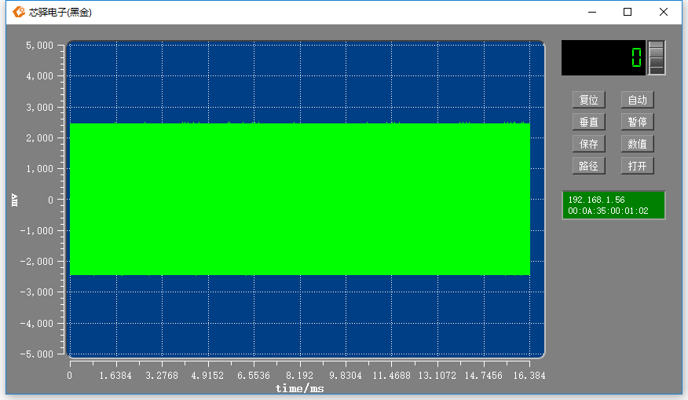
      
上位机软件使用方法，请参考AN108以太网传输的上位机软件使用说明一节。

上位机软件使用说明
------------------

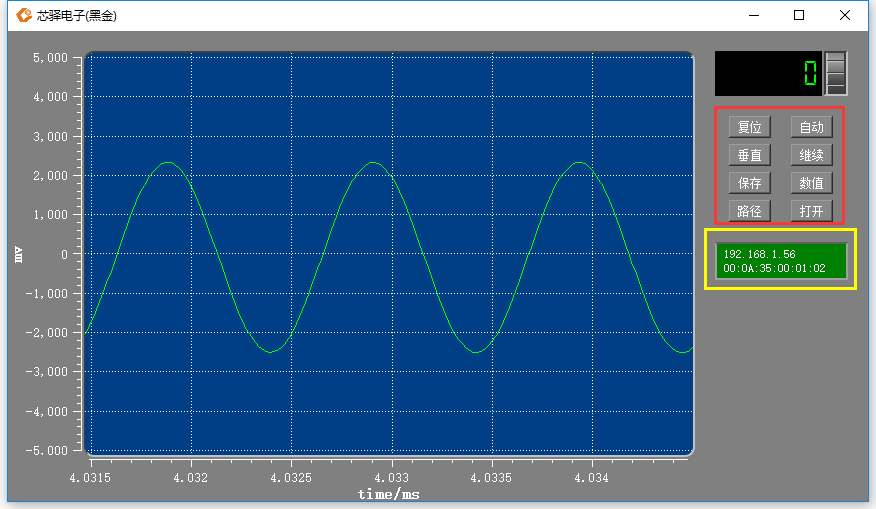
      
黄色框显示发送板卡的MAC和IP地址。若背景变成红色，说明网络连接断开或数据丢包。

红色框中为控制按钮，功能如下：

**复位**\ ：点击复位可使波形显示到初始状态，如下图

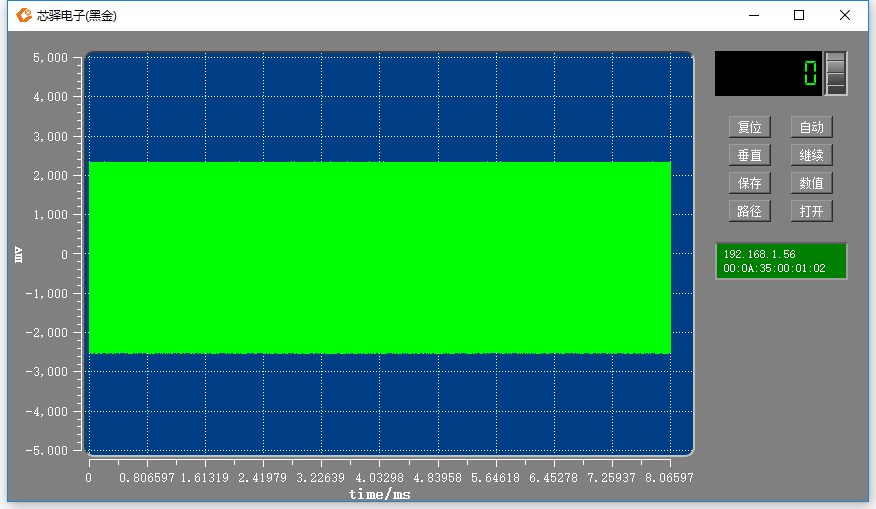
      
**自动**\ ：没有用处

**垂直**\ ：“垂直“与“水平”切换，点击此按钮可进行水平垂直方向缩放的切换，在垂直状态下，滚动鼠标滚轴可进行垂直方向的缩放，水平状态下，进行水平方向的缩放。

**暂停**\ ：“暂停“与”继续“切换，点击暂停波形，可再点击“继续”显示波形。

**保存**\ ：保存ADC数据为TXT文档，保存路径在“路径”按钮处设置，默认为软件所在路径。

**数值**\ ：“数值”与“电压”切换，Y方向坐标单位为原始值，即接收到的原始数据值，点击“电压”则显示电压值。

**路径**\ ：选择保存路径

**打开**\ ：打开已保存的TXT波形文件

数据保存演示
------------

点击保存按扭后，在设置的保存路径中会出现一个TXT文件

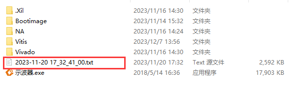
      
打开文件后即可看到原始ADC数据

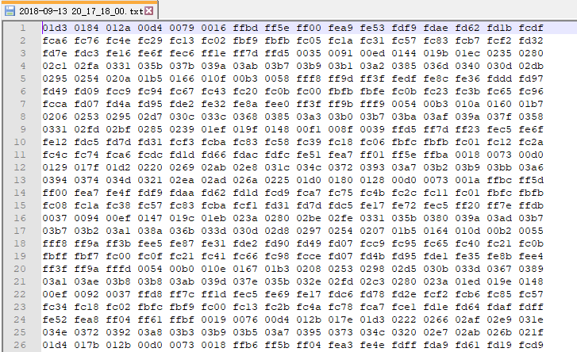
      