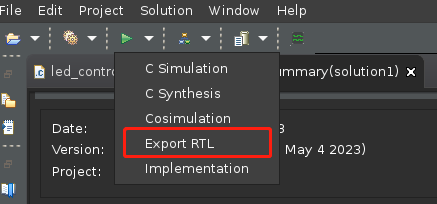

初识HLS
========================================

实验led控制
========================================
创建vitis hls工程
-------------------------------------------
1) 打开vivado hls软件
2) 点击图标

.. image:: images/images1/image6.png   
     
3) 设置工程名称及选择存放路径,如图 

.. image:: images/images1/image7.png   
     
4) 设置顶层函数名, 如图
  
.. image:: images/images1/image8.png   
     
5) NextNext至如下界面,在Clock Period一栏可填入运行时钟的周期,软件会根据此时钟进行逻辑优化,可根据实际需要填写,默认是10ns,clock uncertainty默认为时钟周期的12.5%。
  

     
6) 点击图标
    
.. image:: images/images1/image10.png   
     
7) Search后输入框中输入ZYNQ芯片型号,在下拉列表框中选中对应器件,点击“OK”按钮
 

     
8) 点击“Finish”按钮,创建vitis hls工程完成
9)  选择”Source“图标右键,选择“New File…”,文件名设置为”lec_control.cpp“,点击”保存“

     
10) 在“lec_control.cpp“文件中输入如下内容
  
.. code:: c 

    #include <ap_int.h>
  
    void led_control(ap_int<1> &led)
    {
    #pragma HLS interface ap_none port=led
    #pragma HLS interface ap_ctrl_none port=return
    	led = 0;
    	for(int i=0; i<50000000; i++)
    	{
    		if(i==25000000)
    		led = ~led;
    	}
    }

11) “Ctrl+S”保存当前文档内容
12) 点击图标,或者点击菜单栏SolutionRun C SynthesisActive Solution
  
.. image:: images/images1/image13.png
     
13) “Console”栏中输出“Finished C synthesis. “,综合完成,软件会自动跳出综合报告。在Timing信息中,可以看到时钟设置为10ns,uncertainty为1.25ns,软件将目标时钟周期设置为10-1.25=8.75ns。Estimated时钟周期（最差路径）为2.06ns,满足8.75ns时钟需求。Latency需要多少周期输出结果,latency比loop循环多一个周期,为迭代延迟。
  
.. image:: images/images1/image14.png
       
14) 点击图标,弹出如下对话框,可以在下拉框内选择需要导出的RTL类型。
      

       
15) “Console”栏中输出“Finished export RTL. “,导出IP完成。在solution1/impl/ip文件夹能够找到生成的IP压缩包,可在Vivado中导入。
   

       
创建vivado工程
-------------------------------------------

1) 打开vivado软件
2) 点击“Create Project“标签,弹出工程创建向导
3) Next
4) 设置存放路径和工程名
5) NextNext Next Next, 至如下界面
 
.. image:: images/images1/image17.png
       
6) Search后输入框中输入ZYNQ芯片型号,在下拉列表框中选中对应器件
7) NextFinish,完成vivado工程创建
8) 进入到vivado软件工程界面,点击设置图标
9) 在下图界面中,右键“Vivado Repository”标签,选择“Add Repositories…”, 选择IP所在路径,点击按钮”Select”
 

         
10) 弹出如下界面,点击”OK”,完成led_control IP添加
 
.. image:: images/images1/image19.png
        
11) 点击图标”Create Block Design”,弹出“Create Block Design”对话框,选择”OK“按钮
 
.. image:: images/images1/image20.png
         
12) 在如下界面中,点击如图所示图标,
 
.. image:: images/images1/image21.png
         
13) 在弹出的对话框中,输入“led_control”,双击检索出的IP
      

        
14) 成功在我们设置中,添加了我们设计的IP,如下图
       
.. image:: images/images1/image23.png
          
15) 单击右键选择Add IP
 
.. image:: images/images1/image24.png
         
16) 输入“cons”,双击检索出的IP
 
.. image:: images/images1/image25.png
        
17) 此时我们的设计,如下图
 
.. image:: images/images1/image26.png
        
 
18) 鼠标移至图示管脚上,此时鼠标变成笔状
 

         
19) 左键鼠标不放,拖动鼠标至下图管脚,会发现两个管脚之间出现连线,此时松开鼠标
 
.. image:: images/images1/image28.png
         
20) 此时我们的设计,如下图
 
.. image:: images/images1/image29.png
         
21) 双击图中” xlconstant_0“ IP,在弹出的对话框中,修改“Const val”值为0,点击“OK”。
 
.. image:: images/images1/image30.png
         
22) 鼠标点击“ap_clk”,选中该管脚,如图所示
 
.. image:: images/images1/image31.png
         
23) 此时,按”Ctl+T”,相同操作“led_V[0:0]“管脚,此时设计如下图
      
.. image:: images/images1/image32.png
         
24) 右键“design_1”,选择“Create HDL Wrapper…”。
 

         
25) 弹出的对话框不作修改,点击“OK”, ,生成顶层文件
 
.. image:: images/images1/image34.png
         
26) 接下来,我们需要为设计中的“ap_clk_0“及“led_V_0[0]”具体分配物理管脚。若当前没有处在“Sources”标签项下,则需要点击“Sources”,如图
 

         
27) 右键图中”Constraints”,在菜单中选择“Add Sources…”,弹出向导
 

         
28) 不作任何改变,点击“Next”,在如下界面中,点击按钮”Create File”
 

         
29) 设置文件名称“pinset”,点击“OK“。
     
.. image:: images/images1/image38.png
         
30) 回到前面的界面,点击“Finish”按钮,完成文件添加,此时我们展开“Constraints”,如下图。
 
.. image:: images/images1/image39.png
        
31) 双击”pinset.xdc”,在文件中输入如下内容,并“Ctrl+S”保存。
    
::

  set_property PACKAGE_PIN xxx  [get_ports ap_clk_0]
  set_property PACKAGE_PIN xxx   [get_ports {led_V_0 [0]}]
  set_property IOSTANDARD LVCMOSxx [get_ports {*}]

32) 至此,vivado工程设计完毕,点击下述标注图标,生成bit文件。可能弹出保存文件对话框,点击“Save”即可。
    
.. image:: images/images1/image40.png
         
33) 生成文件可能需要几分钟,直至弹出如下对话框,点击“Cancel”按钮,bit文件生成完成。
 
.. image:: images/images1/image41.png
         
34) 接下来,可以加载刚生成的bit文件至板卡,先将板卡上电,并确定连接好JTAG。
35) 点击“Open Hardware Manager”
      
.. image:: images/images1/image42.png
         
36) 点击“Open Target””Auto Connect”
     
.. image:: images/images1/image43.png
         
.. image:: images/images1/image44.png
        
37) 点击”Program device“
 
.. image:: images/images1/image45.png
        
38) 点击“Program“
 

        
39) 完成后,即可看到led灯以1秒的频率闪烁,至此,整个实验完成。

实验总结
-------------------------------------------
通过led控制实验,我们学习了HLS与vivado的基本操作。对于C、C++通过HLS转换为逻辑的流程,有了大致认识。

工程路径
========================================
.. csv-table:: 
  :header: "名称", "路径"
  :widths: 20, 50

  "Vivado工程","vivado/led_control"
  "HLS工程","hls/led_control"
  "bit文件","/vivado/led_control/led_control.runs/impl_1/design_1_wrapper.bit"

HLS简介
========================================
Vitis hls是XILINX推出的高层次综合工具,可以实现直接使用 C,C++ 以及 System C 语言规范对赛灵思可编程器件进行编程,无需手动创建 RTL,从而可加速 IP 创建。
通过在C,C++中插入HLS Pragmas语句,定义我们设计的IP与外部的接口,优化综合结果,如减少执行周期、减少FPGA资源使用等。插入方法：在 HLS软件界面,点击程序所在的文件,在右侧边栏有个 Directive,里面列出了程序中所有用到的变量,函数和循环结构,点击右键通过向导插入语句。或者我们手动输入。

Vitis HLS 包含库   
-------------------------------------------
.. csv-table:: 
  :header: "任意精度的数据类型", "整数和定点 (ap_cint.h, ap_int.h and systemc.h)"
  :widths: 20, 50

  "HLS 流","流数据结构模型  旨在实现最佳性能和面积 (hls_stream.h)" 
  "HLS Math","广泛支持标准 C (math.h) 和 C++ (cmath.h) 数学库的综合。支持浮点和定点功能：abs, atan, atanf, atan2, atan2, ceil, ceilf, copysign, copysignf, cos, cosf, coshf, expf, fabs, fabsf, floorf, fmax, fmin, logf, fpclassify, isfinite, isinf, isnan, isnormal, log, log10, modf, modff, recip, recipf, round, rsqrt, rsqrtf, 1/sqrt, signbit, sin, sincos, sincosf, sinf, sinhf, sqrt, tan, tanf, trunc"
  "HLS 视频","视频库可使用 C++ 实现多个方面的建模视频设计,支持 视频功能、特定数据类型、存储器线路缓存以及存储器视窗 (hls_video.h)。 通过数据类型 hls::Mat, Vivado HLS 还与已有 OpenCV 功能兼容： AXIvideo2cvMat, AXIvideo2CvMat, AXIvideo2IplImage, cvMat2AXIvideo, CvMat2AXIvideo, cvMat2hlsMat, CvMat2hlsMat, CvMat2hlsWindow, hlsMat2cvMat, hlsMat2CvMat, hlsMat2IplImage, hlsWindow2CvMat, IplImage2AXIvideo, IplImage2hlsMat, AbsDiff, AddS, AddWeighted, And, Avg, AvgSdv, Cmp, CmpS, CornerHarris, CvtColor, Dilate, Duplicate, EqualizeHist, Erode, FASTX, Filter2D, GaussianBlur, Harris, HoughLines2, Integral, InitUndistortRectifyMap, Max, MaxS, Mean, Merge, Min, MinMaxLoc, MinS, Mul, Not, PaintMask, PyrDown, PyrUp, Range, Remap, Reduce, Resize, Set, Scale, Sobel, Split, SubRS, SubS, Sum, Threshold, Zero"
  "HLS IP","集成 LogiCORE IP FFT 和 FIR Compiler (hls_fft.h, hls_fir.h, ap_shift_reg.h)"
  "HLS 线性代数","cholesky, cholesky_inverse, matrix_multiply, qrf, qr_inverse, svd (hls_linear_algebra.h)"
  "HLS DSP","atan2, awgn, cmpy, convolution_encoder, nco,  qam_demod, qam_mod, sqrt, viterbi_decoder (hls_dsp.h)"

Vitis HLS 接口
-------------------------------------------

.. image:: images/images1/image47.png
      
hls官方教程
-------------------------------------------
官方提供了教程：ug1399-vivado-high-level-synthesis.pdf。里面有非常详细的使用说明。

 

