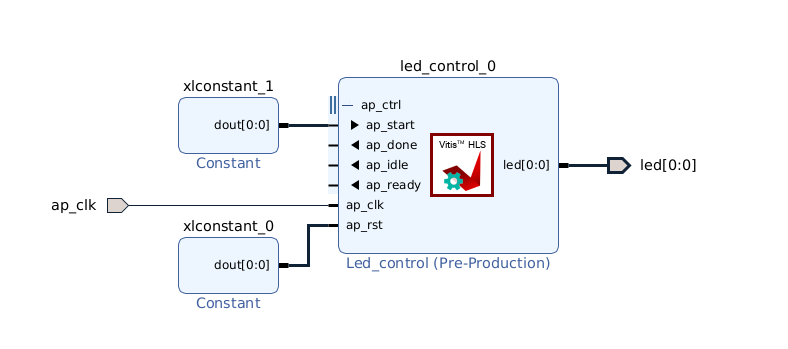

状态指示led
========================================

模块控制block-level
========================================
回顾前面章节我们做的led实验,源代码中插入了“#pragma HLS interface ap_ctrl_none port=return “ ,它的作用是定义该IP无控制端口。通常,一个模块可能需要被外部控制停止、开始。也需要向控制方表明,本模块当前的状态：空闲、运行中、已完成、就绪。这就需要一个接口,hls中,block-level I/O协议为此定义了三种接口：ap_ctrl_none、 ap_ctrl_hs 和 ap_ctrl_chain。ap_ctrl_none无控制信号,ap_ctrl_hs则多出了start、done、idle、ready信号,ap_ctrl_chain则在ap_ctrl_hs基础上多了continue信号。hls中, ap_ctrl_hs为该接口的默认值。在使用中,需要将start置高,如图： 

      
可以看出,选择默认ap_ctrl_hs,使用起来比较麻烦,所以,之前的实验中,我们将其指定为ap_ctrl_none。

可配置的模块
========================================
若led的闪烁频率可通过软件配置,就可以将其作为状态指示灯了。为此,我们修改hls代码如下:

.. code:: c

  #include <ap_int.h>

  void led_register(ap_int<1> &led, int total_cnt, int high_cnt)
  {
  #pragma HLS INTERFACE ap_none port=led
  #pragma HLS INTERFACE s_axilite port=total_cnt
  #pragma HLS INTERFACE s_axilite port=high_cnt
  #pragma HLS INTERFACE ap_ctrl_none port=return
  	led = 0;
  	for(int i=0;i<total_cnt;i++)
  	{
  #pragma HLS LOOP_TRIPCOUNT avg=100000000 max=100000000 min=100000000
  		if(i == high_cnt)
  		led = ~led;
  	}
  }

这里,我们新增了两个参数total_cnt、high_cnt,并将其指定为s_axilite接口,此时软件可通过AXI4-Lite接口来配置这两个参数值。 

工程路径
========================================

.. csv-table:: 
  :header: "名称", "路径"
  :widths: 20, 20

  "Vivado工程","vivado/led_register"
  "HLS工程","hls/ led_register"
  "BOOT.bin文件","bootimage"

实验结果
========================================

程序运行后,可以看到led灯每秒闪烁一次。

  

