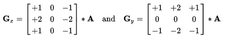
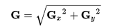

边缘检测
==============================================

实验介绍
==============================================
Sobel算子,也被称为Sobel-Feldman算子,或者Sobel滤波,是在图像处理和计算机视觉得到广泛应用的一种图像边缘检测算法。它由斯坦福大学人工智能实验室（SAIL）的Irwin Sobel和Gray Feldman而得名。
Sobel算子使用两个（3x3）矩阵来对原图进行卷积运算以计算出两个方向的灰度差分（偏导）的估计值（一个水平方向、一个竖直方向）。我们假定A是原始图像（彩色图像需先转换为灰度图像）,Gx和Gy分别是在横向及纵向的灰度偏导的近似值（即两个方向上对原图的平面卷积结果）。数学表达如下：

      
对应的计算过程如下：

Gx = [ f(x+1,y-1)+2*f(x+1,y)+f(x+1,y+1)] - [f(x-1,y-1)+2*f(x-1,y)+f(x-1,y+1) ]

Gy = [ f(x-1,y-1) + 2f(x,y-1) + f(x+1,y-1)] - [f(x-1, y+1) + 2*f(x,y+1)+f(x+1,y+1) 

上式中,f(x,y)为图像A中(x,y)处的灰度值。由此便可以计算出每个点的Gx和Gy。
对于图像中的每个点,其梯度的估计值G便可以通过两个方向的梯度Gx和Gy借由下式得出：

      
模块主要代码
==================================================

.. code:: c

        #include "edge_detector.h"

  void ExtractPixel(XF_TNAME(XF_8UC3,XF_NPPC1)&src,ap_uint<8>dst[3])
  {
  	unsigned int i,j=0;
  	for(i=0;i<24;i+=8)
  	{
  		dst[j]=src.range(i+7,i);
  		j++;
  	}
  }
  
  template<int ROWS,int COLS>
  void thresholding(xf::cv::Mat<XF_8UC1,IMG_MAX_ROWS, IMG_MAX_COLS,XF_NPPC1> &src,
  		xf::cv::Mat<XF_8UC1,IMG_MAX_ROWS, IMG_MAX_COLS,XF_NPPC1> &dst,
  		ap_uint<8>&threshold)
  {
  	XF_TNAME(XF_8UC1,XF_NPPC1) pixel_src, pixel_dst;
  	unsigned int i,j=0;
  	ap_uint<8>value;
  	if(threshold==0)
  	{
  		for(i=0;i<ROWS;i++)
  		{
  			for(j=0;j<COLS;j++)
  			{
  #pragma HLS PIPELINE
  				pixel_src=src.read(i*COLS+j);
  				dst.write(i*COLS+j,pixel_src);
  			}
  		}
  	}
  	else
  	{
  		for(i=0;i<ROWS;i++)
  		{
  			for(j=0;j<COLS;j++)
  			{
  #pragma HLS PIPELINE
  				pixel_src=src.read(i*COLS+j);
  				if(pixel_src>threshold)
  				{
  					pixel_dst=0;
  				}
  				else
  				{
  					pixel_dst=255;
  				}
  				dst.write(i*COLS+j,pixel_dst);
  			}
  		}
  	}
  }
  
  
  template <int ROWS, int COLS>
  void xfrgb2gray(xf::cv::Mat<XF_8UC3, ROWS, COLS, XF_NPPC1>& src,
                  xf::cv::Mat<XF_8UC1, ROWS, COLS, XF_NPPC1>& dst)
  {
  	unsigned int i,j=0;
  	XF_TNAME(XF_8UC3,XF_NPPC1)pixel_src;
  	XF_TNAME(XF_8UC1,XF_NPPC1)pixel_dst;
  	ap_uint<8>value[3];
  	ap_uint<8>gray;
  	for(i=0;i<ROWS;i++)
  	{
  		for(j=0;j<COLS;j++)
  		{
  			pixel_src=src.read(i*COLS+j);
  			ExtractPixel(pixel_src,value);
  			gray=CalculateGRAY(value[0],value[1],value[2]);
  			pixel_dst.range(7,0)=gray;
  			dst.write(i*COLS+j,pixel_dst);
  		}
  	}
  }
  
  
  template<int ROWS,int COLS>
  void AddWeightedKernel(xf::cv::Mat<XF_8UC1,ROWS,COLS,XF_NPPC1>&src1,
  					   float alpha,
  					   xf::cv::Mat<XF_8UC1,ROWS,COLS,XF_NPPC1>&src2,
  					   float beta,
  					   float gamma,
  					   xf::cv::Mat<XF_8UC1,ROWS,COLS,XF_NPPC1>&dst
  					)
  {
  	ap_fixed<16,8,AP_RND>value_src1=alpha;
  	ap_fixed<16,8,AP_RND>value_src2=beta;
  	ap_fixed<16,8,AP_RND>value_src3=gamma;
  	XF_TNAME(XF_8UC1,XF_NPPC1)pixel1;
  	XF_TNAME(XF_8UC1,XF_NPPC1)pixel2;
  	XF_TNAME(XF_8UC1,XF_NPPC1)pixel3;
  	ap_int<24>firstcmp;
  	ap_int<24>secondcmp;
  	ap_int<16>thirdcmp;
  	ap_uint<8>value;
  	ap_uint<8>value_cmp1;
  	ap_uint<8>value_cmp2;
  	unsigned int i,j=0;
  	for(i=0;i<ROWS;i++)
  	{
  		for(j=0;j<COLS;j++)
  		{
  #pragma HLS pipeline
  			pixel1=src1.read(i*COLS+j);
  			pixel2=src2.read(i*COLS+j);
  			value_cmp1=pixel1.range(7,0);
  			value_cmp2=pixel2.range(7,0);
  			firstcmp=(ap_int<24>)value_cmp1*value_src1;
  			secondcmp=(ap_int<24>)value_cmp2*value_src2;
  			thirdcmp=(ap_int<16>)firstcmp+secondcmp+value_src3;
  			if(thirdcmp>255)
  			{
  				thirdcmp=255;
  			}
  			else if(thirdcmp<0)
  			{
  				thirdcmp=0;
  			}
  			value=thirdcmp;
  			pixel3.range(7,0)=value;
  			dst.write(i*COLS+j,pixel3);
  		}
  	}
  }
  
  template<int ROWS,int COLS>
  void xfgray2rgb(xf::cv::Mat<XF_8UC1,ROWS,COLS,XF_NPPC1>&src,xf::cv::Mat<XF_8UC3,ROWS,COLS,XF_NPPC1> &dst)
  {
  	unsigned int i,j=0;
  	XF_TNAME(XF_8UC1,XF_NPPC1)temp_src;
  	XF_TNAME(XF_8UC3,XF_NPPC1)temp_dst;
  	ap_uint<8>value;
  	for(i=0;i<ROWS;i++)
  	{
  		for(j=0;j<COLS;j++)
  		{
  #pragma HLS PIPELINE
  			temp_src=src.read(i*COLS+j);
  			value=temp_src.range(7,0);
  			temp_dst.range(7,0)=value;
  			temp_dst.range(15,8)=value;
  			temp_dst.range(23,16)=value;
  			dst.write(i*COLS+j,temp_dst);
  		}
  	}
  }
  
  void edge_detector(ustream_t &src, ustream_t &dst, ap_uint<8> threshold)
  {
  #pragma HLS DATAFLOW
  #pragma HLS INTERFACE axis port=src
  #pragma HLS INTERFACE axis port=dst
  #pragma HLS INTERFACE mode=s_axilite port=threshold register
  #pragma HLS INTERFACE mode=ap_ctrl_none port=return
  
  	xf::cv::Mat<XF_8UC3,IMG_MAX_ROWS, IMG_MAX_COLS,XF_NPPC1> srcImg;
  #pragma HLS STREAM depth=1920 type=fifo variable=srcImg
  	xf::cv::Mat<XF_8UC3,IMG_MAX_ROWS, IMG_MAX_COLS,XF_NPPC1> rgbSobel;
  #pragma HLS STREAM depth=1920 type=fifo variable=rgbSobel
  	xf::cv::Mat<XF_8UC1,IMG_MAX_ROWS, IMG_MAX_COLS,XF_NPPC1> grayImg;
  #pragma HLS STREAM depth=1920 type=fifo variable=grayImg
  	xf::cv::Mat<XF_8UC1,IMG_MAX_ROWS, IMG_MAX_COLS,XF_NPPC1> sobelImg_x;
  #pragma HLS STREAM depth=1920 variable=sobelImg_x
  	xf::cv::Mat<XF_8UC1,IMG_MAX_ROWS, IMG_MAX_COLS,XF_NPPC1> sobelImg_y;
  #pragma HLS STREAM depth=1920 type=fifo variable=sobelImg_y
  	xf::cv::Mat<XF_8UC1,IMG_MAX_ROWS, IMG_MAX_COLS,XF_NPPC1> sobelImg;
  #pragma HLS STREAM depth=1920 type=fifo variable=sobelImg
  	xf::cv::Mat<XF_8UC1,IMG_MAX_ROWS, IMG_MAX_COLS,XF_NPPC1> thresholdImg;
  #pragma HLS STREAM depth=1920 variable=thresholdImg
  
  	xf::cv::AXIvideo2xfMat(src, srcImg);
  	xfrgb2gray<IMG_MAX_ROWS,IMG_MAX_COLS>(srcImg, grayImg);
      xf::cv::xFSobelFilter3x3<XF_8UC1, XF_8UC1,IMG_MAX_ROWS, IMG_MAX_COLS, XF_CHANNELS(XF_8UC1,XF_NPPC1), XF_DEPTH(XF_8UC1,XF_NPPC1), XF_DEPTH(XF_8UC1,XF_NPPC1),
                      XF_NPPC1,_XFCVDEPTH_DEFAULT,_XFCVDEPTH_DEFAULT,_XFCVDEPTH_DEFAULT,XF_WORDWIDTH(XF_8UC1,XF_NPPC1), XF_WORDWIDTH(XF_8UC1,XF_NPPC1), (IMG_MAX_COLS >> XF_BITSHIFT(XF_NPPC1)),false>(
          grayImg,sobelImg_x,sobelImg_y,grayImg.rows,grayImg.cols>>XF_BITSHIFT(XF_NPPC1));
  	AddWeightedKernel<IMG_MAX_ROWS,IMG_MAX_COLS>(sobelImg_x,0.5f,sobelImg_y,0.5f,0.0f,sobelImg);
  	thresholding<IMG_MAX_ROWS,IMG_MAX_COLS>(sobelImg, thresholdImg,threshold);
  	xfgray2rgb<IMG_MAX_ROWS,IMG_MAX_COLS>(thresholdImg, rgbSobel);
  	xf::cv::xfMat2AXIvideo(rgbSobel, dst);
  }

工程路径
==========================================

.. csv-table:: 
  :header: "名称", "路径"
  :widths: 20, 20

  "vivado 工程","vivado/ edge_detector"
  

