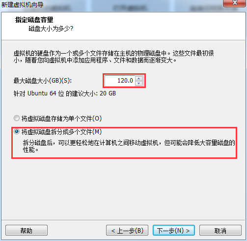
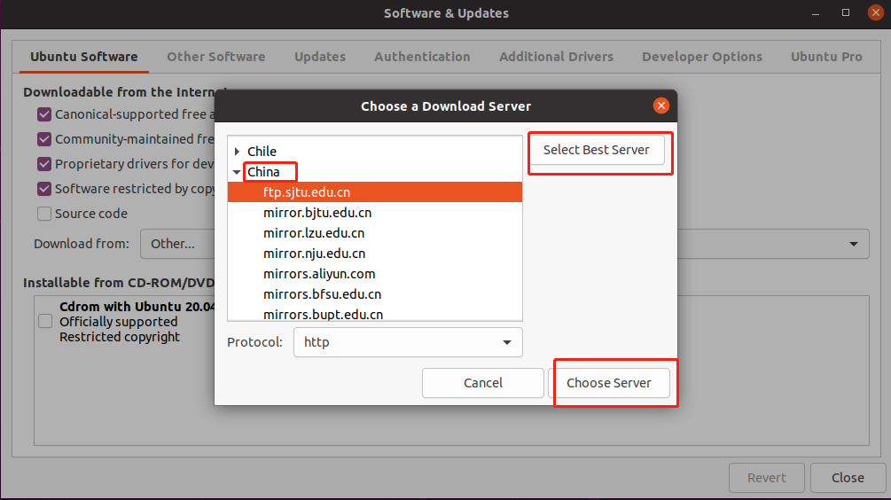
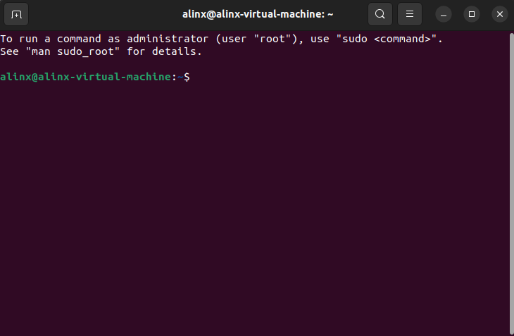

安装虚拟机和Ubuntu系统
======================

后面的教程要涉及到嵌入式Linux开发，一般需要一台Linux操作系统主机，用来编译u-boot或者Linux-kernel。在Windows操作系统的电脑上安装个虚拟机，再在虚拟机上安装Linux操作系统是最便捷的方法了。

虚拟机软件安装
--------------

我们提供的虚拟机的安装软件版本为VMware-worksation-full
12.1.1。用户可以在我们提供的资料里找到, 双击
“VMware-workstation-full-12.1.1-3770994.exe”
图标开始安装。因为安装比较简单，所以具体的安装步骤我们这里不做具体介绍了，用户只要按照默认安装项一直点"Next"按键来进行安装。安装完成的最后一个界面里，我们需要选择许可证来输入一个VMware12的序列号。

.. image:: images/01_media/image1.png

.. image:: images/01_media/image2.png

安装完成后，桌面上有VMware Workstation Pro的图标。

.. image:: images/01_media/image3.png

Ubuntu安装
----------

安装系统
~~~~~~~~

安装好虚拟机后，就要在虚拟机上安装Linux 操作系统了。鉴于ubuntu
Linux桌面操作系统的安装以及配置较为简单，所以我们选择了ubuntu桌面操作系统。

本教程使用Ubuntu 22.4.1 LTS 64位操作系统（ubuntu-22.4.1-desktop-amd64）

如果使用其他版本，可能有不可预料的错误，请保持版本一致，请不要升级系统。

ubuntu安装步骤如下：

1) 双击桌面的VMware Workstation
   Pro的图标，然后在VMware工作界面上点击“创建新的虚拟机”图标。

2) 选择典型，下一步。

.. image:: images/01_media/image5.png

3) 选择"安装程序光盘映像文件(iso)"项，然后点击浏览找到ubunt的光盘映像文件“ubuntu-22.4.1-desktop-amd64.iso”。

.. image:: images/01_media/image6.png

4) 虚拟机名称可以自己修改，安装位置需要选择安装到硬盘空间比较充足的磁盘

5) 设置最大的磁盘大小为300G，我们需要在虚拟机里安装软件，这里预留空间大一些。用户可以根据自己的硬盘空间选择合适的空间尺寸，建议大于等于300G。

6) 选择自定义硬件

.. image:: images/01_media/image9.png

7) 可以根据修改修改内存大小和处理器核心，网络适配器选项，网络连接选择桥接模式，内存建议设置为8G，否则编译会出错。

.. image:: images/01_media/image10.png

8) 点击完成就开始安装Ubuntu了

.. image:: images/01_media/image11.png

9) 安装完成以后进入系统

修改软件源服务器
~~~~~~~~~~~~~~~~

1) 为了以后安装软件方便，我们要设置一下软件源，点击应用菜单，搜索Software
   & Updates

2) 在“Software & Updates”中选择“Other...”

3) 点击“Select Best Server”，可以测试出一个最快的服务器，然后选择“Choose
   Server”，这些操作都是基于虚拟机能够连接互联网的情形。

4) 输入密码，完成软件源修改

.. image:: images/01_media/image15.png

设置bash为默认sh
~~~~~~~~~~~~~~~~

1) Ctrl+Alt+T打开终端

2) 输入命令，Configuring dash选择“No”，回车确认

+-----------------------------------------------------------------------+
| sudo dpkg-reconfigure dash                                            |
+-----------------------------------------------------------------------+

设置屏幕锁定时间
~~~~~~~~~~~~~~~~

为了能复制大文件到Ubuntu系统，我们取消屏幕锁定

.. image:: images/01_media/image18.png

常见问题
--------

虚拟机要求虚拟化支持
~~~~~~~~~~~~~~~~~~~~

1) 如果安装Ubuntu弹出以下的错误信息框的话，用户需要重启电脑，进入BIOS里进行设置。

.. image:: images/01_media/image19.png

重启电脑后，进入到BIOS里，找到Intel虚拟化技术这一项，点击开启。不同的主板，可能名字不太一样。

