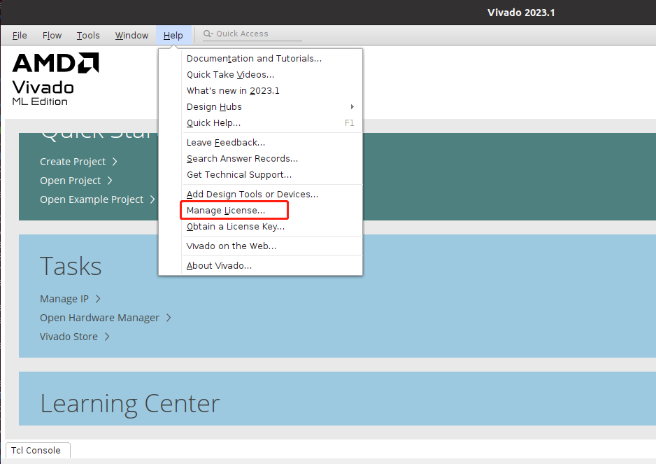
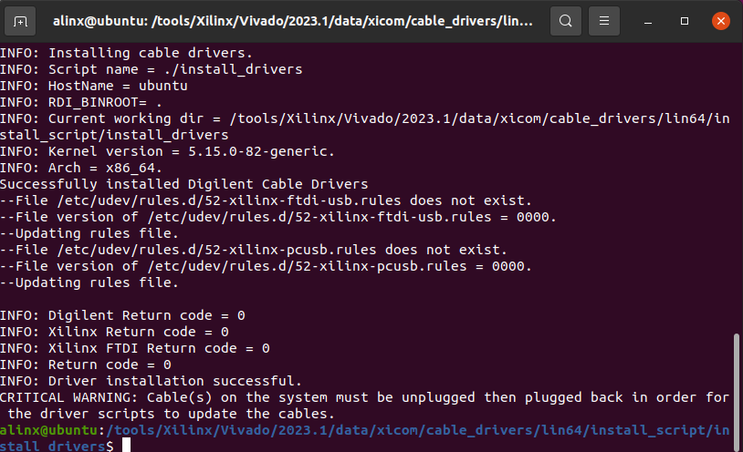
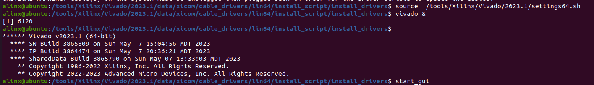

Ubuntu安装Linux版Vitis软件
==========================

虽然Windows下的Vivado软件可以解决大部分问题，可是偶尔我们还要使用Linux版本的Vivado，特别是Vitis，我们可以交叉编译很多应用程序。

安装库
------

在终端输入下面的命令，如果没有安装的话，那么安装vitis就会一直卡住。

+-----------------------------------------------------------------------+
| sudo apt install libncurses5                                          |
|                                                                       |
| sudo apt install libtinfo5                                            |
|                                                                       |
| sudo apt install libncurses5-dev libncursesw5-dev                     |
|                                                                       |
| sudo apt install ncurses-compat-libs                                  |
+-----------------------------------------------------------------------+

安装Linux版Vitis
----------------

1) 复制安装文件到虚拟机 Ubuntu，解压文件。

.. image:: images/02_media/image1.png
   

2) 使用终端进入解压后的

+-----------------------------------------------------------------------+
| cd ~/Downloads/Xilinx_Unified_2023.1_0507_1903/                       |
+-----------------------------------------------------------------------+

3) 运行命令

+-----------------------------------------------------------------------+
| sudo chmod +x xsetup                                                  |
+-----------------------------------------------------------------------+

.. image:: images/02_media/image2.png
   

4) 运行命令，开始安装，需要注意，这里是sudo安装

+-----------------------------------------------------------------------+
| sudo ./xsetup                                                         |
+-----------------------------------------------------------------------+

5) 如果弹出这些窗口，都点击“Ignore”

.. image:: images/02_media/image3.png

.. image:: images/02_media/image4.png

6) 安装过程要求我们关闭杀毒软件

.. image:: images/02_media/image5.png

7) 选择“Vitis”

.. image:: images/02_media/image7.png

8) 根据自己的需求选择对应组件，建议保持默认配置

.. image:: images/02_media/image8.png

9) 勾选所有协议

10) 安装路径使用默认路径

.. image:: images/02_media/image10.png

11) 运行Vivado软件

+-----------------------------------------------------------------------+
| source /tools/Xilinx/Vivado/2023.1/settings64.sh                      |
|                                                                       |
| vivado &                                                              |
+-----------------------------------------------------------------------+

12) 软件启动以后在“Help → Manage license…”添加license文件

13) 先点击“Load License”再点击Copy
    License安装“lic”文件，lic文件和Windows版本通用的，各种版本也是通用的

.. image:: images/02_media/image12.png

权限设置
--------

运行命令添加运行权限

+-----------------------------------------------------------------------+
| sudo chmod 777 -R /tools/Xilinx/                                      |
+-----------------------------------------------------------------------+

安装下载器驱动
--------------

运行下列命令安装下载器驱动

+-----------------------------------------------------------------------+
| cd                                                                    |
| /tools/Xilinx/Vivado/                                                 |
| 2023.1/data/xicom/cable_drivers/lin64/install_script/install_drivers/ |
|                                                                       |
| sudo ./install_drivers                                                |
+-----------------------------------------------------------------------+

测试Vivado
----------

1) 运行下列命令，启动Vivado

+-----------------------------------------------------------------------+
| source /tools/Xilinx/Vivado/2023.1/settings64.sh                      |
|                                                                       |
| vivado &                                                              |
+-----------------------------------------------------------------------+

2) 连接下载器到虚拟机

3) 连接开发板和下载器，使用“Open Hardware
   Manager”测试，正常情况下可以发现芯片，说明Vivado和下载器驱动安装成功

.. image:: images/02_media/image17.png

常见问题
--------

Linux下载器下载时提示被占用
~~~~~~~~~~~~~~~~~~~~~~~~~~~

1) 测试硬件时，能发现下载器，但是有个错误

.. image:: images/02_media/image18.png

2) 有些主板需要设置USB的兼容性，关闭虚拟机的Ubuntu，设置USB兼容性到“USB
   3.0”，再次尝试，如果还不能使用下载器，只能使用Windows版本下载了。

.. image:: images/02_media/image19.png

适合ZYNQ的交叉编译器
~~~~~~~~~~~~~~~~~~~~

在安装Vitis软件里就包含了交叉编译器arm-linux-gnueabihf-gcc。

+-----------------------------------------------------------------------+
| source /tools/Xilinx/Vivado/2023.1/settings64.sh                      |
|                                                                       |
| arm-linux-gnueabihf-gcc -v                                            |
+-----------------------------------------------------------------------+

.. image:: images/02_media/image20.png
