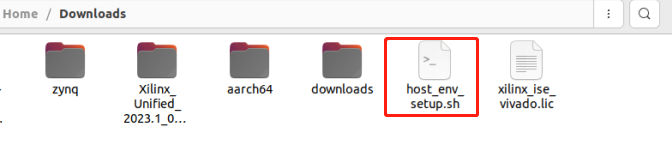
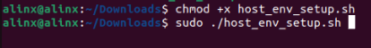
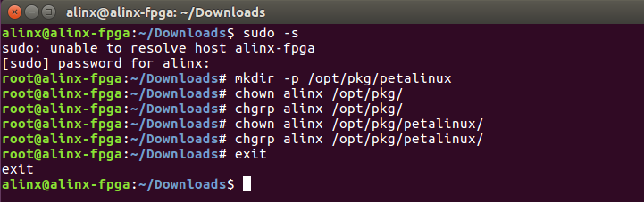
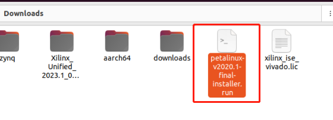
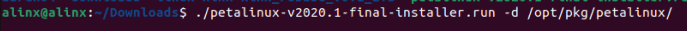
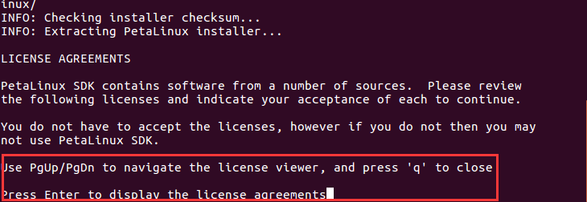
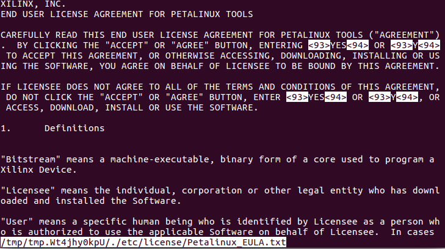
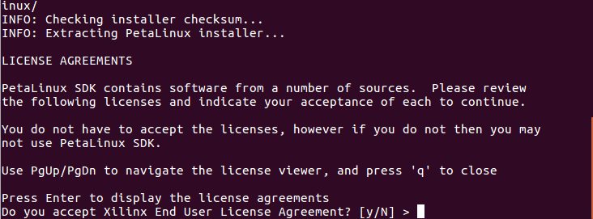
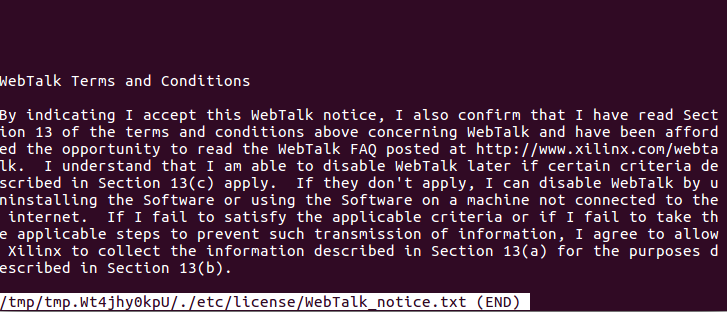
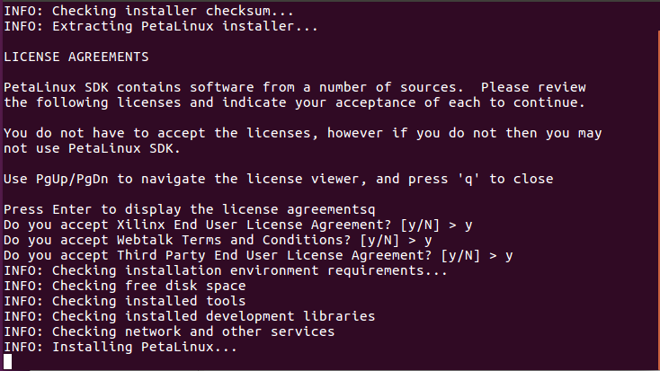

Petalinux工具安装
=================

Petalinux简介
-------------

petalinux并不是一个特殊Linux内核，而是一套开发环境配置的工具，降低uboot、内核、根文件系统的配置的工作量，可以从Vivado的导出硬件信息自动完成相关软件的配置。

这里要特意强调一下，petalinux对系统版本和设置有严格要求，如果使用其他版本操作系统，使用中遇到问题请自行百度解决。

安装必要的库
------------

在Xilinx官方文档UG1144（https://docs.xilinx.com/r/en-US/ug1144-petalinux-tools-reference-guide/Overview）
中有详细安装方法，如果本教程安装失败，请参考Xilinx的ug1144文档进行安装。

我们运行下面SHELL（host_env_setup.sh，这个文件首先必须要有，而且要到文件所在目录运行，建议熟悉Linux教程基本操作，了解如何运行Linux命令等基础知识）安装

1) 将我们提供的host_env_setup.sh复制到Download目录下

   

2) 在文件所在目录下运行下面 SHELL，安装库

   

3) 配置tftp server，如果不需要从TFTP启动，这一步可选

+-----------------------------------------------------------------------+
| sudo -s                                                               |
|                                                                       |
| apt-get install tftpd-hpa                                             |
|                                                                       |
| chmod a+w /var/lib/tftpboot/                                          |
|                                                                       |
| reboot                                                                |
+-----------------------------------------------------------------------+

安装Petalinux
-------------

1) 运行以下命令做安装准备，<your_user_name>为你的用户名，例如图中的alinx

+-----------------------------------------------------------------------+
| sudo -s                                                               |
|                                                                       |
| mkdir -p /opt/pkg/petalinux                                           |
|                                                                       |
| chown <your_user_name> /opt/pkg/                                      |
|                                                                       |
| chgrp <your_user_name> /opt/pkg/                                      |
|                                                                       |
| chgrp <your_user_name> /opt/pkg/petalinux/                            |
|                                                                       |
| chown <your_user_name> /opt/pkg/petalinux/                            |
|                                                                       |
| exit                                                                  |
+-----------------------------------------------------------------------+

2) 将petalinux-v2020.1-final-installer.run 至 ubuntu
   系统下（笔者是复制到 Downloads 的 目录下）

   

3) 给安装文件添加运行权限

+-----------------------------------------------------------------------+
| sudo chmod +x petalinux-v2023.1-05012318-installer.run                |
+-----------------------------------------------------------------------+

4) 开始安装

+-----------------------------------------------------------------------+
| ./petalinux-v2023.1-05012318-installer.run -d /opt/pkg/petalinux/     |
+-----------------------------------------------------------------------+

   

5) 按回车查看协议内容

6) 按q退出协议内容

7) 按y同意协议内容

8) 在安装过程中会弹出License，按“q”退出，然后按“y”同意。

