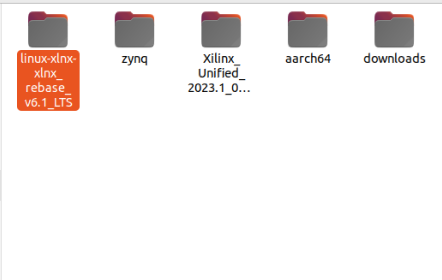
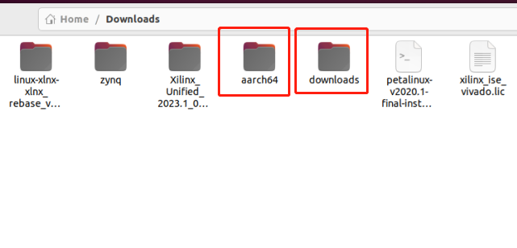
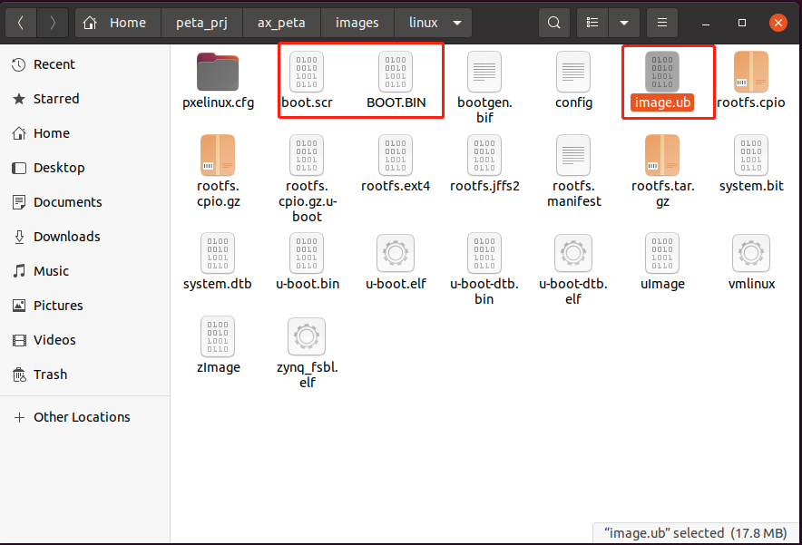

使用Petalinux定制Linux系统
==========================

**实验Vivado工程为“linux_base”,在vivado.zip压缩包中。**

**实验petalinux工程相关文件夹为“ax_peta”**

前面的教程中我们搭建好了Petalinux环境，本教程主要演示如何使用Petalinux。需要注意的是，本实验只有Linux主机可以连接互联网的情况下才能完成。

Vivado工程
----------

使用Petalinux可以非常方便地定制嵌入式Linux系统，只需要Vivado软件把硬件信息导出，然后Petalinux根据这些信息来配置uboot，内核、文件系统等，Vivado工程建立的步骤在其他教程中有详细说明，这里不再讲解，这里可以用直接用我们提供的资料中的xsa文件。将xsa文件复制到虚拟机里。

   

使用Petalinux建立工程
---------------------

1) 在用户目录下，创建一个工作目录，路径中“~”表示用户home路径

+-----------------------------------------------------------------------+
| mkdir -p ~/peta_prj/hardware                                          |
+-----------------------------------------------------------------------+

2) 将vivado导出xsa文件拷贝进hardware文件夹下

注：这里使用的是名为ps_base 的vivado工程导出的xsa文件

3) 进入工程目录

+-----------------------------------------------------------------------+
| cd ~/peta_prj/                                                        |
+-----------------------------------------------------------------------+

4) 设置petalinux环境变量，运行下面命令

+-----------------------------------------------------------------------+
| source /opt/pkg/petalinux/settings.sh                                 |
+-----------------------------------------------------------------------+

5) 运行下面命令设置vivado环境变量

+-----------------------------------------------------------------------+
| source /tools/Xilinx/Vivado/2023.1/settings64.sh                      |
+-----------------------------------------------------------------------+

6) 使用下面命令创建一个petalinux工程，工程名为ax_peta，这个时候petalinux会自动创建一个名为ax_peta的工程。

+-----------------------------------------------------------------------+
| petalinux-create -t project -n ax_peta --template zynq                |
+-----------------------------------------------------------------------+

7) 使用下面的命令进入petalinux工作目录

+-----------------------------------------------------------------------+
| cd ~/peta_prj/ax_peta                                                 |
+-----------------------------------------------------------------------+

8) 配置Petalinux工程的硬件信息，硬件信息目录里只能有一个xsa文件

+-----------------------------------------------------------------------+
| petalinux-config --get-hw-description ../hardware/                    |
+-----------------------------------------------------------------------+

9) 在弹出一个窗口里可以配置petalinux工程，\ **如果配置过后想再次配置，可以运行命令“petalinux-config”来配置**\ 。

.. image:: images/05_media/image3.png
   

10) 在选项Linux Components Selection
    中可以配置uboot和Linux内核的来源，按回车键可进入下一个选择界面。uboot和Linux内核默认是github上下载的，需要Linux主机连接互联网才能下载。本实验将对应的内核都下载到了本地。内核源码和
    u-boot 源码由 xilinx 提供移植好的版本，可以到 xilinx 的 github
    主页下载：https://github.com/Xilinx。在我们资料中提供了修改后的内核源码，而linux教程后续章节
    内容都需要用到我们资料中的内核源码。

注意：①一定要使用和petalinux对应版本；②如果多个petalinux工程都需要使用本地源码，

那么每一个 petalinux 工程都需要单独对应内核源码和 u-boot 源码，
否则其中一个 petalinux 工程修改了源码，
就会影响到其他的工程，教程后面的章节只需要将内核配置为本地的，uboot配置保持不变。

   

将内核源码复制到虚拟机内解压。

   

11) 将linux内核的来源改为本地获取，并配置对应下载的离线包解压后的地址，uboot保持默认。

   

   

   

12) 配置完成后保存设置

13) 退出配置界面等待一段时间

**设置离线编译**
----------------

Petalinux
编译工程默认需要联网下载一些资源，如果网络不佳会编译非常缓慢甚至编译失败。为了解决这个问题，我们可以预先下载两个离线资源包，然后设置 petalinux离线编译这两个离线资源包也可以从 xilinx官网获取:https://www.xilinx.com/support/download/index.html/content/xilinx/en/downloadNav/embedded-design-tools/2023-1.html
下载下图中红框标出来的两个文件。注意，一定要下载 petalinux版本对应的文件，我们使用的 petalinux 版本是 2023.1，就需要找到 2023.1标签中的这两个文件下载。

.. image:: images/05_media/image11.png

1. 将资源包拷贝到虚拟机中并解压。这里笔者解压在/home/Downloads/
   路径下，如下图：

   

2. 在 petalinux 工程中打开终端，输入命令

+-----------------------------------------------------------------------+
| petalinux-config                                                      |
+-----------------------------------------------------------------------+

然后会弹出如下配置界面：

   

3. 选择最下面的“Yocto Settings --->”选顷

   

4. 在“Yocto Settings --->” 界面中，取消选择“Enable Network sstate
   feeds”，选择“”选顷，

修改成如下图的状态：

   

5. 设置“sstate_aarch64”包的路径，选择“Local sstate feeds settings
   --->”选顷，配置相应的解压文件所在路径

+-----------------------------------------------------------------------+
| /home/alinx/Downloads/aarch64                                         |
+-----------------------------------------------------------------------+

   

   

6. 设置“downloads”包的路径，先选择< Exit
   >选项返回到下图的界面，然后选择“Add pre-mirror url --->”选顷

+-----------------------------------------------------------------------+
| file:///home/alinx/Downloads/downloads                                |
+-----------------------------------------------------------------------+

|IMG_256|\ |image1|

7. 选择< Save >选项，然后选择< Exit >选项退出配置界面即可

配置Linux内核
-------------

1) 使用下面命令配置内核，运行命令后又要等待很长一段时间

+-----------------------------------------------------------------------+
|  petalinux-config -c kernel                                           |
+-----------------------------------------------------------------------+

1) 等待一段时间后弹出配置内核的配置界面

.. image:: images/05_media/image21.png
   

3) 由于以太网的phy芯片驱动默认没有打开，需要配置驱动，在选项Device
   Drivers配置驱动

   

4) 然后到Network device support > PHY Device support and infrastructure
   ，选中Micrel PHYs，按Y键。

   

5) 其他的不需要再配置，保存配置并退出

.. image:: images/05_media/image24.png
   

配置根文件系统
--------------

   运行下面的命令配置根文件系统，可以根据需求来配置根文件系统，本实验保持默认配置。

+-----------------------------------------------------------------------+
| petalinux-config -c rootfs                                            |
+-----------------------------------------------------------------------+

   

编译
----

1) 使用下面命令配置编译uboot、内核、根文件系统、设备树等。

+-----------------------------------------------------------------------+
| petalinux-build                                                       |
+-----------------------------------------------------------------------+

注：即便设置了离线编译，但在构建工程时也需要保证ubuntu系统可以连接网络，petalinux需要从github上下载一些源代码

1) 编译完成

生成BOOT文件
------------

运行下面命令生成BOOT文件，“--fpga”指合成 bit 文件到 BOOT.bin 中(注意：
如果你的 xsa 文件中不包含 bitstream，就不要加这个参数)

+-----------------------------------------------------------------------+
| petalinux-package --boot --u-boot --fsbl --fpga --force               |
+-----------------------------------------------------------------------+

测试Linux
---------

1) 将SD卡格式为FAT32格式，可用Ubuntu系统上的Disks软件格式化SD卡，具体操作请参考第九章的9.4制作SD卡文件系统。

2) 将工程目录images ->
   linux目录中的BOOT.BIN、boot.scr及image.ub复制到sd卡的FAT分区。

   

3) 将SD卡插入板卡内，跳线帽选择SD卡启动模式，板卡连接好串口。

   

4) 解压资料中的CP210x_Windows_Drivers压缩包，根据当前系统安装相应的驱动，然后打开putty软件，根据设备管理器中的端口号，在软件中填入相关信息，设置好波特率。

   

   

5) 板卡插上电源，上电启动开发板

6) 使用petalinux登录，密码由用户设置，然后需要再次输入密码，成功后就可以进入系统控制台进行操作，插上网线后（路由器支持自动获取IP），使用ifconfig命令可以看到网络状态。

创建和使用bsp包
---------------

使用petalinux的bsp包，我们可以方便快速的提供我们验证好的petalinux工程给他人使用，或者是使用他人验证好的petalinux工程。只需要掌握创建和使用bsp包的两条命令即可。

1. 创建 bsp包

使用下面的命令即可创建petalinux工程的bsp包到当前打开终端的路径中：

+-----------------------------------------------------------------------+
| petalinux-package --bsp -p ./ax_peta/ --output ax_peta.bsp            |
+-----------------------------------------------------------------------+

-  -p参数后面的路径是petalinux工程的一级路径

-  --output参数后面跟的是bsp包的名称

2. 使用bsp包

使用下面的命令即可用bsp包来创建petalinux工程到当前打开终端的路径中：

+-----------------------------------------------------------------------+
| petalinux-create -t project -n ax7015_qspi -s ./ax_peta.bsp           |
+-----------------------------------------------------------------------+

-  -n参数后面跟的是petalinux工程的名称

-  -s参数后面跟的是我们使用的bsp包的路径

注：如果制作bsp包的工程可以编译成功，那使用bsp包制作的工程也可以直接编译。

常见问题
--------

提示“Bad FIT kernel image format!”无法启动内核
~~~~~~~~~~~~~~~~~~~~~~~~~~~~~~~~~~~~~~~~~~~~~~

解决办法：

将sd卡fat32分区再次格式化，重新放置启动文件。

无法保存文件和配置
~~~~~~~~~~~~~~~~~~

因为petalinux默认文件系统是RAM类型，无法保存，后续教程中可设置为SD卡类型，数据就能保存到SD卡。

输入正确的root账户密码，登不上系统，可以使用petalinux用户登录，然后再切换到root用户
~~~~~~~~~~~~~~~~~~~~~~~~~~~~~~~~~~~~~~~~~~~~~~~~~~~~~~~~~~~~~~~~~~~~~~~~~~~~~~~~~~~

.. image:: images/05_media/image39.png

