使用Vitis开发Linux程序
======================

前面的教程中我们使用petalinux制作了一个嵌入式Linux系统，本实验要做一个Linux应用程序，然后在开发板上运行。本实验需要使用上面的实验中做好的Linux运行环境。

使用Vitis建立Linux应用程序
--------------------------

1) 在/home/alinx/work建立目录linux_app，用于Vitis的工作空间

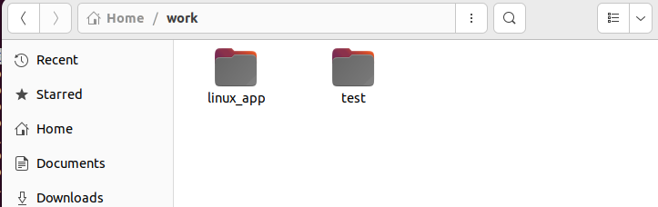

2) 设置Vitis环境变量，运行vitis

+-----------------------------------------------------------------------+
| source /tools/Xilinx/Vitis/2023.1/settings64.sh                       |
|                                                                       |
| vitis                                                                 |
+-----------------------------------------------------------------------+

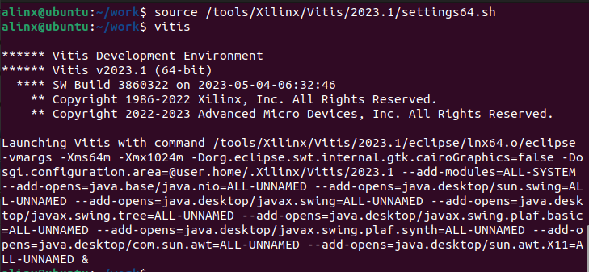

3) 工作空间选/home/alinx/work/linux_app

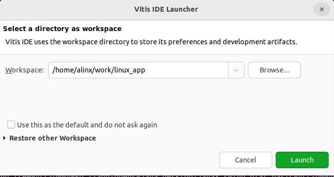

4) 关闭欢迎界面后进入到编辑界面，在Explorer空白处点击右键“New->Project...”

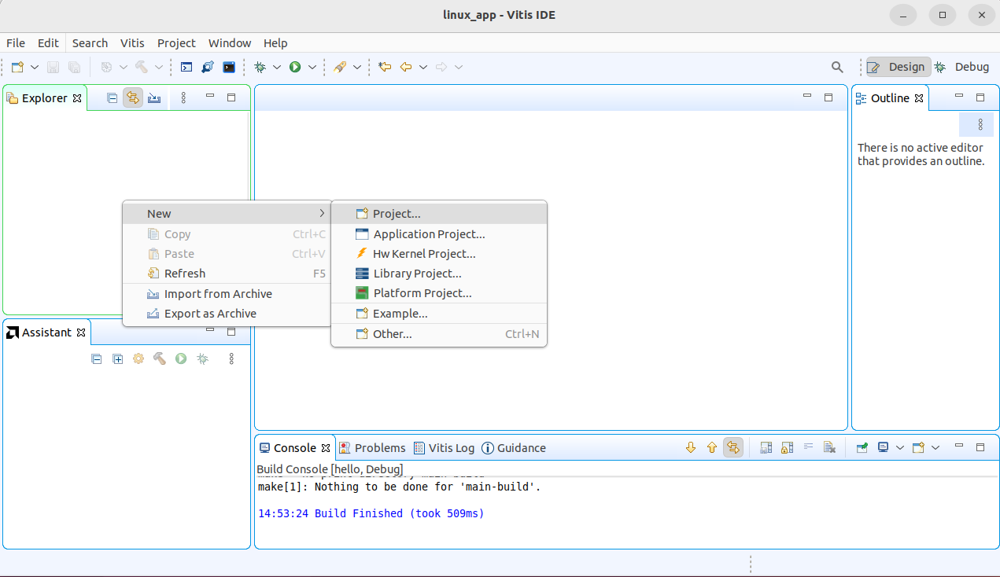

5) 选择“C Project”，就是一个C 语言的一个工程，点击“Next”

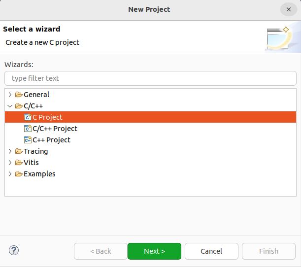

6) 工程名填写“hello”，工程类型选择 Others 文件夹里面的“Xilinx ARM v8 32
   Bit Linux Executable”，然后点击“Finish”

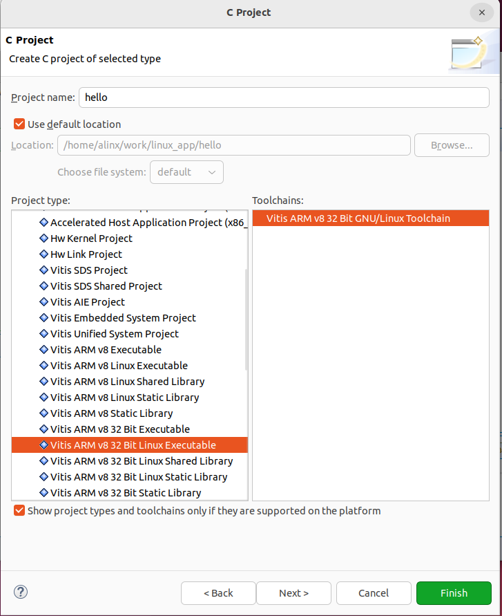

7) 如果弹出下面的信息， 点“No”

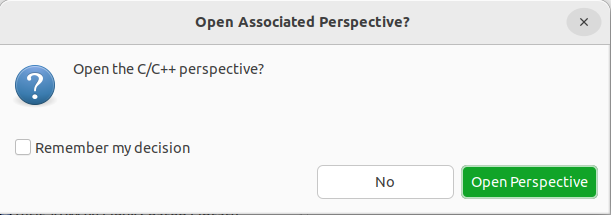

8) 在“Explorer”窗口中右击hello然后选择“New > File”

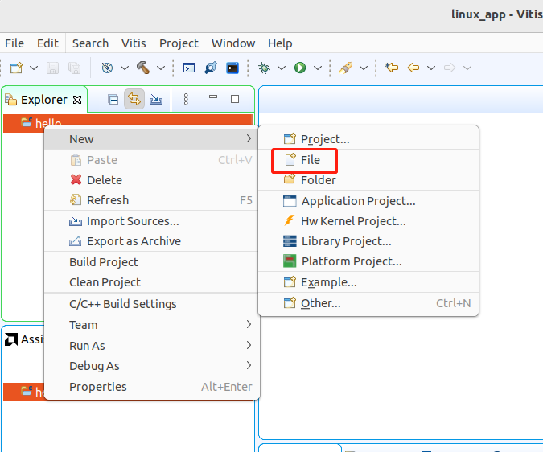

9) 弹出的窗口中，“File
   name：”后面填写文件名，这里命名为“main.c”，然后点“Finish”。

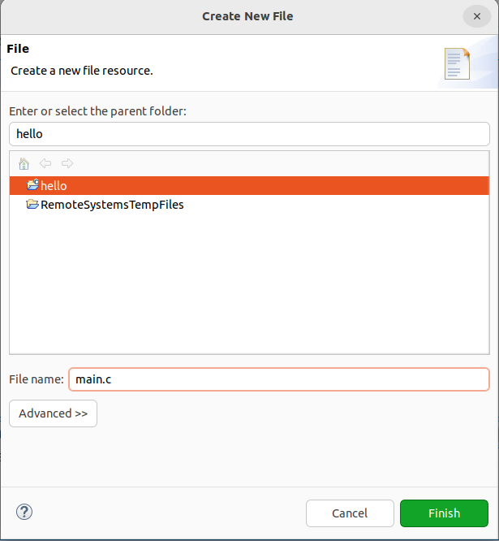

10) 编辑 main.c 文件， 写一个简单的打印

+-----------------------------------------------------------------------+
| **#include**\ <stdio.h>                                               |
|                                                                       |
| **#include**\ <stdlib.h>                                              |
|                                                                       |
| **int** **main**\ ()                                                  |
|                                                                       |
| {                                                                     |
|                                                                       |
| **printf**\ ("hello world!\\n");                                      |
|                                                                       |
| **return** 0;                                                         |
|                                                                       |
| }                                                                     |
+-----------------------------------------------------------------------+

11) 在“hello”目录上右击，然后选择“Build Project”编译工程。

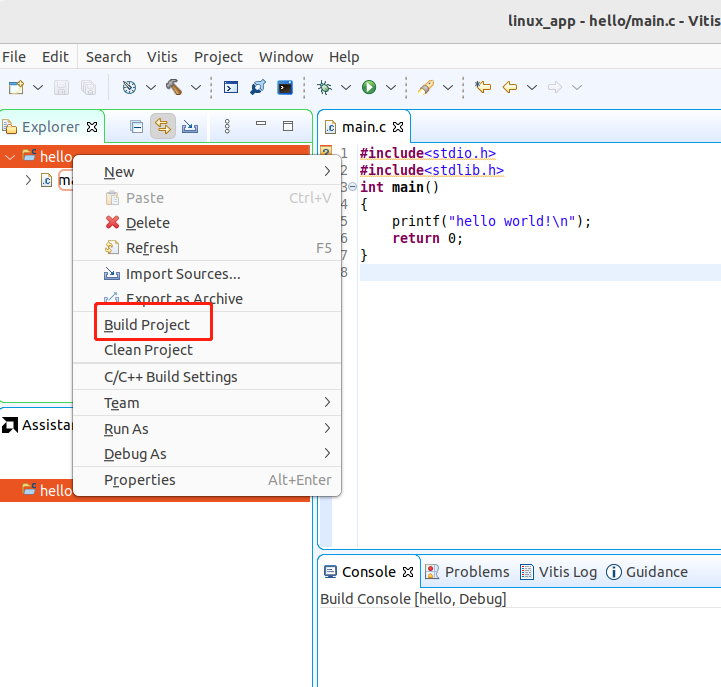

通过NFS共享运行
---------------

1) 开发板插上网线（PS、ETH1，需要路由器支持自动获取IP），上电，挂载Linux主机NFS，其中192.168.1.77为主机地址，/home/alinx/work为NFS目录，/mnt为开发板目录。这里要求主机和开发板在一个网段。

+-----------------------------------------------------------------------+
|    mount -t nfs -o nolock 192.168.8.86:/home/alinx/work /mnt          |
+-----------------------------------------------------------------------+

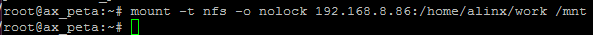

2) 进入/mnt/linux_app/hello/Debug目录，运行hello.elf，我们可以看到打印出Hello
   World。

+-----------------------------------------------------------------------+
| cd /mnt/linux_app/hello/Debug                                         |
|                                                                       |
| ./hello.elf                                                           |
+-----------------------------------------------------------------------+

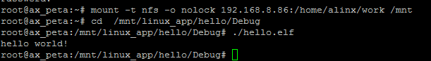
