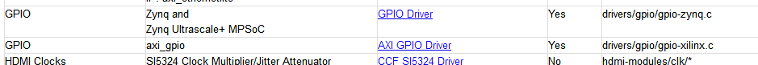
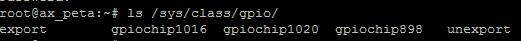
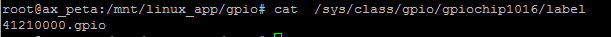

Linux下GPIO实验
===============

前面的教程介绍如何使用Vitis编写一个zynq版本的helloworld实验，本实验介绍如何控制zynq端外设，实验使用GPIO来举例，ZYNQ的GPIO可以分为2种，一种是PS端自带的GPIO，一种是使用PL实现的GPIO，在建立Vivado工程时添加了Xilinx的GPIO
IP，大部分Xilinx提供的IP核在Linux下都已经有驱动，而且很多默认配置都是可以用的，像AXI
GPIO驱动不需要在内核中再配置就可以使用。

在\ http://www.wiki.xilinx.com/Linux+Drivers
页面我们可以找到所有Linux下Xilinx的驱动，例如GPIO驱动如下图所示，有些驱动给出了详细的用法。

在GPIO驱动详细页面\ http://www.wiki.xilinx.com/Linux%20GPIO%20Driver
中介绍了GPIO驱动使用范围，设备树范例，以及如何写程序。

使用SHELL控制
-------------

Linux提供了强大的SHELL功能，也是学习Linux必须掌握的技能，对于不熟悉Linux的命令和SHELL是令人头疼的，但是为了更好地学习ZYNQ，必须熟悉掌握SHELL，本教程不会去详细讲解Linux和SHELL的使用。

通过 ls /sys/class/gpio命令可以查看GPIO编号

gpio_test.sh文件内容如下，gpio_test函数会根据参数来export一个GPIO，然后一个for循环3次，每次先写0再写1，调用了5次gpio_test，依次点亮5个LED，其中898是PS端的，其他是PL端的，（下一节中介绍如何确定GPIO的这个编号）。

+-----------------------------------------------------------------------+
|#!/bin/sh                                                              |
|                                                                       |
|gpio_test() {                                                          |
|                                                                       |
|gpio=$1                                                                |
|                                                                       |
|echo $gpio > /sys/class/gpio/export                                    |
|                                                                       |
|echo out > /sys/class/gpio/gpio${gpio}/direction                       |
|                                                                       |
|for i in $(seq 1 3)                                                    |
|                                                                       |
|do                                                                     |
|                                                                       |
|echo 0 >/sys/class/gpio/gpio${gpio}/value                              |
|                                                                       |
|sleep 1                                                                |
|                                                                       |
|echo 1 >/sys/class/gpio/gpio${gpio}/value                              |
|                                                                       |
|sleep 1                                                                |
|                                                                       |
|done                                                                   |
|                                                                       |
|echo $gpio > /sys/class/gpio/unexport                                  |
|                                                                       |
|}                                                                      |
|                                                                       |
|gpio_test 898                                                          |
|                                                                       |
|gpio_test 1016                                                         |
|                                                                       |
|gpio_test 1017                                                         |
|                                                                       |
|gpio_test 1018                                                         |
+-----------------------------------------------------------------------+

我们可以通过挂载NFS来运行这个SHELL。

如果SHELL不能运行，可以先添加运行权限，命令如下：

+-----------------------------------------------------------------------+
| chmod +x gpio_test.sh                                                 |
+-----------------------------------------------------------------------+

使用C语言控制
-------------

大部分情况我们都需要使用C语言来控制外设，在Xilinx的wiki页面\ http://www.wiki.xilinx.com/GPIO%20User%20Space%20App
我们找到一段GPIO测试代码，代码内容如下：

+-----------------------------------------------------------------------+
| #include <stdio.h>                                                    |
|                                                                       |
| #include <stdlib.h>                                                   |
|                                                                       |
| #include <fcntl.h>                                                    |
|                                                                       |
| // The specific GPIO being used must be setup and replaced thru       |
|                                                                       |
| // this code. The GPIO of 898 is in the path of most the sys dirs     |
|                                                                       |
| // and in the export write.                                           |
|                                                                       |
| //                                                                    |
|                                                                       |
| // Figuring out the exact GPIO was not totally obvious when there     |
|                                                                       |
| // were multiple GPIOs in the system. One way to do is to go into     |
|                                                                       |
| // the gpiochips in /sys/class/gpio and view the label as it should   |
|                                                                       |
| // reflect the address of the GPIO in the system. The name of the     |
|                                                                       |
| // the chip appears to be the 1st GPIO of the controller.             |
|                                                                       |
| //                                                                    |
|                                                                       |
| // The export causes the gpio898 dir to appear in /sys/class/gpio.    |
|                                                                       |
| // Then the direction and value can be changed by writing to them.    |
|                                                                       |
| // The performance of this is pretty good, using a nfs mount,         |
|                                                                       |
| // running on open source linux,                                      |
|                                                                       |
| // the GPIO can be toggled about every 1sec.                          |
|                                                                       |
| // The following commands from the console setup the GPIO to be       |
|                                                                       |
| // exported, set the direction of it to an output and write a 1       |
|                                                                       |
| // to the GPIO.                                                       |
|                                                                       |
| //                                                                    |
|                                                                       |
| // bash> echo 898 > /sys/class/gpio/export                            |
|                                                                       |
| // bash> echo out > /sys/class/gpio/gpio898/direction                 |
|                                                                       |
| // bash> echo 1 > /sys/class/gpio/gpio898/value                       |
|                                                                       |
| // if sysfs is not mounted on your system, the you need to mount it   |
|                                                                       |
| // bash> mount -t sysfs sysfs /sys                                    |
|                                                                       |
| // the following bash script to toggle the gpio is also handy for     |
|                                                                       |
| // testing                                                            |
|                                                                       |
| //                                                                    |
|                                                                       |
| // while [ 1 ]; do                                                    |
|                                                                       |
| // echo 1 > /sys/class/gpio/gpio898/value                             |
|                                                                       |
| // echo 0 > /sys/class/gpio/gpio898/value                             |
|                                                                       |
| // done                                                               |
|                                                                       |
| // to compile this, use the following command                         |
|                                                                       |
| // gcc gpio.c -o gpio                                                 |
|                                                                       |
| // The kernel needs the following configuration to make this work.    |
|                                                                       |
| //                                                                    |
|                                                                       |
| // CONFIG_GPIO_SYSFS=y                                                |
|                                                                       |
| // CONFIG_SYSFS=y                                                     |
|                                                                       |
| // CONFIG_EXPERIMENTAL=y                                              |
|                                                                       |
| // CONFIG_GPIO_XILINX=y                                               |
|                                                                       |
| int main\ **()**                                                      |
|                                                                       |
| **{**                                                                 |
|                                                                       |
| int valuefd\ **,** exportfd\ **,** directionfd\ **;**                 |
|                                                                       |
| printf\ **(**"GPIO test running...\\n"**);**                          |
|                                                                       |
| // The GPIO has to be exported to be able to see it                   |
|                                                                       |
| // in sysfs                                                           |
|                                                                       |
| exportfd **=** open\ **(**"/sys/class/gpio/export"**,**               |
| O_WRONLY\ **);**                                                      |
|                                                                       |
| **if** **(**\ exportfd **<** 0\ **)**                                 |
|                                                                       |
| **{**                                                                 |
|                                                                       |
| printf\ **(**"Cannot open GPIO to export it\\n"**);**                 |
|                                                                       |
| exit\ **(**\ 1\ **);**                                                |
|                                                                       |
| **}**                                                                 |
|                                                                       |
| write\ **(**\ exportfd\ **,** "898"**,** 4\ **);**                    |
|                                                                       |
| close\ **(**\ exportfd\ **);**                                        |
|                                                                       |
| printf\ **(**"GPIO exported successfully\\n"**);**                    |
|                                                                       |
| // Update the direction of the GPIO to be an output                   |
|                                                                       |
| directionfd **=** open\ **(**"/sys/class/gpio/gpio898/direction"**,** |
| O_RDWR\ **);**                                                        |
|                                                                       |
| **if** **(**\ directionfd **<** 0\ **)**                              |
|                                                                       |
| **{**                                                                 |
|                                                                       |
| printf\ **(**"Cannot open GPIO direction it\\n"**);**                 |
|                                                                       |
| exit\ **(**\ 1\ **);**                                                |
|                                                                       |
| **}**                                                                 |
|                                                                       |
| write\ **(**\ directionfd\ **,** "out"**,** 4\ **);**                 |
|                                                                       |
| close\ **(**\ directionfd\ **);**                                     |
|                                                                       |
| printf\ **(**"GPIO direction set as output successfully\\n"**);**     |
|                                                                       |
| // Get the GPIO value ready to be toggled                             |
|                                                                       |
| valuefd = open("/sys/class/gpio/gpio898/value", O_RDWR);              |
|                                                                       |
| if (valuefd < 0)                                                      |
|                                                                       |
| {                                                                     |
|                                                                       |
| printf("Cannot open GPIO value\\n");                                  |
|                                                                       |
| exit(1);                                                              |
|                                                                       |
| }                                                                     |
|                                                                       |
| printf("GPIO value opened, now toggling...\\n");                      |
|                                                                       |
| // toggle the GPIO as fast a possible forever, a control c is needed  |
|                                                                       |
| // to stop it                                                         |
|                                                                       |
| while (1)                                                             |
|                                                                       |
| {                                                                     |
|                                                                       |
| write(valuefd,"1", 2);                                                |
|                                                                       |
| sleep(1);                                                             |
|                                                                       |
| write(valuefd,"0", 2);                                                |
|                                                                       |
| sleep(1);                                                             |
|                                                                       |
| }                                                                     |
|                                                                       |
| }                                                                     |
+-----------------------------------------------------------------------+

这一次我们不再使用vitis来编译，源代码命名为“gpio.c”,运行下面命令编译代码

+-----------------------------------------------------------------------+
| source /tools/Xilinx/Vivado/2023.1/settings64.sh                      |
|                                                                       |
| arm-linux-gnueabihf-gcc gpio.c -o gpio                                |
+-----------------------------------------------------------------------+

编译完成以后会生成一个gpio的文件，不像在Windows，Linux下对扩展名要求不是很严格，gpio文件就是一个elf文件。

运行gpio，可以看到PS端LED不断闪烁，说明这个898就是PS端第一个LED。

如何确定GPIO的这个编号？
~~~~~~~~~~~~~~~~~~~~~~~~

通过下面命令，我们可以看到有gpiochip898 gpiochip1016
gpiochip1020，说明有三个GPIO控制器，数字是控制器GPIO基数。

+-----------------------------------------------------------------------+
| ls /sys/class/gpio                                                    |
+-----------------------------------------------------------------------+

如何确定和物理GPIO的关系？
~~~~~~~~~~~~~~~~~~~~~~~~~~

通过下面命令，来确定GPIO1016和物理GPIO的关系，可以看到这个gpio在设备树里的节点是“gpio@41210000”，通过设备树的节点我们可以确定是哪一个物理GPIO。

+-----------------------------------------------------------------------+
| cat /sys/class/gpio/gpiochip1016/label                                |
+-----------------------------------------------------------------------+

实验总结
--------

本实验重点在于如何通过Xilinx给的资料来学习ZYNQ，技术资料更新较快，只有紧跟芯片厂商提供的最新资料才能获取到最新最好的技术。后续教程中PCIe驱动、PL端以太网驱动都是Xilinx提供，这些资料都可以通过wiki获取。

如果使用一个非xilinx的IP，或者自己写的IP，那就要自己开发驱动程序，这对没做过Linux驱动的开发人员来说是一个挑战，所以我们尽可能使用Xilinx的IP来搭建系统，优点就是不用开发Linux驱动，缺点就是不够灵活，如果IP有问题或者驱动有问题，无法快速定位问题。
