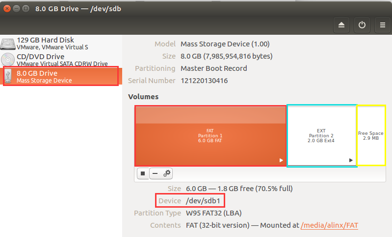

使用Debian桌面系统
==================

**实验Vivado工程为“linux_base” ,在vivado.zip压缩包中。**

**实验petalinux工程相关文件夹为“ax_peta_debian”**

前面的教程中我们学习了如何使用Petalinux定制一个嵌入式Linux系统以及HDMI显示，本实验将做一个基于Debian的根文件系统，根文件系统的制作比较复杂，本章不再讲解，直接使用制作好的Debian根文件系统。

Petalinux配置
-------------

由于Debian根文件系统比较大，QSPI
flash是无法放下的，只能放在sd卡或emmc里，所以我们要配置Petalinux。

本实验还是在前面HDMI实验的Petalinux工程基础上进行修改的，需要先掌握前面的实验内容。

1) 打开终端，进入前面实验中的Petalinux工程目录

2) 设置petalinux环境变量，运行下面命令

+-----------------------------------------------------------------------+
| source /opt/pkg/petalinux/settings.sh                                 |
+-----------------------------------------------------------------------+

3) 运行下面命令设置vivado环境变量

+-----------------------------------------------------------------------+
| source /tools/Xilinx/Vivado/2023.1/settings64.sh                      |
+-----------------------------------------------------------------------+

4) 使用下面命令重新配置petalinux

+-----------------------------------------------------------------------+
| petalinux-config                                                      |
+-----------------------------------------------------------------------+

5) 在Image Packaging Configuration --> Root filesystem type选项中选择SD
   card，把根文件系统放在SD卡中。

   

6) 保存并退出

.. image:: images/09_media/image4.png
   

配置Linux内核
-------------

1) 运行下面的命令配置内核

+-----------------------------------------------------------------------+
| petalinux-config -c kernel                                            |
+-----------------------------------------------------------------------+

配置USB WIFI模块驱动
~~~~~~~~~~~~~~~~~~~~

1) 在选项Networking Support -> Wireless -> 选项中先选择cfg80211 -
   wireless configuration API再选择Generic IEEE 802.11 Networking Stack
   (mac80211)

   

2) 在选项Device Drivers -> Network device support -> Wireless LAN ->
   Realtek rtlwifi family of devices选择Realtek RTL8192CU/RTL8188CU USB
   Wireless Network Adapter

   

配置USB摄像头驱动
~~~~~~~~~~~~~~~~~

1) 在选项Device Drivers  ---> Multimedia support  ---> Media drivers--->
   Media USB Adapters  ---> 中使能 USB Video Class (UVC)

.. image:: images/09_media/image8.png
   

2) 保存并退出

编译测试Petalinux工程
---------------------

1) 使用下面命令配置编译uboot、内核、根文件系统、设备树等。

+-----------------------------------------------------------------------+
|   petalinux-build                                                     |
+-----------------------------------------------------------------------+

.. image:: images/09_media/image9.png

2) 运行下面命令生成BOOT.BIN文件，注意空格和短线

+-----------------------------------------------------------------------+
| petalinux-package --boot --u-boot --fsbl --fpga --force               |
+-----------------------------------------------------------------------+

制作SD卡文件系统
----------------

制作SD卡文件系统会导致SD卡里内容丢失，请先做好备份。

SD卡修改分区
~~~~~~~~~~~~

1) 把开发板的sd卡插入读卡器，然后插入电脑的USB口

2) 连接到虚拟机Linux中

.. image:: images/09_media/image10.png

3) 在 ubuntu的搜索路径中，输入disk，会出现Disks的图标

   

4) 鼠标点击Disks图标，出现"Disks"的对话框，本实验中SD卡已经分为2个分区，一个名为FAT，一个名为EXT，这里要重新分区。

5) 选择每个分区下面的删除分区图标，删除所有分区。

6) 点击添加分区的图标，添加第一个分区，本实验填写5000MB，格式为FAT，用于存放ZYNQ的启动文件BOOT.bin,
   image.ub和boot.scr ，名称为FAT

7) 创建第二个分区，用于存放根文件系统，格式为EXT4，名称为EXT

8) 创建分区完成后重新插入sd卡

.. image:: images/09_media/image17.png

9) 系统会自动挂载分区，并弹出窗口

同步根文件系统到SD卡EXT4分区
~~~~~~~~~~~~~~~~~~~~~~~~~~~~

1) 复制资料中的debian根文件系统的压缩包到Linux主机（实验复制在“/home/alinx/work”目录下）

   

2) 输入解压缩命令"tar -xzvf txt.tar.gz -C /media/alinx/EXT4/
   "，解压缩文件系统，-C选项后面的路径是EXT分区所在的路径。解压缩可能需要几分钟的时间。\ **请注意解压方式，必须和教程一致**\ 。

   

3) 输入sync命令，等待系统把解压后的文件同步到SD卡中，需要等待一段时间，当命令行中重新出现命令提示符时，表示同步的过程结束。

   

4) 把BOOT.bin，iamge.ub，boot.scr复制到sd
   的FAT32分区（第一分区）中，设置开发板sd模式启动，插上HDMI显示器，启动开发板。

.. image:: images/09_media/image22.png
   

5) SD卡制作完成后，把制作好后的SD卡插入到开发板的SD卡插槽内。连接USB串口线，连接HDMI显示器，开发板上电后在HDMI显示器上会显示Debian的操作系统的界面。另外在串口工具里我们可以看到操作系统启动的过程,
   运行u-boot之后开始运行Linux,账号: root，密码：root

6) 进入系统后使用ifconfig命令查看网络连接

