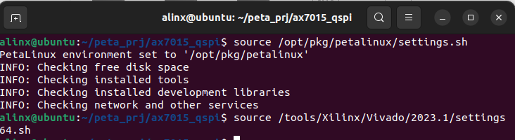
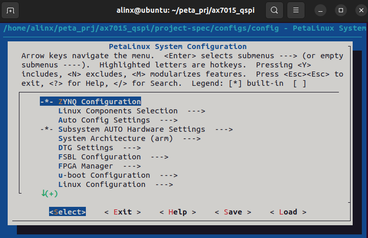
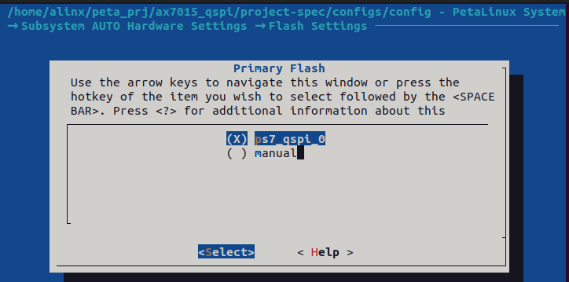
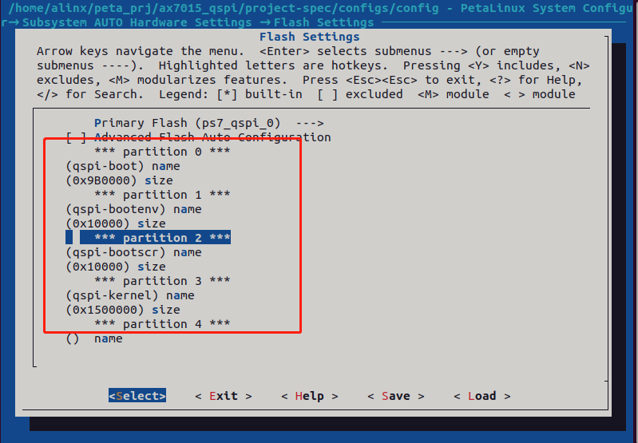
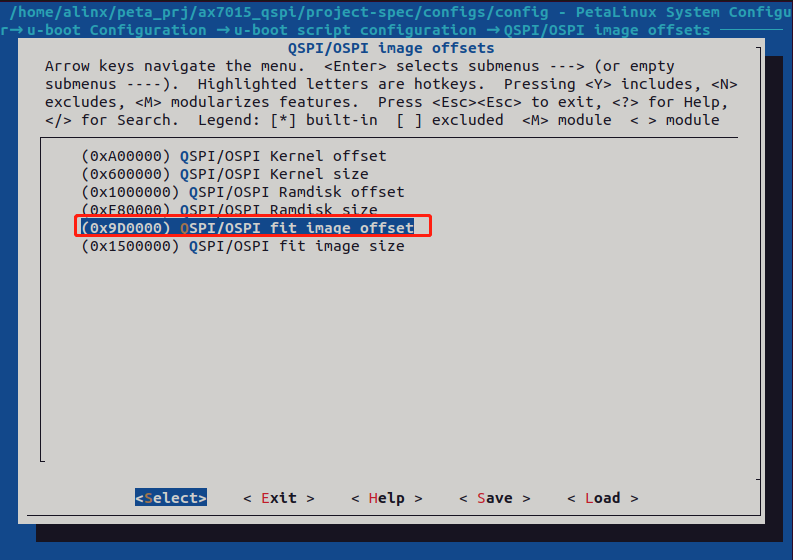
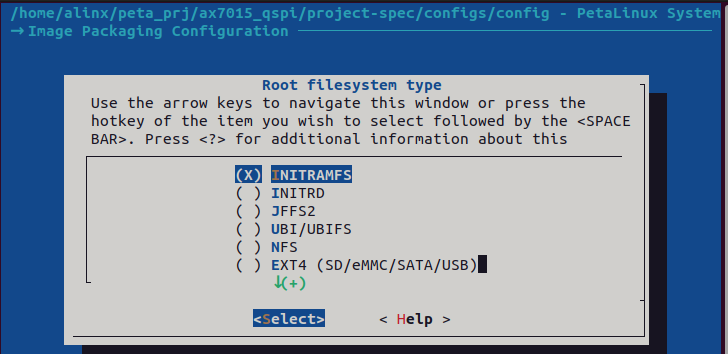
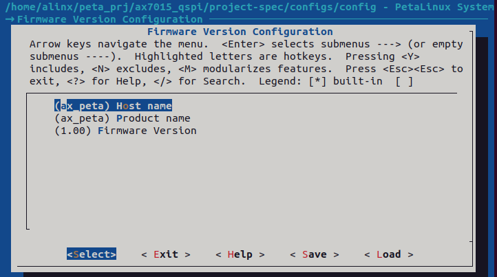
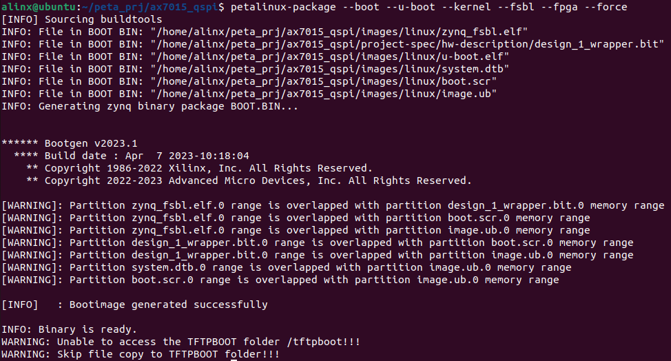

制作QSPI Flash启动的Linux
=========================

**实验Vivado工程为“linux_base” ,在vivado.zip压缩包中。**

**实验petalinux工程相关文件夹为“ax_peta_qspi”**

前面教程讲解的Linux都是在SD里启动，本实验讲解如何使用Petalinux制作一个从QSPI
Flash启动的Linux。

创建Petalinux工程
-----------------

前面的HDMI教程中我们建立了一个基于BSP包创建的工程，这里我们可以直接使用该工程，后面如果需要创建新的工程，工程配置又和之前工程差别不大的情况下，就可以直接使用之前的工程，当然也可以用对应章节资料的BSP包重新创建工程。

配置编译Petalinux
-----------------

1) 使用下面命令设置环境变量

+-----------------------------------------------------------------------+
| source /opt/pkg/petalinux/settings.sh                                 |
|                                                                       |
| source /tools/Xilinx/Vivado/2023.1/settings64.sh                      |
+-----------------------------------------------------------------------+

2) 使用petalinux-config命令配置Petalinux

3) 在Subsystem AUTO Hardware Settings ---> Flash Settings ---> Primary
   flash 选项中选择要使用的flash设备

4) Subsystem AUTO Hardware Settings → Flash Settings中可以修改QSPI
   flash的分区，需要按照下图调整一下大小，注意：u-boot的默认加载地址为0x9C0000。

-  boot分区中存放描述FPGA的.bit文件、u-boot、fsbl、设备树.dtb等文件。boot分区的大小需要大于这些文件大小总和，需要根据实际情况修改。

-  bootenv分区存放u-boot的环境变量，根据实际情况修改。

-  kernel分区存放image.ub，分区大于image.ub即可，需要根据实际情况修改。

-  bootscr分区存放boot.scr，分区大于boot.scr即可，需要根据实际情况修改。

-  另外需要注意，所有打包文件的大小总和，不能超过flash的大小。

5) 在u-boot Configuration → u-boot script configuration → QSPI/OSPI
   image offsets中更改下图中的QSPI/OSPI fit image
   offset选项，将偏移量改为0x9D0000，放在boot.scr文件的后面，需要与上一步中的地址对应。

6) 在Image Packaging Configuration ---> Root filesystem
   type选择INITRAMFS，使用RAM类型的根文件系统，这样就可以方便打包烧写到QSPI
   Flash。

7) 在Firmware Version Configuration ---> 中可以修改Host name等信息

8) 保存后，使用petalinux-build命令编译工程

9) 编译成功后，使用下面命令合成BOOT.bin，使用--kernel选项把内核编译进BOOT.bin，此处参照官方文档进行了内核偏移量的指定，不然会打包不成功。

+-----------------------------------------------------------------------+
| petalinux-package --boot --u-boot --kernel --fsbl --fpga --force      |
+-----------------------------------------------------------------------+

10) 可以参考S2教程“固化程序”章节内容将 BOOT.bin 烧写到 QSPI Flash。

11) 调整启动模式为QSPI，将跳线帽接到QSPI启动。
