OpenCV应用（USB摄像头显示）
===========================

**例程相关文件夹： opencv_usb_camera**

本章讲解如何编译OpenCV库，包括Ubuntu主机版和ZYNQ版。同样，芯驿电子为大家准备好了源代码包和编译脚本，从名称可以看出，OpenCV版本为3.1.0。本实验还是在前面HDMI实验的Petalinux工程基础上进行修改的，需要先掌握前面的实验内容。

   

配置USB摄像头驱动
-----------------

1) 运行下面的命令配置内核

+-----------------------------------------------------------------------+
| petalinux-config -c kernel                                            |
+-----------------------------------------------------------------------+

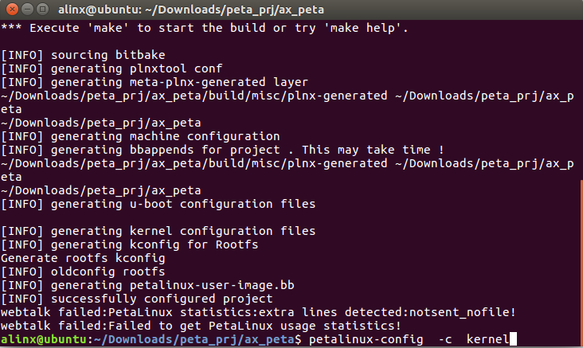

2) 在选项Device Drivers  ---> Multimedia support  ---> Media drivers--->
   Media USB Adapters  ---> 中使能 USB Video Class (UVC)

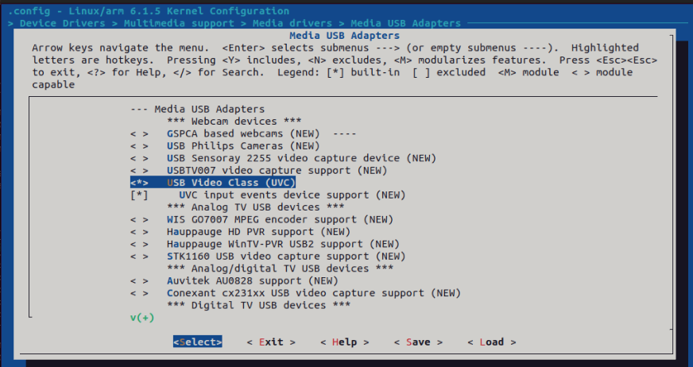
   

3) 在选项Device Drivers  --->Input device support中使能Mouse interface

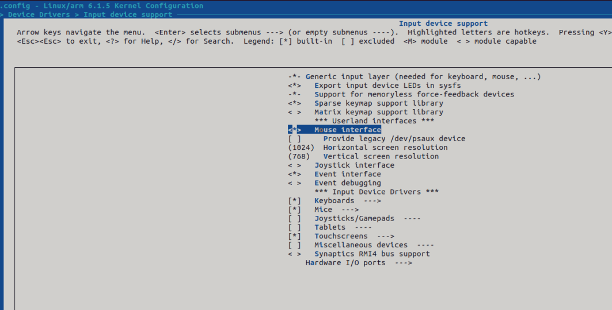
   

4) 保存并退出

host版OpenCV库编译
------------------

1) 解压源码包

2) “src_pkg”里就是源码，“build_host.sh”是编译Ubuntu版本OpenCV的脚本，“build_zynq.sh”是编译ZYNQ版本的脚本，“make_img.sh”是制作ZYNQ版本库镜像的脚本

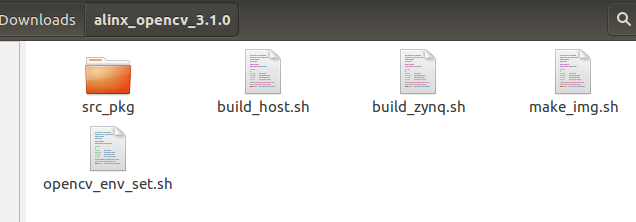

3) 安装cmake

+-----------------------------------------------------------------------+
| sudo apt-get install cmake                                            |
+-----------------------------------------------------------------------+

4) 在终端运行“build_host.sh”，会提示输入账号密码，输入密码，继续运行

   

5) 编译完成

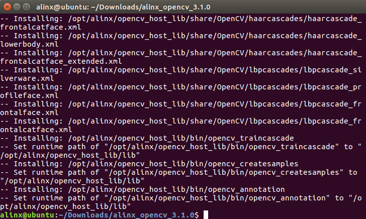

6) 在/opt/alinx/opencv_host_lib目录下可以看到编译好的OpenCV库，“include”目录为头文件，“lib”为库。

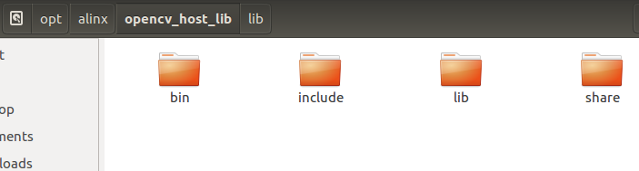

zynq版OpenCV库编译
------------------

1) 和host版本编译类型，运行“build_zynq.sh”编译ZYNQ版本的OpenCV库，需要输入账号密码后就开始了漫长的编译等待时间

   

2) /opt/alinx/opencv_zynq_lib目录就是编译出来的ZYNQ版本OpenCV库

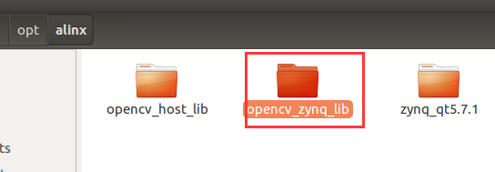

3) 运行make_img.sh制作OpenCV库的镜像，需要输入账号密码

   

4) zynq_cv_lib.img文件就是制作好的OpenCV库镜像

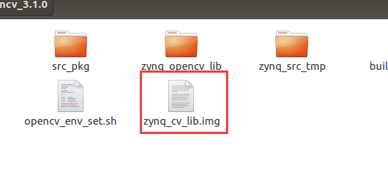

测试host版OpenCV
----------------

实验给出一个QT工程，工程中使用OpenCV进行YUV到RGB的颜色空间转换，其他更复杂的例子开发者可以自行开发，需要说明的是，在嵌入式上运行OpenCV和Ubuntu
主机会有效差异。

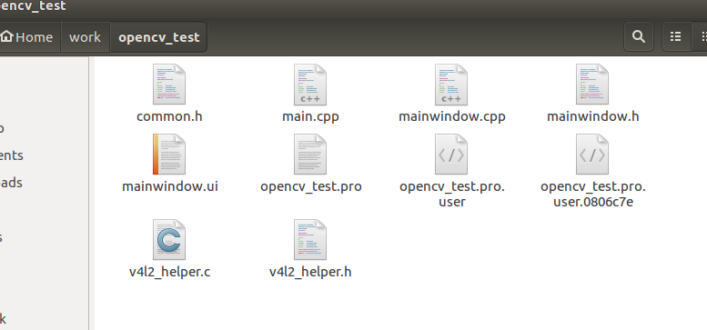

5) 运行QT Creator，打开opencv_test工程

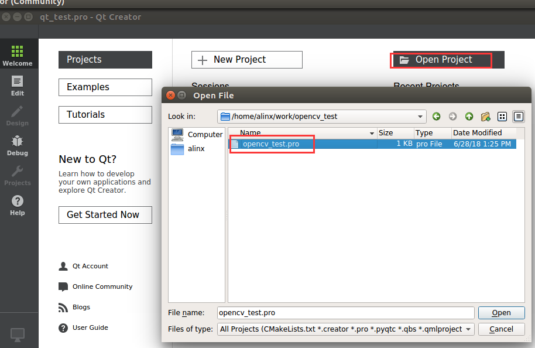

6) 如果出现下图对话框，选择“No”

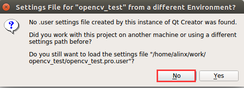

7) 选中ZYNQ kit，点击“Configure Project”

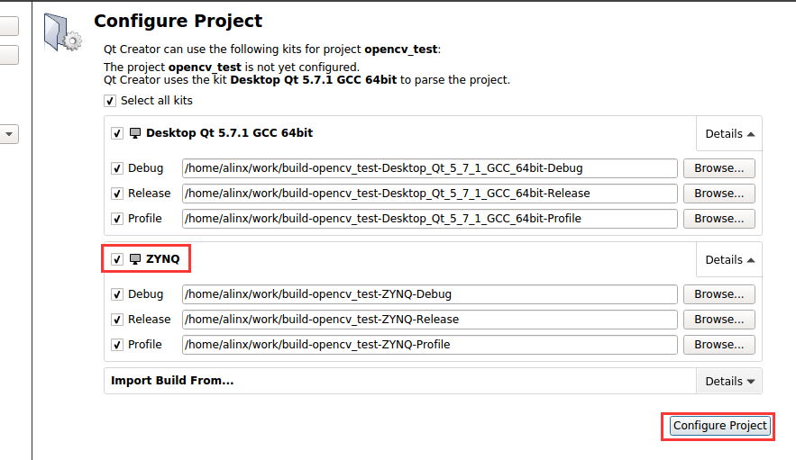

8) 双击“opencv_test.pro”文件可以看到设置了ZYNQ和HOST版本的OpenCV库的路径，根据实际情况修改，如果前面的库都是按默认配置编译这里不需要修改。

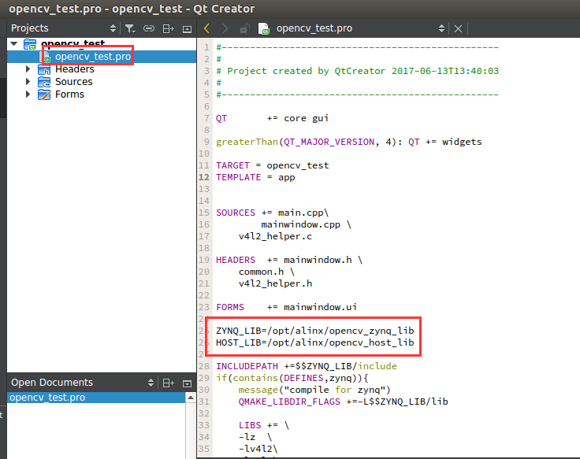

9) 设置host版运行环境变量，在LD_LIBRARY_PATH选项后面添加“:/opt/alinx/opencv_host_lib/lib”

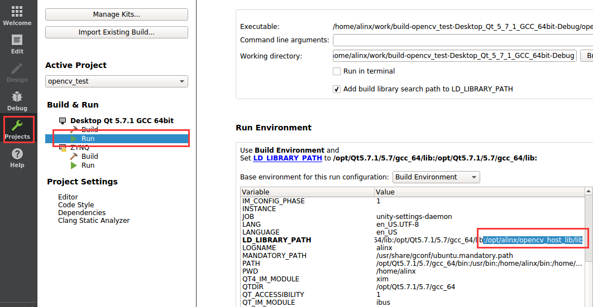

10) 连接USB摄像头到Ubuntu主机中

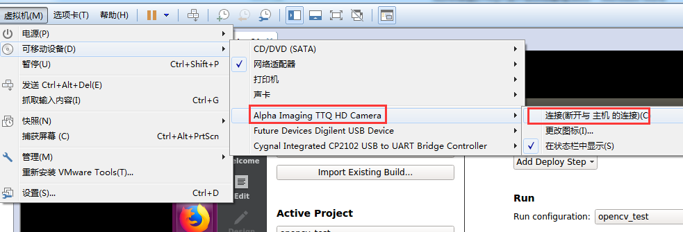

11) 运行host版本测试程序

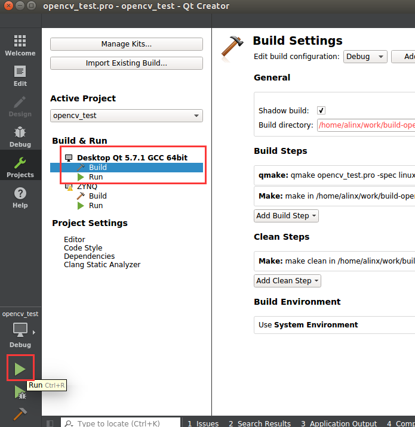

12) 点击open即可打开USB摄像头

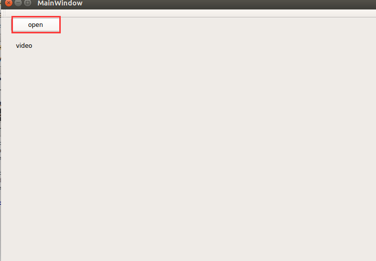

测试zynq版OpenCV 
-----------------

1) 在zynq的kit设置里添加额外的编译选项DEFINES+=zynq，定义一个zynq宏

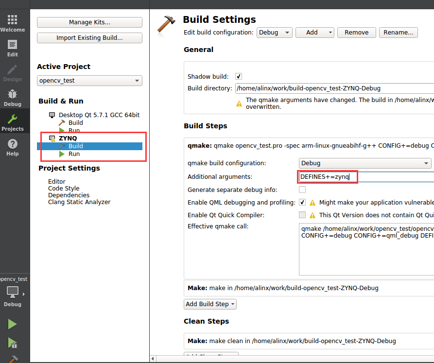

2) 点击锤子图标编译

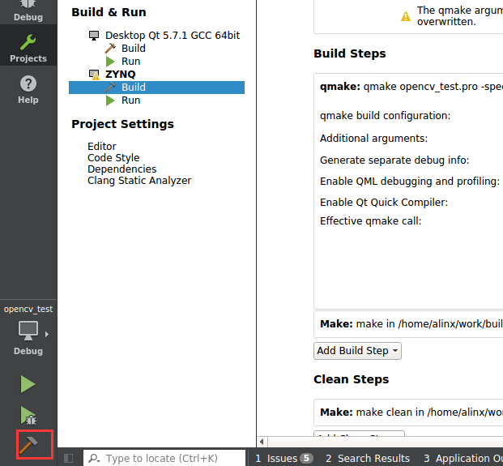

3) 准备好开发板，连接好显示器，将例程给的BOOT.BIN，image.ub复制到sd卡（sd_boot目录），建议先格式化sd卡，再复制。

4) 使用串口终端登录系统，默认账户root，密码root

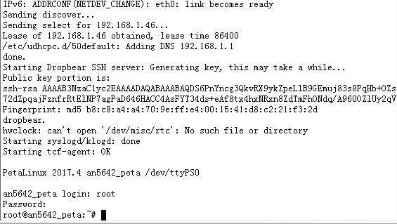

5) 挂载NFS，设置QT运行环境

+-----------------------------------------------------------------------+
| mount -t nfs -o nolock 192.168.1.55:/home/alinx/work /mnt             |
|                                                                       |
| cd /mnt                                                               |
|                                                                       |
| mkdir /tmp/qt                                                         |
|                                                                       |
| mount qt_lib.img /tmp/qt                                              |
|                                                                       |
| cd /tmp/qt                                                            |
|                                                                       |
| source ./qt_env_set.sh                                                |
+-----------------------------------------------------------------------+

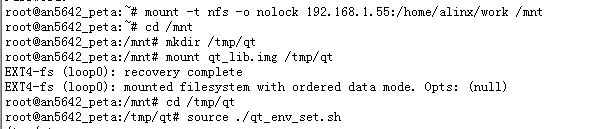

6) 复制zynq_cv_lib.img到/home/alinx/work文件夹，设置OpenCV库环境

+-----------------------------------------------------------------------+
| mkdir /tmp/cv                                                         |
|                                                                       |
| cd /mnt                                                               |
|                                                                       |
| mount zynq_cv_lib.img /tmp/cv                                         |
|                                                                       |
| cd /tmp/cv                                                            |
|                                                                       |
| source ./opencv_env_set.sh                                            |
+-----------------------------------------------------------------------+

7) 运行测试

+-----------------------------------------------------------------------+
| cd /mnt/build-opencv_test-ZYNQ-Debug/                                 |
|                                                                       |
| ./opencv_test                                                         |
+-----------------------------------------------------------------------+

8) 插入USB摄像头，点击open，测试结果如下

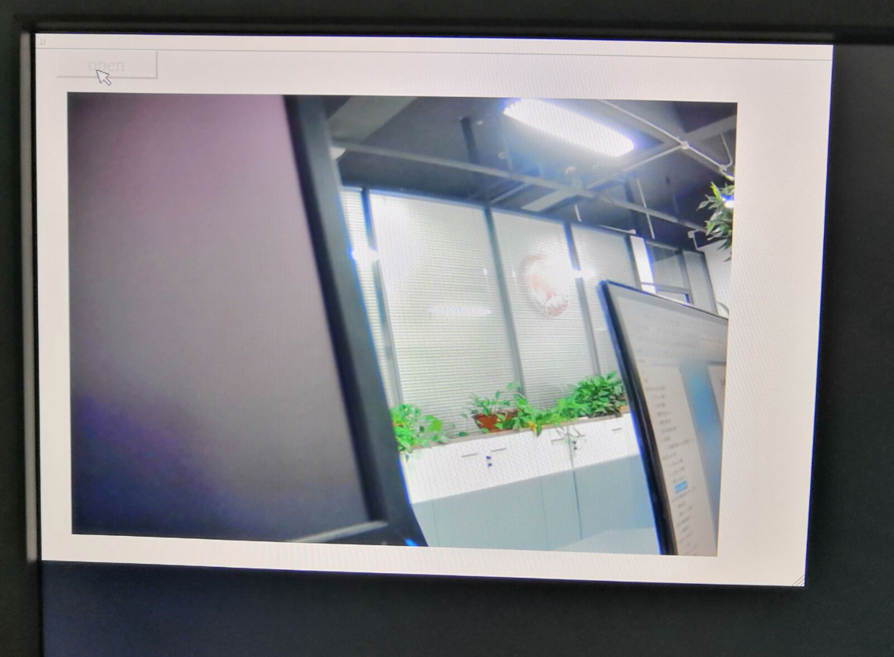
