双目摄像头模块OpenCV显示
========================

**例程相关文件夹：opencv_an5642**

**Vivado工程在vivado.zip压缩包中：opencv_an5642**

前面的教程中讲到如何使用OpenCV和QT显示USB摄像头的应用，本章讲解如何显示芯驿电子配套模块双目摄像头（AN5642）的应用。

例程资料中给出了vivado工程，BSP包。

vivado工程简介
--------------

1) 摄像头输入转换为AXI Stream模块，将摄像头输入数据转换为16bit的AXI
   Stream，然后通过VDMA写入PS端DDR3。

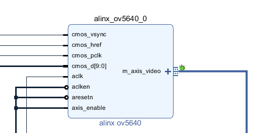

2) IIC处理，由于双目OV5640的IIC地址完全相同，所以这里使能2路IIC，都是通过EMIO引出到PL端，其中一个通过IIC扩展模块扩展出多路。

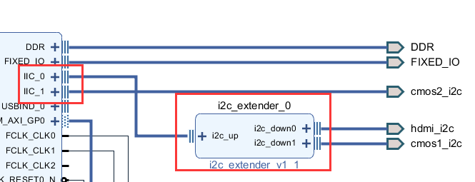

3) 通过AXI GPIO复位2路摄像头

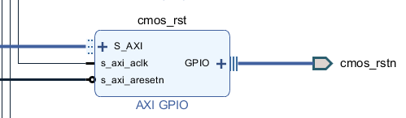

摄像头驱动
----------

芯驿电子为OV5640写了简单的驱动，由于Linux驱动编写涉及内容较多，大部分驱动编写都是通过改写内核中已有驱动，这个驱动也是一样。驱动主要配置OV5640输出YUV422数据，分辨率根据应用程序来修改，驱动不做过多解释，本身就是Linux开发中比较难的点，请直接使用芯驿电子提供的Linux内核源码包。

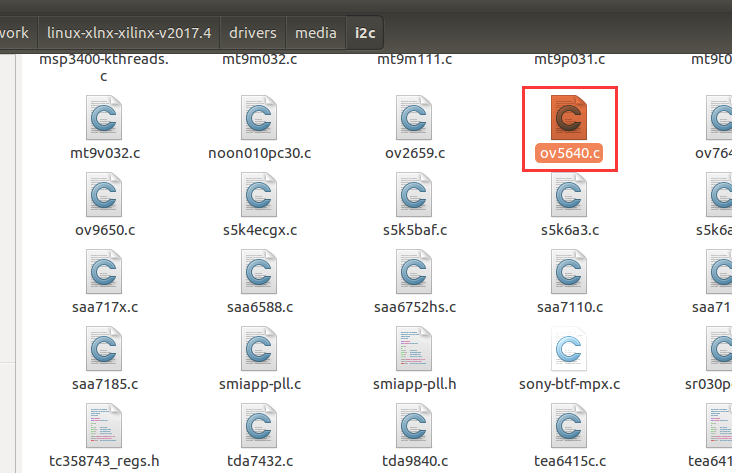

内核驱动配置
------------

内核驱动中涉及到drm显示的部分请参考第八章HDMI显示的内核配置，可以在HDMI显示的工程基础上添加下列配置，也可以用BSP包重新生成工程。

1) 驱动配置，Device Drivers → Multimedia support→ Media ancillary
   drivers → Camera sensor devices→ <*> ALINX OV5640 sensor
   support，HDMI等显示驱动配置在前面的教程中已经讲解，不再复述。

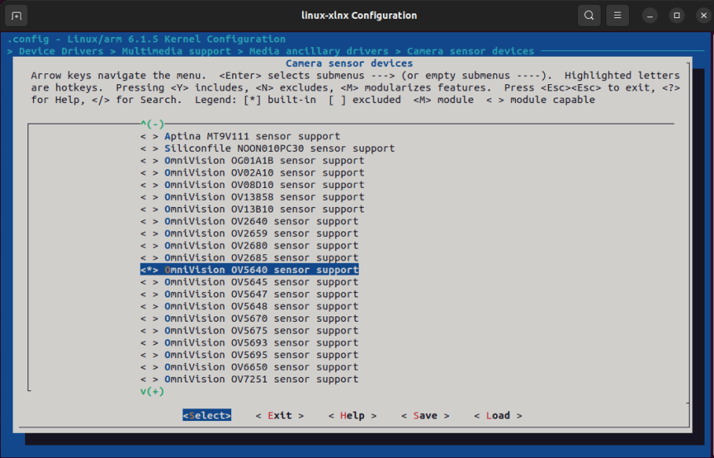
   

2) Library routines →Size in Mega Bytes
   ，CMA_SIZE_MBYTES配置，由于视频路数增加，需要添加更多的DMA空间，配置CMA_SIZE_MBYTES大小为256MB

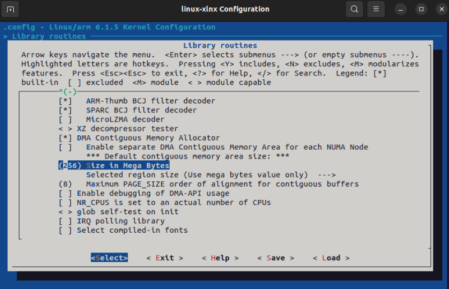
   

设备树配置
----------

1) 在petalinux工程project-spec/meta-user/recipes-bsp/device-tree/files目录下，找到system-user.dtsi，这是我们要修改会添加的设备树，例程中已经修改好

2) 2个OV5640分别挂载i2c0和i2c1总线下，地址为0x3c（7bit表示，是8bit表示地址的一半），详细设备树可以参考例程petalinux工程目录下project-spec/meta-user/recipes-bsp/device-tree/files/system-user.dtsi文件

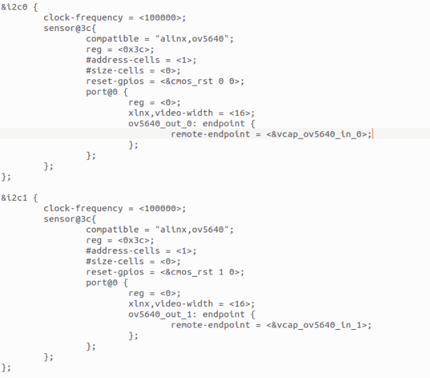
   

3) vcap_ov5640设备为Xilinx提供VDMA驱动封装起来，做成V4L2接口

   

摄像头Linux应用程序
-------------------

1) 应用程序使用QT编写，结合OpenCV做颜色空间转换，在前面的教程中已经将过，不再复述

2) 需要注意的是，elf文件生成位置，和前面教程不同，这次在app目录里

3) 运行例程Linux，可以看到双目摄像头相关驱动打印信息。

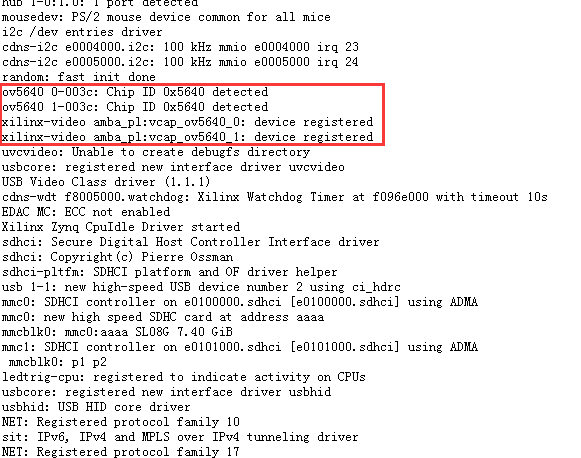

4) 挂载NFS，设置QT和OpenCV运行环境

+-----------------------------------------------------------------------+
| mount -t nfs -o nolock 192.168.1.115:/home/alinx2020/work /mnt        |
|                                                                       |
| cd /mnt                                                               |
|                                                                       |
| mkdir /tmp/qt                                                         |
|                                                                       |
| mount qt_lib.img /tmp/qt                                              |
|                                                                       |
| cd /tmp/qt                                                            |
|                                                                       |
| source ./qt_env_set.sh                                                |
|                                                                       |
| mkdir /tmp/cv                                                         |
|                                                                       |
| cd /mnt                                                               |
|                                                                       |
| mount zynq_cv_lib.img /tmp/cv                                         |
|                                                                       |
| cd /tmp/cv                                                            |
|                                                                       |
| source ./opencv_env_set.sh                                            |
+-----------------------------------------------------------------------+

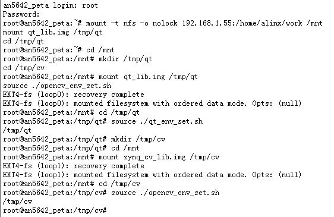

5) 运行测试程序

+-----------------------------------------------------------------------+
| cd /mnt/app                                                           |
|                                                                       |
| ./an5642_demo                                                         |
+-----------------------------------------------------------------------+

6) 运行效果，资料包中给出了编译好的程序在sd_boot目录，所有文件复制到sd卡根目录运行即可。

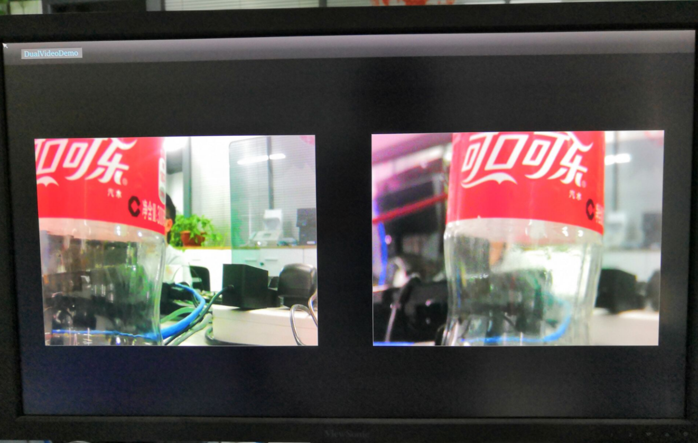

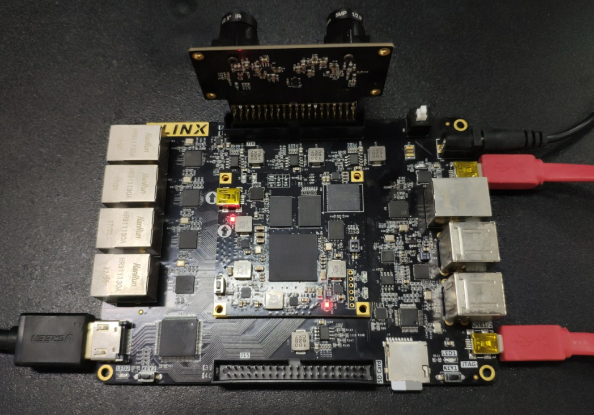

AX7021硬件连接图（J16扩展口）

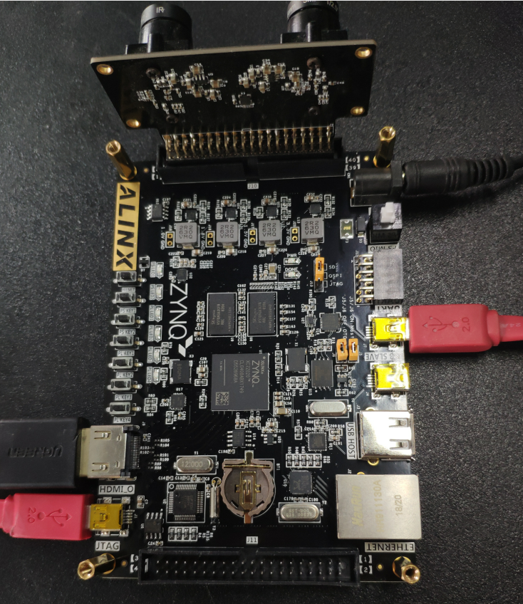

AX7020/AX7010硬件连接图(J10扩展口)
