触摸屏模块应用
==============

**例程相关文件夹：lcd_touch**

**Vivado工程在vivado.zip压缩包中：lcd_touch**

例程资料中给出了vivado工程，petalinux工程，本实验还是在前面HDMI实验的Petalinux工程基础上进行修改的，需要先掌握前面的实验内容。

vivado工程简介
--------------

1) 触摸屏中断处理，由于触摸屏默认中断是低电平，而PS来自PL的中断只能是高电平或上升沿，这里加一个非门反相。中断连接到PS的第一个中断管脚，后面我们可以根据这些信息推断Linux下中断号，Linux下中断编号可以参考Xilinx文档UG585

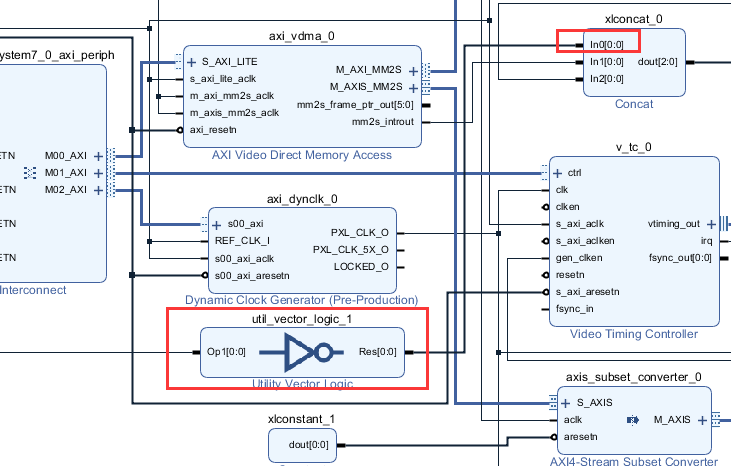

2) 液晶屏时钟处理，由于液晶屏是下降沿采样，这里使用非门把时钟反相输出，后面的与门没有什么作用，仅仅用于信号的连接。

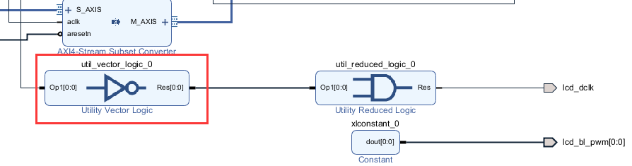

3) 液晶屏背光设置为一直高电平，就是最亮状态，可能会让液晶屏发热较多

4) IIC用于读取液晶屏触摸信息

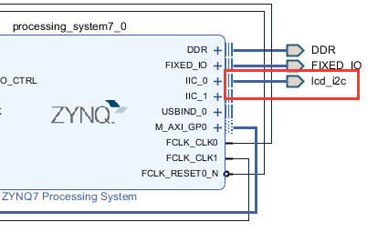

触摸屏驱动
----------

1) alinx_ts.c为芯驿电子提供的触摸屏驱动，位于内核目录drivers/input/touchscreen中

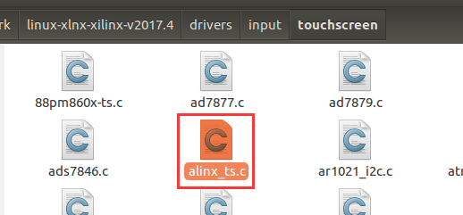

2) 触摸屏还要配套编码器才能工作，ax_lcd_encoder.c是芯驿电子提供的DRM编码器驱动，位于内核drivers/gpu/drm/xilinx

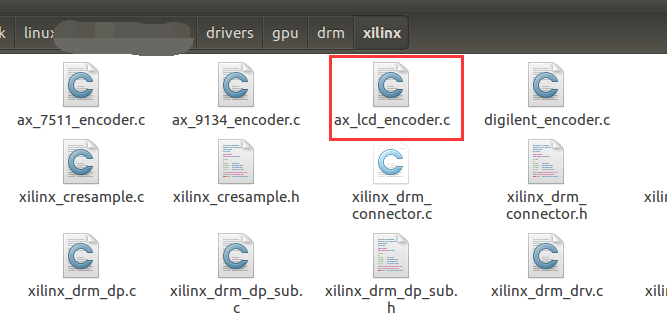

内核驱动配置
------------

内核驱动中涉及到drm显示的部分请参考第八章HDMI显示的内核配置，可以在HDMI显示的工程基础上添加下列配置，也可以用BSP包重新生成工程。

1) Device Drivers > Input device support > [*] Touchscreens使能触摸屏

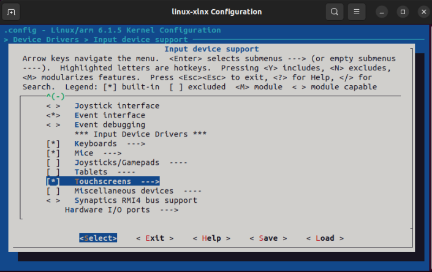
   

2) 选择 <*> Alinx_ts I2C Touchscreen support

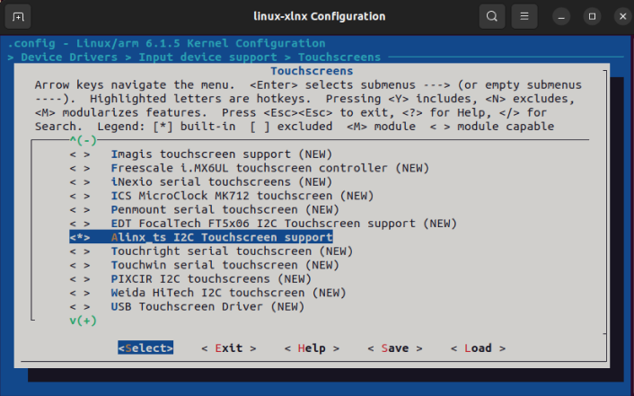
   

3) 在Device Drivers > Graphics support中选择<*> ALINX LCD DRM Encoder
   Driver，

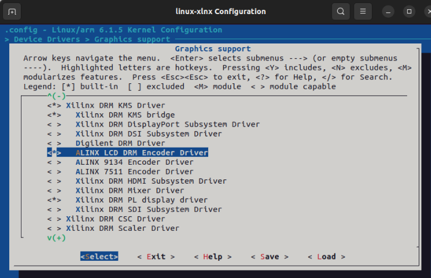
   

4) 在Device Drivers > Common Clock Framework中选择<*> Digilent
   axi_dynclk Driver

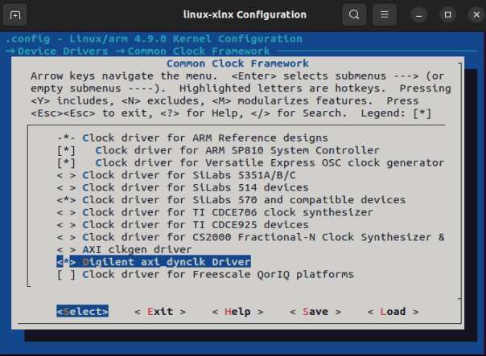
   

5) 如果用到其他外设，请更加需要配置驱动

设备树配置
----------

在i2c0下挂触摸屏模块，设备地址为0x5D（7bit地址）。详细设备树可以参考例程petalinux工程目录下project-spec/meta-user/recipes-bsp/device-tree/files/system-user.dtsi文件

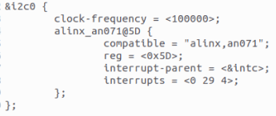
   

触摸屏测试
----------

1) 用例程给的petalinux工程生成的BOOT.BIN和image.ub，放入SD卡

2) 挂载NFS，运行前面例程的QT测试程序

+-----------------------------------------------------------------------+
| mount -t nfs -o nolock 192.168.1.55:/home/alinx/work /mnt             |
|                                                                       |
| cd /mnt                                                               |
|                                                                       |
| mkdir /tmp/qt                                                         |
|                                                                       |
| mount qt_lib.img /tmp/qt                                              |
|                                                                       |
| cd /tmp/qt                                                            |
|                                                                       |
| source ./qt_env_set.sh                                                |
|                                                                       |
| cd /mnt                                                               |
|                                                                       |
| cd build-qt_test-ZYNQ-Debug                                           |
|                                                                       |
| ./qt_test                                                             |
+-----------------------------------------------------------------------+

3) 运行效果

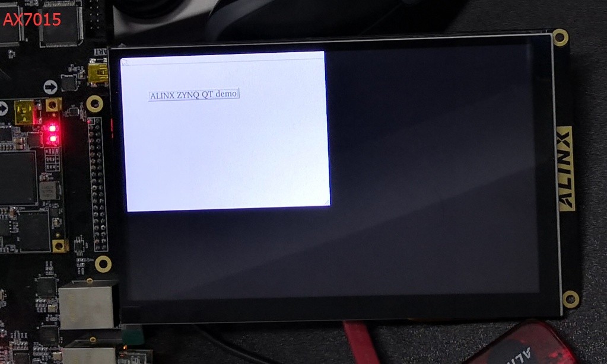

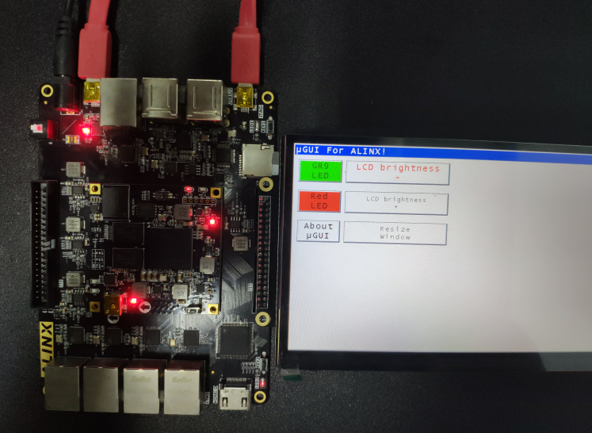

AX7021硬件连接（J15扩展口）请忽略显示内容

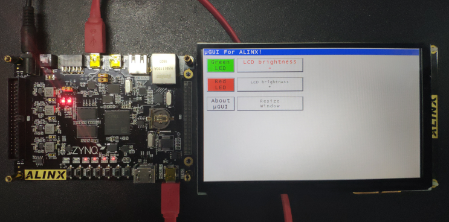

AX7020/AX7010硬件连接（J11扩展口）请忽略显示内容
