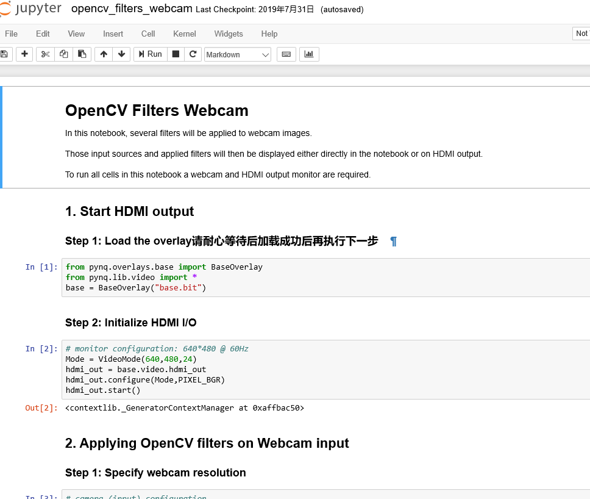
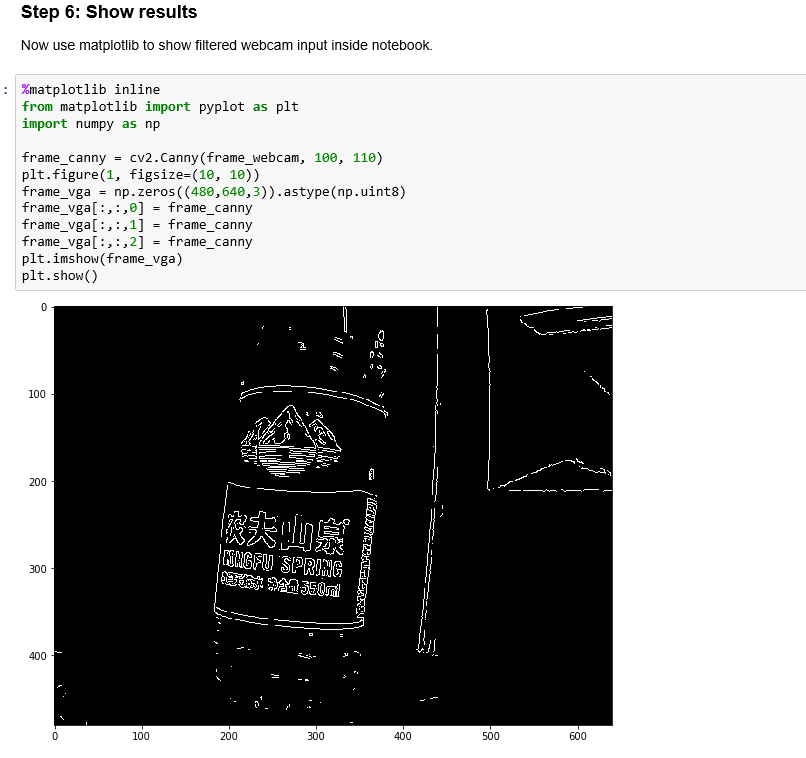
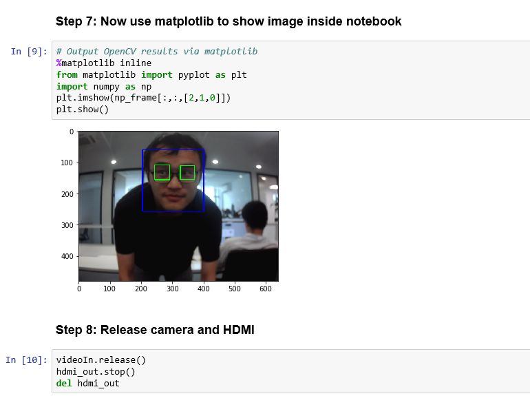

USB摄像头边沿检测和人脸识别
=============================

在pynq镜像里给出了很多自带例程，比较有代表的就是边沿检测和人脸识别，比较遗憾的是，这2个例程都没有使用FPGA做加速，是纯软件计算的，但是使用了FPGA的HDMI输出显示结果。这些例程都是Xilinx官方提供，芯驿电子做了一些本地化工作。

边沿检测
--------

和前面一章一样，先登录Jupyter Notebooks，然后在目录base/video中找到opencv_filters_webcam.ipynb这个Notebook。

在运行这个例程前，先把USB摄像头（免驱型USB摄像头）。

在Notebooks强大注释功能下本教程显得特别苍白无力，每一步都可以有丰富的提示。Python语言本身也不是本教程的重点，如果对Python语言不熟悉，先在电脑上加强练习。

      
需要解释有：如果程序中不使用FPGA资源，可以不加载FPGA的bit文件，如果使用FPGA资源，必须先加载FPGA的bit文件，本例程中HDMI显示是FPGA做的，必须加载bit文件。

通过本例程，我们可以看到支持Python常用的库，例如opencv等，如果需要安装其他库，可以pip命令安装。

通过实验，可以看到边沿检测结果能直接在浏览器中显示出来

      
**需要注意的是：涉及到FPGA的程序，每次都要完整运行，如果程序运行一半退出，可能导致下次运行异常，需要开发板断电重启。**

人脸检测
--------

人脸检测例程是opencv_face_detect_webcam.ipynb这个Notebook。人脸检测程序主要检测图像中有没有人脸，然后框出人脸和眼睛，是直接调用opencv进行检测

      
