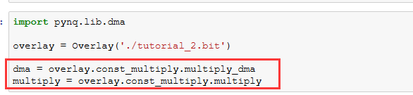

含有DMA操作自定义Overlays
===========================

通过前一章我们初步掌握了如何通过自定义的vivado工程来做overlay，上一个例子中只有寄存器读写操作，大批量高速数据交互时往往会使用DMA，所以含有DMA的Overlay就显得非常重要，Python中DMA驱动是Xilinx官方提供，目前只支持sample AXI DMA，不支持SG模式，也不支持中断。

本实验同样是一个基于HLS编写的流乘法器，就是一个数组都乘一个常数、得到另一个数组

      
tutorial_2就是本实验的vivado工程，我们可以看到multiply 和multiply_dma组合成一个const_multiply，这相当于一个子模块，在PYNQ中引用时要分出层次结构

      
就像代码中dma = overlay.const_multiply.multiply_dma，先是引用const_multiply，再引用multiply_dma

      
DMA如何操作
-----------

结合代码说明一下DMA操作

1. 首先导入Xlnk库，这个库里包含了Xilinx的DMA管理接口，

2. 使用cma_array分配DMA缓冲区

3. 使用sendchannel.transfer发起一个DMA发送操作

4. 使用recvchannel.transfer发起一个DMA接受操作

5. sendchannel.wait()等待发送完成

6. recvchannel.wait()等待接收完成

      