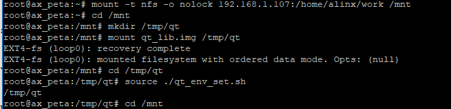
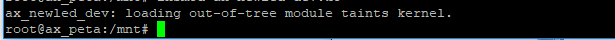
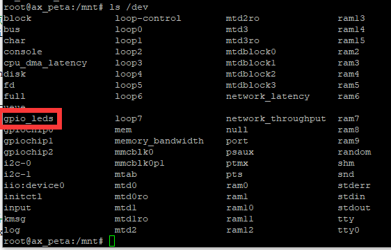
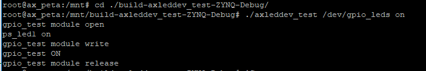
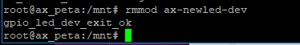
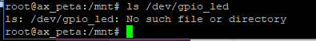

字符设备的新写法
=======================

设备号管理
--------------

在上一章中的实验中，设备号直接在驱动代码中写死了。这样做会带来很多麻烦：

1) 编译驱动代码前，必须要先查看目标系统中设备号的占用情况；

2) 更换设备后原先驱动中写死的设备号就可能已被占用；

3) 原先的驱动注册函数register_chrdev()输入参数中仅有主设备号而没有次设备号，这意味着一个设备就会占用所有的次设备号，十分浪费。

针对这些问题，Linux内核提出了新的字符设备注册方法，并由内核来管理设备号。新增两个设备号注册函数。

1) 当驱动程序需要给定主设备号时，使用函数来注册设备号：

+-----------------------------------------------------------------------+
| int register_chrdev_region(dev_t from, unsigned count, const char     |
| \*name);                                                              |
+-----------------------------------------------------------------------+

输入参数说明：

**from**\ ：需要申请的起始设备号，dev_t类型，它取代了原先的主设备号和次设备号，在需要指定主次设备号的情况下，可以通过方法from=MKDEV(major,
minor);来获取他的值。

**count**\ ：需要申请设备号的个数，一般只要申请一个。

**name**\ ：设备名。

示例：

.. code:: c
   
 int major = 200; //主设备号指定为 200
 int minor = 0; //次设备号为 0
 dev_t devid = MKDEV(major, minor); //通过主次设备号获得设备号
 /* 向内核注册设备号 */
 register_chrdev_region(devid, 1, "xxx-dev");   

2) 驱动程序不需要指定主设备号时，使用函数:
   
+-----------------------------------------------------------------------+
| int alloc_chrdev_region(dev_t \*dev, unsigned baseminor, unsigned     |
| count,const char \*name)                                              |
+-----------------------------------------------------------------------+

输入参数说明：
**dev**\ ：设备号指针，不指定主次设备号的情况下，设备号由内核分配，因此传入指针来获取设备号，注册成功后可以通过方法major = MAJOR(\*dev); 和minor = MINOR(\*dev);分别获取主次设备号，如果不需要用到主次设备号，不获取也可以。

**baseminor**\ ：次设备号起始地址。

**count**\ ：需要申请设备号的个数，一般只要申请一个。

**name**\ ：设备名。

示例：

.. code:: c

 dev_t devid; //设备号
 /* 申请设备号 */
 alloc_chrdev_region(&devid, 0, 1, "xxx-dev");

3) 注销设备号只要使用同一个函数：

+-----------------------------------------------------------------------+
| void unregister_chrdev_region(dev_t from, unsigned count);            |
+-----------------------------------------------------------------------+

输入参数含义和注册函数一致。

示例：

.. code:: c

 dev_t devid; //设备号
 /* 申请设备号 */
 alloc_chrdev_region(&devid, 0, 1, "xxx-dev");
 /* 注销设备号 */
 unregister_chrdev_region(devid, 1);

新的注册方法
----------------

上面提到过注册函数register_chrdev()存在问题。和新的设备号管理方式相对应，现在摒弃register_chrdev()，使用一套新的方法来来注册字符设备。

字符设备数据结构
~~~~~~~~~~~~~~~~~~~~~~

使用cdev结构体来定来定义一个字符设备，他定义在include/linux/cdev.h中，具体如下：

.. code:: c

 struct cdev {
 struct kobject kobj;
 struct module *owner;
 const struct file_operations *ops;
 struct list_head list;
 dev_t dev;
 unsigned int count;
 };
 

重要成员变量：

**owner**\ ：一般设置为THIS_MODULE；

**ops**\ ：设备操作函数指针；

**dev**\ ：设备号。

2.1.2 cdev结构体初始化
~~~~~~~~~~~~~~~~~~~~~~

cdev结构体变量定义后需要用cdev_init()函数初始化，函数原型为：

+-----------------------------------------------------------------------+
| void cdev_init(struct cdev \*cdev, const struct file_operations       |
| \*fops)                                                               |
+-----------------------------------------------------------------------+

**cdev**\ ：字符设备结构体指针；

**fops**\ ：设备操作函数集合结构体指针。

使用示例：

.. code:: c

 /* 字符设备 */
 struct cdev ax_cdev = {
 .owner = THIS_MODULE,
 };
 /* 设备操作函数 */
 static struct file_operations ax_fops = {
 .owner = THIS_MODULE,
 .open…… /* 此处有省略 */
 };

 /* ax_cdev 变量初始化 */
 cdev_init(&ax_cdev, &ax_fops)

新的注册和注销函数
~~~~~~~~~~~~~~~~~~~~~~~~

初始化字符结构体变量后，便可以使用这个变量来向Linux系统注册字符设备。使用新的注册函数cdev_add，原型为：

+-----------------------------------------------------------------------+
| int cdev_add(struct cdev \*p, dev_t dev, unsigned count);             |
+-----------------------------------------------------------------------+

**p**\ ：上面初始化后的字符设备结构体变量；

**dev**\ ：设备号；

**count**\ ：需要添加的设备数量。

注册函数变了，注销卸载函数也一样，不再使用unregister_chrdev()函数，改用cdev_del()函数，原型：

+-----------------------------------------------------------------------+
| void cdev_del(struct cdev \*p);                                       |
+-----------------------------------------------------------------------+

输入参数即为字符设备结构体变量。

结合上设备号，补充一下中的示例：

.. code:: c

 /* 字符设备 */
 struct cdev ax_cdev = {
 .owner = THIS_MODULE,
 };

 /* 设备操作函数 */
 static struct file_operations ax_fops = {
 .owner = THIS_MODULE,
 .open……
 };

 /* 设备号 */
 cdev_t devid;
 /* 申请设备号 */
 alloc_chrdev_region(&devid, 0, 1, " xxx-dev");

 /* ax_cdev 变量初始化 */
 cdev_init(&ax_cdev, &ax_fops);
 /* 注册字符设备 */
 cdev_add(&ax_cdev, devid, 1);
 …… /* 此处有省略 */
 /* 卸载字符设备 */
 cdev_del(&ax_cdev); 

自动创建设备文件
--------------------

mdev
~~~~~~~~~~

medv是一个用户程序，是udev的简化版。它可以检测并根据系统中硬件设备状态来创建或者删除设备文件。在加载驱动模块后，会自动在/dev目录下创建设备节点文件，卸载驱动模块后设备节点也会自动删除。接下来看看如何实现。

类的创建和删除
~~~~~~~~~~~~~~~~~~~~

创建设备前需要先创建类，设备是在类下面创建的。类的结构体struct
class结构体定义在include/linux/device.h中，需要使用函数class_create()来创建。class_create()是个宏定义：

.. code:: c

 #define class_create(owner, name) \
 ({ \
 static struct lock_class_key __key; \
 __class_create(owner, name, &__key); \
 })

 struct class *__class_create(struct module *owner, const char *name, struct lock_class_key *key)

展开后可以看出：

**输入参数**\ ：

**owner**\ ：至今出现的owner值都是THIS_MODULE，这里任然不例外；

**name**\ ：类的名字。

**返回值**\ ：struct class类型的结构体指针。

卸载驱动程序时需要删除类，使用函数class_destroy()，原型如下：

+-----------------------------------------------------------------------+
| void class_destroy(struct class \*cls);                               |
+-----------------------------------------------------------------------+

**cls**\ 为需要删除的类。

设备节点的创建和删除
~~~~~~~~~~~~~~~~~~~~~~~~~~

创建类后，使用device_create()函数在类下面创建设备，原型为：

.. code:: c

 struct device *device_create(struct class *class,
 struct device *parent,
 dev_t devt,
 void * drvdata,
 const char *fmt, ...)

参数说明：

**class**\ ：上节介绍的类，设备会在这个类下创建；

**parent**\ ：父设备，没有父设备的话填NULL；

**devt**\ ：设备号；

**drvdata**\ ：设备可能会用到的数据，没有的话填NULL；

**fmt**\ ：设备名，比如当fmt=axled时，创建设备后就会生成/dev/axled文件。

删除设备函数为：

+-----------------------------------------------------------------------+
| void device_destroy(struct class \*class, dev_t devt);                |
+-----------------------------------------------------------------------+

输入参数含义和上面一样。

自动创建设备节点的实现一般放在驱动入口函数中，结合上一节类的创建以及设备号，自动创建设备节点的实现示例如下：

.. code:: c
   
 struct class *class; /* 类 */
 struct device *device; /* 设备 */
 dev_t devid; /* 设备号 */

 /* 驱动入口函数 */
 static int __init xxx_init(void)
 {
 ……
 /* 申请设备号 */
 alloc_chrdev_region(&devid, 0, 1, "xxx-dev");
 ……
 /* 创建类 */
 class = class_create(THIS_MODULE, "xxx");
 /* 创建设备 */
 device = device_create(class, NULL, devid, NULL, "xxx");

 return 0;
 }

 /* 驱动出口函数 */
 static void __exit led_exit(void)
 {
 /* 删除设备 */
 device_destroy(class, devid);
 /* 删除类 */
 class_destroy(class);
 /* 注销字符设备 */
 unregister_chrdev_region(devid, 1);
 }

 module_init(led_init);
 module_exit(led_exit);

字符设备新驱动实验
----------------------

现在了解字符设备驱动的新写法相关的要点，接下来就动手尝试，这章我们要达成的目标和上一章相同，编写开发板上”PS
LED1”这个led的设备驱动，通过驱动程序能点亮、熄灭这个led。

查看硬件原理图以及数据手册
~~~~~~~~~~~~~~~~~~~~~~~~~~~~~~~~

和上一章内容相同。

编写字符设备驱动程序
~~~~~~~~~~~~~~~~~~~~~~~~~~

使用petalinux创建新的驱动，方法也和上一章相同，之后重复的步骤就略过了。这里我新建了名为ax-newled-drv的驱动。打开文件ax-newled-drv.c，输入以下内容：

.. code:: c

 #include <linux/module.h>
 #include <linux/kernel.h>
 #include <linux/fs.h>
 #include <linux/init.h>
 #include <linux/ide.h>
 #include <linux/types.h>
 #include <linux/errno.h>
 #include <linux/cdev.h>
 #include <linux/device.h>
 #include <asm/uaccess.h>

 /* 设备节点名称 */
 #define DEVICE_NAME "gpio_leds"
 /* 设备号个数 */
 #define DEVID_COUNT 1
 /* 设备个数 */
 #define DEVICE_COUNT 1
 /* 主设备号 */
 #define MAJOR
 /* 次设备号 */
 #define MINOR 0

 /* gpio 寄存器虚拟地址 */
 static unsigned int gpio_add_minor;
 /* gpio 寄存器物理基地址 */
 #define GPIO_BASE 0xE000A000
 /* gpio 寄存器所占空间大小 */
 #define GPIO_SIZE 0x1000
 /* gpio 方向寄存器 */
 #define GPIO_DIRM_0 (unsigned int *)(0xE000A204 - GPIO_BASE + gpio_add_minor)
 /* gpio 使能寄存器 */
 #define GPIO_OEN_0 (unsigned int *)(0xE000A208 - GPIO_BASE + gpio_add_minor)
 /* gpio 控制寄存器 */
 #define GPIO_DATA_0 (unsigned int *)(0xE000A040 - GPIO_BASE + gpio_add_minor)

 /* 时钟使能寄存器虚拟地址 */
 static unsigned int clk_add_minor;
 /* 时钟使能寄存器物理基地址 */
 #define CLK_BASE 0xF8000000
 /* 时钟使能寄存器所占空间大小 */
 #define CLK_SIZE 0x1000
 /* AMBA 外设时钟使能寄存器 */
 #define APER_CLK_CTRL (unsigned int *)(0xF800012C - CLK_BASE + clk_add_minor)

 /* 把驱动代码中会用到的数据打包进设备结构体 */
 struct alinx_char_dev{
 dev_t devid; //设备号
 struct cdev cdev; //字符设备
 struct class *class; //类
 struct device *device; //设备节点
 };
 /* 声明设备结构体 */
 static struct alinx_char_dev alinx_char = {
 .cdev = {
 .owner = THIS_MODULE,
 },
 };

 /* open 函数实现, 对应到 Linux 系统调用函数的 open 函数 */
 static int gpio_leds_open(struct inode *inode_p, struct file *file_p)
 {
 /* 把需要修改的物理地址映射到虚拟地址 */
 gpio_add_minor = (unsigned int)ioremap(GPIO_BASE, GPIO_SIZE);
 clk_add_minor = (unsigned int)ioremap(CLK_BASE, CLK_SIZE);

 /* MIO_0 时钟使能 */
 *APER_CLK_CTRL |= 0x00400000;
 /* MIO_0 设置成输出 */
 *GPIO_DIRM_0 |= 0x00000001;
 /* MIO_0 使能 */
 *GPIO_OEN_0 |= 0x00000001;

 printk("gpio_test module open\n");

 return 0;
 }

 /* write 函数实现, 对应到 Linux 系统调用函数的 write 函数 */
 static ssize_t gpio_leds_write(struct file *file_p, const char __user *buf, size_t len, loff_t *loff_t_p)
 {
 int rst;
 char writeBuf[5] = {0};

 printk("gpio_test module write\n");

 rst = copy_from_user(writeBuf, buf, len);
 if(0 != rst)
 {
 return -1;
 }

 if(1 != len)
 {
 printk("gpio_test len err\n");
 return -2;
 }
 if(1 == writeBuf[0])
 {
 *GPIO_DATA_0 &= 0xFFFFFFFE;
 printk("gpio_test ON\n");
 }
 else if(0 == writeBuf[0])
 {
 *GPIO_DATA_0 |= 0x00000001;
 printk("gpio_test OFF\n");
 }
 else
 {
 printk("gpio_test para err\n");
 return -3;
 }

 return 0;
 }

 /* release 函数实现, 对应到 Linux 系统调用函数的 close 函数 */
 static int gpio_leds_release(struct inode *inode_p, struct file *file_p)
 {
 printk("gpio_test module release\n");
 return 0;
 }

 /* file_operations 结构体声明, 是上面 open、write 实现函数与系统调用函数对应的关键 */
 static struct file_operations ax_char_fops = {
 .owner = THIS_MODULE,
 .open = gpio_leds_open,
 .write = gpio_leds_write,
 .release = gpio_leds_release,
 };

 /* 模块加载时会调用的函数 */
 static int __init gpio_led_init(void)
 {
 /* 注册设备号 */
 alloc_chrdev_region(&alinx_char.devid, MINOR, DEVID_COUNT, DEVICE_NAME);

 /* 初始化字符设备结构体 */
 cdev_init(&alinx_char.cdev, &ax_char_fops);

 /* 注册字符设备 */
 cdev_add(&alinx_char.cdev, alinx_char.devid, DEVICE_COUNT);

 /* 创建类 */
 alinx_char.class = class_create(THIS_MODULE, DEVICE_NAME);
 if(IS_ERR(alinx_char.class))
 {
 return PTR_ERR(alinx_char.class);
 }

 /* 创建设备节点 */
 alinx_char.device = device_create(alinx_char.class, NULL,
 alinx_char.devid, NULL,
 DEVICE_NAME);
 if (IS_ERR(alinx_char.device))
 {
 return PTR_ERR(alinx_char.device);
 }

 return 0;
 }

 /* 卸载模块 */
 static void __exit gpio_led_exit(void)
 {
 /* 释放对虚拟地址的占用 */
 iounmap((unsigned int *)gpio_add_minor);
 iounmap((unsigned int *)clk_add_minor);
 /* 注销字符设备 */
 cdev_del(&alinx_char.cdev);

 /* 注销设备号 */
 unregister_chrdev_region(alinx_char.devid, DEVID_COUNT);

 /* 删除设备节点 */
 device_destroy(alinx_char.class, alinx_char.devid);

 /* 删除类 */
 class_destroy(alinx_char.class);

 printk("gpio_led_dev_exit_ok\n");
 }

 /* 标记加载、卸载函数 */
 module_init(gpio_led_init);
 module_exit(gpio_led_exit);

 /* 驱动描述信息 */
 MODULE_AUTHOR("Alinx");
 MODULE_ALIAS("gpio_led");
 MODULE_DESCRIPTION("NEW GPIO LED driver");
 MODULE_VERSION("v1.0");
 MODULE_LICENSE("GPL");

与上一章相比，改动的部分加粗了，除了新增了一些宏定义和参数声明之外，改动的只有入口函数和出口函数两个地方。

**13~21**\ 行，新增了几个宏定义，DEVICE_NAME表示设备名，也是设备节点名，最终我们要到/dev目录中去寻找这个名字的设备文件。

DEVID_COUNT和DEVICE_COUNT分别表示设备号数和设备节点数。一般一个设备对应一个驱动，所以在一个驱动代码中就只有一个设备，所以这里都为1。

MAJOR主设备号，这里我们通过函数获取设备号，主设备号不需要自己设置。MAJOR次设备号一般从0开始。

**46~57**\ 行，新建了一个结构体类型，并用这个类型声明了一个变量。把之后会用到的设备号、字符设备、类、设备节点等数据类型都打包进这个结构体中。驱动开发中通常在open函数中将文件(struct
file结构体)的私有数据(private_data元素)指向设备结构体，在read()、write()、ioctl()等函数通过
private_data 访问数据 设备结构体。举例如下：

.. code:: c

 /* 定义一个设备结构体 */
 struct char_dev {
 …………
 int value;
 };
 /* 声明设备结构体 */
 static struct char_dev charDev_t = {
 .cdev = {
 .owner = THIS_MODULE,
 },
 };

 static int xxx_open(struct inode *inode, struct file *filp)
 {
 filp->private_data = &charDev_t;
 …………
 return 0;
 }

 static ssize_t xxx_read(struct file *filp, char __user *buf, size_t cnt, loff_t *offt)
 {
 int value = 0;

 struct char_dev *dev = (struct char_dev *)filp->private_data;

 value = dev->value;
 …………
 }

对于这种一般性的规范，慢慢去习惯就好了，一开始不这么写也没问题。

**140~162**\ 行是关键的地方，在驱动入口函数中，把本章先后讲到的知识点申请设备号、初始化并注册字符设备、创建类和设备节点全部结合。

**171~180**\ 行出口函数中就是做与入口函数中注册创建相对应的注销和删除。

结合上面几节的内容，这个新驱动代码不难理解。完成后在ubuntu虚拟机重编译得到驱动模块文件ax-newled-dev.ko。

编写测试APP
~~~~~~~~~~~~~~~~~

测试APP与上一章内容一致，可以直接使用上一章的测试程序。

运行测试
~~~~~~~~~~~~~~

测试方法也与之前一样，给开发板上电，并挂在虚拟机的工作目录到开发板/mnt路径。

1) 先加载驱动，执行命令：

+-----------------------------------------------------------------------+
| insmod ax-newled-dev.ko                                               |
+-----------------------------------------------------------------------+

1) 驱动加载成功，再看看设备文件有没有创建成功，执行命令：

+-----------------------------------------------------------------------+
| ls /dev                                                               |
+-----------------------------------------------------------------------+

3) 设备节点文件已经存在了，可以使用测试APP来试试驱动程序了，执行下列命令：

+-----------------------------------------------------------------------+
| cd ./build-axleddev_test-ZYNQ-Debug/                                  |
|                                                                       |
| ./axleddev_test /dev/gpio_leds on                                     |
+-----------------------------------------------------------------------+

4) led被点亮，最后在测试卸载驱动，执行命令：

+-----------------------------------------------------------------------+
| rmmod ax-newled-dev                                                   |
+-----------------------------------------------------------------------+

如果不确定驱动名称，可以先执行lsmod命令查看。

5) 删除设备后，再确认设备节点文件有没有被删除：

+-----------------------------------------------------------------------+
| ls /dev/gpio_led                                                      |
+-----------------------------------------------------------------------+

没有问题，试验成功。
