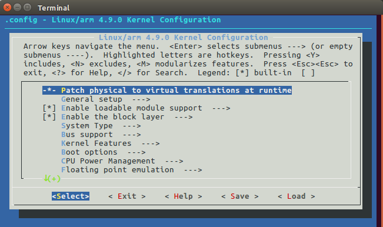
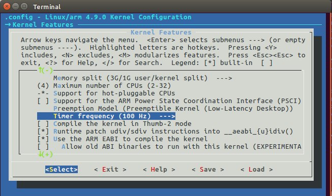
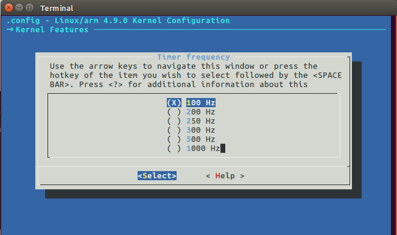
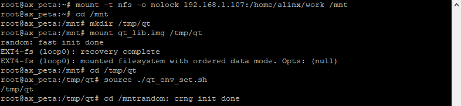
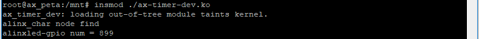
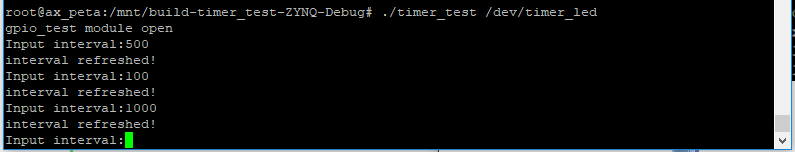

定时器
=============

本章简单介绍Linux内核提供的定时器及其用法。

Linux内核中的定时器
-----------------------

内核中定时器的实现依赖于硬件定时器。硬件定时器提供固定频率的时钟源并产生中断，系统使用这个中断来计时。而内核中的定时器功能，则是在这个计时的基础上实现的。

系统频率
~~~~~~~~~~~~~~

产生系统中断的频率就是系统频率，也叫系统节拍即每秒的节拍数。系统节拍是可设置的，在petalinux中设置方法为：

在petalinux工程目录中打开终端输入命令：

+-----------------------------------------------------------------------+
| petalinux-config -c kernel                                            |
+-----------------------------------------------------------------------+

等待一段时间后，会弹出交互界面如下图：

用上下方向键移动选项置”Kernel Features”，按回车进入，如下图：

再按下方向键选择选项”Timer frequency(100Hz)”按回车(这个选项被藏在很下面，不在一开始的界面里)，就能看到系统频率的选项：

这里默认选择的是100Hz，每秒100个节拍。

系统频率越高，时钟精度也越高，100Hz的时间进度能达到10ms，而1000Hz能达到1ms。同时中断产生的频率增加，cpu的负担也就越大这需要根据实际情况去取舍，我们的实验使用100Hz就足够了。

系统时钟定义在include/asm-generic/param.h中，为宏定义HZ，他最终会对应到我们设置的系统时钟值。

节拍数
~~~~~~~~~~~~

系统计时的方式就是记录节拍数。系统运行的时间=节拍数/系统频率，单位为秒。

内核中用全局变量jiffies来记录节拍书，定义在文件include/linux/jiffies.h中：

+-----------------------------------------------------------------------+
| extern u64 \__jiffy_data jiffies_64;                                  |
|                                                                       |
| extern unsigned long volatile \__jiffy_data jiffies;                  |
+-----------------------------------------------------------------------+

jiffies_64用于64位的系统，jiffies用于32位系统。既然是用来计数的变量，就会有溢出的风险。64位且不提，32位的jiffies在100Hz的系统频率下，500天左右就会溢出回绕，在1000Hz的频率下50天左右就会回绕。回绕会带来什么问题，举个例子：

.. code:: c

 unsigned long time_mark = jiffies + HZ * 5;

 /* 业务处理 */

 if(time_mark > jiffies)
 {
 /* 未超时 */
 }
 else
 {
 /* 超时 */
 }

这个例子中，先设定一个时间time_mark为当前节拍数再加上5秒的节拍，也就是5秒后系统节拍jiffies会到达的值。这个示例代码的目的是如果业务处理的时间超过5秒就执行超时的处理。极端情况下，比如此时jiffies为0xFFFFFDA7，time_mark则等于0xFFFFFF9B，如果业务处理时间用了7秒，jiffies会因为超过最大值0xFFFFFFFF发生反转，从0开始重新计数变成0x64，这个值远远小于time_mark，明明超时了，却进入了未超时的条件。

对此，内核的通过把数据强专无符号数强转成有符号数巧妙的规避了回绕的问题，不用传统的比较运算符去比较，而使用下面几个宏来代替：

+-----------------------------------------------------------------------+
| #define time_after(unknown,known) ((long)(known) - (long)(unknown)<0) |
|                                                                       |
| #define time_before(unkonwn,known) ((long)(unknown) -                 |
| (long)(known)<0)                                                      |
|                                                                       |
| #define time_after_eq(unknown,known) ((long)(unknown) -               |
| (long)(known)>=0)                                                     |
|                                                                       |
| #define time_before_eq(unknown,known) ((long)(known)                  |
| -(long)(unknown)>=0)                                                  |
+-----------------------------------------------------------------------+

以time_after_eq为例，参数unknow一般指jiffies，know通常是我们设定的时间，如上面例子中的time_mark。after_eq即大于等于，如果unknow大于等于know，即jiffies大于time_mark，则返回真，对于上面的例程来说就是超时了。

内核定时器及相关函数
~~~~~~~~~~~~~~~~~~~~~~~~~~

Linux内核中定时器用数据结构timer_list来表示。定义在include/linux/timer.h中：

.. code:: c

 struct timer_list {
 /*
 * All fields that change during normal runtime grouped to the
 * same cacheline
 */
 struct hlist_node entry;
 unsigned long expires;
 void (*function)(unsigned long);
 unsigned long data;
 u32 flags;

 #ifdef CONFIG_TIMER_STATS
 int start_pid;
 void *start_site;
 char start_comm[16];
 #endif
 #ifdef CONFIG_LOCKDEP
 struct lockdep_map lockdep_map;
 #endif
 }

重要的成员介绍：

**expires**\ ：设置定时器超时时间点的节拍数，如果我们需要定义一个10s的定时器，那expires就应该等于jiffies+10*HZ。为了方便，内核还提供了毫秒、微妙、纳秒和jiffies互换的系列函数：

+-----------------------------------------------------------------------+
| /\* 毫秒互换 \*/                                                      |
|                                                                       |
| int jiffies_to_msecs(const unsigned long j)                           |
|                                                                       |
| long msecs_to_jiffies(const unsigned int m)                           |
|                                                                       |
| /\* 微秒互换 \*/                                                      |
|                                                                       |
| int jiffies_to_usecs(const unsigned long j)                           |
|                                                                       |
| long usecs_to_jiffies(const unsigned int u)                           |
|                                                                       |
| /\* 纳秒互换 \*/                                                      |
|                                                                       |
| u64 jiffies_to_nsecs(const unsigned long j)                           |
|                                                                       |
| unsigned long nsecs_to_jiffies(u64 n)                                 |
+-----------------------------------------------------------------------+

**function**\ ：定时器超回掉函数指针。超时后的需要做的操作就在这个函数中实现。

**data**\ ：用于设置function的输入参数。

定时器相关的函数有：

**1. void init_timer(struct timer_list \*timer)**

初始化定时器，输入参数timer即需要初始化的定时器。

**2.** **void add_timer(struct timer_list \*timer)**

向内核注册定时器，注册后定时器就开始运行，输入参数timer即需要注册的定时器。

**3. int del_timer(struct timer_list \* timer)**

删除定时器，不管定时器是否正在运行，正在运行的timer会直接停止计时。输入参数timer即需要删除的定时器。删除的定时器若正在运行，则返回1，否则返回0。

**4. int del_timer_sync(struct timer_list \*timer)**

删除定时器，正在运行的timer会等到使用完成后才删除。输入参数timer即需要删除的定时器。删除的定时器若正在运行，则返回1，否则返回0。

**5. int mod_timer(struct timer_list \*timer, unsigned long expires)**

修改定时器的expires即超时时间，如果定时器不在运行，则激活该定时器。输入参数timer为需要修改的定时器。expires即为修改后的超时时间。

实验
-------

实验目标是，使用定时器定让led闪烁，应用程序可以通过输入参数设置led闪烁的周期。

原理图
~~~~~~~~~~~

和 **字符设备** 章节的内容相同。

设备树
~~~~~~~~~~~

和 **pinctrl和gpio子系统** 章节相同。

驱动程序
~~~~~~~~~~~~~~

使用 petalinux 新建驱动名为”ax-timer-dev”，在 ax- timer -dev
中输入以下代码：

.. code:: c
   
 #include <linux/module.h>  
 #include <linux/kernel.h>  
 #include <linux/fs.h>  
 #include <linux/init.h>   
 #include <linux/types.h>  
 #include <linux/errno.h>
 #include <linux/cdev.h>
 #include <linux/of.h>
 #include <linux/of_address.h>
 #include <linux/of_gpio.h>
 #include <linux/device.h>
 #include <linux/delay.h>
 #include <linux/init.h>
 #include <linux/gpio.h>
 #include <linux/semaphore.h>
 #include <linux/timer.h>
 #include <asm/uaccess.h>
 #include <asm/mach/map.h>
 #include <asm/io.h>
   
 /* 设备节点名称 */  
 #define DEVICE_NAME       "timer_led"
 /* 设备号个数 */  
 #define DEVID_COUNT       1
 /* 驱动个数 */  
 #define DRIVE_COUNT       1
 /* 主设备号 */
 #define MAJOR_U
 /* 次设备号 */
 #define MINOR_U           0
 
   
 /* 把驱动代码中会用到的数据打包进设备结构体 */
 struct alinx_char_dev{
     dev_t              devid;             //设备号
     struct cdev        cdev;              //字符设备
     struct class       *class;            //类
     struct device      *device;           //设备
     struct device_node *nd;               //设备树的设备节点
     int                alinx_led_gpio;    //gpio号
     char               led_status;        //gpio状态
     unsigned int       time_count;        //定时器时间
     struct timer_list  timer;             //定时器
 };
 /* 声明设备结构体 */
 static struct alinx_char_dev alinx_char = {
     .cdev = {
         .owner = THIS_MODULE,
     },
 };
 
 void timer_function(struct timer_list *timer)
 {    
     /* 反转led状态 */
     alinx_char.led_status = !alinx_char.led_status;
     /* 设置led */
     gpio_set_value(alinx_char.alinx_led_gpio, alinx_char.led_status);
     /* 重新开始计时 */
     mod_timer(&alinx_char.timer, jiffies + msecs_to_jiffies(alinx_char.time_count));
 }
 
 /* open函数实现, 对应到Linux系统调用函数的open函数 */  
 static int timer_led_open(struct inode *inode_p, struct file *file_p)  
 {  
     printk("gpio_test module open\n");  
     return 0;  
 }  
   
   
 /* write函数实现, 对应到Linux系统调用函数的write函数 */  
 static ssize_t timer_led_write(struct file *file_p, const char __user *buf, size_t len, loff_t *loff_t_p)  
 {  
     int retvalue;
     /* 获取用户数据 */
     retvalue = copy_from_user(&alinx_char.time_count, buf, len); 
     /* 设置好timer后先点亮led */
     alinx_char.led_status = 1;
     gpio_set_value(alinx_char.alinx_led_gpio, alinx_char.led_status);
     /* 开启timer */
     mod_timer(&alinx_char.timer, jiffies + msecs_to_jiffies(alinx_char.time_count));
     
     return 0;  
 }  
   
 /* release函数实现, 对应到Linux系统调用函数的close函数 */  
 static int timer_led_release(struct inode *inode_p, struct file *file_p)  
 {  
     printk("gpio_test module release\n");  
     /* 删除定时器 */
     del_timer_sync(&alinx_char.timer);
     return 0;  
 }  
       
 /* file_operations结构体声明, 是上面open、write实现函数与系统调用函数对应的关键 */  
 static struct file_operations ax_char_fops = {  
     .owner   = THIS_MODULE,  
     .open    = timer_led_open,  
     .write   = timer_led_write,     
     .release = timer_led_release,   
 };  
   
 /* 模块加载时会调用的函数 */  
 static int __init timer_led_init(void)  
 {
     /* 用于接受返回值 */
     u32 ret = 0;
     
     /* 获取led设备节点 */
     alinx_char.nd = of_find_node_by_path("/alinxled");
     if(alinx_char.nd == NULL)
     {
         printk("alinx_char node not find\r\n");
         return -EINVAL;
     }
     else
     {
         printk("alinx_char node find\r\n");
     }
     
     /* 获取节点中gpio标号 */
     alinx_char.alinx_led_gpio = of_get_named_gpio(alinx_char.nd, "alinxled-gpios", 0);
     if(alinx_char.alinx_led_gpio < 0)
     {
         printk("can not get alinxled-gpios");
         return -EINVAL;
     }
     printk("alinxled-gpio num = %d\r\n", alinx_char.alinx_led_gpio);
     
     /* 申请gpio标号对应的引脚 */
     ret = gpio_request(alinx_char.alinx_led_gpio, "alinxled");
     if(ret != 0)
     {
         printk("can not request gpio\r\n");
     }
     
     /* 把这个io设置为输出 */
     ret = gpio_direction_output(alinx_char.alinx_led_gpio, 1);
     if(ret < 0)
     {
         printk("can not set gpio\r\n");
     }
     
     /* 注册设备号 */
     alloc_chrdev_region(&alinx_char.devid, MINOR_U, DEVID_COUNT, DEVICE_NAME);
     
     /* 初始化字符设备结构体 */
     cdev_init(&alinx_char.cdev, &ax_char_fops);
     
     /* 注册字符设备 */
     cdev_add(&alinx_char.cdev, alinx_char.devid, DRIVE_COUNT);
     
     /* 创建类 */
     alinx_char.class = class_create(THIS_MODULE, DEVICE_NAME);
     if(IS_ERR(alinx_char.class)) 
     {
         return PTR_ERR(alinx_char.class);
     }
     
     /* 创建设备节点 */
     alinx_char.device = device_create(alinx_char.class, NULL, 
                                       alinx_char.devid, NULL, 
                                       DEVICE_NAME);
     if (IS_ERR(alinx_char.device)) 
     {
         return PTR_ERR(alinx_char.device);
     }
  
     /* 初始化定时器 */
     __init_timer(&alinx_char.timer, timer_function, 0);
     return 0;  
 }
 
 /* 卸载模块 */  
 static void __exit timer_led_exit(void)  
 {  
     /* 释放gpio */
     gpio_free(alinx_char.alinx_led_gpio);
 
     /* 注销字符设备 */
     cdev_del(&alinx_char.cdev);
     
     /* 注销设备号 */
     unregister_chrdev_region(alinx_char.devid, DEVID_COUNT);
     
     /* 删除设备节点 */
     device_destroy(alinx_char.class, alinx_char.devid);
     
     /* 删除类 */
     class_destroy(alinx_char.class);
        
     printk("timer_led_dev_exit_ok\n");  
 }  
   
 /* 标记加载、卸载函数 */  
 module_init(timer_led_init);  
 module_exit(timer_led_exit);  
   
 /* 驱动描述信息 */  
 MODULE_AUTHOR("Alinx");  
 MODULE_ALIAS("gpio_led");  
 MODULE_DESCRIPTION("TIMER LED driver");  
 MODULE_VERSION("v1.0");  
 MODULE_LICENSE("GPL");  

 

同样关注加粗的部分，其他都是常规的字符设备注册框架。

**42**\ 行定义一个char型数来记录led的状态。

**43**\ 行定义一个unsigned int来记录定时器的时间。

**44**\ 行定义一个定时器。

**53~61**\ 行是定时器的回掉函数，定时器计时结束后就会执行这个函数。在这个函数中进行一次led的状态反转，并重新开始计时。

**72**\ 行的open函数中，根据应用程序输入的值来设置timer的计时时间，并开启timer，使用mod_timer函数。

**91**\ 行的release函数中删除timer。

**170**\ 行在入口函数中，设置定时器的回掉函数为timer_function()，并初始化定时器。

测试程序
~~~~~~~~~~~~~~

新建 QT 工程名为”timer-test”，新建 main.c，输入下列代码：

.. code:: c

 #include "stdio.h"
 #include "unistd.h"
 #include "sys/types.h"
 #include "sys/stat.h"
 #include "fcntl.h"
 #include "stdlib.h"
 #include "string.h"
 #include "linux/ioctl.h"
 
 int main(int argc, char *argv[])
 {
     int fd, ret;
     char *filename;
     unsigned int interval_new, interval_old = 0;
 
     /* 验证输入参数个数 */
     if(argc != 2)
     {
         printf("Error Usage!\r\n");
         return -1;
     }
 
     /* 打开输入的设备文件, 获取文件句柄 */
     filename = argv[1];
     fd = open(filename, O_RDWR);
     if(fd < 0)
     {
         /* 打开文件失败 */
         printf("can not open file %s\r\n", filename);
         return -1;
     }
 
     while(1)
     {
         /* 等待输入led闪烁的时间间隔 */
         printf("Input interval:");
         scanf("%d", &interval_new);
 
         /* 时间间隔更新了 */
         if(interval_new != interval_old)
         {
             interval_old = interval_new;
             /* 写入新的时间间隔 */
             ret = write(fd, &interval_new, sizeof(interval_new));
             if(ret < 0)
             {
                 printf("write failed\r\n");
             }
             else
             {
                 printf("interval refreshed!\r\n");
             }
         }
         else
         {
             printf("same interval!");
         }
     }
     close(fd);
 }

内容很简单。

**34**\ 行等待用户输入时间间隔。

**36**\ 行判断如果时间间隔没有变化就忽略。如果有变化则调用write函数用新的间隔重新开启timer。

运行测试
~~~~~~~~~~~~~~

测试步骤如下：

+-----------------------------------------------------------------------+
| /\* IP 和路径根据实际情况调整 \*/                                     |
|                                                                       |
| mount -t nfs -o nolock 192.168.1.107:/home/alinx/work /mnt cd /mnt    |
|                                                                       |
| mkdir /tmp/qt                                                         |
|                                                                       |
| mount qt_lib.img /tmp/qt                                              |
|                                                                       |
| cd /tmp/qt                                                            |
|                                                                       |
| source ./qt_env_set.sh                                                |
|                                                                       |
| cd /mnt                                                               |
|                                                                       |
| ./ax-timer-drv.ko                                                     |
|                                                                       |
| /\* app 目录可能不一样， 根据实际情况调整 \*/                         |
|                                                                       |
| cd ./build-timer_test-ZYNQ-Debug/                                     |
|                                                                       |
| ./timer_test /dev/timer_led                                           |
+-----------------------------------------------------------------------+

结果如下图：

运行app后，输入不同的时间间隔，观察led的变化。

