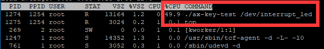
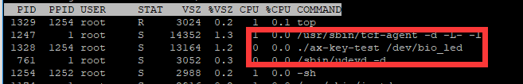

阻塞IO 
==============

IO是Input stream/Output
stream的缩写，即输入输出。对于驱动程序来说的IO就是用户程序对设备资源的访问和操作。接下来简单的说说几种IO模型以及Linux对他们的支持。

阻塞和非阻塞、同步和异步与IO操作
------------------------------------

阻塞和非阻塞、同步和异步是在IO操作中几种不可避免的状态。

先分开来看，通俗的讲：

1) 阻塞就是指某个操作如果不满足执行的条件，他会一直处于等待状态直至条件满足。

2) 非阻塞是指某个操作如果不满足执行的条件，他不会等待并且会返回未执行的结果。

3) 同步指多个操作同时发生时，这些操作需要排队逐个执行。

4) 异步指多个操作同时发生时，这些操作可以一起执行。

对于驱动来说IO操作一般可以理解为对外设的读写。一个完整的IO操作有两个阶段：

第一阶段：查看外设数据是否就绪；

第二阶段：数据就绪，读写外设数据。

再结合起来看。

阻塞IO、非阻塞IO：

当应用程序发出了IO请求。如果目标外设或数据没有准备好，对于阻塞IO来说，就会在read方法一直等待，直到数据准备好才会返回。而非阻塞IO会直接返回数据未准备好，应用程序再去处理NG的情况，重新读取或是其他。可见阻塞IO和非阻塞IO体现在IO操作的第一阶段。

同步IO、异步IO：

同步IO和异步IO实际上是针对应用程序和内核的交互来说的，应用程序发出IO请求后，如果数据没有就绪，需要应用程序不断的去轮询，直到准备就绪再执行第二阶段。对于异步IO，应用程序发出IO请求之后，第一阶段和第二阶段全都交友内核完成，当然驱动程序也属于内核的一部分。

阻塞IO
---------

这里说的阻塞IO实际上是同步阻塞IO。Linux的阻塞式访问中，应用程序调用read()函数从设备中读取数据时，如果设备或者数据没有准备好，就会进入休眠让出CPU资源，准备好时就会唤醒并返回数据给应用程序。
内核提供了等待队列机制来实现这里的休眠唤醒工作。

等待队列
~~~~~~~~~~~~~~

等待队列也就是进程组成的队列，Linux在系统执行会根据不同的状态把进程分成不同的队列，等待队列就是其中之一。

在驱动中使用等待队列步骤如下:

1) 创建并初始化等待队列

创建等待队列的方式为创建一个等待队列头，往队列头下添加项即为队列。队列头定义再include/linux/wait.h中，详情如下：

.. code:: c

 struct __wait_queue_head {
 spinlock_t lock;
 struct list_head task_list;
 };
 typedef struct __wait_queue_head wait_queue_head_t;

 

定义好队列头之后，使用下面的函数来初始化队列头：

+-----------------------------------------------------------------------+
| void init_waitqueue_head(wait_queue_head_t \*q)                       |
+-----------------------------------------------------------------------+

也可以使用宏定义

+-----------------------------------------------------------------------+
| DECLARE_WAIT_QUEUE_HEAD_ONSTACK(name)                                 |
+-----------------------------------------------------------------------+

一次性完成队列头的创建和初始化，name为队列头的名字。

2) 创建代表进程的等待队列项

等待队列项也定义在include/linux/wait.h头文件中，可以用宏定义：

+-----------------------------------------------------------------------+
| DECLARE_WAITQUEUE(name, tsk)                                          |
+-----------------------------------------------------------------------+

一次性完成队列项的定义和初始化，name为队列项的名字，tsk为队列项指代的进程，一般设置为current。current是内核中的一个全局变量，表示当前进程。

3) 添加或移除等待队列项到等待队列中并进入休眠

设备或数据不可访问时，就把进程添加进队列，使用接口函数：

+-----------------------------------------------------------------------+
| void add_wait_queue(wait_queue_head_t \*q, wait_queue_t \*wait)       |
+-----------------------------------------------------------------------+

q为需要加入的队列头，wait就是需要加入的队列项。

添加完成后使用函数

+-----------------------------------------------------------------------+
| \__set_current_state (state_value);                                   |
+-----------------------------------------------------------------------+

来设置进程状态，state_value 可以为：

TASK_UNINTERRUPTIBLE休眠不可被信号打断；

TASK_INTERRUPTIBLE休眠可被信号打断。

之后调用任务切换函数

+-----------------------------------------------------------------------+
| schedule();                                                           |
+-----------------------------------------------------------------------+

使当前进程进入休眠。如果被唤醒就会接着这个函数的位置往下运行。

紧接着，如果进程被设置成了TASK_INTERRUPTIBLE状态，有必要的话，还需要判断进程是不是被信号唤醒，如果是的话那就是误唤醒，需要让进程重新休眠。

使用函数

+-----------------------------------------------------------------------+
| signal_pending(current)                                               |
+-----------------------------------------------------------------------+

来判断当前进程是否为信号唤醒，current就是当前进程，如果是则返回真。

进程被唤醒后，使用

+-----------------------------------------------------------------------+
| set_current_state(TASK_RUNNING)                                       |
+-----------------------------------------------------------------------+

设置当前进程为运行状态。

如果设备可访问了，队列项从队列头中移除，使用函数：

+-----------------------------------------------------------------------+
| void remove_wait_queue(wait_queue_head_t \*q, wait_queue_t \*wait)    |
+-----------------------------------------------------------------------+

4) 主动唤醒或等待事件

进程休眠后使用下面两个函数来主动唤醒整个队列：

+-----------------------------------------------------------------------+
| void wake_up(wait_queue_head_t \*q)                                   |
|                                                                       |
| void wake_up_interruptible(wait_queue_head_t \*q)                     |
+-----------------------------------------------------------------------+

wake_up 函数可以唤醒处于 TASK_INTERRUPTIBLE 和TASK_UNINTERRUPTIBLE
状态的进程。 wake_up_interruptible 函数只能唤醒处于 TASK_INTERRUPTIBLE
状态的进程。

除了主动唤醒之外，还可以设置成等待某个条件满足后自动唤醒，Linux提供了这些宏：

.. code:: c

 /* 此函数会把进程设置为TASK_UNINTERRUPTIBLE， condition为真(条件)时会唤醒队列wq，会一直阻塞等待condition为真 */
 wait_event(wq, condition)
 /* 与wait_event类似，不过加了超时机制，timeout为超时时间单位为jiffies，时间到了之后即使条件不满足也会唤醒队列wq */
 wait_event_timeout(wq, condition, timeout)
 /*与wait_event类似，但是会把进程设置为TASK_INTERRUPTIBLE */
 wait_event_interruptible(wq, condition)
 /*与wait_event\_ timeout类似，，但是会把进程设置为TASK_INTERRUPTIBLE */
 wait_event_interruptible_timeout(wq, condition, timeout)

实验
--------

我们前面做的按键实验中，测试程序中读取key状态的方式都是在while循环中不断的去调用read方法。而我们在驱动程序中实现的read方法也只是简单的返回按键当前的值。这样做就导致测试程序和驱动程序都一直处于活跃状态，导致cpu占用率很高。以上一章的例程为例，使用./ax-key-test
/dev/interrupt_led&命令让ax-key-test程序在后台运行。再使用top命令来查看cpu的占用情况，如下图：

双cpu的soc光是一个按键程序就占用了49.9%几乎是一个cpu的资源，显然是不可取的。

分析一下，应用程序轮询read函数读取按键状态，大部分时候读到的都是未被按下的状态，而我们需要捕捉到的仅是按键被按下的状态，那是不是可以理解为，按键未按下就等同于我们需要的数据还没有准备好呢？在此基础上，我们就可以使用等待队列来是驱动程序中的read进程在按键没有按下时进入休眠，应用程序的read函数就得不到返回值，就不会一直轮询，从而降低cpu占用率。然后在按键按下时，唤醒进程，又能达到驱动程序捕捉按键被按下的动作的要求。

原理图
~~~~~~~~~~~~

led部分和 **字符设备** 章节相同。

key部分和 **gpio输入** 章节相同。

设备树
~~~~~~~~~~~~

和 **gpio输入** 章节相同。

驱动程序
~~~~~~~~~~~~~~

使用 petalinux 新建名为”ax-bio-drv”的驱劢程序，并执行 petalinux-config -c rootfs 命令选上新增的驱动程序。

在 ax-bio-drv.c 文件中输入下面的代码：

.. code:: c

 #include <linux/module.h>  
 #include <linux/kernel.h>
 #include <linux/init.h>   
 #include <linux/types.h>  
 #include <linux/errno.h>
 #include <linux/cdev.h>
 #include <linux/of.h>
 #include <linux/of_address.h>
 #include <linux/of_gpio.h>
 #include <linux/device.h>
 #include <linux/delay.h>
 #include <linux/init.h>
 #include <linux/gpio.h>
 #include <linux/semaphore.h>
 #include <linux/timer.h>
 #include <linux/of_irq.h>
 #include <linux/irq.h>
 #include <linux/interrupt.h>
 #include <asm/uaccess.h>
 #include <asm/mach/map.h>
 #include <asm/io.h>
   
 /* 设备节点名称 */  
 #define DEVICE_NAME       "bio_led"
 /* 设备号个数 */  
 #define DEVID_COUNT       1
 /* 驱动个数 */  
 #define DRIVE_COUNT       1
 /* 主设备号 */
 #define MAJOR_U
 /* 次设备号 */
 #define MINOR_U           0
 
 /* 把驱动代码中会用到的数据打包进设备结构体 */
 struct alinx_char_dev {
 /** 字符设备框架 **/
     dev_t              devid;             //设备号
     struct cdev        cdev;              //字符设备
     struct class       *class;            //类
     struct device      *device;           //设备
     struct device_node *nd;               //设备树的设备节点
 /** gpio **/    
     int                alinx_key_gpio;    //gpio号
 /** 并发处理 **/
     atomic_t           key_sts;           //记录按键状态, 为1时被按下
 /** 中断 **/
     unsigned int       irq;               //中断号
 /** 定时器 **/
     struct timer_list  timer;             //定时器
 /** 等待队列 **/
     wait_queue_head_t  wait_q_h;          //等待队列头
 };
 /* 声明设备结构体 */
 static struct alinx_char_dev alinx_char = {
     .cdev = {
         .owner = THIS_MODULE,
     },
 };
 
 /** 回掉 **/
 /* 中断服务函数 */
 static irqreturn_t key_handler(int irq, void *dev)
 {
     /* 按键按下或抬起时会进入中断 */
     /* 开启50毫秒的定时器用作防抖动 */
     mod_timer(&alinx_char.timer, jiffies + msecs_to_jiffies(50));
     return IRQ_RETVAL(IRQ_HANDLED);
 }
 
 /* 定时器服务函数 */
 void timer_function(struct timer_list *timer)
 {
     /* value用于获取按键值 */
     unsigned char value;
     /* 获取按键值 */
     value = gpio_get_value(alinx_char.alinx_key_gpio);
     if(value == 0)
     {
         /* 按键按下, 状态置1 */
         atomic_set(&alinx_char.key_sts, 1);
 /** 等待队列 **/
         /* 唤醒进程 */
         wake_up_interruptible(&alinx_char.wait_q_h);
     }
     else
     {
         /* 按键抬起 */
     }
 }
 
 /** 系统调用实现 **/
 /* open函数实现, 对应到Linux系统调用函数的open函数 */  
 static int char_drv_open(struct inode *inode_p, struct file *file_p)  
 {  
     printk("gpio_test module open\n");  
     return 0;  
 }  
   
   
 /* read函数实现, 对应到Linux系统调用函数的write函数 */  
 static ssize_t char_drv_read(struct file *file_p, char __user *buf, size_t len, loff_t *loff_t_p)  
 {  
     unsigned int keysts = 0;
     int ret;
     
     /* 读取key的状态 */
     keysts = atomic_read(&alinx_char.key_sts);
     /* 判断当前按键状态 */
     if(!keysts)
     {
         /* 按键未被按下(数据未准备好) */
         /* 以当前进程创建并初始化为队列项 */
         DECLARE_WAITQUEUE(queue_mem, current);
         /* 把当前进程的队列项添加到队列头 */
         add_wait_queue(&alinx_char.wait_q_h, &queue_mem);
         /* 设置当前进成为可被信号打断的状态 */
         __set_current_state(TASK_INTERRUPTIBLE);
         /* 切换进程, 是当前进程休眠 */
         schedule();
         
         /* 被唤醒, 修改当前进程状态为RUNNING */
         set_current_state(TASK_RUNNING);
         /* 把当前进程的队列项从队列头中删除 */
         remove_wait_queue(&alinx_char.wait_q_h, &queue_mem);
         
         /* 判断是否是被信号唤醒 */
         if(signal_pending(current))
         {
             /* 如果是直接返回错误 */
             return -ERESTARTSYS;
         }
         else
         {
             /* 被按键唤醒 */
         }
     }
     else
     {
         /* 按键被按下(数据准备好了) */
     }    
       
     /* 读取key的状态 */
     keysts = atomic_read(&alinx_char.key_sts);
     /* 返回按键状态值 */
     ret = copy_to_user(buf, &keysts, sizeof(keysts));
     /* 清除按键状态 */
     atomic_set(&alinx_char.key_sts, 0);
     return 0;  
 }  
   
 /* release函数实现, 对应到Linux系统调用函数的close函数 */  
 static int char_drv_release(struct inode *inode_p, struct file *file_p)  
 {  
     printk("gpio_test module release\n");
     return 0;  
 }  
       
 /* file_operations结构体声明, 是上面open、write实现函数与系统调用函数对应的关键 */  
 static struct file_operations ax_char_fops = {  
     .owner   = THIS_MODULE,  
     .open    = char_drv_open,  
     .read    = char_drv_read,     
     .release = char_drv_release,   
 };  
   
 /* 模块加载时会调用的函数 */  
 static int __init char_drv_init(void)  
 {
     /* 用于接受返回值 */
     u32 ret = 0;
     
 /** 并发处理 **/
     /* 初始化原子变量 */
     atomic_set(&alinx_char.key_sts, 0);
     
 /** gpio框架 **/   
     /* 获取设备节点 */
     alinx_char.nd = of_find_node_by_path("/alinxkey");
     if(alinx_char.nd == NULL)
     {
         printk("alinx_char node not find\r\n");
         return -EINVAL;
     }
     else
     {
         printk("alinx_char node find\r\n");
     }
     
     /* 获取节点中gpio标号 */
     alinx_char.alinx_key_gpio = of_get_named_gpio(alinx_char.nd, "alinxkey-gpios", 0);
     if(alinx_char.alinx_key_gpio < 0)
     {
         printk("can not get alinxkey-gpios");
         return -EINVAL;
     }
     printk("alinxkey-gpio num = %d\r\n", alinx_char.alinx_key_gpio);
     
     /* 申请gpio标号对应的引脚 */
     ret = gpio_request(alinx_char.alinx_key_gpio, "alinxkey");
     if(ret != 0)
     {
         printk("can not request gpio\r\n");
         return -EINVAL;
     }
     
     /* 把这个io设置为输入 */
     ret = gpio_direction_input(alinx_char.alinx_key_gpio);
     if(ret < 0)
     {
         printk("can not set gpio\r\n");
         return -EINVAL;
     }
 
 /** 中断 **/
     /* 获取中断号 */
     alinx_char.irq = gpio_to_irq(alinx_char.alinx_key_gpio);
     /* 申请中断 */
     ret = request_irq(alinx_char.irq,
                       key_handler,
                       IRQF_TRIGGER_FALLING | IRQF_TRIGGER_RISING,
                       "alinxkey", 
                       NULL);
     if(ret < 0)
     {
         printk("irq %d request failed\r\n", alinx_char.irq);
         return -EFAULT;
     }
     
 /** 定时器 **/
     __init_timer(&alinx_char.timer, timer_function, 0);
     
 /** 等待队列 **/
     init_waitqueue_head(&alinx_char.wait_q_h);
 
 /** 字符设备框架 **/    
     /* 注册设备号 */
     alloc_chrdev_region(&alinx_char.devid, MINOR_U, DEVID_COUNT, DEVICE_NAME);
     
     /* 初始化字符设备结构体 */
     cdev_init(&alinx_char.cdev, &ax_char_fops);
     
     /* 注册字符设备 */
     cdev_add(&alinx_char.cdev, alinx_char.devid, DRIVE_COUNT);
     
     /* 创建类 */
     alinx_char.class = class_create(THIS_MODULE, DEVICE_NAME);
     if(IS_ERR(alinx_char.class)) 
     {
         return PTR_ERR(alinx_char.class);
     }
     
     /* 创建设备节点 */
     alinx_char.device = device_create(alinx_char.class, NULL, 
                                       alinx_char.devid, NULL, 
                                       DEVICE_NAME);
     if (IS_ERR(alinx_char.device)) 
     {
         return PTR_ERR(alinx_char.device);
     }
     
     return 0;  
 }
 
 /* 卸载模块 */  
 static void __exit char_drv_exit(void)  
 {  
 /** gpio **/
     /* 释放gpio */
     gpio_free(alinx_char.alinx_key_gpio);
 
 /** 中断 **/
     /* 释放中断 */
     free_irq(alinx_char.irq, NULL);
 
 /** 定时器 **/
     /* 删除定时器 */   
     del_timer_sync(&alinx_char.timer);
 
 /** 字符设备框架 **/
     /* 注销字符设备 */
     cdev_del(&alinx_char.cdev);
     
     /* 注销设备号 */
     unregister_chrdev_region(alinx_char.devid, DEVID_COUNT);
     
     /* 删除设备节点 */
     device_destroy(alinx_char.class, alinx_char.devid);
     
     /* 删除类 */
     class_destroy(alinx_char.class);
     
     printk("timer_led_dev_exit_ok\n");  
 }  
   
 /* 标记加载、卸载函数 */  
 module_init(char_drv_init);  
 module_exit(char_drv_exit);  
   
 /* 驱动描述信息 */  
 MODULE_AUTHOR("Alinx");  
 MODULE_ALIAS("alinx char");  
 MODULE_DESCRIPTION("BIO LED driver");  
 MODULE_VERSION("v1.0");  
 MODULE_LICENSE("GPL");  
  

这次的程序在上一章中断的驱动程序基础上修改，只要修改集中在read函数中。

这次我们把自旋锁换成了原子变量，仅对key_sts这个状态值的读写做保护。

代码的\ **50**\ 行先定义了一个等待队列头。

在入口函数的\ **234**\ 行吧队列头进行了初始化。

应用程序通过read方法来读取key的状态，所以，先到read函数中做一些改动。前面提到过，key被按下才认为是数据准备好了。

进入read函数后\ **107~109**\ 行我们先判断key的状态，如果key没有被按下，就使用等待队列，等待按键被按下。

**113**\ 行以当前进程创建并初始化名为queue_mem的队列项。

**115**\ 行把队列项加入队列头。

**117**\ 行设置进程为可被信号打断的状态，然后\ **119**\ 行调用schedule切换进程，使当前进程休眠。

休眠了就需要相应的唤醒契机，我们是在等待按键被按下，所以，唤醒就可以放在按键的中断中去执行，在93行定时器的回掉中，最终确定案件被按下的同时，调用wake_up_interruptible(&alinx_char.wait_q_h);唤醒等待队列。

唤醒之后我们就又回到了\ **122**\ 行，接着刚才休眠的位置继续运行，先调用set_current_state(TASK_RUNNING);把当前进程的状态设为RUNNING。

**124**\ 行再把队列项从队列头中删除。

由于进程是可以被信号唤醒的，所以还需要判断进程是否是被信号还信，如果是则直接返回错误。

如果不是，就把按键的值返回给用户。

测试程序
~~~~~~~~~~~~~~

和 **gpio输入** 章节的测试程序相同。

运行测试
~~~~~~~~~~~~~~

测试步骤如下：

+-----------------------------------------------------------------------+
| mount -t nfs -o nolock 192.168.1.107:/home/alinx/work /mnt            |
|                                                                       |
| cd /mnt                                                               |
|                                                                       |
| mkdir /tmp/qt                                                         |
|                                                                       |
| mount qt_lib.img /tmp/qt                                              |
|                                                                       |
| cd /tmp/qt                                                            |
|                                                                       |
| source ./qt_env_set.sh                                                |
|                                                                       |
| cd /mnt                                                               |
|                                                                       |
| insmod ./ax-concled-drv.ko                                            |
|                                                                       |
| insmod ./ax-bio-drv.ko                                                |
|                                                                       |
| cd ./build-ax-key-test-ZYNQ-Debug                                     |
|                                                                       |
| ./ax-key-test /dev/bio_led&                                           |
|                                                                       |
| top                                                                   |
+-----------------------------------------------------------------------+

IP和路径根据实际情况调整。按键的现象与上一章相同。

此外，我们再看一下测试程序的cpu占用量。

几乎可以忽略了，因为测试程序没有改动，所以看来是等待队列起作用了。

如果想要关闭后台运行的程序，可以使用kill命令加上top命令中对应的PID，比如我们这里想要关闭ax-key-test程序，就是用命令kill
1328即可

