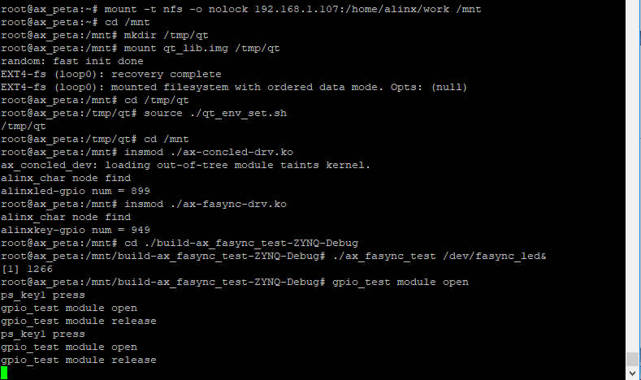
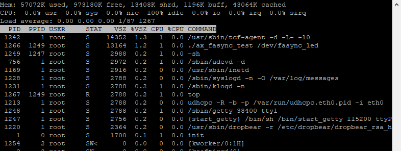

异步IO
===============

这里要说的异步IO准确的说应该叫“信号驱动的异步I/O”，也可以成为异步通知。前面两章说的阻塞和非阻塞IO，他们都是同步IO，需要应用程序不断的轮询设备是否可以被访问。而异步IO模型下，设备可被访问时，可以由驱动程序主动通知应用程序进行访问。他的形式类似于硬件层面的中断，可以理解为由软件实现的模拟中断机制。

Linux中的异步IO 
---------------------

信号
-----------

Linux系统中，使用信号来实现异步IO机制。在头文件arch/xtensa/include/uapi/asm/signal.h的34~72行定义了所有Linux系统支持的信号，相当于是中断系统中的中断号。信号的使用和中断也很想色，一个信号对应一个回掉函数，收到信号时，就会执行对应的回掉。

对于应用程序来说，信号是一种模拟中断方法，调用接口使用即可，而驱动程序则需要实现相应的方法，提供底层的支持。分别来看应用程序和驱动程序中信号的用法和实现方法。

应用程序中信号的使用
~~~~~~~~~~~~~~~~~~~~~~~~~~~

应用程序中使用信号的步骤如下：

1) 指定信号并指定对应的信号处理函数

使用下面的函数来选择一个信号并指定对应的信号处理函数：

+-----------------------------------------------------------------------+
| sighandler_t signal(int signum, sighandler_t handler)                 |
+-----------------------------------------------------------------------+

参数说明：

**signum**\ ：需要选择的信号，从文件arch/xtensa/include/uapi/asm/signal.h的34~72行宏定义中选一个。

**handler**\ ：对应的信号处理函数。

**返回值**\ ：成功返回信号的前一个处理函数，失败返回SGI_ERR。

信号处理函数sighandler_t的原型如下：

+-----------------------------------------------------------------------+
| typedef void (\*sighandler_t)(int)                                    |
+-----------------------------------------------------------------------+

2) 设置即将接收信号的进程ID

+-----------------------------------------------------------------------+
| fcntl(fd, F_SETOWN, getpid());                                        |
+-----------------------------------------------------------------------+

fd是设备文件句柄，F_SETOWN命令表示设置将接收SIGIO或SIGURG信号的线程ID，getpid()是获取当前线程ID。

3) 获取当前线程状态，并使它进入FASYNC状态

使用下面的方法获取当前进程状态：

+-----------------------------------------------------------------------+
| flag = fcntl(fd, F_GETFL);                                            |
+-----------------------------------------------------------------------+

flag是整型，fd是设备文件句柄，F_GETFL命令表示获取当前线程状态。

获取到当前线程状态后，在当前状态的基础上，设置进程为FASYNC状态，即开启当前线程的异步通知功能，使用下面的命令：

+-----------------------------------------------------------------------+
| fcntl(fd, F_SETFL, flags \| FASYNC);                                  |
+-----------------------------------------------------------------------+

fd是设备文件句柄，F_SETFL命令表示设置当前进程状态，flag \|
FASYNC中flag是获取到的当前线状态，或上FASYNC即在当前的状态上增加FASYNC状态。当线程的FASYNC状态被设置时，对应驱动程序file_pperations操作函数中的fasync就会被调用。

驱动程序中信号的实现
~~~~~~~~~~~~~~~~~~~~~~~~~~~

在驱动程序中支持信号，需要以下步骤：

1) 在设备结构体中声明fasync_struct结构体指针：

+-----------------------------------------------------------------------+
| struct xxx_dev {                                                      |
|                                                                       |
| \......                                                               |
|                                                                       |
| struct fasync_struct \*fasync;                                        |
|                                                                       |
| }                                                                     |
+-----------------------------------------------------------------------+

2) 实现fasync函数

fasync()函数的实现，一般只需将该函数的3个参数以及fasync_struct结构体指针传入fasync_helper()函数就可以了，如下：

+-----------------------------------------------------------------------+
| static int xxx_fasync(int fd,struct file \*filp, int mode)            |
|                                                                       |
| {                                                                     |
|                                                                       |
| 　　struct xxx_dev \*dev = filp->private_data;                        |
|                                                                       |
| 　　return fasync_helper(fd, filp, mode, &dev-> fasync);              |
|                                                                       |
| }                                                                     |
|                                                                       |
| static struct file_operations xxx_ops = {                             |
|                                                                       |
| \......                                                               |
|                                                                       |
| .fasync = xxx_fasync,                                                 |
|                                                                       |
| };                                                                    |
+-----------------------------------------------------------------------+

然后在release函数中调用fasync使用释放fasync_struct结构体，如下：

+-----------------------------------------------------------------------+
| static int xxx_release(struct inode \*inode, struct file \*filp)      |
|                                                                       |
| {                                                                     |
|                                                                       |
| \......                                                               |
|                                                                       |
| return xxx_fasync(-1, filp, 0);                                       |
|                                                                       |
| }                                                                     |
+-----------------------------------------------------------------------+

3) 设备可访问时，发出信号

应用程序开启异步通知之后，就是在等待设备可操作的信号，驱动程序需要在设备可操作时发出信号，使用函数：

+-----------------------------------------------------------------------+
| void kill_fasync(struct fasync_struct \**fp, int sig, int band)       |
+-----------------------------------------------------------------------+

参数说明：

**fp**\ ：目标fasync_struct结构体变量指针的地址。

**sig**\ ：发送的信号类型，范围是文件arch/xtensa/include/uapi/asm/signal.h的34~72行宏定义，需要和应用程序的需求一致。

**band**\ ：设备可写时设为POLL_IN，可读时为POLL_OUT。

实验
---------

驱动程序在上一章的基础上，增加异步IO的实现。然后再完成对应的测试程序。

原理图
~~~~~~~~~~~~~

led部分和章节 **字符设备** 章节相同。

key部分和 **gpio输入** 章节相同。

设备树
~~~~~~~~~~~~~

和 **gpio输入** 章节相同。

驱动代码
~~~~~~~~~~~~~~~

使用 petalinux 新建名为”ax-fasync-drv”的驱劢程序，并执行
petalinux-config -c rootfs 命令选上新增的驱动程序。

在 ax-fasync-drv.c 文件中输入下面的代码：

.. code:: c

 #include <linux/module.h>  
 #include <linux/kernel.h>
 #include <linux/init.h>  
 #include <linux/types.h>  
 #include <linux/errno.h>
 #include <linux/cdev.h>
 #include <linux/of.h>
 #include <linux/of_address.h>
 #include <linux/of_gpio.h>
 #include <linux/device.h>
 #include <linux/delay.h>
 #include <linux/init.h>
 #include <linux/gpio.h>
 #include <linux/semaphore.h>
 #include <linux/timer.h>
 #include <linux/of_irq.h>
 #include <linux/irq.h>
 #include <linux/interrupt.h>
 #include <linux/sched.h>
 #include <linux/wait.h>
 #include <linux/poll.h>
 #include <linux/fcntl.h>
 #include <asm/uaccess.h>
 #include <asm/mach/map.h>
 #include <asm/io.h>
   
 /* 设备节点名称 */  
 #define DEVICE_NAME       "fasync_led"
 /* 设备号个数 */  
 #define DEVID_COUNT       1
 /* 驱动个数 */  
 #define DRIVE_COUNT       1
 /* 主设备号 */
 #define MAJOR_U
 /* 次设备号 */
 #define MINOR_U           0
 
 /* 把驱动代码中会用到的数据打包进设备结构体 */
 struct alinx_char_dev {
     dev_t                devid;             //设备号
     struct cdev          cdev;              //字符设备
     struct class         *class;            //类
     struct device        *device;           //设备
     struct device_node   *nd;               //设备树的设备节点
     int                  alinx_key_gpio;    //gpio号
     atomic_t             key_sts;           //记录按键状态, 为1时被按下
     unsigned int         irq;               //中断号
     struct timer_list    timer;             //定时器
     wait_queue_head_t    wait_q_h;          //等待队列头
     struct fasync_struct *fasync;           //异步信号
 };
 /* 声明设备结构体 */
 static struct alinx_char_dev alinx_char = {
     .cdev = {
         .owner = THIS_MODULE,
     },
 };
 
 /* 中断服务函数 */
 static irqreturn_t key_handler(int irq, void *dev_in)
 {
     /* 按键按下或抬起时会进入中断 */
     struct alinx_char_dev *dev = (struct alinx_char_dev *)dev_in;
     
     mod_timer(&dev->timer, jiffies + msecs_to_jiffies(50));
     return IRQ_RETVAL(IRQ_HANDLED);
 }
 
 /* 定时器服务函数 */
 void timer_function(struct timer_list *timer)
 {
     struct alinx_char_dev *dev = &alinx_char;
     /* value用于获取按键值 */
     unsigned char value;
     /* 获取按键值 */
     value = gpio_get_value(dev->alinx_key_gpio);
     if(value == 0)
     {
         /* 按键按下, 状态置1 */
         atomic_set(&dev->key_sts, 1);
         /* fasync有没有初始化过 */
         if(dev->fasync)
         {
             /* 初始化过说明应用程序调用过 */
             kill_fasync(&dev->fasync, SIGIO, POLL_OUT);
         }
         else if((current->__state & TASK_INTERRUPTIBLE) != 0)
         {
             /* 是等待队列，需要唤醒进程 */
             wake_up_interruptible(&dev->wait_q_h);
         }
         else
         {
             /* do nothing */
         }
     }
     else
     {
         /* 按键抬起 */
     }
 }
 
 /* open函数实现, 对应到Linux系统调用函数的open函数 */  
 static int char_drv_open(struct inode *inode_p, struct file *file_p)  
 {  
     printk("gpio_test module open\n"); 
     file_p->private_data = &alinx_char;
     return 0;  
 }  
   
 /* read函数实现, 对应到Linux系统调用函数的write函数 */  
 static ssize_t char_drv_read(struct file *file_p, char __user *buf, size_t len, loff_t *loff_t_p)  
 {  
     unsigned int keysts = 0;
     int ret;
     
     struct alinx_char_dev *dev = (struct alinx_char_dev *)file_p->private_data;
     
     /* 读取key的状态 */
     keysts = atomic_read(&dev->key_sts);
     /* 判断文件打开方式 */
     if(file_p->f_flags & O_NONBLOCK)
     {
         /* 如果是非阻塞访问, 说明已满足读取条件 */
     }
     /* 判断当前按键状态 */
     else if(!keysts)
     {
         /* 按键未被按下(数据未准备好) */
         /* 以当前进程创建并初始化为队列项 */
         DECLARE_WAITQUEUE(queue_mem, current);
         /* 把当前进程的队列项添加到队列头 */
         add_wait_queue(&dev->wait_q_h, &queue_mem);
         /* 设置当前进成为可被信号打断的状态 */
         __set_current_state(TASK_INTERRUPTIBLE);
         /* 切换进程, 是当前进程休眠 */
         schedule();
         
         /* 被唤醒, 修改当前进程状态为RUNNING */
         set_current_state(TASK_RUNNING);
         /* 把当前进程的队列项从队列头中删除 */
         remove_wait_queue(&dev->wait_q_h, &queue_mem);
         
         /* 判断是否是被信号唤醒 */
         if(signal_pending(current))
         {
             /* 如果是直接返回错误 */
             return -ERESTARTSYS;
         }
         else
         {
             /* 被按键唤醒 */
         }
     }
     else
     {
         /* 按键被按下(数据准备好了) */
     }    
       
     /* 读取key的状态 */
     keysts = atomic_read(&dev->key_sts);
     /* 返回按键状态值 */
     ret = copy_to_user(buf, &keysts, sizeof(keysts));
     /* 清除按键状态 */
     atomic_set(&dev->key_sts, 0);
     return 0;  
 }  
 
 /* poll函数实现 */  
 unsigned int char_drv_poll(struct file *file_p, struct poll_table_struct *wait)
 {
     unsigned int ret = 0;
     
     struct alinx_char_dev *dev = (struct alinx_char_dev *)file_p->private_data;
     
     /* 将应用程序添添加到等待队列中 */
     poll_wait(file_p, &dev->wait_q_h, wait);
     
     /* 判断key的状态 */
     if(atomic_read(&dev->key_sts))
     {
         /* key准备好了, 返回数据可读 */
         ret = POLLIN;
     }
     else
     {
         
     }
     
     return ret;
 }
 
 /* fasync函数实现 */
 static int char_drv_fasync(int fd,struct file *file_p, int mode)
 {
     struct alinx_char_dev *dev = (struct alinx_char_dev *)file_p->private_data;
     return fasync_helper(fd, file_p, mode, &dev->fasync);
 }
 
 /* release函数实现, 对应到Linux系统调用函数的close函数 */  
 static int char_drv_release(struct inode *inode_p, struct file *file_p)  
 {  
     printk("gpio_test module release\n");
     return char_drv_fasync(-1, file_p, 0);
 }
       
 /* file_operations结构体声明, 是上面open、write实现函数与系统调用函数对应的关键 */  
 static struct file_operations ax_char_fops = {  
     .owner   = THIS_MODULE,  
     .open    = char_drv_open,  
     .read    = char_drv_read,   
     .poll    = char_drv_poll,  
     .fasync  = char_drv_fasync,
     .release = char_drv_release,   
 };  
   
 /* 模块加载时会调用的函数 */  
 static int __init char_drv_init(void)  
 {
     /* 用于接受返回值 */
     u32 ret = 0;
     
     /* 初始化原子变量 */
     atomic_set(&alinx_char.key_sts, 0);
     
     /* 获取设备节点 */
     alinx_char.nd = of_find_node_by_path("/alinxkey");
     if(alinx_char.nd == NULL)
     {
         printk("alinx_char node not find\r\n");
         return -EINVAL;
     }
     else
     {
         printk("alinx_char node find\r\n");
     }
     
     /* 获取节点中gpio标号 */
     alinx_char.alinx_key_gpio = of_get_named_gpio(alinx_char.nd, "alinxkey-gpios", 0);
     if(alinx_char.alinx_key_gpio < 0)
     {
         printk("can not get alinxkey-gpios");
         return -EINVAL;
     }
     printk("alinxkey-gpio num = %d\r\n", alinx_char.alinx_key_gpio);
     
     /* 申请gpio标号对应的引脚 */
     ret = gpio_request(alinx_char.alinx_key_gpio, "alinxkey");
     if(ret != 0)
     {
         printk("can not request gpio\r\n");
         return -EINVAL;
     }
     
     /* 把这个io设置为输入 */
     ret = gpio_direction_input(alinx_char.alinx_key_gpio);
     if(ret < 0)
     {
         printk("can not set gpio\r\n");
         return -EINVAL;
     }
 
     /* 获取中断号 */
     alinx_char.irq = gpio_to_irq(alinx_char.alinx_key_gpio);
     /* 申请中断 */
     ret = request_irq(alinx_char.irq,
                       key_handler,
                       IRQF_TRIGGER_FALLING | IRQF_TRIGGER_RISING,
                       "alinxkey", 
                       &alinx_char);
     if(ret < 0)
     {
         printk("irq %d request failed\r\n", alinx_char.irq);
         return -EFAULT;
     }
     
     __init_timer(&alinx_char.timer, timer_function, 0);
     
     init_waitqueue_head(&alinx_char.wait_q_h);
     
     /* 注册设备号 */
     alloc_chrdev_region(&alinx_char.devid, MINOR_U, DEVID_COUNT, DEVICE_NAME);
     
     /* 初始化字符设备结构体 */
     cdev_init(&alinx_char.cdev, &ax_char_fops);
     
     /* 注册字符设备 */
     cdev_add(&alinx_char.cdev, alinx_char.devid, DRIVE_COUNT);
     
     /* 创建类 */
     alinx_char.class = class_create(THIS_MODULE, DEVICE_NAME);
     if(IS_ERR(alinx_char.class)) 
     {
         return PTR_ERR(alinx_char.class);
     }
     
     /* 创建设备节点 */
     alinx_char.device = device_create(alinx_char.class, NULL, 
                                       alinx_char.devid, NULL, 
                                       DEVICE_NAME);
     if (IS_ERR(alinx_char.device)) 
     {
         return PTR_ERR(alinx_char.device);
     }
     
     return 0;  
 }
 
 /* 卸载模块 */  
 static void __exit char_drv_exit(void)  
 {  
     /* 释放gpio */
     gpio_free(alinx_char.alinx_key_gpio);
 
     /* 释放中断 */
     free_irq(alinx_char.irq, NULL);
 
     /* 删除定时器 */   
     del_timer_sync(&alinx_char.timer);
 
     /* 注销字符设备 */
     cdev_del(&alinx_char.cdev);
     
     /* 注销设备号 */
     unregister_chrdev_region(alinx_char.devid, DEVID_COUNT);
     
     /* 删除设备节点 */
     device_destroy(alinx_char.class, alinx_char.devid);
     
     /* 删除类 */
     class_destroy(alinx_char.class);
     
     printk("timer_led_dev_exit_ok\n");  
 }  
  
 /* 标记加载、卸载函数 */  
 module_init(char_drv_init);  
 module_exit(char_drv_exit);  
   
 /* 驱动描述信息 */  
 MODULE_AUTHOR("Alinx");  
 MODULE_ALIAS("alinx char");  
 MODULE_DESCRIPTION("FASYNC LED driver");  
 MODULE_VERSION("v1.0");  
 MODULE_LICENSE("GPL");  
 
21行添加头文件linux/fcntl.h。

49行添加fasync_struct结构体到设备结构体中。

82行在定时器的处理函数中，确认按键按下后，先判断fasync_struct结构体有没有初始化过，初始化过说明调用过fasync函数，也就是应用程序是能了异步通知，所以就发送对应的信号。

204~208行实现fasync函数，里面就是简单的调用了fasync_helper来初始化fasync_struct结构体。

204行在release函数中调用fasync函数，释放fasync_struct结构体。

213行把我们实现的fasync函数添加到file_operations结构体中。

另外，相比较上一章，这章里面使用了私有数据来代替设备结构体变量的全局变量，具体的用法说明，可以回顾一下第一章的实验代码里的解释。

注意270行中断的服务函数输入参数设置和64行定时器的服务函数输入参数设置。

测试代码
~~~~~~~~~~~~~~~

新建QT工程名为”ax_fasync_test”，新建main.c，输入下列代码：

.. code:: c

 #include "stdio.h"
 #include "unistd.h"
 #include "sys/types.h"
 #include "sys/stat.h"
 #include "fcntl.h"
 #include "stdlib.h"
 #include "string.h"
 #include "poll.h"
 #include "sys/select.h"
 #include "sys/time.h"
 #include "linux/ioctl.h"
 #include "signal.h"
 
 static int fd = 0, fd_l = 0;
 
 static void sigio_signal_func()
 {
     int ret = 0;
     static char led_value = 0;
     unsigned int key_value;
 
     /* 获取按键状态 */
     ret = read(fd, &key_value, sizeof(key_value));
     if(ret < 0)
     {
         printf("read failed\r\n");
     }
 
     /* 判断按键状态 */
     if(1 == key_value)
     {
         /* 按键被按下，改变吗led状态 */
         printf("ps_key1 press\r\n");
         led_value = !led_value;
 
         fd_l = open("/dev/gpio_leds", O_RDWR);
         if(fd_l < 0)
         {
             printf("file /dev/gpio_leds open failed\r\n");
         }
 
         ret = write(fd_l, &led_value, sizeof(led_value));
         if(ret < 0)
         {
             printf("write failed\r\n");
         }
 
         ret = close(fd_l);
         if(ret < 0)
         {
             printf("file /dev/gpio_leds close failed\r\n");
         }
     }
 }
 
 int main(int argc, char *argv[])
 {
     int flags = 0;
     char *filename;
 
     if(argc != 2)
     {
         printf("wrong para\n");
         return -1;
     }
 
     filename = argv[1];
     fd = open(filename, O_RDWR);
     if(fd < 0)
     {
         printf("can not open file %s\r\n", filename);
         return -1;
     }
 
     /* 指定信号SIGIO，并绑定处理函数 */
     signal(SIGIO, sigio_signal_func);
     /* 把当前线程指定为将接收信号的进程 */
     fcntl(fd, F_SETOWN, getpid());
     /* 获取当前线程状态 */
     flags = fcntl(fd, F_GETFD);
     /* 设置当前线程为FASYNC状态 */
     fcntl(fd, F_SETFL, flags | FASYNC);
 
     while(1)
     {
         sleep(2);
     }
 
     close(fd);
     return 0;
 }

注意19行给led_value加上static。

75~82行就是按照异步IO章节中说的步骤操作即可，不重复解释了。

运行测试
~~~~~~~~~~~~~~~

测试方式和现象和上一章一样，步骤如下：

+-----------------------------------------------------------------------+
| mount -t nfs -o nolock 192.168.1.107:/home/alinx/work /mnt            |
|                                                                       |
| cd /mnt                                                               |
|                                                                       |
| mkdir /tmp/qt                                                         |
|                                                                       |
| mount qt_lib.img /tmp/qt                                              |
|                                                                       |
| cd /tmp/qt                                                            |
|                                                                       |
| source ./qt_env_set.sh                                                |
|                                                                       |
| cd /mnt                                                               |
|                                                                       |
| insmod ./ax-concled-drv.ko                                            |
|                                                                       |
| insmod ./ax-fasync-drv.ko                                             |
|                                                                       |
| cd ./build-ax_fasync_test-ZYNQ-Debug                                  |
|                                                                       |
| ./ax_fasync_test /dev/fasync_led&                                     |
|                                                                       |
| top                                                                   |
+-----------------------------------------------------------------------+

结果如下图：

