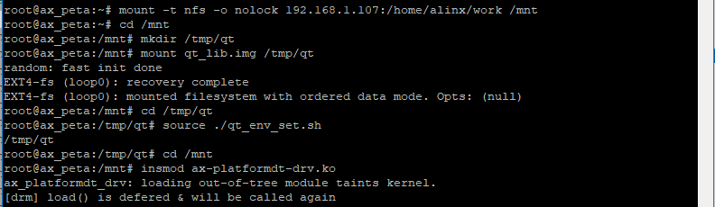
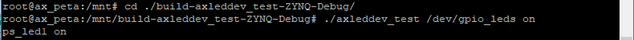

platform与设备树
=========================

设备树下的platform
-----------------------

在设备树引入之后，platform结构中的platform_device就可以用设备树去代替了。设备树下的platform驱动相较于原始的platform驱动，只需要把platform_device中描述的设备信息放到设备树中，同时修改paltform_drvier中对资源的读取方法即可。

1) 在设备树中描述设备信息

使用platform_device时，我们可以通过name字段或者id_table来匹配设备和驱动，当platform_device变成设备树时，根据上一章在platform_bus中的介绍，则使用of_match_table方法来匹配。of_match_table对于设备树来说，要做的事，就是保证设备节点的compatible属性和platform_driver中的compatible保持一致。

.. code:: c

 alinxled {
 compatible = "alinx-led";
 pinctrl-names = "default";
 pinctrl-0 = <&pinctrl_led_default>;
 alinxled-gpios = <&gpio0 0 0>;
 };

除了这点要注意之外，设备树的写法就没有什么特别的了。

2) of_match_table

paltform_drvier中的compatible属性设置在上一章中已经介绍过了，compatible
位于paltform_drvier->device_driver->
of_device_id->compatible，保证和设备树中的compatible字段一致即可。of_device_id结构体在paltform_drvier结构体中的成员名为of_match_table，of匹配表。初始化示例如下：

.. code:: c

 static const struct of_device_id led_of_match[] = {
 /* compatible 字段和设备树中保持一致 */
 { .compatible = "alinx-led" },
 {/* Sentinel */}
 }; 

需要注意of_device_id 的最后一个成员必须为空。

还有一点，即使我们不是用name字段做匹配工作device_driver结构体中的name字段还是需要保留，否则在加载驱动时可能会出错。

3) 修改paltform_drvier读取设备信息的方法

既然platform_device换成了设备树，那paltform_drvier读取设备信息的方式肯定得换成of函数了。回顾一下 **pinctrl和gpio子系统** 章节中的of函数内容，就可以动手来实现设备树下的platform驱动代码了。

实验
---------

这一章的实验在上一章的基础上，用设备树代替platform_device的情况下，使用platform架构来实现简单的点亮led实验。

原理图
~~~~~~~~~~~~~

和 **字符设备** 章节的内容相同。

设备树
~~~~~~~~~~~~~

这里我们只要使用 **pinctrl和gpio子系统** 章节中下的led节点就可以了，写法都是一样的，直接用就行了。只要注意设备节点中的compatible属性，要和platform_driver中的compatible保持一致。

.. code:: c

	alinxled {
		compatible = "alinx-led";
		pinctrl-names = "default";
		alinxled-gpios = <&gpio0 0 0>;
	};

驱动程序
~~~~~~~~~~~~~~~

使用 petalinux 新建名为”ax-platformdt-drv”的驱动程序，并执行
petalinux-config -c rootfs 命令选上新增的驱动程序。

在 ax-platformdt-drv.c 文件中输入下面的代码：

.. code:: c
   
 #include <linux/types.h>
 #include <linux/kernel.h>
 #include <linux/delay.h>
 #include <linux/init.h>
 #include <linux/module.h>
 #include <linux/errno.h>
 #include <linux/gpio.h>
 #include <linux/cdev.h>
 #include <linux/device.h>
 #include <linux/of_gpio.h>
 #include <linux/semaphore.h>
 #include <linux/timer.h>
 #include <linux/irq.h>
 #include <linux/wait.h>
 #include <linux/poll.h>
 #include <linux/fs.h>
 #include <linux/fcntl.h>
 #include <linux/platform_device.h>
 #include <asm/mach/map.h>
 #include <asm/uaccess.h>
 #include <asm/io.h>
 
 /* 设备节点名称 */  
 #define DEVICE_NAME       "gpio_leds"
 /* 设备号个数 */  
 #define DEVID_COUNT       1
 /* 驱动个数 */  
 #define DRIVE_COUNT       1
 /* 主设备号 */
 #define MAJOR_AX
 /* 次设备号 */
 #define MINOR_AX          0
 /* LED点亮时输入的值 */
 #define ALINX_LED_ON      1
 /* LED熄灭时输入的值 */
 #define ALINX_LED_OFF     0
 
 /* 把驱动代码中会用到的数据打包进设备结构体 */
 struct alinx_char_dev{
     dev_t              devid;       //设备号
     struct cdev        cdev;        //字符设备
     struct class       *class;      //类
     struct device      *device;     //设备
     struct device_node *nd;         //设备树的设备节点
     int                ax_led_gpio; //gpio号
 };
 /* 声明设备结构体 */
 static struct alinx_char_dev alinx_char = {
     .cdev = {
         .owner = THIS_MODULE,
     },
 };
 
 /* open函数实现, 对应到Linux系统调用函数的open函数 */  
 static int gpio_leds_open(struct inode *inode_p, struct file *file_p)  
 {  
     /* 设置私有数据 */
     file_p->private_data = &alinx_char;    
       
     return 0;  
 }  
 
 /* write函数实现, 对应到Linux系统调用函数的write函数 */  
 static ssize_t gpio_leds_write(struct file *file_p, const char __user *buf, size_t len, loff_t *loff_t_p)  
 {  
     int retvalue;
     unsigned char databuf[1];  
     /* 获取私有数据 */
     struct alinx_char_dev *dev = file_p->private_data;
   
     /* 获取用户数据 */
     retvalue = copy_from_user(databuf, buf, len);  
     if(retvalue < 0) 
     {
         printk("alinx led write failed\r\n");
         return -EFAULT;
     } 
       
     if(databuf[0] == ALINX_LED_ON)
     {
         /* gpio_set_value方法设置GPIO的值, 使用!!对0或者1二值化 */
         gpio_set_value(dev->ax_led_gpio, !!0);
     }
     else if(databuf[0] == ALINX_LED_OFF)
     {
         gpio_set_value(dev->ax_led_gpio, !!1);
     }
     else
     {
         printk("gpio_test para err\n");
     }
      
     return 0;  
 }  
 
 /* release函数实现, 对应到Linux系统调用函数的close函数 */  
 static int gpio_leds_release(struct inode *inode_p, struct file *file_p)  
 {   
     return 0;  
 }  
 
 /* file_operations结构体声明, 是上面open、write实现函数与系统调用函数对应的关键 */  
 static struct file_operations ax_char_fops = {  
     .owner   = THIS_MODULE,  
     .open    = gpio_leds_open,  
     .write   = gpio_leds_write,     
     .release = gpio_leds_release,   
 };
 
 /* probe函数实现, 驱动和设备匹配时会被调用 */
 static int gpio_leds_probe(struct platform_device *dev)
 {    
     /* 用于接受返回值 */
     u32 ret = 0;
     /* 获取设备节点 */
     alinx_char.nd = of_find_node_by_path("/alinxled");
     if(alinx_char.nd == NULL)    
     {
         printk("gpioled node nost find\r\n");
         return -EINVAL;
     }
 
     /* 获取节点中gpio标号 */
     alinx_char.ax_led_gpio = of_get_named_gpio(alinx_char.nd, "alinxled-gpios", 0);
     if(alinx_char.ax_led_gpio < 0)    
     {
         printk("can not get alinxled-gpios\r\n");
         return -EINVAL;
     }
 
     /* 把这个io设置为输出 */
     ret = gpio_direction_output(alinx_char.ax_led_gpio, 1);
     if(ret < 0)
     {
         printk("can not set gpio\r\n");
     }
     
     /* 注册设备号 */
     alloc_chrdev_region(&alinx_char.devid, MINOR_AX, DEVID_COUNT, DEVICE_NAME);
     
     /* 初始化字符设备结构体 */
     cdev_init(&alinx_char.cdev, &ax_char_fops);
     
     /* 注册字符设备 */
     cdev_add(&alinx_char.cdev, alinx_char.devid, DRIVE_COUNT);
     
     /* 创建类 */
     alinx_char.class = class_create(THIS_MODULE, DEVICE_NAME);
     if(IS_ERR(alinx_char.class)) 
     {
         return PTR_ERR(alinx_char.class);
     }
     
     /* 创建设备节点 */
     alinx_char.device = device_create(alinx_char.class, NULL, 
                                       alinx_char.devid, NULL, 
                                       DEVICE_NAME);
     if (IS_ERR(alinx_char.device)) 
     {
         return PTR_ERR(alinx_char.device);
     }
     
     return 0;
 }
 
 static int gpio_leds_remove(struct platform_device *dev)
 {
     /* 注销字符设备 */
     cdev_del(&alinx_char.cdev);
     
     /* 注销设备号 */
     unregister_chrdev_region(alinx_char.devid, DEVID_COUNT);
     
     /* 删除设备节点 */
     device_destroy(alinx_char.class, alinx_char.devid);
     
     /* 删除类 */
     class_destroy(alinx_char.class);
     return 0;
 }
 
 /* 初始化of_match_table */
 static const struct of_device_id led_of_match[] = {
     /* compatible字段和设备树中保持一致 */
     { .compatible = "alinx-led", },
     {/* Sentinel */}
 };
 
 
 /* 声明并初始化platform驱动 */
 static struct platform_driver led_driver = {
     .driver = {
         /* name字段需要保留 */
         .name = "alinx-led",
         /* 用of_match_table代替name匹配 */
         .of_match_table = led_of_match,
     },
     .probe  = gpio_leds_probe,
     .remove = gpio_leds_remove,
 };
 
 /* 驱动入口函数 */
 static int __init gpio_led_drv_init(void)
 {
 
     /* 在入口函数中调用platform_driver_register, 注册platform驱动 */
     return platform_driver_register(&led_driver);
 }
 
 /* 驱动出口函数 */
 static void __exit gpio_led_dev_exit(void)
 {
     /* 在出口函数中调用platform_driver_register, 卸载platform驱动 */
     platform_driver_unregister(&led_driver);
 }
 
 /* 标记加载、卸载函数 */ 
 module_init(gpio_led_drv_init);
 module_exit(gpio_led_dev_exit);
 
 /* 驱动描述信息 */  
 MODULE_AUTHOR("Alinx");  
 MODULE_ALIAS("gpio_led");  
 MODULE_DESCRIPTION("PLATFORM DT LED driver");  
 MODULE_VERSION("v1.0");  
 MODULE_LICENSE("GPL"); 

把 **pinctrl和gpio子系统** 章节的驱动代码和上一章的代码结合起来看，这章的代码其实就是这两张的驱动代码的组合。

platform结构套用上一章的结构，设备树资源获取的方法套用第四章的方法。read、write、release方法和 **pinctrl和gpio子系统** 章节相同。

为一要注意的就是200行的driver字段，name要保留。of_match_table中的compatible字段要和设备树中的一致。

测试程序
~~~~~~~~~~~~~~~

测试 APP 和 **字符设备** 章节内容一致，可以使用那一章节的测试程序。

运行测试
~~~~~~~~~~~~~~~

测试方法和上一章基本一致，省去了加载device的命令，步骤如下：

+-----------------------------------------------------------------------+
| mount -t nfs -o nolock 192.168.1.107:/home/alinx/work /mnt            |
|                                                                       |
| cd /mnt                                                               |
|                                                                       |
| mkdir /tmp/qt                                                         |
|                                                                       |
| mount qt_lib.img /tmp/qt                                              |
|                                                                       |
| cd /tmp/qt                                                            |
|                                                                       |
| source ./qt_env_set.sh                                                |
|                                                                       |
| cd /mnt                                                               |
|                                                                       |
| insmod ax-platformdt-drv.ko                                           |
|                                                                       |
| cd ./build-axleddev_test-ZYNQ-Debug/                                  |
|                                                                       |
| ./axleddev_test /dev/gpio_leds on                                     |
+-----------------------------------------------------------------------+

IP 和路径根据实际情况调整。

除了led的现象之外，串口工具中的调试结果如下：

