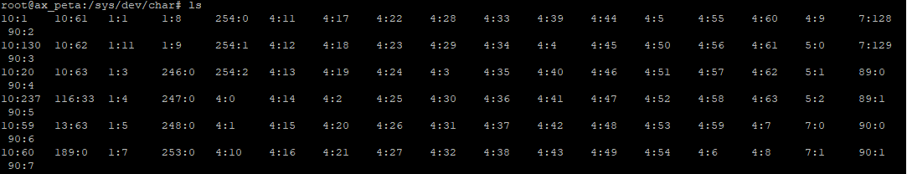
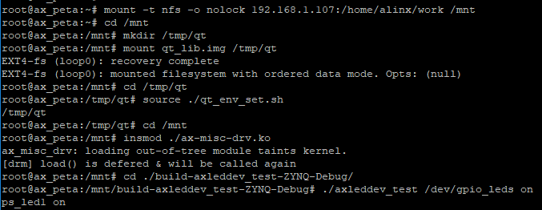

第十四章 MISC设备驱动
=====================

做了这么多实验之后，一直没有离开过字符设备。比较这些章节的驱动代码不难发现，字符设备框架中，有很大一部分的代码是相同的。对此，Linux内核提出了MISC驱动模型，把这些共性的代码封装起来。

MISC设备简介
-----------------

MISC意为杂散设备，诸如蜂鸣器、adc、led这些难以分类的设备，都可以用MISC框架来实现驱动。

MISC驱动模型实际上是对字符设备驱动模型的一次封装，他的本质是还是字符设备。MISC的源码目录为/drivers/char/misc.c。相比一般的字符设备驱动框架，MISC这层封装带来的好处有以下几点：

1) 节省主设备号

在文件/drivers/char/misc.c的214行，在misc_register函数中，使用宏MISC_MAJOR表示主设备号来注册次设备号，MISC_MAJOR宏定义在文件include/uapi/linux/major.h的第25行，值为10，也就是说MISC设备的主设备号固定为10。使用MISC框架注册的字符设备，都会在主设备号10下分配次设备号(部分次设备号已被内核占用)。而普通字符设备框架注册时必须要分配一个主设备号，因此相对于一般的字符设备框架，使用MISC框架能节省主设备号。

2) 简洁使用方便

一般的字符设备驱动框架需要用alloc_chrdev_region()、cdev_init()、cdev_add()、class_create()、device_create()一串函数来完成设备的创建，但是MISC框架使用misc_register()函数对设备的创建过程做了很好的优化和封装，我们只需调用这一个函数就可以完成设备的创建，方便很多。

3) 驱动分层

MISC也是对Linux驱动分层思想的一种体现，给难以分类的设备提供了归属类型，也方便了他们的使用。

MISC框架的使用
-------------------

MISC框架的使用对于一般字符设备框架来说只是做一些替换。方法如下。

1) 创建并初始化miscdevice结构体

miscdveice表示misc设备，定义在文件 include/linux/miscdevice.h 中，如下：

.. code:: c

 struct miscdevice {
 int minor;
 const char *name;
 const struct file_operations *fops;
 struct list_head list;
 struct device *parent;
 struct device *this_device;
 const struct attribute_group **groups;
 const char *nodename;
 umode_t mode;
 };

结构体成员中没有主设备号，因为misc设备的主设备号都固定为10。声明了miscdevice结构体变量之后需要初始化三个成员变量：

1.1) 第2行的minor，子设备号。使用misc框架注册的设备以子设备号来区分。内核中已经占用了部分misc的子设备号，在文件include/linux/miscdevice.h的14~54行中可查看已被占用的子设备号(不同的内核源码行号可能不一样)。如果需要在系统中查看已被占用的子设备号，可以ls一下/sys/dev/char这个路径如下图。ls结果中的如第一项的10:1，冒号前的10为主设备，冒号后的1为此次设备号，也就是说主设备号10下的次设备号1已被占用。

1.2) 第3行的name，设备名称。将在/dev目录中生成的节点名。

1.3) 第4行的fops，设备操作函数集。和字符设备中实现的fops相同。

2) 使用misc_register函数注册设备代替原先的注册过程

声明并初始化完成miscdevice后，使用misc_register函数来注册misc设备，函数定义在文件/drivers/char/misc.c中，原型如下：

+-----------------------------------------------------------------------+
| int misc_register(struct miscdevice \* misc)                          |
+-----------------------------------------------------------------------+

misc即为miscdevice结构体变量。

注册成功返回0，失败返回负数。

3) 使用misc_deregister函数注销设备代替原先的注销过程

与注册相对的就有注销函数，代替一般字符设备在驱动出口函数中一系列的注销操作，函数原型：

+-----------------------------------------------------------------------+
| void misc_deregister(struct miscdevice \*misc)                        |
+-----------------------------------------------------------------------+

misc即为miscdevice结构体变量。

实验
---------

本章的实验在上一章的基础上修改，在platform框架下结合misc框架和把一般的字符设备框架修改成misc框架的方法几乎没有差别。

原理图
~~~~~~~~~~~~~

和 **字符设备** 章节的内容相同。

设备树
~~~~~~~~~~~~~

和上一章相同。

驱动代码
~~~~~~~~~~~~~~~

使用 petalinux 新建名为”ax-misc-drv”的驱动程序，并执行 petalinux-config -c rootfs 命令选上新增的驱动程序。

在 ax-misc-drv.c 文件中输入下面的代码：

.. code:: c

 #include <linux/types.h>
 #include <linux/kernel.h>
 #include <linux/delay.h>
 #include <linux/init.h>
 #include <linux/module.h>
 #include <linux/errno.h>
 #include <linux/gpio.h>
 #include <linux/cdev.h>
 #include <linux/device.h>
 #include <linux/of_gpio.h>
 #include <linux/semaphore.h>
 #include <linux/timer.h>
 #include <linux/irq.h>
 #include <linux/wait.h>
 #include <linux/poll.h>
 #include <linux/fs.h>
 #include <linux/fcntl.h>
 #include <linux/platform_device.h>
 #include <linux/miscdevice.h>
 #include <asm/mach/map.h>
 #include <asm/uaccess.h>
 #include <asm/io.h>
 
 /* 设备节点名称 */  
 #define DEVICE_NAME       "gpio_leds"
 /* 设备号个数 */  
 #define DEVID_COUNT       1
 /* 驱动个数 */  
 #define DRIVE_COUNT       1
 /* 主设备号 */
 #define MAJOR_AX
 /* 次设备号 */
 #define MINOR_AX          20
 /* LED点亮时输入的值 */
 #define ALINX_LED_ON      1
 /* LED熄灭时输入的值 */
 #define ALINX_LED_OFF     0
 
 /* 把驱动代码中会用到的数据打包进设备结构体 */
 struct alinx_char_dev{
     dev_t              devid;       //设备号
     struct cdev        cdev;        //字符设备
     struct class       *class;      //类
     struct device      *device;     //设备
 	struct device_node *nd;         //设备树的设备节点
     int                ax_led_gpio; //gpio号
 };
 /* 声明设备结构体 */
 static struct alinx_char_dev alinx_char = {
     .cdev = {
         .owner = THIS_MODULE,
     },
 };
 
 /* open函数实现, 对应到Linux系统调用函数的open函数 */  
 static int gpio_leds_open(struct inode *inode_p, struct file *file_p)  
 {  
     /* 设置私有数据 */
     file_p->private_data = &alinx_char;    
       
     return 0;  
 }  
 
 /* write函数实现, 对应到Linux系统调用函数的write函数 */  
 static ssize_t gpio_leds_write(struct file *file_p, const char __user *buf, size_t len, loff_t *loff_t_p)  
 {  
     int retvalue;
     unsigned char databuf[1];  
 	/* 获取私有数据 */
 	struct alinx_char_dev *dev = file_p->private_data;
   
     /* 获取用户数据 */
     retvalue = copy_from_user(databuf, buf, len);  
     if(retvalue < 0) 
     {
 		printk("alinx led write failed\r\n");
 		return -EFAULT;
     } 
       
     if(databuf[0] == ALINX_LED_ON)
     {
         /* gpio_set_value方法设置GPIO的值, 使用!!对0或者1二值化 */
 		gpio_set_value(dev->ax_led_gpio, !!0);
     }
     else if(databuf[0] == ALINX_LED_OFF)
     {
 		gpio_set_value(dev->ax_led_gpio, !!1);
     }
     else
     {
 		printk("gpio_test para err\n");
     }
 	 
     return 0;  
 }  
 
 /* release函数实现, 对应到Linux系统调用函数的close函数 */  
 static int gpio_leds_release(struct inode *inode_p, struct file *file_p)  
 {   
     return 0;  
 }  
 
 /* file_operations结构体声明, 是上面open、write实现函数与系统调用函数对应的关键 */
 static struct file_operations ax_char_fops = {  
     .owner   = THIS_MODULE,  
     .open    = gpio_leds_open,  
     .write   = gpio_leds_write,     
     .release = gpio_leds_release,   
 };
 
 /* MISC设备结构体 */
 static struct miscdevice led_miscdev = {
 	.minor = MINOR_AX,
 	.name = DEVICE_NAME,
     /* file_operations结构体 */
 	.fops = &ax_char_fops,
 };
 
 /* probe函数实现, 驱动和设备匹配时会被调用 */
 static int gpio_leds_probe(struct platform_device *dev)
 {	
     /* 用于接受返回值 */
 	u32 ret = 0;
 	
 	/* 获取设备节点 */
 	alinx_char.nd = of_find_node_by_path("/alinxled");
 	if(alinx_char.nd == NULL)	
     {
 		printk("gpioled node nost find\r\n");
 		return -EINVAL;
 	}
 
     /* 获取节点中gpio标号 */
 	alinx_char.ax_led_gpio = of_get_named_gpio(alinx_char.nd, "alinxled-gpios", 0);
 	if(alinx_char.ax_led_gpio < 0)	
     {
 		printk("can not get alinxled-gpios\r\n");
 		return -EINVAL;
 	}
 
 	/* 把这个io设置为输出 */
 	ret = gpio_direction_output(alinx_char.ax_led_gpio, 1);
 	if(ret < 0)
 	{
 		printk("can not set gpio\r\n");
 	}
     
     /*
     alloc_chrdev_region(&alinx_char.devid, MINOR_AX, DEVID_COUNT, DEVICE_NAME);
 
     cdev_init(&alinx_char.cdev, &ax_char_fops);
 
     cdev_add(&alinx_char.cdev, alinx_char.devid, DRIVE_COUNT);
 
     alinx_char.class = class_create(THIS_MODULE, DEVICE_NAME);
     if(IS_ERR(alinx_char.class)) 
     {
         return PTR_ERR(alinx_char.class);
     }
 
     alinx_char.device = device_create(alinx_char.class, NULL, 
                                       alinx_char.devid, NULL, 
                                       DEVICE_NAME);
     if (IS_ERR(alinx_char.device)) 
     {
         return PTR_ERR(alinx_char.device);
     }
     */
     
     /* 注册misc设备 */
     ret = misc_register(&led_miscdev);
 	if(ret < 0) {
 		printk("misc device register failed\r\n");
 		return -EFAULT;
 	}
     
     return 0;
 }
 
 static int gpio_leds_remove(struct platform_device *dev)
 {
     /* 
     cdev_del(&alinx_char.cdev);
 
     unregister_chrdev_region(alinx_char.devid, DEVID_COUNT);
 
     device_destroy(alinx_char.class, alinx_char.devid);
 
     class_destroy(alinx_char.class);
     */
     
     /* 注销misc设备 */
     misc_deregister(&led_miscdev);
     return 0;
 }
 
 /* 初始化of_match_table */
 static const struct of_device_id led_of_match[] = {
     /* compatible字段和设备树中保持一致 */
 	{ .compatible = "alinx-led" },
 	{/* Sentinel */}
 };
 
 
 /* 声明并初始化platform驱动 */
 static struct platform_driver led_driver = {
     .driver = {
         /* name字段需要保留 */
         .name = "alinx-led",
         /* 用of_match_table代替name匹配 */
         .of_match_table = led_of_match,
     },
     .probe  = gpio_leds_probe,
     .remove = gpio_leds_remove,
 };
 
 /* 驱动入口函数 */
 static int __init gpio_led_drv_init(void)
 {
     /* 在入口函数中调用platform_driver_register, 注册platform驱动 */
     return platform_driver_register(&led_driver);
 }
 
 /* 驱动出口函数 */
 static void __exit gpio_led_dev_exit(void)
 {
     /* 在出口函数中调用platform_driver_register, 卸载platform驱动 */
     platform_driver_unregister(&led_driver);
 }
 
 /* 标记加载、卸载函数 */ 
 module_init(gpio_led_drv_init);
 module_exit(gpio_led_dev_exit);
 
 /* 驱动描述信息 */  
 MODULE_AUTHOR("Alinx");  
 MODULE_ALIAS("gpio_led");  
 MODULE_DESCRIPTION("MISC LED driver");  
 MODULE_VERSION("v1.0");  
 MODULE_LICENSE("GPL"); 

与上一章相比，改动很少，看加粗的部分。

**34**\ 行设置次设备号为20。首先查看已被内核占用的次设备号，这里我们用的20没有被占用，其他没有被占用的次设备号都可以。

**113~118**\ 行定义并初始化miscdevice结构体。

**155~175**\ 行驱动入口函数中被注释掉的部分替换为\ **117~182**\ 行的misc_register函数，达到注册设备的目的。明显可以看到，代码被简化了很多。

**189~197**\ 行驱动出口函数中的注销函数替换为\ **200**\ 行的misc_deregister。同样的简化了很多。

测试代码
~~~~~~~~~~~~~~~

测试 APP 和 **字符设备** 章节内容一致，可以使用那一章的测试程序。

运行测试
~~~~~~~~~~~~~~~

测试方法和上一章基本一致，省去了加载device的命令，步骤如下：

+-----------------------------------------------------------------------+
| mount -t nfs -o nolock 192.168.1.107:/home/alinx/work /mnt            |
|                                                                       |
| cd /mnt                                                               |
|                                                                       |
| mkdir /tmp/qt                                                         |
|                                                                       |
| mount qt_lib.img /tmp/qt                                              |
|                                                                       |
| cd /tmp/qt                                                            |
|                                                                       |
| source ./qt_env_set.sh                                                |
|                                                                       |
| cd /mnt                                                               |
|                                                                       |
| insmod ax-misc-drv.ko                                                 |
|                                                                       |
| cd ./build-axleddev_test-ZYNQ-Debug/                                  |
|                                                                       |
| ./axleddev_test /dev/gpio_leds on                                     |
+-----------------------------------------------------------------------+

IP 和路径根据实际情况调整。

串口工具中的调试结果如下：

