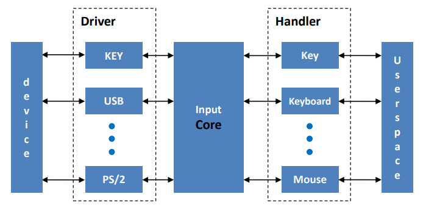
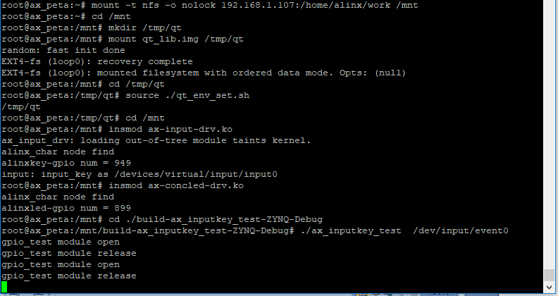
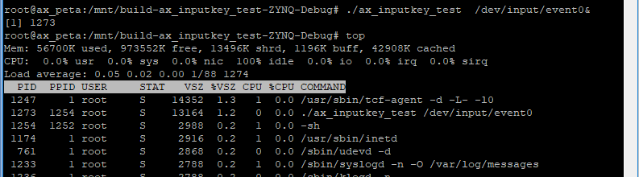

input子系统
====================

Linux支持的输入设备很多，如键盘、鼠标、触摸屏或简单的按键等等。这些输入设备的原理不尽相同，为了管理这些多样的输入设备，Linux内核提供了input子系统框架。

input子系统简介
--------------------

相较于前面学到paltform框架misc框架，input子系统框架的复杂度稍高。它分为事件层、核心层、设备驱动层，上中下三层，如下：

可以看出，input子系统中可以注册多个不同的输入设备。

1) Driver对应下层驱动，和各种输入设备对接。

2) Handler对应上层事件，通过设备节点文件和用户空间相对接。不同的handler设备节点文件名称也不同。

3) Core核心层负责上层和下层的协调，实现上下层的数据交互。下层的事件会激活整个系统，核心会上传事件到上层，最终传递到用户空间。

input子系统解决了不同输入设备与应用层数据交互的问题，为输入设备驱动开发提供了很多方便。

input子系统驱动框架的使用
~~~~~~~~~~~~~~~~~~~~~~~~~~~~~~~~

input子系统的核心是在文件drivers/input/input.c中实现的。我们找到其中2416行的input_init()函数。

.. code:: c
 
 static int __init input_init(void)
 {
 int err;

 err = class_register(&input_class);
 if (err) {
 pr_err("unable to register input_dev class\n");
 return err;
 }

 err = input_proc_init();
 if (err)
 goto fail1;

 err = register_chrdev_region(MKDEV(INPUT_MAJOR, 0),
 INPUT_MAX_CHAR_DEVICES, "input");
 if (err) {
 pr_err("unable to register char major %d", INPUT_MAJOR);
 goto fail2;
 }

 return 0;

 fail2: input_proc_exit();
 fail1: class_unregister(&input_class);
 return err;
 }
 ……
 subsys_initcall(input_init);
 ……

2452行用subsys_initcall(input_init)标记了input_init函数，subsys_initcall作用于module_init类似用于标记驱动入口函数，区别在于subsys_initcall标记的是静态加载的驱动。也就是说input_init函数是系统启动后就会执行的函数，那我们看看input_init函数中做了什么工作。

2420行先是注册了input_class。

2430行使用主设备号INPUT_MAJOR注册了input设备，INPUT_MAJOR定义在文件include/uapi/linux/major.h
中，值为13。

也就是说我们使用input子系统来加载输入设备，不需要再注册字符设备，只需要向input子系统注册input_dev就可以了。

接下来我们介绍一下什么是input_dev，input子系统具体如何使用。

1) 申请input_dev结构体变量

使用input子系统需要注册一个input设备，input_dev结构体就是用于表示input设备，定义在文件include/linux/input.h中，如下:

.. code:: c

 struct input_dev {
 const char *name;
 const char *phys;
 const char *uniq;
 struct input_id id;

 unsigned long propbit[BITS_TO_LONGS(INPUT_PROP_CNT)];

 unsigned long evbit[BITS_TO_LONGS(EV_CNT)];
 unsigned long keybit[BITS_TO_LONGS(KEY_CNT)];
 unsigned long relbit[BITS_TO_LONGS(REL_CNT)];
 unsigned long absbit[BITS_TO_LONGS(ABS_CNT)];
 unsigned long mscbit[BITS_TO_LONGS(MSC_CNT)];
 unsigned long ledbit[BITS_TO_LONGS(LED_CNT)];
 unsigned long sndbit[BITS_TO_LONGS(SND_CNT)];
 unsigned long ffbit[BITS_TO_LONGS(FF_CNT)];
 unsigned long swbit[BITS_TO_LONGS(SW_CNT)];

 ……

 bool devres_managed;
 };

129~137行是一些事件的位图，用于传递事件。可选的事件类型定义在文件include/uapi/linux/input-event-codes.h中。第一个位图evbit用于设置启用下面的哪种事件，比如我们需要使用keybit，就需要把evbit中对应的位置起来对应的宏定义为EV_KEY。

申请input_dev结构体变量使用下面的函数：

+-----------------------------------------------------------------------+
| struct input_dev \*input_allocate_device(void)                        |
+-----------------------------------------------------------------------+

释放input_dev结构体变量使用下面的函数：

+-----------------------------------------------------------------------+
| void input_free_device(struct input_dev \*dev)                        |
+-----------------------------------------------------------------------+

2) 初始化input_dev结构体变量

申请input_dev成功后，首先要初始化一些成员变量，如name字段。主要需要初始化的是事件位图。设置事件位图的方法针对我们的实验介绍以下几种：

2.1) 直接赋值，如input_dev->evbit[0] = BIT_MASK(EV_KEY);

2.2) 使用__set_bit()方法，如__set_bit(EV_KEY, input_dev->evbit);

清除事件使用__clear_bit(EV_KEY, input_dev->evbit);

2.3) 使用input_set_capability方法，如input_set_capability(input_dev,
   EV_KEY,
   KEY_Q)。这个函数实际上还是调用的__set_bit方法，这一句实际上等价于__set_bit(KEY_Q,
   input_dev->keybit);。input_set_capability相当于是对evbit的进一步设置，因此这个函数不可以设置evbit。

3) 注册input_dev结构体变量

初始化完成后，就可以向系统注册input_dev结构体变量了，使用函数：

+-----------------------------------------------------------------------+
| int input_register_device(struct input_dev \*dev)                     |
+-----------------------------------------------------------------------+

返回0注册成功，返回负值注册失败。

相对的注销使用下面的函数：

+-----------------------------------------------------------------------+
| void input_unregister_device(struct input_dev \*dev)                  |
+-----------------------------------------------------------------------+

注意，input_register_device函数注册成功后，如果需要释放input_dev结构体，需要先用input_unregister_device再调用input_free_device。

4) 输入事件上报

设置好input_dev结构体变量之后，就可以通过这个变量来上报捕捉到的输入事件给内核，使用函数：

+-----------------------------------------------------------------------+
| void input_event(struct input_dev \*dev, unsigned int type, unsigned  |
| int code, int value)                                                  |
+-----------------------------------------------------------------------+

参数说明：

dev：input_dev结构体指针；

type：上报的事件类型，可选值为Event
types，定义在文件include/uapi/linux/input-event-codes.h中的37~48行。

code：事件码，定义在文件include/uapi/linux/input-event-codes.h中，根据type的至来选择，比如type为EV_KEY时，code可选KEY_0、KEY_1等等。

value：事件对应的值，比如按键事件中，可以规定一个值表示案件被按下或松开。

input_event()函数可以上报所有的事件类型，Linux内核还提供了一些针对性的事件上报函数，实际上都是对input_event()函数的封装。

上报之后，还需要使用下面的函数来提交到input子系统：

+-----------------------------------------------------------------------+
| void input_sync(struct input_dev \*dev);                              |
+-----------------------------------------------------------------------+

dev为设置好的input_dev结构体变量。

input子系统应用程序的使用
~~~~~~~~~~~~~~~~~~~~~~~~~~~~~~~~

驱动上报了输入事件后，应用程序就可以获取到输入事件。获取输入时间使用read()方法。但是输入参数较为特殊，需要使用结构体变量input_event。input_event定义在文件include/uapi/linux/input.h中，如下
:

+-----------------------------------------------------------------------+
| struct input_event {                                                  |
|                                                                       |
| struct timeval time;                                                  |
|                                                                       |
| \__u16 type;                                                          |
|                                                                       |
| \__u16 code;                                                          |
|                                                                       |
| \__s32 value;                                                         |
|                                                                       |
| };                                                                    |
+-----------------------------------------------------------------------+

time表示时间，timeval结构体有两个成员，分别表示秒和微妙。

type、code、value和前面讲的input_event()函数的输入参数相对应。

实验
---------

本章的实验在 **中断** 那一章节按键实验驱动代码基础上修改。

原理图
~~~~~~~~~~~~~

和 **gpio输入** 章节相同。

设备树
~~~~~~~~~~~~~

和 **gpio输入** 章节相同。

驱动程序
~~~~~~~~~~~~~~~

使用 petalinux新建名为”ax-input-drv”的驱劢程序，并执行 petalinux-config
-c rootfs 命令选上新增的驱动程序。

在 ax-input-drv.c 文件中输入下面的代码：

.. code:: c

 #include <linux/kernel.h>
 #include <linux/module.h>
 #include <linux/init.h>  
 #include <linux/types.h>  
 #include <linux/errno.h>
 #include <linux/cdev.h>
 #include <linux/of.h>
 #include <linux/of_address.h>
 #include <linux/of_gpio.h>
 #include <linux/device.h>
 #include <linux/delay.h>
 #include <linux/init.h>
 #include <linux/gpio.h>
 #include <linux/semaphore.h>
 #include <linux/timer.h>
 #include <linux/of_irq.h>
 #include <linux/irq.h>
 #include <linux/interrupt.h>
 #include <linux/input.h>
 #include <asm/uaccess.h>
 #include <asm/mach/map.h>
 #include <asm/io.h>
    
 /* 设备节点名称 */  
 #define INPUT_DEV_NAME "input_key"
 
 /* 把驱动代码中会用到的数据打包进设备结构体 */
 struct alinx_char_dev {
     dev_t              devid;             //设备号
     struct cdev        cdev;              //字符设备
     struct class       *class;            //类
     struct device      *device;           //设备
     struct device_node *nd;               //设备树的设备节点
     spinlock_t         lock;              //自旋锁变量
     int                alinx_key_gpio;    //gpio号
     unsigned int       irq;               //中断号
     struct timer_list  timer;             //定时器
     struct input_dev   *inputdev;         //input_dev结构体
     unsigned char      code;              //input事件码
 };
 /* 声明设备结构体 */
 static struct alinx_char_dev alinx_char = {
     .cdev = {
         .owner = THIS_MODULE,
     },
 };
 
 /* 中断服务函数 */
 static irqreturn_t key_handler(int irq, void *dev)
 {
     /* 按键按下或抬起时会进入中断 */
     struct alinx_char_dev *cdev = (struct alinx_char_dev *)dev;
     /* 开启50毫秒的定时器用作防抖动 */
     mod_timer(&cdev->timer, jiffies + msecs_to_jiffies(50));
     return IRQ_RETVAL(IRQ_HANDLED);
 }
 
 /* 定时器服务函数 */
 void timer_function(struct timer_list *timer)
 {
     unsigned long flags;
     struct alinx_char_dev *dev = &alinx_char;
     /* value用于获取按键值 */
     unsigned char value;
     
     /* 获取锁 */
     spin_lock_irqsave(&dev->lock, flags);
 
     /* 获取按键值 */
     value = gpio_get_value(dev->alinx_key_gpio);
     
     if(value == 0)
     {
         /* 按键按下, 状态置1 */
         input_report_key(dev->inputdev, dev->code, 1);
         input_sync(dev->inputdev);
     }
     else
     {
         /* 按键抬起 */
         input_report_key(dev->inputdev, dev->code, 0);
         input_sync(dev->inputdev);
     }
     
     /* 释放锁 */
     spin_unlock_irqrestore(&dev->lock, flags);
 }
   
 /* 模块加载时会调用的函数 */  
 static int __init char_drv_init(void)  
 {
     /* 用于接受返回值 */
     u32 ret = 0;
     
     /* 初始化自旋锁 */
     spin_lock_init(&alinx_char.lock);
 
     /* 获取设备节点 */
     alinx_char.nd = of_find_node_by_path("/alinxkey");
     if(alinx_char.nd == NULL)
     {
         printk("alinx_char node not find\r\n");
         return -EINVAL;
     }
     else
     {
         printk("alinx_char node find\r\n");
     }
     
     /* 获取节点中gpio标号 */
     alinx_char.alinx_key_gpio = of_get_named_gpio(alinx_char.nd, "alinxkey-gpios", 0);
     if(alinx_char.alinx_key_gpio < 0)
     {
         printk("can not get alinxkey-gpios");
         return -EINVAL;
     }
     printk("alinxkey-gpio num = %d\r\n", alinx_char.alinx_key_gpio);
     
     /* 申请gpio标号对应的引脚 */
     ret = gpio_request(alinx_char.alinx_key_gpio, "alinxkey");
     if(ret != 0)
     {
         printk("can not request gpio\r\n");
         return -EINVAL;
     }
     
     /* 把这个io设置为输入 */
     ret = gpio_direction_input(alinx_char.alinx_key_gpio);
     if(ret < 0)
     {
         printk("can not set gpio\r\n");
         return -EINVAL;
     }
 
     /* 获取中断号 */
     alinx_char.irq = gpio_to_irq(alinx_char.alinx_key_gpio);
     /* 申请中断 */
     ret = request_irq(alinx_char.irq,
                       key_handler,
                       IRQF_TRIGGER_FALLING | IRQF_TRIGGER_RISING,
                       "alinxkey", 
                       &alinx_char);
     if(ret < 0)
     {
         printk("irq %d request failed\r\n", alinx_char.irq);
         return -EFAULT;
     }
 
     __init_timer(&alinx_char.timer, timer_function, 0);
    
     /* 设置事件码为KEY_0 */
     alinx_char.code = KEY_0;
     
     /* 申请input_dev结构体变量 */
     alinx_char.inputdev = input_allocate_device();
     
     alinx_char.inputdev->name = INPUT_DEV_NAME;
     /* 设置按键事件 */
     __set_bit(EV_KEY, alinx_char.inputdev->evbit);
     /* 设置按键重复事件 */
     __set_bit(EV_REP, alinx_char.inputdev->evbit);
     /* 设置按键事件码 */
     __set_bit(KEY_0, alinx_char.inputdev->keybit);
     
     /* 注册input_dev结构体变量 */
     ret = input_register_device(alinx_char.inputdev);
     if(ret) {
         printk("register input device failed\r\n");
         return ret;
     }
     
     return 0;  
 }
 
 /* 卸载模块 */  
 static void __exit char_drv_exit(void)  
 {  
     /* 删除定时器 */
     del_timer_sync(&alinx_char.timer);
     /* 释放中断号 */
     free_irq(alinx_char.irq, &alinx_char);
     /* 注销input_dev结构体变量 */
     input_unregister_device(alinx_char.inputdev);
     /* 释放input_dev结构体变量 */
     input_free_device(alinx_char.inputdev);
 }  
   
 /* 标记加载、卸载函数 */  
 module_init(char_drv_init);  
 module_exit(char_drv_exit);  
   
 /* 驱动描述信息 */  
 MODULE_AUTHOR("Alinx");  
 MODULE_ALIAS("alinx char");  
 MODULE_DESCRIPTION("INPUT LED driver");  
 MODULE_VERSION("v1.0");  
 MODULE_LICENSE("GPL");  

重点关注加粗的部分。

19行包含input.h头文件。

38行在设备结构体中增加struct input_dev型指针成员变量。

39行添加一个事件码code。

76行在timer去抖的回掉函数中，如果案件被按下则使用input_report_key()函数上报事件。input_report_key()函数定义在文件include/linux/input.h中，内容很简单，就时调用了一下input_event(dev,
EV_KEY, code,
!!value)；函数专门用于按键的时间上报。input_report_key()的第一个参数为input_dev结构体类型的指针，也就是我们驱动中申请的输入设备，第二个参数时事件码，第三个参数为事件对应的值。

77行调用input_sync(dev->inputdev)提交上报。

82~83行同理上报按键抬起的事件，我们这里用第三个参数value来区分按下和抬起，1表示按下，0表示抬起。

在驱动入口函数中，153行之前，就是和 **中断** 那一章一样的获取设备树中信息，设置中断和定时器。

154行个事件码赋值为KEY_0，之后我们在写应用程序时，需要对应到KEY_0这个值。

157行使用input_allocate_device()函数申请结构体变量。

159~165行初始化input_dev结构体变量。先给name赋值。

161行调用__set_bit把evbit中的按键事件置1。163行同理设置重复按键。

165行设置按键事件的事件码为KEY_0。

在驱动出口函数中，185行先调用input_unregister_device注销input_dev，187行再调用input_free_device释放input_dev结构体变量的空间。

全程我们没有再去实现file_operations设备操作函数集，都是使用input子系统中的操作函数。也没有再去注册字符设备，所以使用input子系统，相当于是向input子系统注册设备，而不是在向内核注册。我们直接交流的对象是input子系统而不是内核，和内核的交互，全权交给input子系统了，这点和前面说的misc设备框架是有所区别的。

15.3.4 测试程序
~~~~~~~~~~~~~~~

新建 QT 工程名为”ax_inputkey_test”，新建 main.c，输入下面的代码：

.. code:: c

 #include "stdio.h"
 #include "unistd.h"
 #include <fcntl.h>
 #include <linux/input.h>
 
 static struct input_event inputevent;
 
 /* 点亮火熄灭led */
 int led_change_sts()
 {
     int fd, ret;
     static char led_value = 0;
 
     fd = open("/dev/gpio_leds", O_RDWR);
     if(fd < 0)
     {
         printf("file /dev/gpio_leds open failed\r\n");
     }
 
     led_value = !led_value;
     ret = write(fd, &led_value, sizeof(led_value));
 
     if(ret < 0)
     {
         printf("write failed\r\n");
     }
 
     ret = close(fd);
     if(ret < 0)
     {
         printf("file /dev/gpio_leds close failed\r\n");
     }
 
     return ret;
 }
 
 int main(int argc, char *argv[])
 {
     int fd;
     int err = 0;
     char *filename;
 
     filename = argv[1];
 
     /* 验证输入参数个数 */
     if(argc != 2) {
         printf("Error Usage\r\n");
         return -1;
     }
 
     /* 打开输入的设备文件, 获取文件句柄 */
     fd = open(filename, O_RDWR);
     if(fd < 0) {
         /* 打开文件失败 */
         printf("can not open file %s\r\n", filename);
         return -1;
     }
 
     while(1)
     {
         err = read(fd, &inputevent, sizeof(inputevent));
         if(err > 0)
         {
             switch(inputevent.type)
             {
                 case EV_KEY:
                     if(KEY_0 == inputevent.code)
                     {
                         if(0 == inputevent.value)
                         {
                             /* 按键抬起 */
                             err = led_change_sts();
                         }
                         else
                         {
                             /* 按键按下 */
                         }
                     }
                     else
                     {
                         /* ignore */
                     }
                     break;
 
                 default :
                     /* ignore */
                     break;
             }
 
             if(err < 0)
             {
                 printf("led open filed");
             }
         }
         else
         {
             printf("get data failed\r\n");
         }
     }
 
     return 0;
 }  

第4行包含头文件input.h。

第6行定义input_event结构体变量以获取事件。

8~35行把点亮或熄灭led的代码拎出来，这样看main函数能清楚些。

main函数中61行，调用read函数读取事件，这里第二个参数传递的就是input_event结构体变量。

64行先判断事件类型，如果是EV_KEY类型，则进入66行的case，其他类型忽略。

67行再判断事件码是不是KEY_0，不是则忽略，是就继续往下判断。

69行判断事件对应的值，驱动代码中我们说过0代表按键抬起，1表示按下。按键抬起是一次按键的结束，所以在按键抬起后，我们切换一次led的状态。

运行测试
~~~~~~~~~~~~~~~

input子系统框架下生成的设备节点文件在路径/dev/input下，在使用insmod加载input设备时，系统会提示”input:
input_key as
/devices/virtual/input/input0”，一般设备文件会对应这里的input0，也就是/dev/input/event0。

测试方法步骤如下：

+-----------------------------------------------------------------------+
| mount -t nfs -o nolock 192.168.1.107:/home/alinx/work /mnt            |
|                                                                       |
| cd /mnt                                                               |
|                                                                       |
| mkdir /tmp/qt                                                         |
|                                                                       |
| mount qt_lib.img /tmp/qt                                              |
|                                                                       |
| cd /tmp/qt                                                            |
|                                                                       |
| source ./qt_env_set.sh                                                |
|                                                                       |
| cd /mnt                                                               |
|                                                                       |
| insmod ax-input-drv.ko                                                |
|                                                                       |
| insmod ax-concled-drv.ko                                              |
|                                                                       |
| cd ./build-ax_inputkey_test-ZYNQ-Debug                                |
|                                                                       |
| ./ax_inputkey_test /dev/input/event0                                  |
+-----------------------------------------------------------------------+

IP 和路径根据实际情况调整。

串口工具中的调试结果如下：

可以看一下input子系统下，按键的cpu占用量，也是几乎为零。

