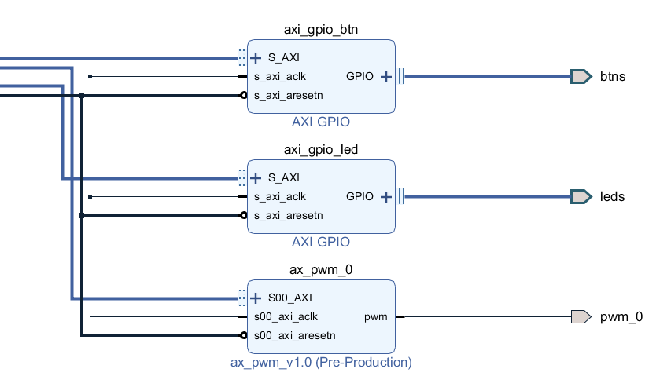
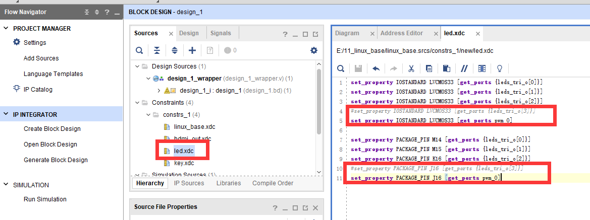
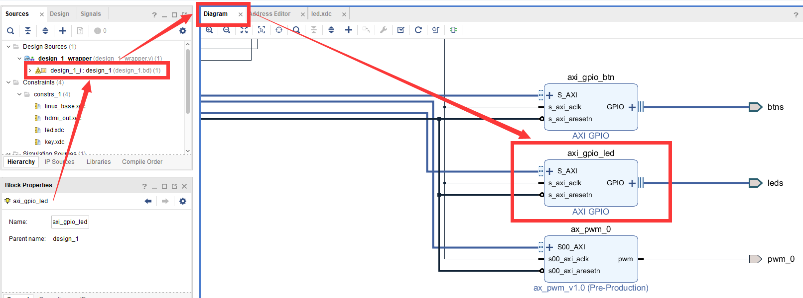
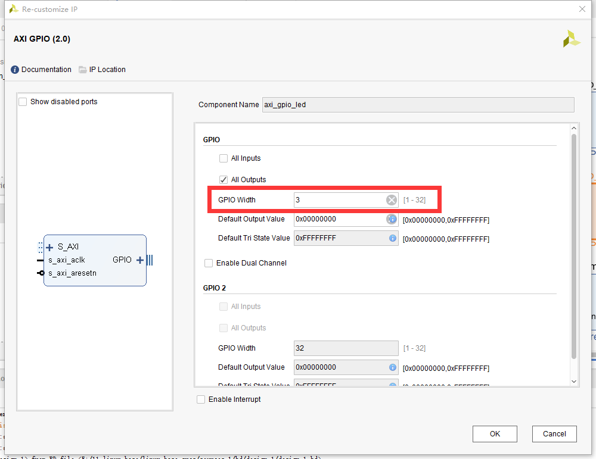
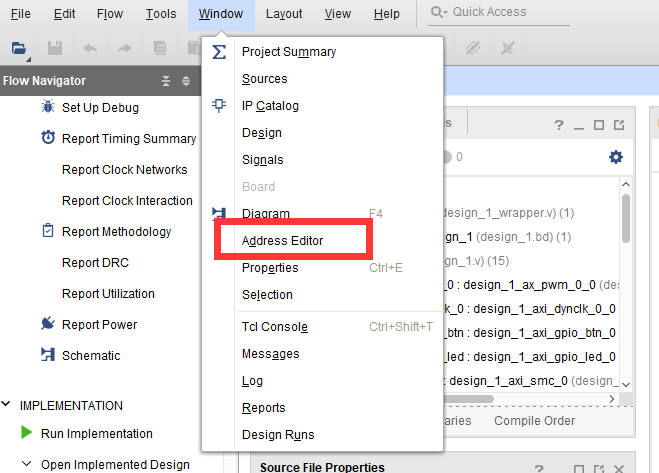
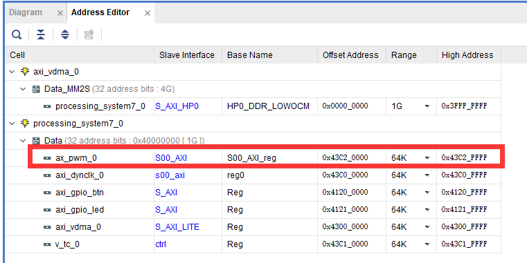
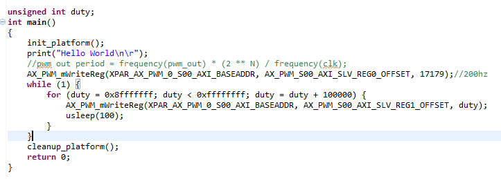
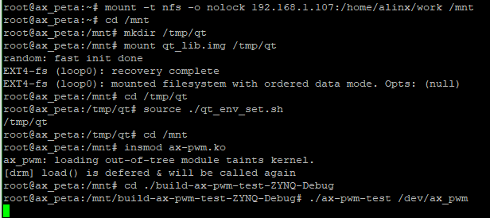

pwm驱动
================

pwm在嵌入式设备中使用很多，常用于控制电机、控制振动器件、调节背光、呼吸灯等等。这一章就来学习zynq平台上Linux系统中的pwm驱动的实现方法。

zynq上的pwm实现
--------------------

修改vivado工程
~~~~~~~~~~~~~~~~~~~~~

zynq平台上输出pwm需要借助pl端(fpga)的资源。

整个过程这里就不详细说了，添加pwm的ip之后结果如下：

ip添加完成后，需要修改xdc更改引脚约束，这里我们准备使用pwm来控制开发板上PL_LED4这个led。打开led.xdc文件，原先的J16脚是配置成led的，现在修改成pwm_0，如下图。

这里修改完后，原先gpio输出的ip就少了一个引脚的使用，我们对应修改一下ip，双击axi_gpio_led这个ip，打开配置界面，如下图：

把GPIO
Width字段修改成3。这样就修改完成了，再导出硬件信息并重新定制一个petalinux系统。

控制pwm输出的方法
~~~~~~~~~~~~~~~~~~~~~~~~

控制pwm输出有两个关键参数，一是频率，二是占空比。在上面我们配置好硬件信后，该如何去操作pwm的这两个参数呢。自定义IP可以理解为配置fpga的寄存器资源变成我们想要的设备，添加IP后，我们就可以像操作ARM资源一样，通过操作紧寄存器来操fpga的资源。那首先我们就要找到pwm设备的寄存器首地址。在菜单栏Window选项中打开Address
Editor窗口。如图下：

就能找到ip对应的寄存器范围，这个寄存器首地址是vivado工程自动分配的，所以每个人的可能会不一样，当然也可以手动修改。

光是找到了寄存器首地址，还是不知道寄存器的具体设置方法，这里我们参考一下S2文档Vitis软件编写调试试验。

实验工程中的主函数如下图：

AX_PWM_mWriteReg函数用于设置寄存器的值，第一个参数是首地址，第二个参数是偏移量，第三个参数是目标值。

第一次调用AX_PWM_mWriteReg函数是设置频率。XPAR_AX_PWM_0_S00_AXI_BASEADDR的值就是我们上面在Address
Editor界面中查到的首地址，看一下偏移量AX_PWM_S00_AXI_SLV_REG0_OFFSET的值为0。也就是说设置频率的寄存器就是首地址了。

第二次调用是设置占空比，首地址没变，偏移量AX_PWM_S00_AXI_SLV_REG1_OFFSET的值为4，也就是首地址加4。

Linux中的pwm框架
---------------------

在Linux内核提供了一套完整的pwm框架。但是在zynq上使用这套框架需要注意，zynq上的pwm是借助fpga资源来实现的，自定义ip的寄存器设置可能会因人而异，因此要使用这套框架，需要保证自定义ip的一致。再者如果只是简单的pwm应用，如本章实验的led呼吸灯，使用这个框架就显得有些大材小用了。虽然在本章的实验中不会这个框架，但我们还是简单的介绍一下，了解一下其中的结构与设计思路。

pwm框架还是融入了驱动的分层思想，把pwm驱动分成了pwm_device(设备)和pwm_chip(芯片)两个部分，pwm_chip意为pwm的芯片，它可以输出单路或者多路pwm波形，而pwm_device即为使用pwm_chip其中一路或多路的设备，以本章例程led呼吸灯为例，led就是pwm_device，我们自定义的pwmip就是pwm_chip。pwm的框架一般会和platform框架结合使用。接下来我们分别介绍他们的实现方法。

pwm_device
~~~~~~~~~~~~~~~~~

一个使用pwm的设备，需要关注四个参数：使能、极性、频率、占空比，对此pwm框架提供了以下方法来与之对应：

1) int pwm_enable(struct pwm_device \*pwm);和void pwm_disable(struct pwm_device \*pwm);
   
   pwm_enable函数用使能pwm输出，pwm_disable用于失能pwm输出。

2) int pwm_set_polarity(struct pwm_device \*pwm, enum pwm_polarity polarity);
   
   pwm_set_polarity用于设置极性，可选参数有PWM_POLARITY_NORMAL(普通)和PWM_POLARITY_INVERSED(反转)两种。

3) int pwm_config(struct pwm_device \*pwm, int duty_ns, int period_ns);
   
   pwm_config函数用于设置占空比和频率，参数duty_ns为占空比，period_ns为频率。

这些接口函数定义在文件include/linux/pwm.h中，他们都需要一个struct
pwm_device类型的指针作为操作句柄。

pwm_device结构体则是指代使用pwm的设备，我们要使用这些接口，需要先获取一个pwm_device结构体。

获取pwm_device结构体的方法也定义在文件include/linux/pwm.h中。如下：

1) struct pwm_device \*pwm_get(struct device \*dev, const char\*con_id);
   struct pwm_device \*of_pwm_get(struct device_node \*np, const char\*con_id);

这两个方法将从指定设备(参数dev)的设备树节点或者直接从设备树节点(参数np)中去获取pwm_device。对设备树的格式要求如下：

+-----------------------------------------------------------------------+
| bl: backlight {                                                       |
|                                                                       |
| pwms = <&pwm 0 5000000 PWM_POLARITY_INVERTED>;                        |
|                                                                       |
| pwm-names = "backlight";                                              |
|                                                                       |
| }                                                                     |
+-----------------------------------------------------------------------+

bl: backlight即为设备节点名称。节点中的两个属性都是必须的
pwms指代这个设备用到的pwm列表，第一个参数&pwm实际是引用了pwm_chip节点，具体在讲pwm_chip的时候再说。第二个参数指代platform_device的设备号，具体根据实际情况来定，不一定会用到。第三个参数500000是pwm的默认周期，单位是纳秒。第四个参数是可选字段，表示极性。
pwm-names是与pwms相对应的pwm设备名称。"backlight"就是与&pwm 0 5000000
PWM_POLARITY_INVERTED相对应。
函数参数con_id用于指定相匹配的pwm设备，如果NULL，就会返回pwms中的第一个设备，如果指定名称如"backlight"，就会返回对应的设备。

2) void pwm_put(struct pwm_device \*pwm);

与获取get函数相对的put，用于释放pwm_device。pwm_device需要关注的事情就这些，pwm设备调用了接口函数后，最终就会调用pwm_chip中的操作函数，接下来我们再看pwm_chip。

pwm_chip
~~~~~~~~~~~~~~~

pwm_chip关在作用在于，它提供了pwm_device接口函数对应的操作函数集，pwm_chip结构体定义在include/linux/pwm.h中，如下：

+-----------------------------------------------------------------------+
| struct pwm_chip {                                                     |
|                                                                       |
| struct device \*dev;                                                  |
|                                                                       |
| struct list_head list;                                                |
|                                                                       |
| const struct pwm_ops \*ops;                                           |
|                                                                       |
| int base;                                                             |
|                                                                       |
| unsigned int npwm;                                                    |
|                                                                       |
| struct pwm_device \*pwms;                                             |
|                                                                       |
| struct pwm_device \* (\*of_xlate)(struct pwm_chip \*pc, const struct  |
| of_phandle_args \*args);                                              |
|                                                                       |
| unsigned int of_pwm_n_cells;                                          |
|                                                                       |
| bool can_sleep;                                                       |
|                                                                       |
| };                                                                    |
+-----------------------------------------------------------------------+

dev为pwm chip对应的设备，一般由pwm
driver对应的platform驱动指定且必须提供。

ops为pwm_device中接口函数对应的操作函数集，必须提供。

npwm为pwm chip可以支持的pwm_device个数，必须提供。

pwms为该pwm chip中pwm device的数组，kernel会自行分配，不需要手动设置。

重点介绍一下struct pwm_ops结构体指正ops。struct pwm_ops定义如下：

+-----------------------------------------------------------------------+
| struct pwm_ops {                                                      |
|                                                                       |
| int (\*request)(struct pwm_chip \*chip, struct pwm_device \*pwm);     |
|                                                                       |
| void (\*free)(struct pwm_chip \*chip, struct pwm_device \*pwm);       |
|                                                                       |
| int (\*config)(struct pwm_chip \*chip, struct pwm_device \*pwm, int   |
| duty_ns, int period_ns);                                              |
|                                                                       |
| int (\*set_polarity)(struct pwm_chip \*chip, struct pwm_device \*pwm, |
| enum pwm_polarity polarity);                                          |
|                                                                       |
| int (\*enable)(struct pwm_chip \*chip, struct pwm_device \*pwm);      |
|                                                                       |
| void (\*disable)(struct pwm_chip \*chip, struct pwm_device \*pwm);    |
|                                                                       |
| #ifdef CONFIG_DEBUG_FS                                                |
|                                                                       |
| void (\*dbg_show)(struct pwm_chip \*chip, struct seq_file \*s);       |
|                                                                       |
| #endif                                                                |
|                                                                       |
| struct module \*owner;                                                |
|                                                                       |
| };                                                                    |
+-----------------------------------------------------------------------+

request和free函数已经弃用了。

函数与pwm_device接口函数中的pwm_config函数相对应，配置pwm_device的频率、占空比。必须提供。

enable、disable函数与pwm_device接口函数中的pwm_enable、pwm_disable函数相对应，用于使能/禁止pwm信号输出。必须提供。

set_polarity函数与pwm_device接口函数中的pwm_set_polarity函数对应，设置pwm信号的极性。可选。

定义一个pwm_chip之后，需要实现ops中至少config、enable、disable三个函数。初始化完成后，使用下面的函数向内核注册pwm_chip：

+-----------------------------------------------------------------------+
| int pwmchip_add(struct pwm_chip \*chip);                              |
+-----------------------------------------------------------------------+

相对的注销使用函数：

+-----------------------------------------------------------------------+
| int pwmchip_remove(struct pwm_chip \*chip);                           |
+-----------------------------------------------------------------------+

在实现config等函数时，需要通过设备树获取设备信息，pwm_chip在设备树中的节点格式并不固定，添加相关信息即可。如下:

+-----------------------------------------------------------------------+
| pwm: pwm@43C20000 {                                                   |
|                                                                       |
| compatible = "test-pwm";                                              |
|                                                                       |
| reg = <0x43C20000 0x100>;                                             |
|                                                                       |
| };                                                                    |
+-----------------------------------------------------------------------+

上面再pwm_device的节点中有对pwm_chip的引用"pwms = <&pwm 0 5000000
PWM_POLARITY_INVERTED>;"。这里的&pwm，实际上就是引用如"pwm:
`pwm@43C20000"这样的pwm_chip0节点。引用的目的也就是把device和chip <mailto:pwm@43C20000%22这样的pwm_chip0节点。引用的目的也就是把device和chip>`__\ 相关联。

专用的pwm芯片厂家会提供pwm_chip的驱动，但是xlinx斌没有提供，也许是考虑到自定义ip的多样性，因此在zynq平台上使用pwm框架，还需要驱动开发人员去实现pwm_chip，比较麻烦。

示例
~~~~~~~~~~~

设备树：

.. code:: c

 pwm: pwm@43C20000 {
 compatible = "alinx-pwm";
 reg = <0x43C20000 1>;
 #pwm-cells = <2>;
 };

 pwm-led {
 compatible = "pwm-led";
 pwms = <&pwm 0 5000000>;
 };

pwm_chip：
结合platform框架，从设备树中获取信息，注册pwm_chip。

.. code:: c

 struct ax_pwm_chip {
 struct pwm_chip chip;
 };

 struct ax_pwm_chip ax_pwm;

 static int ax_pwm_config(struct pwm_chip *chip, struct pwm_device *pwm, int duty_ns, int period_ns)
 {
 return 0;
 }

 static int ax_pwm_enable(struct pwm_chip *chip, struct pwm_device *pwm)
 {
 return 0;
 }

 static void ax_pwm_disable(struct pwm_chip *chip, struct pwm_device *pwm)
 {

 }

 static const struct pwm_ops ax_pwm_ops = {
 .owner = THIS_MODULE,
 .config = ax_pwm_config,
 .enable = ax_pwm_enable,
 .disable = ax_pwm_disable,
 };

 static int ax_pwm_probe(struct platform_device *pdev)
 {
 int err;

 ax_pwm.chip.dev = &pdev->dev;
 ax_pwm.chip.ops = &ax_pwm_ops;
 ax_pwm.chip.npwm = 1;

 err = pwmchip_add(&ax_pwm.chip);
 if (err < 0)
 {
 return err;
 }

 return 0;
 }

 static int ax_pwm_remove(struct platform_device *pdev)
 {
 int err;

 err = pwmchip_remove(&ax_pwm.chip);
 if (err < 0)
 {
 return err;
 }

 return 0;
 }

 static const struct of_device_id of_ax_pwm_match[] = {
 { .compatible = "alinx-pwm", },
 { /* Sentinel */ },
 };

 static struct platform_driver ax_pwm_driver = {
 .driver = {
 .name = "alinx-pwm",
 .of_match_table = of_ax_pwm_match,
 },
 .probe = ax_pwm_probe,
 .remove = ax_pwm_remove,
 };

 module_platform_driver(ax_pwm_driver);

pwm_device：

结合misc设备框架，注册pwm_device。

.. code:: c

 #define PWM_ON 0x100001
 #define PWM_OFF 0x100002

 struct pwm_device *ax_pwm_dev;

 static long ax_pwm_ioctl(struct file *file, unsigned int cmd, unsigned long arg)
 {
 int ret;
 switch(cmd) {
 case PWM_ON:
 ret = pwm_config(ax_pwm_dev, 200000, 500000);
 pwm_enable(ax_pwm_dev);
 break;

 case PWM_OFF:
 ret = pwm_config(ax_pwm_dev, 0, 500000);
 pwm_disable(ax_pwm_dev);
 break;
 }
 return 0;
 }

 static struct file_operations ax_pwm_fops = {
 .owner = THIS_MODULE,
 .unlocked_ioctl = ax_pwm_ioctl,
 };

 static struct miscdevice pwm_misc = {
 .minor = MISC_DYNAMIC_MINOR,
 .name = "ax-pwm",
 .fops = &ax_pwm_fops
 };
 static int ax_pwm_init(void)
 {
 int ret;
 struct device_node *nd;

 nd = of_find_node_by_path("/pwm-led");

 ax_pwm_dev = of_pwm_get(nd, "pwm-led");

 misc_register(&pwm_misc);
 return 0;
 }

 static void ax_pwm_exit(void)
 {
 pwm_put(ax_pwm_dev);
 }
 module_init(ax_pwm_init);
 module_exit(ax_pwm_exit);
 
实验
---------

本章实验结合platform和misc框架，实现简单的led呼吸灯。

原理图
~~~~~~~~~~~~~

和 **字符设备** 章节的原理图相同。

设备树
~~~~~~~~~~~~~

打开system-user.dtsi文件，在根节点中添加下面的节点：

.. code:: c

 alinxpwm {
 compatible = "alinx-pwm";
 reg-freq = <0x43C20000 1>;
 reg-duty = <0x43C20004 1>;
 };

compatible节点兼容性为”alinx-pwm”，之后的驱动代码中platform的of匹配表需要和这个属性一致。

reg-freq和reg-duty分别的频率和占空比的物理地址，从vivado中获得。

驱动程序
~~~~~~~~~~~~~~~

使用 petalinux新建名为”ax-pwm”的驱劢程序，并执行 petalinux-config -c
rootfs 命令选上新增的驱动程序。

在 ax-pwm.c 文件中输入下面的代码：

.. code:: c

 #include <linux/types.h>
 #include <linux/kernel.h>
 #include <linux/delay.h>
 #include <linux/init.h>
 #include <linux/module.h>
 #include <linux/errno.h>
 #include <linux/of.h>
 #include <linux/cdev.h>
 #include <linux/device.h>
 #include <linux/semaphore.h>
 #include <linux/timer.h>
 #include <linux/irq.h>
 #include <linux/wait.h>
 #include <linux/poll.h>
 #include <linux/fs.h>
 #include <linux/fcntl.h>
 #include <linux/platform_device.h>
 #include <linux/miscdevice.h>
 #include <asm/mach/map.h>
 #include <asm/uaccess.h>
 
 /* 设备节点名称 */  
 #define DEVICE_NAME       "ax_pwm"
 /* 设备号个数 */  
 #define DEVID_COUNT       1
 /* 驱动个数 */  
 #define DRIVE_COUNT       1
 /* 主设备号 */
 #define MAJOR_AX
 /* 次设备号 */
 #define MINOR_AX       
 /* 设置频率 */
 #define PWM_FREQ           0x100001
 /* 设置占空比 */
 #define PWM_DUTY           0x100002   
 
 /* 把驱动代码中会用到的数据打包进设备结构体 */
 struct alinx_char_dev{
     dev_t              devid;       //设备号
     struct cdev        cdev;        //字符设备
 	struct device_node *nd;         //设备树的设备节点
 	unsigned int       *freq;       //频率的寄存器虚拟地址
 	unsigned int       *duty;       //占空比的寄存器虚拟地址
 };
 /* 声明设备结构体 */
 static struct alinx_char_dev alinx_char = {
     .cdev = {
         .owner = THIS_MODULE,
     },
 };
 
 /* open函数实现, 对应到Linux系统调用函数的open函数 */  
 static int ax_pwm_open(struct inode *inode_p, struct file *file_p)  
 {  
     /* 设置私有数据 */
     file_p->private_data = &alinx_char;  
       
     return 0;  
 }  
 
 /* iotcl函数实现, 对应到Linux系统调用函数的iotcl函数 */  
 static long ax_pwm_ioctl(struct file *file_p, unsigned int cmd, unsigned long arg)
 {   
     /* 获取私有数据 */
 	struct alinx_char_dev *dev = file_p->private_data;
     
     switch(cmd) 
     {
         case PWM_FREQ:
         {
             *(dev->freq) = (unsigned int)arg;
             break;
         }
             
         case PWM_DUTY: 
         {
             *(dev->duty) = (unsigned int)arg;
             break;
         }
         
         default :
         {
             break;
         }
     }
     
     return 0;
 }
 
 /* release函数实现, 对应到Linux系统调用函数的close函数 */  
 static int ax_pwm_release(struct inode *inode_p, struct file *file_p)  
 {   
     return 0;  
 }  
 
 /* file_operations结构体声明 */
 static struct file_operations ax_char_fops = {  
     .owner          = THIS_MODULE,  
     .open           = ax_pwm_open,  
     .unlocked_ioctl = ax_pwm_ioctl,     
     .release        = ax_pwm_release,   
 };
 
 /* MISC设备结构体 */
 static struct miscdevice led_miscdev = {
     /* 自动分配次设备号 */
 	.minor = MISC_DYNAMIC_MINOR,
 	.name = DEVICE_NAME,
     /* file_operations结构体 */
 	.fops = &ax_char_fops,
 };
 
 /* probe函数实现, 驱动和设备匹配时会被调用 */
 static int ax_pwm_probe(struct platform_device *dev)
 {	
     /* 用于接受返回值 */
 	u32 ret = 0;
     /* 频率的寄存器物理地址 */
 	int freq_addr;   
     /* 占空比的寄存器物理地址 */
 	int duty_addr;   
 	
 	/* 获取设备节点 */
 	alinx_char.nd = of_find_node_by_path("/alinxpwm");
 	if(alinx_char.nd == NULL)	
     {
 		printk("gpioled node nost find\r\n");
 		return -EINVAL;
 	}
 
     /* 获取寄存器中freq的地址 */
     of_property_read_u32(alinx_char.nd, "reg-freq", &freq_addr);
 	if(!freq_addr)	{
 		printk("can not get reg-freq\r\n");
 		return -EINVAL;
 	}
 	else
 	{
 		/* 映射地址 */
 		alinx_char.freq = ioremap(freq_addr, 4);
 	}
     
     /* 获取寄存器中duty的地址 */
     of_property_read_u32(alinx_char.nd, "reg-duty", &duty_addr);
 	if(!duty_addr)	{
 		printk("can not get reg-duty\r\n");
 		iounmap((unsigned int *)alinx_char.freq);
 		return -EINVAL;
 	}
 	else
 	{
 		/* 映射地址 */
 		alinx_char.duty = ioremap(duty_addr, 4);
 	}
      
     /* 注册misc设备 */
     ret = misc_register(&led_miscdev);
 	if(ret < 0) {
 		printk("misc device register failed\r\n");
 		return -EFAULT;
 	}
     
     return 0;
 }
 
 static int ax_pwm_remove(struct platform_device *dev)
 {
     /* 释放虚拟地址 */
     iounmap((unsigned int *)alinx_char.freq);
 	iounmap((unsigned int *)alinx_char.duty);
     /* 注销misc设备 */
     misc_deregister(&led_miscdev);
     return 0;
 }
 
 /* 初始化of_match_table */
 static const struct of_device_id pwm_of_match[] = {
     /* compatible字段和设备树中保持一致 */
 	{ .compatible = "alinx-pwm" },
 	{/* Sentinel */}
 };
 
 
 /* 声明并初始化platform驱动 */
 static struct platform_driver pwm_driver = {
     .driver = {
         /* name字段需要保留 */
         .name = "alinx-pwm",
         /* 用of_match_table代替name匹配 */
         .of_match_table = pwm_of_match,
     },
     .probe  = ax_pwm_probe,
     .remove = ax_pwm_remove,
 };
 
 /* 驱动入口函数 */
 static int __init pwm_drv_init(void)
 {
     /* 在入口函数中调用platform_driver_register, 注册platform驱动 */
     return platform_driver_register(&pwm_driver);
 }
 
 /* 驱动出口函数 */
 static void __exit pwm_drv_exit(void)
 {
     /* 在出口函数中调用platform_driver_register, 卸载platform驱动 */
     platform_driver_unregister(&pwm_driver);
 }
 
 /* 标记加载、卸载函数 */ 
 module_init(pwm_drv_init);
 module_exit(pwm_drv_exit);
 
 /* 驱动描述信息 */  
 MODULE_AUTHOR("Alinx");  
 MODULE_ALIAS("pwm_led");  
 MODULE_DESCRIPTION("PWM LED driver");  
 MODULE_VERSION("v1.0");  
 MODULE_LICENSE("GPL");   
 
paltform和misc框架的部分可以参考 **misc设备驱动** 章节，几乎没变。

pwm的处理也很简单，从设备树中获取地址，然后再操作函数中操作地址。

33~36行定义了两个宏，用于ioctl的cmd，分别表示设置频率和设置占空比。

43行的freq用于从设备树中获取设置频率寄存器的地址。

44行的freq用于从设备树中获取设置占空比寄存器的地址。

测试程序
~~~~~~~~~~~~~~~

新建 QT 工程名为”ax-pwm-test”，新建 main.c，输入下面的代码：

.. code:: c

 #include "stdio.h"
 #include "unistd.h"
 #include "sys/types.h"
 #include "sys/stat.h"
 #include "fcntl.h"
 #include "stdlib.h"
 #include "string.h"
 #include "sys/ioctl.h"
 
 #define FREQ_DEFAULT   1717900
 /* 设置频率 */
 #define PWM_FREQ       0x100001
 /* 设置占空比 */
 #define PWM_DUTY       0x100002
 
 int main(int argc, char *argv[])
 {
     int fd, retvalue, flag = 0;
     char *filename;
     unsigned int duty = 0x0fffffff;
 
     if(argc != 2)
     {
         printf("Error Usage\r\n");
         return -1;
     }
 
     filename = argv[1];
     fd = open(filename, O_RDWR);
     if(fd < 0)
     {
         printf("file %s open failed\r\n", argv[1]);
         return -1;
     }
 
     /* 设置频率 */
     retvalue = ioctl(fd, PWM_FREQ, FREQ_DEFAULT);
     if(retvalue < 0)
     {
         printf("pwm Failed\r\n");
         close(fd);
         return -1;
     }
 
     while(1)
     {
         if(duty <= 0xefffffff && 0 == flag)
         {
             duty += 2000000;
         }
         else if(duty >= 0x0fffffff)
         {
             duty -= 500000;
             flag = 1;
         }
         else
         {
             flag = 0;
         }
 
         /* 设置占空比 */
         retvalue = ioctl(fd, PWM_DUTY, duty);
         if(retvalue < 0)
         {
             printf("pwm Failed\r\n");
             close(fd);
             return -1;
         }
         usleep(5);
     }
 
 
     return 0;
 }

运行测试
~~~~~~~~~~~~~~~

测试方法步骤如下：

+-----------------------------------------------------------------------+
| mount -t nfs -o nolock 192.168.1.107:/home/alinx/work /mnt            |
|                                                                       |
| cd /mnt                                                               |
|                                                                       |
| mkdir /tmp/qt                                                         |
|                                                                       |
| mount qt_lib.img /tmp/qt                                              |
|                                                                       |
| cd /tmp/qt                                                            |
|                                                                       |
| source ./qt_env_set.sh                                                |
|                                                                       |
| cd /mnt                                                               |
|                                                                       |
| insmod ax-pwm.ko                                                      |
|                                                                       |
| cd ./build-ax-pwm-test-ZYNQ-Debug                                     |
|                                                                       |
| ./ax-pwm-test /dev/ax_pwm                                             |
+-----------------------------------------------------------------------+

IP 和路径根据实际情况调整。

串口工具中的调试结果如下：

开发板上的PL_LED4开始呼吸灯式的和闪烁。

