I2C驱动
================

I2C是常用的串行接口总线，Linux内核中也提供了完善的I2C驱动框架。本章就来了解一下Linux内核中提供的I2C驱动框架。

I2C驱动框架
----------------

在platform驱动框架和pwm驱动框架中，都提到过驱动的分离，也就是控制器或总线和设备的分离。I2C也是相似的结构，分为I2C总线和I2C设备。总线是芯片本身的I2C资源，而设备则是I2C外接的用户设备如RTC、EEPROM等。我们分别来看他们的实现方法。

I2C控制器驱动
~~~~~~~~~~~~~~~~~~~~

内核中使用结构体i2c_adapter来表示I2C控制器，i2c_adapter结构体定义在文件include/linux/i2c.h中。如下：

.. code:: c

 struct i2c_adapter {
  struct module *owner;
  unsigned int class; /* classes to allow probing for */
  const struct i2c_algorithm *algo; /* the algorithm to access the bus */
  void *algo_data;
 
  /* data fields that are valid for all devices */
  const struct i2c_lock_operations *lock_ops;
  struct rt_mutex bus_lock;
  struct rt_mutex mux_lock;
 
  int timeout; /* in jiffies */
  int retries;
  struct device dev; /* the adapter device */
 
  int nr;
  char name[48];
  struct completion dev_released;
 
  struct mutex userspace_clients_lock;
  struct list_head userspace_clients;
 
  struct i2c_bus_recovery_info *bus_recovery_info;
  const struct i2c_adapter_quirks *quirks;
 };
 

549行的const struct i2c_algorithm型指针成员变量algo，是I2C设备访问总线的接口函数的合集，是I2C设备和I2C控制器通讯的方法。

i2c_algorithm结构体定义如下：

.. code:: c

 struct i2c_algorithm {
  /* If an adapter algorithm can't do I2C-level access, set master_xfer
  to NULL. If an adapter algorithm can do SMBus access, set
  smbus_xfer. If set to NULL, the SMBus protocol is simulated
  using common I2C messages */
  /* master_xfer should return the number of messages successfully
  processed, or a negative value on error */
  int (*master_xfer)(struct i2c_adapter *adap, struct i2c_msg *msgs,
  int num);
  int (*smbus_xfer) (struct i2c_adapter *adap, u16 addr,
  unsigned short flags, char read_write,
  u8 command, int size, union i2c_smbus_data *data);
 
  /* To determine what the adapter supports */
  u32 (*functionality) (struct i2c_adapter *);
 
 #if IS_ENABLED(CONFIG_I2C_SLAVE)
  int (*reg_slave)(struct i2c_client *client);
  int (*unreg_slave)(struct i2c_client *client);
 #endif 

414行的master_xfer函数就是用于与I2C设备通讯的函数。

416行的smbus_xfer函数是smbus的传输函数。

I2C总线驱动的实现首先要定义并初始化一个i2c_adapter结构体型的变量，初始化包括实现i2c_algorithm中的函数，至少要实现master_xfer函数。

初始化完成后，使用下面的函数向内核注册i2c_algorithm：

+-----------------------------------------------------------------------+
| int i2c_add_adapter(struct i2c_adapter \*adapter)                     |
|                                                                       |
| int i2c_add_numbered_adapter(struct i2c_adapter \*adap)               |
+-----------------------------------------------------------------------+

这两个函数的却别的前者使用动态总线号，后者使用静态总线号。输入参数为初始化后的i2c_add_adapter结构体变量。返回0注册成功，返回负值注册失败。

相对的注销函数为：

+-----------------------------------------------------------------------+
| void i2c_del_adapter(struct i2c_adapter \* adap)                      |
+-----------------------------------------------------------------------+

输入参数adap为需要删除的I2C控制器。

I2C控制器的驱动一般由芯片厂家提供，从设备树中找到I2C控制器的节点，可以发现节点中的compatible属性为cdns,i2c-r1p10，通过这个compatible可以追寻到，使用的I2C控制器驱动为drivers\\i2c\\busses\\i2c-cadence.c。I2C控制器的驱动相关暂且了解这么多，把重点放在I2C的设备驱动中去。

I2C设备驱动
~~~~~~~~~~~~~~~~~~

设备驱动又分层为两个部分，设备i2c_client和驱动i2c_driver。

1) i2c_client

i2c_client用于描述设备信息，定义如下：

.. code:: c

 struct i2c_client {
  unsigned short flags; /* div., see below */
  unsigned short addr; /* chip address - NOTE: 7bit */
  /* addresses are stored in the */
  /* _LOWER_ 7 bits */
  char name[I2C_NAME_SIZE];
  struct i2c_adapter *adapter; /* the adapter we sit on */
  struct device dev; /* the device structure */
  int irq; /* irq issued by device */
  struct list_head detected;
 #if IS_ENABLED(CONFIG_I2C_SLAVE)
  i2c_slave_cb_t slave_cb; /* callback for slave mode */
 #endif
 };

230行的addr表示芯片地址，储存在低7位。

233行的name表示设备名称。

234行的adapter位设备对应I2C控制器。

每一个I2C设备对应一个i2c_client。

2) i2c_driver

i2c_driver是Linux框架中I2C处理的重点，定义如下：

.. code:: c

 struct i2c_driver {
  unsigned int class;
 
  /* Notifies the driver that a new bus has appeared. You should avoid
  * using this, it will be removed in a near future.
  */
  int (*attach_adapter)(struct i2c_adapter *) __deprecated;
 
  /* Standard driver model interfaces */
  int (*probe)(struct i2c_client *, const struct i2c_device_id *);
  int (*remove)(struct i2c_client *);
 
  /* driver model interfaces that don't relate to enumeration */
  void (*shutdown)(struct i2c_client *);
 
  /* Alert callback, for example for the SMBus alert protocol.
  * The format and meaning of the data value depends on the protocol.
  * For the SMBus alert protocol, there is a single bit of data passed
  * as the alert response's low bit ("event flag").
  * For the SMBus Host Notify protocol, the data corresponds to the
  * 16-bit payload data reported by the slave device acting as master.
  */
  void (*alert)(struct i2c_client *, enum i2c_alert_protocol protocol,
  unsigned int data);
 
  /* a ioctl like command that can be used to perform specific functions
  * with the device.
  */
  int (*command)(struct i2c_client *client, unsigned int cmd, void *arg);
 
  struct device_driver driver;
  const struct i2c_device_id *id_table;
 
  /* Device detection callback for automatic device creation */
  int (*detect)(struct i2c_client *, struct i2c_board_info *);
  const unsigned short *address_list;
  struct list_head clients;
 };

178行的probe函数和platform框架中的类似，I2C设备和驱动匹配成功后就会执行。

199行的device_driver结构体变量driver就是用于和设备匹配，和platform框架类似，使用设备树的话，需要设置driver.of_match_table中的compatible属性。

200行的id_table和platform框架类似，未使用设备树时使用这个匹配表。

定义并初始化完成i2c_driver之后使用下面的函数来向内核注册：

+-----------------------------------------------------------------------+
| int i2c_register_driver(struct module \*owner, struct i2c_driver      |
| \*driver)                                                             |
+-----------------------------------------------------------------------+

owner一般位THIS_MODULE。

driver就是需要注册的i2c_driver。

返回0成功，负值失败。

相对的注销函数为：

+-----------------------------------------------------------------------+
| void i2c_del_driver(struct i2c_driver \*driver)                       |
+-----------------------------------------------------------------------+

I2C设备驱动编写示例：

.. code:: c

 static int ax_probe(struct i2c_client *client, const struct i2c_device_id *id)
 {
 return 0;
 }

 static int ax_remove(struct i2c_client *client)
 {
 return 0;
 }
 static const struct of_device_id ax_of_match[] =
 {
 { .compatible = "alinx-xxx"},
 {/* sentinel */}
 };

 static struct i2c_driver ax_driver = {
 .driver = {
 .owner = THIS_MODULE,
 .name = "alinx-xxx",
 .of_match_table = ax_of_match,
 },
 .probe = ax_probe,
 .remove = ax_remove,
 };

 static int ax_init(void)
 {
 i2c_add_driver(&ax_driver);
 return 0;
 }

 static void ax_exit(void)
 {
 i2c_del_driver(&ax_driver);
 }

 module_init(ax_init);
 module_exit(ax_exit);

I2C设备驱动的实现流程
~~~~~~~~~~~~~~~~~~~~~~~~~~~~

1) 设备树

首先要在对应的I2C节点中添加设备节点，如下：

.. code:: c

 i2c0: i2c@e0004000 {
 compatible = "cdns,i2c-r1p10";
 clocks = <&clkc 38>;
 interrupt-parent = <&intc>;
 interrupts = <0 25 4>;
 reg = <0xe0004000 0x1000>;
 #address-cells = <1>;
 #size-cells = <0>;
 };
 ……
 &i2c0 {
 axrtc@68 {
 compatible = "alinx-rtc";
 status = "okay";
 reg = <0x68>;
 };
 };

第一行的i2c0是控制器的节点。第11行引用控制器节点&i2c，并在里面添加设备节点axrtc。

`设备节点名称后面@接的是设备的地址68。设备节点的关键属性有两个。compatible兼容性用于和设备驱动相匹配。reg <mailto:设备节点名称后面@接的是设备的地址68。设备节点的关键属性有两个。compatible兼容性用于和设备驱动相匹配。reg>`__\ 和节点名@后面的值相同，都是设备地址。

设备树配置好后就可以仔probe函数中获取设备地址。

2) 数据收发

I2C的手法通过内核中的i2c_transfer函数实现，这个函数最终会调用i2c控制器驱动中的master_xfer函数。

i2c_transfer函数定义在include/linux/i2c.h中，原型如下：

+-----------------------------------------------------------------------+
| int i2c_transfer(struct i2c_adapter \*adap, struct i2c_msg \*msgs,    |
| int num)                                                              |
+-----------------------------------------------------------------------+

参数adap可以在probe函数中获取，probe函数被调用时，第一个输入参数为设备树中对应节点的struct
i2c_client \*client，client中的adap也就是对应的控制器。

参数msgs是需要发送的数据。

参数num为需要发送msgs数量。

返回负值失败，返回非负值为msgs发送的数量。

msgs的为struct i2c_msg类型的指针，struct
i2c_msg定义在include/uapi/linux/i2c.h中如下：

.. code:: c

 struct i2c_msg {
 __u16 addr; /* slave address */
 __u16 flags;
 #define I2C_M_RD 0x0001 /* read data, from slave to master */
 /* I2C_M_RD is guaranteed to be 0x0001! */
 #define I2C_M_TEN 0x0010 /* this is a ten bit chip address */
 #define I2C_M_RECV_LEN 0x0400 /* length will be first received byte */
 #define I2C_M_NO_RD_ACK 0x0800 /* if I2C_FUNC_PROTOCOL_MANGLING */
 #define I2C_M_IGNORE_NAK 0x1000 /* if I2C_FUNC_PROTOCOL_MANGLING */
 #define I2C_M_REV_DIR_ADDR 0x2000 /* if I2C_FUNC_PROTOCOL_MANGLING */
 #define I2C_M_NOSTART 0x4000 /* if I2C_FUNC_NOSTART */
 #define I2C_M_STOP 0x8000 /* if I2C_FUNC_PROTOCOL_MANGLING */
 __u16 len; /* msg length */
 __u8 *buf; /* pointer to msg data */
 };
 

根据flags的值，i2c_transfer函数执行不同的工作，包括读写。

调用i2c_transfer函数之前，需要先构建struct i2c_msg变量，如下：

.. code:: c

 static int ax_read_regs(struct axrtc_dev *dev, u8 reg, void *val, int len)
 {
 int ret;
 struct i2c_msg msg[2];
 struct i2c_client *client = (struct i2c_client *)dev->private_data;

 msg[0].addr = client->addr;
 msg[0].flags = 0;
 msg[0].buf = &reg
 msg[0].len = 1;

 msg[1].addr = client->addr;
 msg[1].flags = I2C_M_RD;
 msg[1].buf = val;
 msg[1].len = len;

 ret = i2c_transfer(client->adapter, msg, 2);
 if(2 == ret)
 {
 ret = 0;
 }
 else
 {
 printk("i2c read failed %d", ret);
 ret = -EREMOTEIO;
 }

 return ret;
 }

第4行定义了struct i2c_msg类型的数组msg。

这里的client获取了dev->private_data中的值，dev->private_data是仔probe中设置的私有变量，具体到后面的实验中再去分析，先看msg的构造。

7~10行构建msg[0]，addr为设备地址值，使用client中的addr即可。flags赋为0时为写。flags为写时buf的值为写入的数据的首地址。len为写入数据的长度。

12~15行构建msg[1]，flag等于I2C_M_RD为读数据，此时buf为储存读出数据buffer的首地址。len为读出数据的长度。

实验
---------

本章的实验使用I2C来做一个开发板上的eeprom数据读写实验。主要目标是验证i2c框架的使用是否正确，先往eeprom中写入数据再读出，两次数据一致则成功。

原理图
~~~~~~~~~~~~~

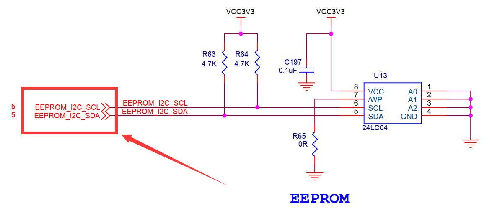

找到原理图中eeprom的位置，看看scl和sda两根线接在哪里。

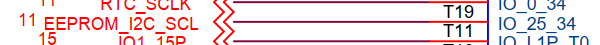
   
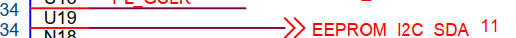

分别接在pl端的T19引脚和U19引脚上。使用pl端的资源，需要借助vivado工具来配置。

1) 打开之前使用的vivado工程。打开Diagram界面。

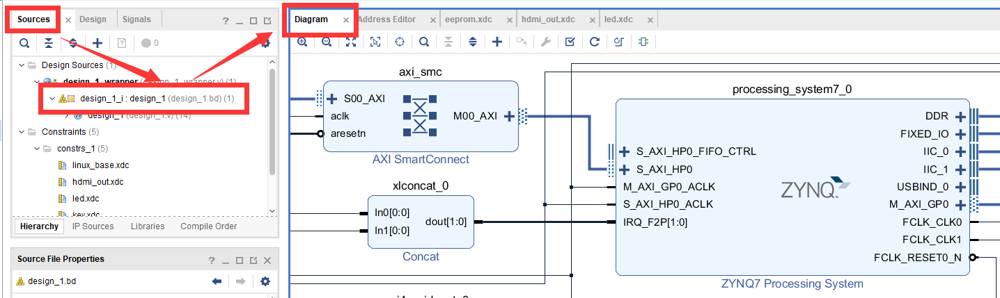

2) 在processing_system7_0的IIC_1引脚上右击，选择Make External导出引脚。

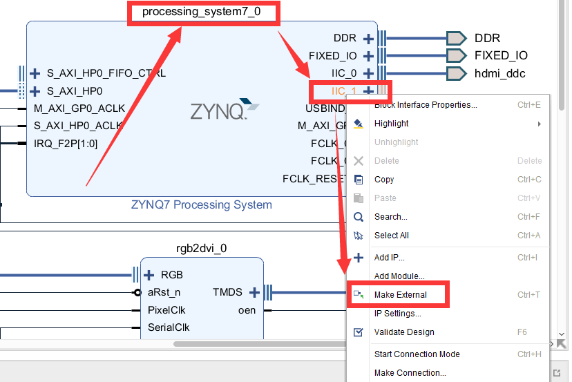

3) 把到处的引脚改名为eeprom_i2c。

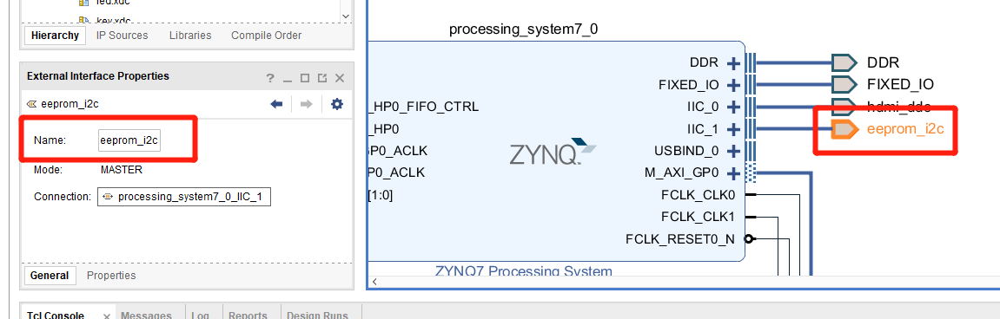

4) 关键的一步，添加新的xdc约束管脚，使IIC_1导出的引脚与原理图上连接eeprom的引脚对应。在constrs_1上右击，选择Add
   Sources。

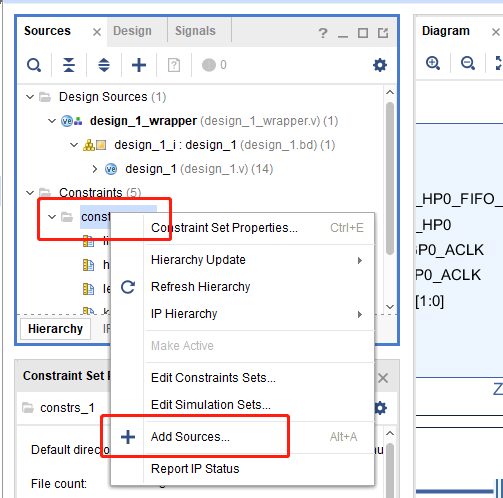

弹出的对话框中直接点击Next。

下一个界面点击Create File。

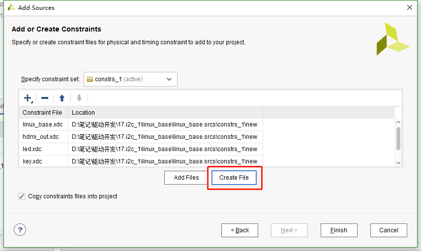

命名为eeprom，点击OK。

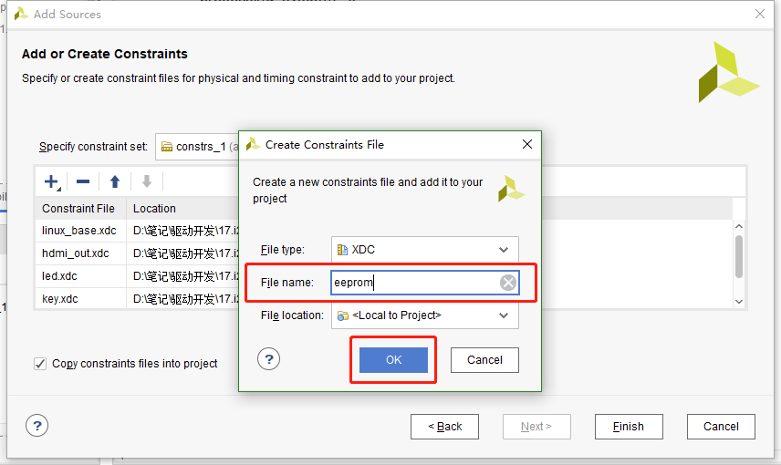

然后点击finish，之后在constrs_1中就有了刚才新建的文件。打开这个文件添加下面的代码：

+-----------------------------------------------------------------------+
| set_property IOSTANDARD LVCMOS33 [get_ports eeprom_i2c_scl_io]        |
|                                                                       |
| set_property PACKAGE_PIN T19 [get_ports eeprom_i2c_scl_io]            |
|                                                                       |
| set_property IOSTANDARD LVCMOS33 [get_ports eeprom_i2c_sda_io]        |
|                                                                       |
| set_property PACKAGE_PIN U19 [get_ports eeprom_i2c_sda_io]            |
+-----------------------------------------------------------------------+

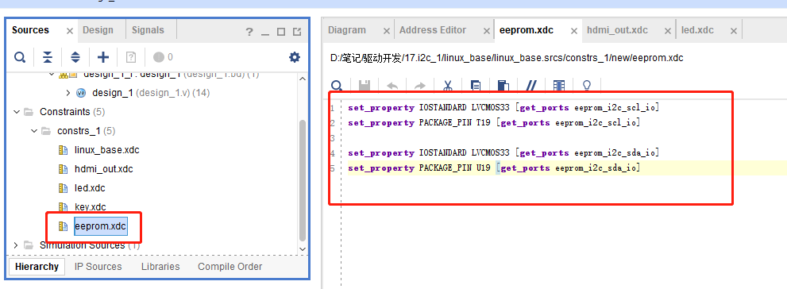

这样pl端就配置好了，重新编译导出硬件信息，再使用petalinux重新制作linux系统，这个过程就不再重复说了。

eeprom的使用可以参考24AA04/24LC04B。

设备树
~~~~~~~~~~~~~

打开system-user.dtsi文件，在根目录外添加下面的节点：

.. code:: c

 &i2c1 {
 clock-frequency = <100000>;

 ax-e2p1@50 {
 compatible = "ax-e2p1";
 reg = <0x50>;
 };
 };

第1行应用i2c1节点，因为上面我们vivado中配置引脚时，把eeprom的引脚约束到i2c1上了，所以设备树中需要对应的添加在i2c_1节点中。

第2行设置i2c_1的时钟为100hz。

第4行添加eeprom的节点ax-e2p1@50，设备地址为50。添加compatible属性等于”x-e2p1”，用于和驱动匹配。添加reg属性等于设备地址0x50。

驱动程序
~~~~~~~~~~~~~~~

使用 petalinux新建名为”ax-i2c”驱劢程序，并执行 petalinux-config -c rootfs 命令选上新增的驱动程序。

在ax-i2c.c文件中输入下面的代码：

.. code:: c
    
 #include <linux/types.h>
 #include <linux/kernel.h>
 #include <linux/delay.h>
 #include <linux/init.h>
 #include <linux/module.h>
 #include <linux/errno.h>
 #include <linux/cdev.h>
 #include <linux/device.h>
 #include <linux/string.h>
 #include <linux/timer.h>
 #include <linux/i2c.h>
 #include <linux/irq.h>
 #include <linux/wait.h>
 #include <linux/poll.h>
 #include <linux/fs.h>
 #include <linux/fcntl.h>
 #include <linux/platform_device.h>
 #include <asm/mach/map.h>
 #include <asm/uaccess.h>
 #include <asm/io.h>
 
 /* 驱动个数 */  
 #define AX_I2C_CNT  1
 /* 设备节点名称 */ 
 #define AX_I2C_NAME "ax_i2c_e2p"
 
 struct ax_i2c_dev {
     dev_t devid;              //设备号
     struct cdev cdev;         //字符设备
     struct class *class;      //类
     struct device *device;    //设备
     int major;                //主设备号
     void *private_data;       //用于在probe函数中获取client
 };
 /* 声明设备结构体变量 */
 struct ax_i2c_dev axi2cdev;
 
 /* i2c数据读取
  * struct ax_i2c_dev *dev : 设备结构体
  * u8 reg                 : 数据在目标设备中的地址
  * void *val              : 数据buffer首地址
  * int len                ：数据长度
  */
 static int ax_i2c_read_regs(struct ax_i2c_dev *dev, u8 reg, void *val, int len)
 {
     int ret;
     /* 构建msg, 读取时一般使用一个至少两个元素的msg数组
        第一个元素用于发送目标数据地址(写), 第二个元素发送buffer地址(读) */
     struct i2c_msg msg[2];
     /* 从设备结构体变量中获取client数据 */
     struct i2c_client *client = (struct i2c_client *)dev->private_data;
 
     /* 构造msg */
     msg[0].addr = client->addr;    //设置设备地址
     msg[0].flags = 0;              //标记为写, 先给eeprom发送读取数据的所在地址
     msg[0].buf = &reg;             //读取数据的所在地址
     msg[0].len = 1;                //地址数据长度, 只发送首地址的话长度就为1
 
     msg[1].addr = client->addr;    //设置设备地址
     msg[1].flags = I2C_M_RD;       //标记为读
     msg[1].buf = val;              //数据读出的buffer地址
     msg[1].len = len;              //读取数据长度
 
     /* 调用i2c_transfer发送msg */
     ret = i2c_transfer(client->adapter, msg, 2);
     if(2 == ret)
     {
         ret = 0;
     }
     else
     {
         printk("i2c read failed %d\r\n", ret);
         ret = -EREMOTEIO;
     }
 
     return ret;
 }
 
 /* i2c数据写入
  * struct ax_i2c_dev *dev : 设备结构体
  * u8 reg                 : 数据在目标设备中的地址
  * void *val              : 数据buffer首地址
  * int len                ：数据长度
  */
 static s32 ax_i2c_write_regs(struct ax_i2c_dev *dev, u8 reg, u8 *buf, int len)
 {
     int ret;
     /* 数据buffer */
     u8 b[100] = {0};
     /* 构建msg */
     struct i2c_msg msg;
     /* 从设备结构体变量中获取client数据 */
     struct i2c_client *client = (struct i2c_client *)dev->private_data;
 
     /* 把写入目标地址放在buffer的第一个元素中首先发送 */
     b[0] = reg;
     /* 把需要发送的数据拷贝到随后的地址中 */
     memcpy(&b[1], buf, 100 > len ? len : 100);
 
     /* 构建msg */
     msg.addr = client->addr;    //设置设备地址
     msg.flags = 0;              //标记为写
     msg.buf = b;                //数据写入的buffer地址
     msg.len = len + 1;          //写入的数据长度, 因为除了用户数据外, 
                                 //还需要发送数据地址所以要+1
     
     /* 调用i2c_transfer发送msg */
     ret = i2c_transfer(client->adapter, &msg, 1);
 
     if(1 == ret)
     {
         ret = 0;
     }
     else
     {
         printk("i2c write failed %d\r\n", ret);
         ret = -EREMOTEIO;
     }
     return ret;
 }
 
 /* open函数实现, 对应到Linux系统调用函数的open函数 */
 static int ax_i2c_open(struct inode *inode, struct file *filp)
 {
     /* 设置私有数据 */
     filp->private_data = &axi2cdev;
     return 0;
 }
 
 /* read函数实现, 对应到Linux系统调用函数的read函数 */ 
 static ssize_t ax_i2c_read(struct file *file, char __user *buf, size_t size, loff_t *offset)
 {
     /* 获取私有数据 */
     struct ax_i2c_dev *dev = (struct ax_i2c_dev *)file->private_data;
     /* 读取数据buffer */
     char b[100] = {0};
     int ret = 0;
     /* 从0地址开始读, 这里只是为了实验方便使用了read并且把地址写死了, 
        实际的应用中不应该在驱动中把地址写死, 可以尝试使用iotcl去实现灵活的方法 */
     ax_i2c_read_regs(dev, 0x00, b, 100 > size ? size : 100);
 
     /* 把读取到的数据拷贝到用户读取的地址 */
     ret = copy_to_user(buf, b, 100 > size ? size : 100);
     return 0;
 }
 
 /* write函数实现, 对应到Linux系统调用函数的write函数 */
 static ssize_t ax_i2c_write(struct file *file, const char __user *buf, size_t size, loff_t *offset)
 {
     /* 获取私有数据 */
     struct ax_i2c_dev *dev = (struct ax_i2c_dev *)file->private_data;
     /* 写入数据的buffer */
     static char user_data[100] = {0};
     int ret = 0;
     /* 获取用户需要发送的数据 */
     ret = copy_from_user(user_data, buf, 100 > size ? size : 100);
     if(ret < 0)
     {
         printk("copy user data failed\r\n");
         return ret;
     } 
     /* 和读对应的从0开始写 */
     ax_i2c_write_regs(dev, 0x00, user_data, size);
     
     return 0;
 }
 
 /* release函数实现, 对应到Linux系统调用函数的close函数 */
 static int ax_i2c_release(struct inode *inode, struct file *filp)
 {
     return 0;
 }
 
 /* file_operations结构体声明 */
 static const struct file_operations ax_i2c_ops = {
     .owner = THIS_MODULE,
     .open  = ax_i2c_open,
     .read  = ax_i2c_read,
     .write = ax_i2c_write,
     .release = ax_i2c_release,
 };
 
 /* probe函数实现, 驱动和设备匹配时会被调用 */
 static int axi2c_probe(struct i2c_client *client, const struct i2c_device_id *id)
 {
     printk("eeprom probe\r\n");
     /* 构建设备号 */
     alloc_chrdev_region(&axi2cdev.devid, 0, AX_I2C_CNT, AX_I2C_NAME);
 
     /* 注册设备 */
     cdev_init(&axi2cdev.cdev, &ax_i2c_ops);
     cdev_add(&axi2cdev.cdev, axi2cdev.devid, AX_I2C_CNT);
 
     /* 创建类 */
     axi2cdev.class = class_create(THIS_MODULE, AX_I2C_NAME);
     if(IS_ERR(axi2cdev.class))
     {
         return PTR_ERR(axi2cdev.class);
     }
 
     /* 创建设备 */
     axi2cdev.device = device_create(axi2cdev.class, NULL, axi2cdev.devid, NULL, AX_I2C_NAME);
     if(IS_ERR(axi2cdev.device))
     {
         return PTR_ERR(axi2cdev.device);
     }
 
     axi2cdev.private_data = client;
 
     return 0;
 }
 
 /* remove函数实现, 驱动卸载时会被调用 */
 static void axi2c_remove(struct i2c_client *client)
 {
     /* 删除设备 */
     cdev_del(&axi2cdev.cdev);
     unregister_chrdev_region(axi2cdev.major, AX_I2C_CNT);
     /* 注销类 */
     device_destroy(axi2cdev.class, axi2cdev.devid);
     class_destroy(axi2cdev.class);
 }
 
 /* of匹配表, 设备树下的匹配方式 */
 static const struct of_device_id axi2c_of_match[] = 
 {
     { .compatible = "ax-e2p1"},
     {/* sentinel */}
 };
 
 /* 传统的id_table匹配方式 */
 static const struct i2c_device_id axi2c_id[] = {
     {"ax-e2p1"},
     {}
 };
 
 /* 声明并初始化i2c驱动 */
 static struct i2c_driver axi2c_driver = {
     .driver = {
         .owner = THIS_MODULE,
         .name    = "ax-e2p1",
         /* 用of_match_table匹配 */
         .of_match_table = axi2c_of_match,
     },
     /* 使用传统的方式匹配 */
     .id_table = axi2c_id,
     .probe = axi2c_probe,
     .remove = axi2c_remove,
 };
 
 /* 驱动入口函数 */
 static int __init ax_i2c_init(void)
 {
     /* 在入口函数中调用i2c_add_driver, 注册驱动 */
     return i2c_add_driver(&axi2c_driver);
 }
 
 /* 驱动出口函数 */
 static void __exit ax_i2c_exit(void)
 {
     /* 在出口函数中调用i2c_add_driver, 卸载驱动 */
     i2c_del_driver(&axi2c_driver);
 }
 
 /* 标记加载、卸载函数 */ 
 module_init(ax_i2c_init);
 module_exit(ax_i2c_exit);
 
 /* 驱动描述信息 */  
 MODULE_AUTHOR("Alinx");  
 MODULE_ALIAS("pwm_led");  
 MODULE_DESCRIPTION("I2C EEPROM driver");  
 MODULE_VERSION("v1.0");  
 MODULE_LICENSE("GPL");   

34行添加一个void指针用于获取client。

45行到78行实现一个通用的i2c读取的函数。i2c读取中构建msg一般构建一个两个元素的数组，第一个msg标记为写用于发送目标数据地址,
第二个msg标记为读。

86行到121行实现通用的i2c写函数。

127行在open函数中设置私有数据。

132行实现read函数，调用前面实现的通用读函数。

149行实现write函数，里面调用了前面实现的通用写函数。

185行实现probe函数，内容就是字符设备的注册。

209行实现把probe输入参数的client赋值给设备结构体变量中的私有数据。在i2c读写函数中会用到的ax_i2c_dev类型句柄。

227行定义of匹配表，compatible字段和设备树中的保持一致。

234行定义一个id_table用于传统的方式匹配。

240行声明并初始化i2c_driver。

257行在驱动入口函数中使用i2c_add_driver函数注册i2c驱动。i2c_add_driver函数是对i2c_register_driver的封装，省去了输入THIS_MODULE。

264行在驱动出口函数中使用i2c_del_driver删除驱动。

测试程序
~~~~~~~~~~~~~~~

新建 QT 工程名为”ax-i2c-test”，新建 main.c，输入下面的代码：

.. code:: c
   
 #include "stdio.h"
 #include "unistd.h"
 #include "sys/types.h"
 #include "sys/stat.h"
 #include "fcntl.h"
 #include "stdlib.h"
 #include "string.h"
 #include "assert.h"
 
 int main(int argc, char *argv[])
 {
     int fd, ret;
     char *filename;
     char buffer[3] = {0};
 
     if(argc != 2)
     {
         printf("Error Usage\r\n");
         return -1;
     }
 
     filename = argv[1];
     fd = open(filename, O_RDWR);
     if(fd < 0)
     {
         printf("file %s open failed\r\n", argv[1]);
         return -1;
     }
 
     /* 随便写入一些数据 */
     buffer[0] = 0x5A;
     buffer[1] = 0x55;
     buffer[2] = 0xAA;
     ret = write(fd, buffer, sizeof(buffer));
     if(ret < 0)
     {
         printf("write failed\r\n");
     }
     /* 在控制台打印写入的数据 */
     printf("write data %X, %X, %X\r\n", buffer[0], buffer[1], buffer[2]);
 
     /* 初始化buffer, 再用来读取数据 */
     memset(buffer, 0, sizeof(buffer));
 
     /* 读出数据 */
     ret = read(fd, buffer, sizeof(buffer));
     if(ret < 0)
     {
         printf("read failed\r\n");
     }
     /* 在控制台打印读出的数据 */
     printf("read data %X, %X, %X\r\n", buffer[0], buffer[1], buffer[2]);
 
     close(fd);
 
     return 0;
 }

测试程序就是简单的读写并分别打印出来，比较读写结果。

运行测试
~~~~~~~~~~~~~~~

测试方法步骤如下：

+-----------------------------------------------------------------------+
| mount -t nfs -o nolock 192.168.1.107:/home/alinx/work /mnt            |
|                                                                       |
| cd /mnt                                                               |
|                                                                       |
| mkdir /tmp/qt                                                         |
|                                                                       |
| mount qt_lib.img /tmp/qt                                              |
|                                                                       |
| cd /tmp/qt                                                            |
|                                                                       |
| source ./qt_env_set.sh                                                |
|                                                                       |
| cd /mnt                                                               |
|                                                                       |
| insmod ./ax-i2c.ko                                                    |
|                                                                       |
| cd ./build-ax_i2c_test-ZYNQ-Debug/                                    |
|                                                                       |
| ./ax_i2c_test /dev/ax_i2c_e2p                                         |
+-----------------------------------------------------------------------+

IP 和路径根据实际情况调整。

串口工具中的调试结果如下：

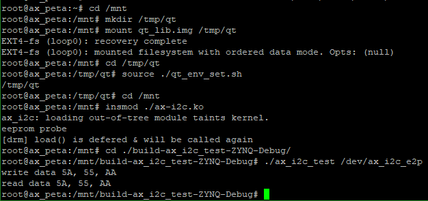

读写结果一致，试验成功。
