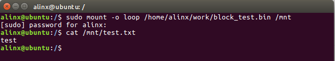
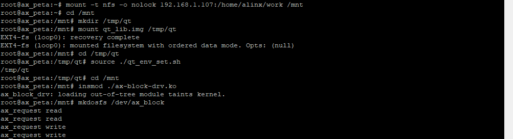
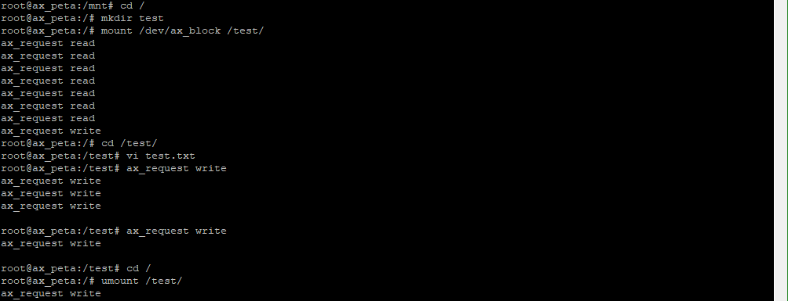
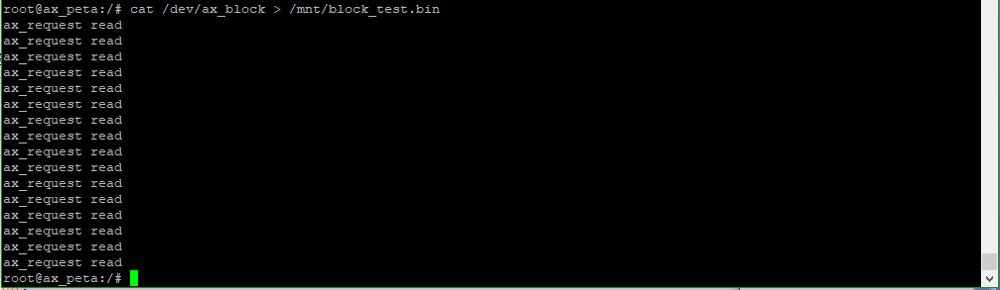

块设备驱动
=====================

Linux设备被分为字符设备、块设备、网络设备。前面介绍的框架都是和字符设备结合起来实验的，这章换换口味来说说块设备。

块设备简介
---------------

块设备被区别于字符设备肯定是有他的特殊性。

先回顾一下字符设备，在之前的字符设备实验中，字符设备框架部分几乎可以保证通用，少有区别的部分只有file_operations中操作函数的实现。既然能保证通用性，又为何要引入块设备的概念呢？

块设备较于字符设备最突出的特征就是，他需要支持批量的数据读写操作。当然多次调用字符设备的读写也可以达成最终目的，但具体到硬件操作就会遇到几个问题：

1) 一些块设备如flash在写之前需要先擦除当前扇区

2) 一些块设备的机械结构需要按地址顺序读写才能达到最高效率

因此块设备的驱动中应该要有这些功能：

1) 有读出扇区数据的buffer

2) 有读写操作队列，并能按地址优化排列读写顺序

而块设备框架的引入正是应对了这些问题。

内核中的块设备访问
-----------------------

从应用层到硬件，块设备的访问过程如下：

1) 应用程的app调用read等方法操作文件如txt等

2) 经由文件系统ext2、ext3等，把对文件的操作转化为对扇区的读写

3) 调用块设备驱动中对应的操作函数

4) 操作硬件

与字符设备的差异在于中间多了一个文件系统。这一步中，有一个关键的函数ll_rw_block()，从这个函数开始，就进入设备层面了。

ll_rw_block()函数，定义在文件fs/buffer.c中。如下：

.. code:: c

 void ll_rw_block(int op, int op_flags, int nr, struct buffer_head *bhs[])
 {
 int i;
 for (i = 0; i < nr; i++) {
 struct buffer_head *bh = bhs[i];
 if (!trylock_buffer(bh))
 continue;
 if (op == WRITE) {
 if (test_clear_buffer_dirty(bh)) {
 bh->b_end_io = end_buffer_write_sync;
 get_bh(bh);
 submit_bh(op, op_flags, bh);
 continue;
 }
 } else {
 if (!buffer_uptodate(bh)) {
 bh->b_end_io = end_buffer_read_sync;
 get_bh(bh);
 submit_bh(op, op_flags, bh);
 continue;
 }
 }
 unlock_buffer(bh);
 }
 }

输入参数中的buffer_head结构体是缓冲区的描述符，存放缓冲区信息，定义如下：

.. code:: c
   
 struct buffer_head {
 unsigned long b_state; //缓冲区状态
 struct buffer_head *b_this_page; //页缓冲区头
 struct page *b_page; //存储缓冲区所在页
 sector_t b_blocknr; //块号
 size_t b_size; //块大小
 char *b_data; //页数据缓冲区
 struct block_device *b_bdev; //块设备
 bh_end_io_t *b_end_io; //I/O 完成后执行函数指针
 void *b_private; //b_end_io 的输入参数
 struct list_head b_assoc_buffers; //映射链表
 /* mapping this buffer is associated with */
 struct address_space *b_assoc_map;
 atomic_t b_count; //缓冲区计数
 };
 

再看ll_rw_block()函数中14和21行最终做的操作submit_bh()函数。submit_bh()是对函数submit_bh_wbc()的简化封装，submit_bh_wbc()定义如下(省略原有注释)：

.. code:: c

 int submit_bh(int rw, struct buffer_head * bh)
 {
 struct bio *bio; //定义一个bio(block input output),也就是块设备 i/o
 BUG_ON(!buffer_locked(bh));
 BUG_ON(!buffer_mapped(bh));
 BUG_ON(!bh->b_end_io);
 BUG_ON(buffer_delay(bh));
 BUG_ON(buffer_unwritten(bh));
 if (test_set_buffer_req(bh) && (op == REQ_OP_WRITE))
 clear_buffer_write_io_error(bh);

 bio = bio_alloc(GFP_NOIO, 1); //分配 bio

 if (wbc) {
 wbc_init_bio(wbc, bio);
 wbc_account_io(wbc, bh->b_page, bh->b_size);
 }

 /* 构造 bio */
 bio->bi_sector = bh->b_blocknr * (bh->b_size >> 9); //存放逻辑块号
 bio->bi_bdev = bh->b_bdev; //存放对应的块设备

 bio_add_page(bio, bh->b_page, bh->b_size, bh_offset(bh));
 BUG_ON(bio->bi_iter.bi_size != bh->b_size);

 bio->bi_end_io = end_bio_bh_io_sync; //设置 i/o 回调函数
 bio->bi_private = bh; //回调函数参数, 指向哪个缓冲区
 bio->bi_flags |= bio_flags;

 guard_bio_eod(op, bio);

 if (buffer_meta(bh))
 op_flags |= REQ_META;
 if (buffer_prio(bh))
 op_flags |= REQ_PRIO;
 bio_set_op_attrs(bio, op, op_flags);

 submit_bio(bio); //提交 bio
 return 0;
 }

这里的工作主要就是使用buffer_head来构造一个bio，bio即block
input/output，块设备输入输出。最终调用submit_bio()函数提交bio到内核队列。

再往下看，submit_bio()函数最终调用了generic_make_request()，再往下调用__generic_make_request()，再到__make_request()，在__make_request()函数中的elv_merge()函数是内核中的电梯算法(elevator
merge)，所谓的电梯算法，也就是实现了我们上面说的按地址顺序优化读写顺序。

我们担心的事情内核已经帮我们完成了，而快设备框架，则在此基础上展开。

块设备框架
---------------

字符设备框架可以参考内核中先用的字符设备驱动代码drivers\\block\\z2ram.c或其他。

大致步骤如下：

1) 分配一个gendisk结构体

2) 分配一个队列request_queue_t

3) 设置gendisk结构体的成员

4) 注册gendisk结构体

分别来看。

gendisk结构体
~~~~~~~~~~~~~~~~~~~~

gendisk结构体定义在genhd.h中，如下：

.. code:: c

 struct gendisk {
 /* major, first_minor and minors are input parameters only,
 * don't use directly. Use disk_devt() and disk_max_parts().
 */
 int major; /* major number of driver */
 int first_minor;
 int minors; /* maximum number of minors, =1 for
 * disks that can't be partitioned. */

 char disk_name[DISK_NAME_LEN]; /* name of major driver */
 char *(*devnode)(struct gendisk *gd, umode_t *mode);

 unsigned int events; /* supported events */
 unsigned int async_events; /* async events, subset of all */

 /* Array of pointers to partitions indexed by partno.
 * Protected with matching bdev lock but stat and other
 * non-critical accesses use RCU. Always access through
 * helpers.
 */
 struct disk_part_tbl __rcu *part_tbl;
 struct hd_struct part0;

 const struct block_device_operations *fops;
 struct request_queue *queue;
 void *private_data;

 int flags;
 struct kobject *slave_dir;

 struct timer_rand_state *random;
 atomic_t sync_io; /* RAID */
 struct disk_events *ev;
 #ifdef CONFIG_BLK_DEV_INTEGRITY
 struct kobject integrity_kobj;
 #endif /* CONFIG_BLK_DEV_INTEGRITY */
 int node_id;
 struct badblocks *bb;
 };

部分成员介绍：

1. major为设备主设备号。

2. first_minor起始次设备号。

3. minors次设备号的数量，也称为分区数量，值为1表示无法分区。

4. disk_name设备名称。

5. part分区表的信息。

6. fops块设备操作集合，块设备的操作函数与字符设备差别较大，碰到了再去研究。

7. queue申请队列，用于管理该设备IO申请队列的指针。

8. private_data私有数据。

9. capacity扇区数。

gendisk的操作大概如下：

1) 在块设备驱动程序中，首先定义一个gendisk结构体变量，在入口函数中使用函数struct
   gendisk \*alloc_disk(int minors)分配空间，minors是分区的数量。

2) 分配队列queue。

3) 使用register_blkdev函数向内核申请块设备的主设备号。

4) 使用函数set_capacity()设置扇区数。

5) 设置其他参数。

6) 使用函数add_disk()向内和注册gendisk。

7) 在出口函数中实现相反的操作：

使用put_disk()和del_gendisk()来注销,释放gendisk结构体。
使用kfree()释放磁盘扇区缓存。
使用blk_cleanup_queue()清除内存中的申请队列。
使用unregister_blkdev()卸载块设备。

request_queue
~~~~~~~~~~~~~~~~~~~~

首先定义一个request_queue结构体变量。使用下面函数来分配：

+-----------------------------------------------------------------------+
| struct request_queue \*blk_init_queue(request_fn_proc \*rfn,          |
| spinlock_t \*lock)                                                    |
+-----------------------------------------------------------------------+

rfn是队列处理函数。

lock是自旋锁。

使用blk_init_queue函数获取到request_queue之后复制给ramblock_disk.queue即可。

这里rfn函数的实现，也就是快设备中的重点了。

快设备框架的使用，到实验例程中去讲解。

实验
---------

本章实验把内存模拟成块设备来操作，重在熟悉块设备的框架和块设备驱动编写流程。

驱动程序
~~~~~~~~~~~~~~~

使用 petalinux新建名为”ax-block-drv”驱动程序，并执行 petalinux-config -c rootfs 命令选上新增的驱动程序。

在ax-block-drv.c文件中输入下面的代码：

.. code:: c

 #include <linux/module.h>
 #include <linux/errno.h>
 #include <linux/interrupt.h>
 #include <linux/mm.h>
 #include <linux/fs.h>
 #include <linux/kernel.h>
 #include <linux/timer.h>
 #include <linux/genhd.h>
 #include <linux/hdreg.h>
 #include <linux/ioport.h>
 #include <linux/init.h>
 #include <linux/wait.h>
 #include <linux/blkdev.h>
 #include <linux/blkpg.h>
 #include <linux/delay.h>
 #include <linux/io.h>
 #include <asm/mach/map.h>
 #include <asm/uaccess.h>
 #include <asm/dma.h>
 
 #define AX_BLOCK_SIZE   (1024*64)                   //块设备大小
 #define SECTOR_SIZE     512                         //扇区大小
 #define SECTORS_NUM     AX_BLOCK_SIZE / SECTOR_SIZE //扇区数
 
 #define AX_BLOCK_NAME   "ax_block"                  //设备节点名称
 
 #define AX_BLOCK_MAJOR  40
 struct ax_block{
     struct gendisk          *block_disk;    //磁盘结构体
     struct request_queue    *block_request; //申请队列
     unsigned char           *block_buf;     //磁盘地址
 };
 /* 声明设备结构体变量 */
 struct ax_block ax_block_drv;
 /* 定义一个自旋锁 */
 static DEFINE_SPINLOCK(ax_block_lock);
 
 /* 块设备操作函数集, 即使没有操作函数, 也需要赋值 */
 static struct block_device_operations ax_block_fops = {
     .owner  =   THIS_MODULE,
 };
 
 /* 队列处理函数 */
 static void ax_block_request(struct request_queue * q)
 {
     struct request *req;
     
     /* 轮询队列中的每个申请 */
     req = blk_fetch_request(q);
     while(req) 
     {
         unsigned long start;
         unsigned long len;
         void *buffer = bio_data(req->bio);
         /* 获取首地址 */
         start = (int)blk_rq_pos(req) * SECTOR_SIZE + ax_block_drv.block_buf; 
         /* 获取长度 */
         len = blk_rq_cur_bytes(req);     
                       
         if(rq_data_dir(req) == READ)
         {            
             printk("ax_request read\n");
             memcpy(buffer, (char *)start, len);
         }
         else
         {             
             printk("ax_request write\n");
             memcpy((char *)start, buffer, len);
         }
         /* 处理完的申请出列 */
         if (!__blk_end_request_cur(req, 0))
 			req = blk_fetch_request(q);
     }  
 }
 
 static int __init ax_block_init(void)
 {
     /* 分配块设备 */
     ax_block_drv.block_disk = alloc_disk(1);  
     /* 分配申请队列, 提供队列处理函数 */ 
     ax_block_drv.block_request = blk_init_queue(ax_block_request, &ax_block_lock);
     /* 设置申请队列 */
     ax_block_drv.block_disk->queue = ax_block_drv.block_request;
     /* 向内核注册块设备 */
     register_blkdev(AX_BLOCK_MAJOR, AX_BLOCK_NAME);   
     /* 主设备号赋给块设备得主设备号字段 */
     ax_block_drv.block_disk->major = AX_BLOCK_MAJOR;
     /* 设置其他参数 */
     ax_block_drv.block_disk->first_minor = 0;
     ax_block_drv.block_disk->fops = &ax_block_fops;
     sprintf(ax_block_drv.block_disk->disk_name, AX_BLOCK_NAME);
     /* 设置扇区数 */
     set_capacity(ax_block_drv.block_disk, SECTORS_NUM);
     /* 获取缓存, 把内存模拟成块设备 */
     ax_block_drv.block_buf = kzalloc(AX_BLOCK_SIZE, GFP_KERNEL);
     /* 向内核注册gendisk结构体 */
     add_disk(ax_block_drv.block_disk);   
     return  0;
 }
 
 static void __exit ax_block_exit(void)
 {
     /* 注销gendisk结构体 */
     put_disk(ax_block_drv.block_disk);
     /* 释放gendisk结构体 */
     del_gendisk(ax_block_drv.block_disk);
     /* 释放缓存 */
     kfree(ax_block_drv.block_buf);
     /* 清空内存中的队列 */
     blk_cleanup_queue(ax_block_drv.block_request);
     /* 卸载快设备 */
     unregister_blkdev(AX_BLOCK_MAJOR, AX_BLOCK_NAME);
 }
 
 module_init(ax_block_init);
 module_exit(ax_block_exit);
 
 /* 驱动描述信息 */  
 MODULE_AUTHOR("Alinx"); 
 MODULE_ALIAS("block test");  
 MODULE_DESCRIPTION("BLOCK driver");  
 MODULE_VERSION("v1.0");  
 MODULE_LICENSE("GPL"); 
  

先看块设备框架，入口函数出口函数以及操作函数三个部分的结构和字符设备框架无异。多了一个在76行开始的驱动入口函数中：

79行先使用函数alloc_disk分配块设备。

81行使用blk_init_queue函数分配申请队列，并提供队列处理函数ax_block_request。ax_block_request函数实现稍后再去看。

83行把分配的队列设置到块设备结构体成员中。

85行向内和注册块设备，需要附上设备号和设备名。87行设置住设备设备号，89行设置起始次设备号也是起始扇区号，90行设置操作函数集合，91行设置设备名称。

93行设置扇区数，95行使用kalloc函数获取缓存来模拟块设备。

97行使用add_disk函数向内和注册gendisk结构体。

101行开始的驱动出口函数中做相反的注销操作。

然后回头看44行队列处理函数中的内容。

内容也不多，可以看到最终的处理就是63行和68行memcpy，把读的或者写的内容拷贝到buffer或者内存地址中。当然这里是应为使用内存所以可以直接使用memcpy方法，实际使用外设块设备，读写方法会复杂一些。

在memcpy的前一步，就是判断本次操作是读还是写，调用函数rq_data_dir函数，如果申请是读，就会返回READ，函数参数是struct
request类型的指针。注意我们的队列处理函数，输入参数是struct request_queue类型的指针，是申请的队列，使用函数blk_fetch_request函数可以从申请队列中获取队列最前的申请，如49行的操作。获取到的申请，就是我们后面处理的对象。

memcpy的关键参数有三，数据来源，数据目标，和数据长度。这些都要通过申请结构体变量指针struct request \*req来获取。54行通过bio_data(req->bio)获取数据目标地址。56行先使用blk_rq_pos(req)获取当前扇区，然后乘上扇区大小，再加上缓存的首地址，则是当前申请数据所在的首地址了。58行使用方法blk_rq_cur_bytes(req)获取当前申请的数据长度。

在队列处理函数中，需要轮询队列中的每一个申请，方法就是使用函数blk_fetch_request(q)，如果有申请，则返回正值。最后处理完了使用blk_end_request_cur(req, 0)函数把处理完成的申请移出队列。

另外在读和写之前加上printk来查看看效果。

运行测试
~~~~~~~~~~~~~~~

测试方法步骤如下：

+-----------------------------------------------------------------------+
| mount -t nfs -o nolock 192.168.1.107:/home/alinx/work /mnt            |
|                                                                       |
| cd /mnt                                                               |
|                                                                       |
| mkdir /tmp/qt                                                         |
|                                                                       |
| mount qt_lib.img /tmp/qt                                              |
|                                                                       |
| cd /tmp/qt                                                            |
|                                                                       |
| source ./qt_env_set.sh                                                |
|                                                                       |
| cd /mnt                                                               |
|                                                                       |
| insmod ./ax-block-drv.ko                                              |
|                                                                       |
| mkdosfs /dev/ax_block                                                 |
|                                                                       |
| cd /                                                                  |
|                                                                       |
| mkdir test                                                            |
|                                                                       |
| mount /dev/ax_block /test/                                            |
|                                                                       |
| cd /test/                                                             |
|                                                                       |
| vi test.txt                                                           |
|                                                                       |
| (编辑任意内容，这里我输入了test)                                      |
|                                                                       |
| cd /                                                                  |
|                                                                       |
| umount /test/                                                         |
|                                                                       |
| cat /dev/ax_block > /mnt/block_test.bin                               |
+-----------------------------------------------------------------------+

IP 和路径根据实际情况调整。

然后到ubuntu虚拟机中，验证block_test.bin，步骤如下：

把block_test.bin挂载到/mnt目录下，发现mnt目录中就有了我们之前创建的test.txt文件，并且内容也是之前输入的内容。

串口工具中的调试结果如下：

通过串口打应的read和write信息，也可以看出块设备内电梯算法的结果，都每次申请的读和写不会交叉进行，提高了读写效率。

另外块设备的读写是异步操作，要确保每次申请的操作都完成，可以使用sync命令来完成当前未完成的异步操作。
